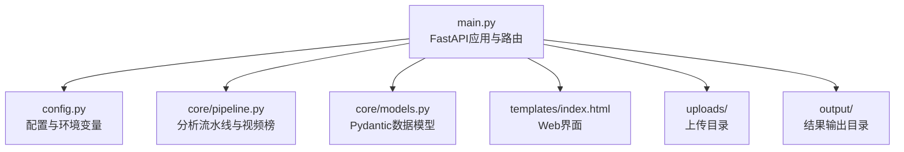
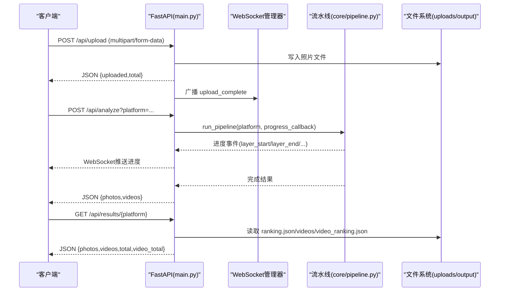
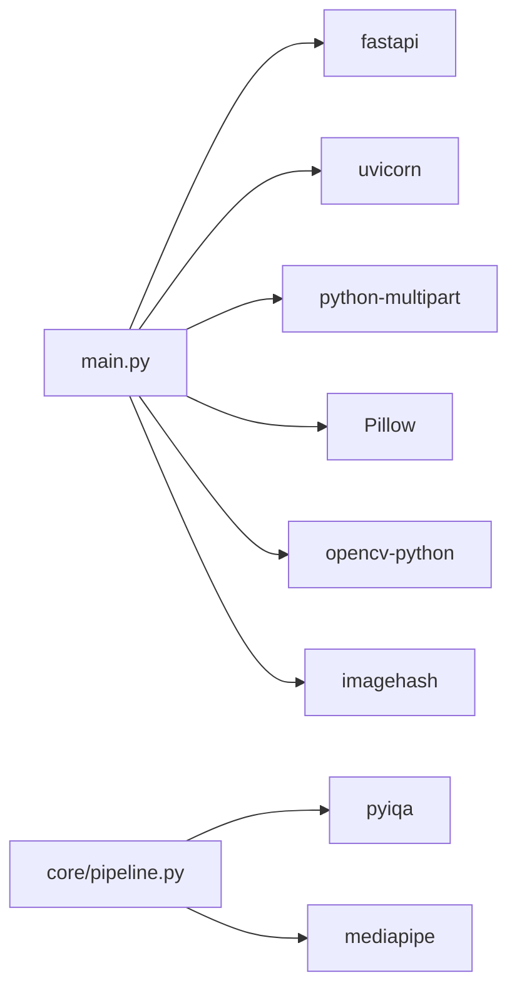
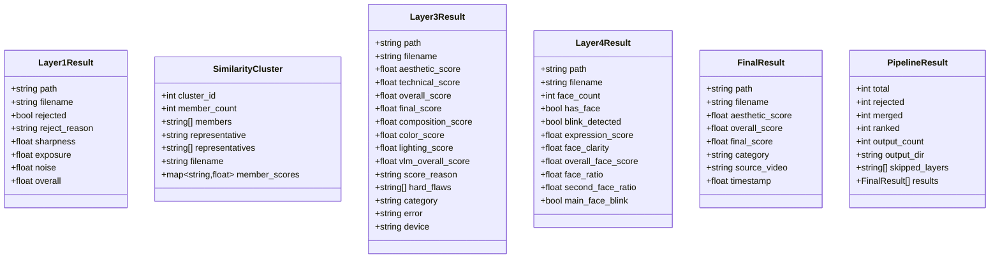

# API参考文档

<cite>
**本文引用的文件**   
- [main.py](file://main.py)
- [config.py](file://config.py)
- [core/pipeline.py](file://core/pipeline.py)
- [core/models.py](file://core/models.py)
- [requirements.txt](file://requirements.txt)
- [templates/index.html](file://templates/index.html)
</cite>

## 目录
1. [简介](#简介)
2. [项目结构](#项目结构)
3. [核心组件](#核心组件)
4. [架构总览](#架构总览)
5. [详细组件分析](#详细组件分析)
6. [依赖分析](#依赖分析)
7. [性能考虑](#性能考虑)
8. [故障排查指南](#故障排查指南)
9. [结论](#结论)
10. [附录](#附录)

## 简介
本API参考文档面向PhotoRank系统的RESTful接口，覆盖照片上传、视频抽帧、列表与删除、结果查询与分析任务等能力。系统基于FastAPI构建，提供WebSocket实时进度推送，支持多平台（小红书/朋友圈/抖音）评分权重配置，并内置并发控制、路径安全校验、文件大小限制与错误码规范。文档同时给出客户端集成建议、SDK使用要点与最佳实践。

## 项目结构
- Web服务入口与路由：main.py
- 全局配置与环境变量：config.py
- 分析流水线与视频榜：core/pipeline.py
- 数据模型定义：core/models.py
- 前端模板（Web UI）：templates/index.html
- 依赖声明：requirements.txt

图表来源
- [main.py:1-120](file://main.py#L1-L120)
- [config.py:1-123](file://config.py#L1-L123)
- [core/pipeline.py:165-594](file://core/pipeline.py#L165-L594)
- [core/models.py:1-123](file://core/models.py#L1-L123)
- [templates/index.html:1-200](file://templates/index.html#L1-L200)

章节来源
- [main.py:1-120](file://main.py#L1-L120)
- [config.py:1-123](file://config.py#L1-L123)

## 核心组件
- FastAPI应用与路由：统一处理HTTP请求、文件上传、静态资源返回与WebSocket广播。
- 配置中心：集中管理路径、阈值、平台权重、VLM参数、代理与Web服务地址端口。
- 分析流水线：整合客观指标、相似聚类、审美评分（TOPIQ+VLM）、人脸质量与融合排序，支持断点续传与进度回调。
- 数据模型：统一的Pydantic模型保障类型安全与序列化一致性。

章节来源
- [main.py:100-399](file://main.py#L100-L399)
- [config.py:1-123](file://config.py#L1-L123)
- [core/pipeline.py:165-594](file://core/pipeline.py#L165-L594)
- [core/models.py:1-123](file://core/models.py#L1-L123)

## 架构总览
系统采用“Web服务 + 异步流水线”的架构。HTTP接口负责接收请求与响应，分析任务通过线程池与事件循环协作执行，并通过WebSocket向客户端推送进度事件。

图表来源
- [main.py:111-163](file://main.py#L111-L163)
- [main.py:336-379](file://main.py#L336-L379)
- [core/pipeline.py:165-594](file://core/pipeline.py#L165-L594)

## 详细组件分析

### REST API端点规范

#### 通用说明
- 基础URL：http://{HOST}:{PORT}（默认 HOST=127.0.0.1, PORT=8080）
- 认证机制：当前版本未实现鉴权；生产环境建议增加JWT或API Key校验。
- 权限控制：无角色区分；如需隔离，可在网关层按IP/Token限流与访问控制。
- 速率限制：未内置；建议在反向代理（Nginx/Cloudflare）或中间件层实现。
- 版本管理：当前为v1；未来可通过URL前缀或Header进行版本控制。
- 错误码约定：
  - 400：请求参数或文件格式不合法
  - 404：资源不存在
  - 409：资源冲突（如分析任务正在运行）
  - 413：请求体过大
  - 500：服务器内部错误

#### 1) 上传照片
- 方法：POST
- URL：/api/upload
- 请求头：Content-Type: multipart/form-data
- 表单字段：files (多个文件)
- 支持格式：jpg/jpeg/png/gif/bmp/webp/heic/heif
- 大小限制：单文件最大50MB
- 成功响应：200
  - 字段：uploaded (数组，每项含 filename/original_name/size), total (数量)
- 失败响应：
  - 400：不支持的文件类型/MIME类型
  - 413：文件过大
- 示例（curl）：
  - curl -X POST http://127.0.0.1:8080/api/upload -F "files=@photo1.jpg" -F "files=@photo2.png"

章节来源
- [main.py:111-163](file://main.py#L111-L163)
- [main.py:48-61](file://main.py#L48-L61)

#### 2) 上传视频并抽帧
- 方法：POST
- URL：/api/upload_video
- 请求头：Content-Type: multipart/form-data
- 表单字段：file (单个视频文件)
- 支持格式：mp4/mov/avi/mkv/webm
- 大小限制：最大200MB（Content-Length预检）
- 成功响应：200
  - 字段：video (文件名), stats (候选/保留等统计), message
- 失败响应：
  - 400：不支持的视频类型/MIME类型/抽帧异常
  - 413：视频过大
  - 500：保存失败/抽帧失败
- 示例（curl）：
  - curl -X POST http://127.0.0.1:8080/api/upload_video -F "file=@clip.mp4"

章节来源
- [main.py:165-237](file://main.py#L165-L237)
- [config.py:83-92](file://config.py#L83-L92)

#### 3) 列出照片
- 方法：GET
- URL：/api/photos
- 成功响应：200
  - 字段：photos (数组，每项含 filename/path/size), total
- 失败响应：无（空列表表示暂无照片）

章节来源
- [main.py:240-251](file://main.py#L240-L251)

#### 4) 获取照片
- 方法：GET
- URL：/api/photos/{filename}
- 路径参数：filename（需通过安全校验，防路径遍历）
- 成功响应：200（二进制图片）
- 失败响应：
  - 400：非法文件名
  - 404：照片不存在

章节来源
- [main.py:254-263](file://main.py#L254-L263)

#### 5) 删除照片
- 方法：DELETE
- URL：/api/photos/{filename}
- 路径参数：filename（需通过安全校验）
- 成功响应：200
  - 字段：deleted (被删除的文件名)
- 失败响应：
  - 400：非法文件名

章节来源
- [main.py:266-276](file://main.py#L266-L276)

#### 6) 获取分析结果（双榜单）
- 方法：GET
- URL：/api/results/{platform}
- 路径参数：platform（xiaohongshu/wechat/douyin）
- 成功响应：200
  - 字段：photos (数组), videos (数组), total, video_total
- 失败响应：
  - 400：非法平台名
  - 404：未找到分析结果

章节来源
- [main.py:278-303](file://main.py#L278-L303)

#### 7) 获取结果中的照片
- 方法：GET
- URL：/api/results/{platform}/{filename}
- 路径参数：platform, filename（均通过安全校验）
- 成功响应：200（二进制图片）
- 失败响应：
  - 400：非法平台名/文件名
  - 404：照片不存在

章节来源
- [main.py:321-333](file://main.py#L321-L333)

#### 8) 获取结果中的视频帧图片
- 方法：GET
- URL：/api/results/{platform}/videos/{filename}
- 路径参数：platform, filename（均通过安全校验）
- 成功响应：200（二进制图片）
- 失败响应：
  - 400：非法平台名/文件名
  - 404：照片不存在

章节来源
- [main.py:306-318](file://main.py#L306-L318)

#### 9) 触发分析任务（批量处理）
- 方法：POST
- URL：/api/analyze
- 查询参数：platform（默认 xiaohongshu）
- 并发控制：同一时刻仅允许一个分析任务运行（409冲突）
- 成功响应：200
  - 字段：photos (照片榜统计), videos (视频精选榜统计)
- 失败响应：
  - 409：分析任务正在运行中
  - 500：服务器内部错误
- 进度推送：通过WebSocket /ws 推送 layer_start/layer_end/analysis_start/analysis_complete/analysis_error 等事件

章节来源
- [main.py:336-379](file://main.py#L336-L379)
- [main.py:382-391](file://main.py#L382-L391)

#### 10) WebSocket连接
- 协议：ws://
- URL：/ws
- 用途：接收分析进度与状态事件
- 事件类型：upload_complete, video_frames_ready, analysis_start, layer_start, layer_end, analysis_complete, analysis_error

章节来源
- [main.py:78-96](file://main.py#L78-L96)
- [main.py:382-391](file://main.py#L382-L391)

### 认证机制、权限控制与速率限制
- 认证机制：当前未实现；建议在生产环境中引入JWT或API Key，并在FastAPI中间件或网关层校验。
- 权限控制：当前无角色体系；可按租户/用户维度在网关层做访问控制。
- 速率限制：未内置；建议在反向代理或API网关层对上传与分析接口实施限流（例如每秒请求数、并发任务数）。

[本节为概念性说明，不直接分析具体文件]

### 客户端集成指南与SDK使用说明
- HTTP客户端：推荐使用httpx或requests进行调用，注意设置超时与重试策略。
- 文件上传：使用multipart/form-data，确保Content-Type正确；HEIC/HEIF浏览器可能上报application/octet-stream，服务端已放行并由下游解码校验。
- WebSocket：连接后订阅事件，根据type字段更新UI进度。
- SDK建议：封装统一的请求类，包含重试、错误解析、进度监听与取消任务逻辑。

[本节为概念性说明，不直接分析具体文件]

### 最佳实践建议
- 上传前本地校验扩展名与MIME类型，减少无效请求。
- 大文件分块上传与断点续传（可结合后端临时目录与清单文件）。
- 分析任务队列化，避免阻塞事件循环；必要时引入消息队列。
- 日志与监控：记录关键步骤耗时与错误堆栈，便于定位瓶颈。

[本节为概念性说明，不直接分析具体文件]

## 依赖分析
- Web框架：fastapi、uvicorn、python-multipart
- 图像处理：Pillow、pillow-heif、opencv-python、numpy、imagehash
- AI推理：pyiqa、mediapipe（torch按需安装）
- 网络请求：httpx
- 配置加载：python-dotenv、PyYAML

图表来源
- [requirements.txt:1-27](file://requirements.txt#L1-L27)
- [main.py:1-40](file://main.py#L1-L40)
- [core/pipeline.py:1-30](file://core/pipeline.py#L1-L30)

章节来源
- [requirements.txt:1-27](file://requirements.txt#L1-L27)

## 性能考虑
- 并发控制：分析任务互斥锁防止重复执行；视频抽帧与AI推理使用线程池避免阻塞事件循环。
- I/O优化：文件写入分块、Content-Length预检、内存占用控制。
- 计算优化：L1阶段并行计算并提前生成感知哈希，供L2与多样性惩罚复用，减少重复计算。
- 网络IO：VLM维度分析独立线程池，图片级流水尽早发起，降低整体延迟。

章节来源
- [main.py:42-43](file://main.py#L42-L43)
- [main.py:190-226](file://main.py#L190-L226)
- [core/pipeline.py:165-594](file://core/pipeline.py#L165-L594)

## 故障排查指南
- 常见问题
  - 上传失败（400/413）：检查扩展名、MIME类型与文件大小限制。
  - 视频抽帧失败（400/500）：确认视频编码与时长，查看日志中的VideoExtractError。
  - 分析任务冲突（409）：等待当前任务完成或重启服务释放锁。
  - 结果缺失（404）：确认platform与filename是否正确，检查output目录是否存在ranking.json。
- 调试建议
  - 启用详细日志，关注layer_start/layer_end与error事件。
  - 检查环境变量（QWEN_API_KEY、HTTPS_PROXY等）是否配置正确。
  - 使用WebSocket订阅事件，观察进度与异常信息。

章节来源
- [main.py:111-163](file://main.py#L111-L163)
- [main.py:165-237](file://main.py#L165-L237)
- [main.py:336-379](file://main.py#L336-L379)

## 结论
本API参考文档全面覆盖了PhotoRank的核心接口与行为，包括上传、列表、删除、结果查询与分析任务。系统具备良好的安全性与可扩展性，适合进一步集成认证、权限与限流机制。建议在生产环境中完善监控与告警，确保稳定运行。

[本节为总结性内容，不直接分析具体文件]

## 附录

### 数据模型概览
- Layer1Result：客观指标（清晰度、曝光、噪声、综合分、淘汰原因）
- SimilarityCluster：相似聚类组（成员、代表图、分数映射）
- Layer3Result：审美评分（TOPIQ/VLM维度、分类标签、硬伤标记）
- Layer4Result：人脸质量（闭眼、清晰度、占比、表情分）
- FinalResult：最终输出（评分与分类，支持视频帧元数据）
- PipelineResult：流水线汇总（总数、淘汰、合并、排名、输出计数、跳过层）

图表来源
- [core/models.py:13-123](file://core/models.py#L13-L123)

章节来源
- [core/models.py:1-123](file://core/models.py#L1-L123)

### 配置项与环境变量
- 路径：PHOTOS_DIR、OUTPUT_DIR、VIDEOS_DIR、VIDEO_FRAMES_DIR
- 平台权重：PLATFORMS（xiaohongshu/wechat/douyin）
- 阈值：LAPLACIAN_THRESHOLD、OVEREXPOSURE_THRESHOLD、UNDEREXPOSURE_THRESHOLD、HAMMING_THRESHOLD
- VLM参数：VLM_IMAGE_MAX_SIDE、VLM_JPEG_QUALITY、QWEN_BASE_URL、QWEN_MODEL
- 代理：HTTPS_PROXY
- Web服务：HOST、PORT

章节来源
- [config.py:1-123](file://config.py#L1-L123)

### 请求/响应示例（JSON结构与文件上传方式）
- 上传照片（multipart/form-data）
  - 请求：POST /api/upload，字段 files=[...]
  - 响应：{ uploaded:[{filename,original_name,size}], total:int }
- 上传视频（multipart/form-data）
  - 请求：POST /api/upload_video，字段 file=...
  - 响应：{ video:string, stats:object, message:string }
- 列出照片
  - 响应：{ photos:[{filename,path,size}], total:int }
- 获取结果
  - 响应：{ photos:[...], videos:[...], total:int, video_total:int }

[本节为概念性说明，不直接分析具体文件]

### 版本管理与向后兼容性
- 当前版本：v1（未显式版本号）
- 兼容策略：保持URL与响应结构稳定；新增字段时保持可选；废弃字段保留但标注弃用。
- 升级建议：通过Header X-API-Version或URL前缀/v1进行版本控制；逐步迁移至新结构。

[本节为概念性说明，不直接分析具体文件]