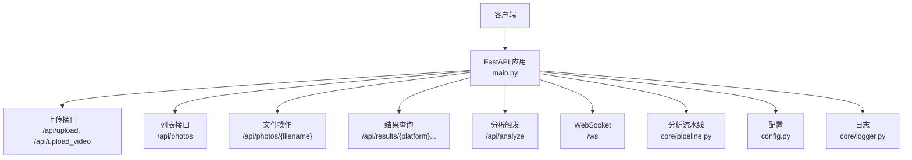
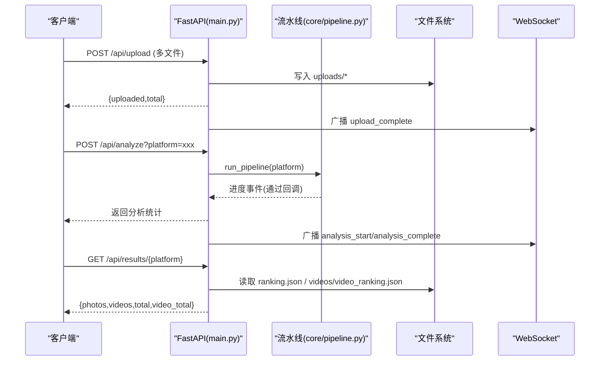

# 基础API接口

<cite>
**本文引用的文件**   
- [main.py](file://main.py)
- [config.py](file://config.py)
- [core/pipeline.py](file://core/pipeline.py)
- [core/models.py](file://core/models.py)
- [core/logger.py](file://core/logger.py)
- [templates/index.html](file://templates/index.html)
</cite>

## 目录
1. [简介](#简介)
2. [项目结构](#项目结构)
3. [核心组件](#核心组件)
4. [架构总览](#架构总览)
5. [详细接口说明](#详细接口说明)
6. [依赖关系分析](#依赖关系分析)
7. [性能与限制](#性能与限制)
8. [故障排查指南](#故障排查指南)
9. [结论](#结论)
10. [附录：错误码与状态码速查](#附录错误码与状态码速查)

## 简介
本项目基于 FastAPI 提供一套用于照片/视频上传、列表管理、结果查询与分析的 RESTful API，并辅以 WebSocket 实时推送分析进度。文档聚焦于“基础API接口”的使用说明，包括：
- 所有REST端点的HTTP方法、URL模式、请求参数与响应格式
- 照片上传接口的文件类型支持、大小限制与编码格式
- 评分查询接口的参数校验、分页机制与排序选项
- 完整的请求/响应示例（成功与错误场景）
- 认证机制、权限控制策略与速率限制配置现状与建议

## 项目结构
- Web服务入口与路由定义在 main.py
- 配置项集中在 config.py（平台权重、路径、阈值等）
- 分析流水线在 core/pipeline.py（含照片榜与视频精选榜）
- 数据模型在 core/models.py（Pydantic 模型）
- 日志统一在 core/logger.py
- 前端模板 templates/index.html（演示页面与WebSocket交互）



图表来源
- [main.py:101-399](file://main.py#L101-L399)
- [core/pipeline.py:165-593](file://core/pipeline.py#L165-L593)
- [config.py:1-123](file://config.py#L1-L123)

章节来源
- [main.py:1-399](file://main.py#L1-L399)
- [config.py:1-123](file://config.py#L1-L123)

## 核心组件
- 安全常量与白名单：最大上传大小、允许的文件扩展名与MIME类型
- 文件名安全化：防路径遍历与Windows非法字符净化
- 并发控制：分析任务互斥锁，避免重复执行
- WebSocket连接管理器：广播事件到前端
- 路由层：上传、列表、删除、结果获取、分析触发、WebSocket

章节来源
- [main.py:42-76](file://main.py#L42-L76)
- [main.py:78-96](file://main.py#L78-L96)

## 架构总览


图表来源
- [main.py:111-162](file://main.py#L111-L162)
- [main.py:335-379](file://main.py#L335-L379)
- [core/pipeline.py:165-593](file://core/pipeline.py#L165-L593)

## 详细接口说明

### 通用约定
- 内容类型：JSON（除文件下载接口为二进制流）
- 字符编码：UTF-8
- 错误响应体：包含 detail 字段描述错误原因
- 路径安全：所有涉及用户输入的路径均经过 secure_filename 处理，防止路径遍历

章节来源
- [main.py:63-70](file://main.py#L63-L70)

### 首页
- 方法：GET
- URL：/
- 功能：返回Web UI页面（若存在模板则渲染，否则返回简单提示）
- 请求参数：无
- 响应体：HTML 或文本

章节来源
- [main.py:102-108](file://main.py#L102-L108)

### 上传照片
- 方法：POST
- URL：/api/upload
- 请求体：multipart/form-data，字段 files（可多选）
- 文件类型支持：
  - 扩展名白名单：jpg、jpeg、png、gif、bmp、webp、heic、heif
  - MIME 白名单：image/jpeg、image/png、image/gif、image/bmp、image/webp、image/heic、image/heif；浏览器上传 HEIC/HEIF 时可能为 application/octet-stream，会被放行并由下游解码验证
- 大小限制：单文件最大 50MB
- 响应体：
  - uploaded：数组，每项包含 filename、original_name、size
  - total：上传数量
- 错误场景：
  - 不支持的文件类型/MIME → 400
  - 文件过大 → 413
  - 其他异常 → 500（脱敏）

章节来源
- [main.py:50-60](file://main.py#L50-L60)
- [main.py:111-162](file://main.py#L111-L162)

#### 请求/响应示例（照片上传）
- 成功
  - 请求：POST /api/upload，files=[photo1.jpg, photo2.png]
  - 响应：{"uploaded":[{"filename":"a1b2c3d4.jpg","original_name":"photo1.jpg","size":12345},{"filename":"e5f6g7h8.png","original_name":"photo2.png","size":67890}],"total":2}
- 失败
  - 请求：上传 .exe 文件
  - 响应：{"detail":"不支持的文件类型: .exe"}，状态码 400
  - 请求：上传 >50MB 的图片
  - 响应：{"detail":"文件过大，最大允许 50 MB"}，状态码 413

章节来源
- [main.py:111-162](file://main.py#L111-L162)

### 上传视频并抽帧
- 方法：POST
- URL：/api/upload_video
- 请求体：multipart/form-data，字段 file
- 文件类型支持：
  - 扩展名：mp4、mov、avi、mkv、webm
  - MIME：video/mp4、video/quicktime、video/x-msvideo、video/x-matroska、video/webm
- 大小限制：最大 200MB（Content-Length 预检 + 分块累计校验）
- 行为：保存视频后，线程池内执行抽帧与本地快筛（L1/L2/L4），合格帧写入独立目录
- 响应体：
  - video：安全文件名
  - stats：抽帧统计信息（如候选数、保留数等）
  - message：简要消息
- 错误场景：
  - 不支持的视频类型/MIME → 400
  - 超过大小限制 → 413
  - 抽帧失败 → 400/500（清理半成品文件）

章节来源
- [main.py:165-237](file://main.py#L165-L237)

#### 请求/响应示例（视频上传）
- 成功
  - 请求：POST /api/upload_video，file=clip.mp4
  - 响应：{"video":"clip.mp4","stats":{"candidates":120,"kept":80},"message":"抽帧完成：候选 120 → 保留 80 帧"}
- 失败
  - 请求：上传 .zip 文件
  - 响应：{"detail":"不支持的视频类型: .zip"}，状态码 400

章节来源
- [main.py:165-237](file://main.py#L165-L237)

### 列出照片
- 方法：GET
- URL：/api/photos
- 功能：列出 uploads 目录下所有图片（jpg/jpeg/png/heic/heif）
- 响应体：
  - photos：数组，每项包含 filename、path、size
  - total：总数

章节来源
- [main.py:240-251](file://main.py#L240-L251)

#### 请求/响应示例（列出照片）
- 成功
  - 响应：{"photos":[{"filename":"a1b2c3d4.jpg","path":"/path/to/uploads/a1b2c3d4.jpg","size":12345}],"total":1}

章节来源
- [main.py:240-251](file://main.py#L240-L251)

### 获取照片
- 方法：GET
- URL：/api/photos/{filename}
- 功能：按文件名返回原始图片（含路径遍历防护）
- 错误场景：
  - 非法文件名 → 400
  - 不存在 → 404

章节来源
- [main.py:254-263](file://main.py#L254-L263)

### 删除照片
- 方法：DELETE
- URL：/api/photos/{filename}
- 功能：删除指定照片（含路径遍历防护）
- 响应体：{"deleted": filename}
- 错误场景：
  - 非法文件名 → 400

章节来源
- [main.py:266-275](file://main.py#L266-L275)

### 获取分析结果（双榜单）
- 方法：GET
- URL：/api/results/{platform}
- 功能：返回指定平台的照片榜与视频精选榜结果（ranking.json 与 videos/video_ranking.json）
- 响应体：
  - photos：照片榜数组
  - videos：视频精选榜数组
  - total：照片榜数量
  - video_total：视频榜数量
- 错误场景：
  - 非法平台名 → 400
  - 未找到分析结果 → 404

章节来源
- [main.py:278-303](file://main.py#L278-L303)

#### 请求/响应示例（获取结果）
- 成功
  - 响应：{"photos":[...],"videos":[...],"total":12,"video_total":20}
- 失败
  - 响应：{"detail":"未找到分析结果"}，状态码 404

章节来源
- [main.py:278-303](file://main.py#L278-L303)

### 获取结果中的视频图片
- 方法：GET
- URL：/api/results/{platform}/videos/{filename}
- 功能：返回视频榜结果图片（独立子目录）
- 错误场景：
  - 非法平台名/文件名 → 400
  - 不存在 → 404

章节来源
- [main.py:306-318](file://main.py#L306-L318)

### 获取结果中的照片图片
- 方法：GET
- URL：/api/results/{platform}/{filename}
- 功能：返回照片榜结果图片（含路径遍历防护）
- 错误场景：
  - 非法平台名/文件名 → 400
  - 不存在 → 404

章节来源
- [main.py:321-333](file://main.py#L321-L333)

### 触发分析
- 方法：POST
- URL：/api/analyze
- 查询参数：
  - platform：目标平台（默认 xiaohongshu），可选值参考配置 PLATFORMS（xiaohongshu、wechat、douyin）
- 功能：运行完整分析流水线（照片榜 + 视频精选榜），并通过 WebSocket 推送进度事件
- 并发控制：使用 asyncio.Lock 保证同一时间仅一个分析任务运行
- 响应体：
  - photos：照片榜统计（total、rejected、output_count）
  - videos：视频榜统计（output_count）
- 错误场景：
  - 分析任务正在运行 → 409
  - 内部异常 → 500（脱敏）

章节来源
- [main.py:336-379](file://main.py#L336-L379)
- [core/pipeline.py:165-593](file://core/pipeline.py#L165-L593)

#### 请求/响应示例（触发分析）
- 成功
  - 请求：POST /api/analyze?platform=xiaohongshu
  - 响应：{"photos":{"total":100,"rejected":12,"output_count":12},"videos":{"output_count":20}}
- 失败
  - 请求：同时发起两次分析
  - 响应：{"detail":"分析任务正在运行中"}，状态码 409

章节来源
- [main.py:336-379](file://main.py#L336-L379)

### WebSocket 实时事件
- 连接：/ws
- 事件类型（由服务端广播）：
  - upload_complete：上传完成，包含 count
  - video_frames_ready：视频抽帧完成，包含 video、stats
  - analysis_start：分析开始，包含 platform
  - analysis_complete：分析完成，包含 result（total、rejected、output_count、video_count）
  - analysis_error：分析错误，包含 error
- 用途：前端实时更新上传与分析进度

章节来源
- [main.py:78-96](file://main.py#L78-L96)
- [main.py:157-162](file://main.py#L157-L162)
- [main.py:227-237](file://main.py#L227-L237)
- [main.py:342-379](file://main.py#L342-L379)
- [templates/index.html:639-717](file://templates/index.html#L639-L717)

## 依赖关系分析
- main.py 依赖 config.py 提供路径、平台配置与阈值
- main.py 调用 core/pipeline.py 执行分析流水线
- core/pipeline.py 依赖 core/models.py 的数据模型进行序列化与校验
- 日志通过 core/logger.py 统一输出

```mermaid
classDiagram
class MainApp {
+"/"
+"/api/upload"
+"/api/upload_video"
+"/api/photos"
+"/api/photos/{filename}"
+"/api/results/{platform}"
+"/api/results/{platform}/videos/{filename}"
+"/api/results/{platform}/{filename}"
+"/api/analyze"
+"/ws"
}
class Pipeline {
+run_pipeline()
+run_video_ranking()
}
class Models {
+Layer1Result
+SimilarityCluster
+Layer3Result
+Layer4Result
+FinalResult
+PipelineResult
}
class Config {
+PLATFORMS
+PHOTOS_DIR
+OUTPUT_DIR
+VIDEO_FRAMES_DIR
+FUSION_WEIGHTS
}
MainApp --> Pipeline : "调用"
Pipeline --> Models : "使用"
MainApp --> Config : "读取"
```

图表来源
- [main.py:101-399](file://main.py#L101-L399)
- [core/pipeline.py:165-593](file://core/pipeline.py#L165-L593)
- [core/models.py:1-123](file://core/models.py#L1-L123)
- [config.py:1-123](file://config.py#L1-L123)

章节来源
- [main.py:101-399](file://main.py#L101-L399)
- [core/pipeline.py:165-593](file://core/pipeline.py#L165-L593)
- [core/models.py:1-123](file://core/models.py#L1-L123)
- [config.py:1-123](file://config.py#L1-L123)

## 性能与限制
- 文件大小限制：
  - 照片：单文件最大 50MB
  - 视频：最大 200MB（Content-Length 预检 + 分块累计校验）
- 并发控制：分析任务互斥锁，避免重复执行导致资源竞争
- I/O 优化：
  - 上传视频采用分块写盘，超限即中断并清理半成品
  - 分析流水线将耗时任务放入线程池，避免阻塞事件循环
- 缓存与断点：
  - 流水线支持 checkpoint 断点续传，失败后可从最近步骤恢复
- 多样性惩罚：对相似照片/帧进行分数惩罚，提升榜单多样性

章节来源
- [main.py:50-60](file://main.py#L50-L60)
- [main.py:190-210](file://main.py#L190-L210)
- [core/pipeline.py:114-147](file://core/pipeline.py#L114-L147)
- [core/pipeline.py:465-504](file://core/pipeline.py#L465-L504)

## 故障排查指南
- 常见问题定位：
  - 上传失败：检查文件扩展名与MIME类型是否在白名单内，确认文件大小不超过限制
  - 分析失败：查看日志（可通过环境变量 LOG_LEVEL、LOG_FILE 调整），关注 analysis_error 事件
  - 结果缺失：确认是否已触发分析且 pipeline 成功生成 ranking.json
- 日志配置：
  - 控制台输出：默认 INFO
  - 文件输出：设置环境变量 LOG_FILE 启用文件日志
  - 第三方库噪音抑制：httpx、httpcore、urllib3、PIL、mediapipe 等降低至 WARNING

章节来源
- [core/logger.py:17-61](file://core/logger.py#L17-L61)
- [main.py:376-379](file://main.py#L376-L379)

## 结论
本API提供了完整的照片/视频上传、管理与分析能力，具备严格的安全校验与良好的并发控制。当前版本未实现认证与鉴权、也未内置速率限制中间件，建议在部署前根据业务需求补充JWT认证、角色权限与限流策略，以增强安全性与稳定性。

## 附录：错误码与状态码速查
- 400：请求参数或文件类型不合法（如不支持的扩展名/MIME、非法文件名）
- 404：资源不存在（如照片或结果文件缺失）
- 409：分析任务正在运行（并发冲突）
- 413：请求体过大（照片>50MB，视频>200MB）
- 500：服务器内部错误（已脱敏，不泄露堆栈）

章节来源
- [main.py:123-141](file://main.py#L123-L141)
- [main.py:258-263](file://main.py#L258-L263)
- [main.py:339-341](file://main.py#L339-L341)
- [main.py:376-379](file://main.py#L376-L379)