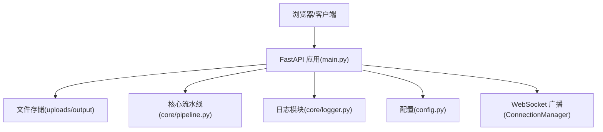
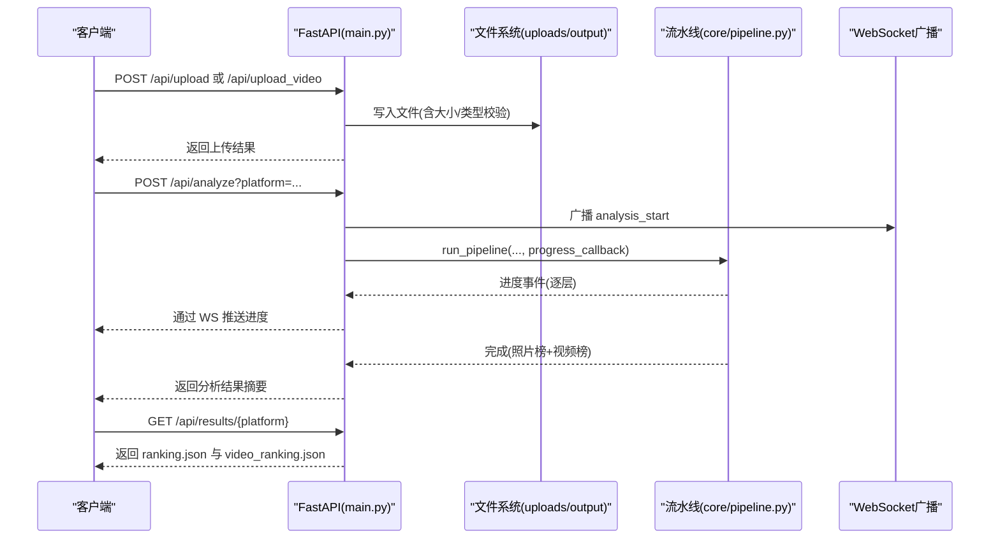
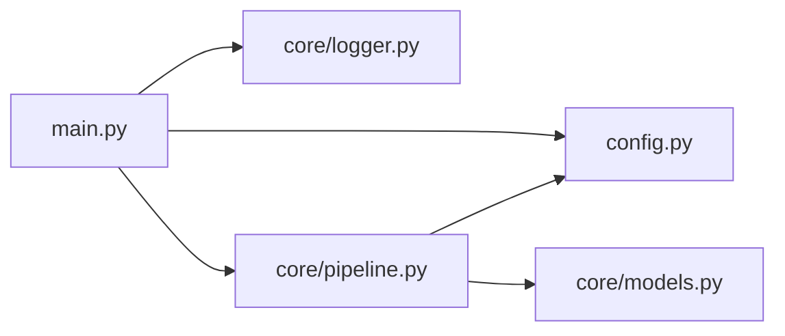

# 管理API接口

<cite>
**本文档引用的文件**   
- [main.py](file://main.py)
- [config.py](file://config.py)
- [core/logger.py](file://core/logger.py)
- [core/pipeline.py](file://core/pipeline.py)
- [README.md](file://README.md)
</cite>

## 目录
1. [简介](#简介)
2. [项目结构](#项目结构)
3. [核心组件](#核心组件)
4. [架构总览](#架构总览)
5. [详细组件分析](#详细组件分析)
6. [依赖关系分析](#依赖关系分析)
7. [性能与容量规划](#性能与容量规划)
8. [故障诊断与排错](#故障诊断与排错)
9. [结论与建议](#结论与建议)
10. [附录：API 端点清单](#附录api-端点清单)

## 简介
本管理文档面向系统管理员与运维人员，聚焦于 PhotoRank 系统的管理 API、配置管理、用户权限控制、监控统计、日志与审计、缓存清理、数据备份与系统维护等主题。当前仓库实现了基于 FastAPI 的 Web 服务与 WebSocket 实时推送，提供照片/视频上传、分析流水线触发、结果查询等能力；同时具备统一日志模块与环境变量驱动的配置体系。

需要特别说明的是：当前仓库未内置“管理员权限验证”“操作审计”“健康检查/性能监控”“缓存清理/数据备份/系统维护”等专用管理端点。为满足管理需求，建议在现有基础上扩展这些能力（见“建议与扩展”章节）。

## 项目结构
- 入口与路由：main.py 定义 HTTP 路由、WebSocket 连接、并发锁与广播机制
- 配置中心：config.py 通过 .env 与环境变量集中管理运行参数、平台权重、阈值等
- 核心流水线：core/pipeline.py 整合多模型层（L1-L5）并支持断点续传与进度回调
- 日志模块：core/logger.py 提供统一日志初始化与分级输出

图表来源
- [main.py:101-398](file://main.py#L101-L398)
- [config.py:1-123](file://config.py#L1-L123)
- [core/pipeline.py:165-200](file://core/pipeline.py#L165-L200)
- [core/logger.py:17-66](file://core/logger.py#L17-L66)

章节来源
- [main.py:101-398](file://main.py#L101-L398)
- [config.py:1-123](file://config.py#L1-L123)
- [core/pipeline.py:165-200](file://core/pipeline.py#L165-L200)
- [core/logger.py:17-66](file://core/logger.py#L17-L66)

## 核心组件
- 路由与服务：HTTP 路由与 WebSocket 端点集中在 main.py，负责请求校验、安全过滤、并发控制与事件广播
- 配置管理：config.py 使用 dotenv 加载环境变量，暴露 HOST/PORT、平台权重、阈值、路径等关键配置
- 流水线执行：core/pipeline.py 实现 L1-L5 多阶段处理、融合评分、断点续传、进度回调
- 日志与审计：core/logger.py 提供统一日志初始化与分级输出，便于问题定位与审计追踪

章节来源
- [main.py:101-398](file://main.py#L101-L398)
- [config.py:1-123](file://config.py#L1-L123)
- [core/pipeline.py:165-200](file://core/pipeline.py#L165-L200)
- [core/logger.py:17-66](file://core/logger.py#L17-L66)

## 架构总览
下图展示了从客户端到后端各组件的交互流程，包括上传、抽帧、分析、结果获取与 WebSocket 实时推送。

图表来源
- [main.py:110-163](file://main.py#L110-L163)
- [main.py:164-237](file://main.py#L164-L237)
- [main.py:335-379](file://main.py#L335-L379)
- [core/pipeline.py:165-200](file://core/pipeline.py#L165-L200)

## 详细组件分析

### 配置管理（config.py）
- 作用：集中管理运行时参数，如主机/端口、平台权重、阈值、路径、代理等
- 覆盖方式：通过 .env 与环境变量覆盖默认值
- 关键项：
  - 路径：PHOTOS_DIR、OUTPUT_DIR、VIDEOS_DIR、VIDEO_FRAMES_DIR
  - 平台：PLATFORMS（小红书/朋友圈/抖音）及其权重
  - 阈值：LAPLACIAN_THRESHOLD、OVEREXPOSURE_THRESHOLD、UNDEREXPOSURE_THRESHOLD、HAMMING_THRESHOLD 等
  - 融合权重：FUSION_WEIGHTS（vlm/topiq/face/objective）
  - Web：HOST、PORT
  - 外部服务：QWEN_BASE_URL、QWEN_MODEL、PROXY

章节来源
- [config.py:1-123](file://config.py#L1-L123)

### 日志与审计（core/logger.py）
- 作用：统一日志初始化与分级输出，支持控制台与可选文件输出
- 环境变量：LOG_LEVEL、LOG_FILE
- 用法：在 main.py 启动时调用 setup_logging()，在各模块中 get_logger(__name__) 获取 logger
- 审计建议：将关键管理操作（如删除、分析、导出）记录为 INFO/WARNING/ERROR，便于后续审计

章节来源
- [core/logger.py:17-66](file://core/logger.py#L17-L66)
- [main.py:34-37](file://main.py#L34-L37)

### 并发控制与实时推送（ConnectionManager + 分析锁）
- 分析锁：_analysis_lock 防止重复触发分析任务
- WebSocket：manager.broadcast 向所有连接推送事件（上传完成、分析开始/完成/错误、视频帧就绪等）
- 适用场景：前端实时展示进度与状态更新

章节来源
- [main.py:42-43](file://main.py#L42-L43)
- [main.py:78-96](file://main.py#L78-L96)
- [main.py:335-379](file://main.py#L335-L379)

### 文件与安全策略
- 文件名安全：secure_filename 防路径遍历与非法字符
- 类型白名单：ALLOWED_EXTENSIONS、ALLOWED_MIME_TYPES、VIDEO_MIME_TYPES
- 大小限制：MAX_UPLOAD_SIZE、MAX_VIDEO_UPLOAD_SIZE
- 流式保存：视频上传分块写入，超限即中断并清理半成品

章节来源
- [main.py:63-70](file://main.py#L63-L70)
- [main.py:50-60](file://main.py#L50-L60)
- [main.py:164-237](file://main.py#L164-L237)

### 流水线执行（core/pipeline.py）
- 功能：整合 L1-L5 各层，支持断点续传、进度回调、融合评分
- 输入：照片目录、目标平台、进度回调函数
- 输出：ranking.json 与 videos/video_ranking.json，以及统计信息

章节来源
- [core/pipeline.py:165-200](file://core/pipeline.py#L165-L200)

## 依赖关系分析
- main.py 依赖 config.py 的路径与常量、core.logger 的日志初始化、core.pipeline 的流水线执行
- core/pipeline.py 依赖 config.py 的平台与阈值、core.models 的数据模型
- core/logger.py 被 main.py 与各层模块引用，用于统一日志

图表来源
- [main.py:22-37](file://main.py#L22-L37)
- [core/pipeline.py:10-28](file://core/pipeline.py#L10-L28)

章节来源
- [main.py:22-37](file://main.py#L22-L37)
- [core/pipeline.py:10-28](file://core/pipeline.py#L10-L28)

## 性能与容量规划
- 上传限制：图片最大 50MB，视频最大 200MB，超限直接拒绝
- 并发控制：分析任务串行执行，避免资源竞争
- I/O 优化：视频上传分块写入，失败自动清理；结果文件按平台隔离
- 推理加速：GPU（RTX 5070）用于审美评分，CPU 用于客观指标与人脸检测
- 建议：在高并发场景下增加反向代理限流与队列化任务调度

章节来源
- [main.py:50-60](file://main.py#L50-L60)
- [main.py:335-379](file://main.py#L335-L379)
- [README.md:140-178](file://README.md#L140-L178)

## 故障诊断与排错
- 常见问题
  - 上传失败：检查文件大小、MIME 类型、扩展名白名单
  - 分析卡住：确认无重复触发（分析锁），查看日志级别与输出
  - 结果缺失：确认 platform 目录存在 ranking.json 与 videos/video_ranking.json
- 日志定位：设置 LOG_LEVEL=DEBUG，必要时启用 LOG_FILE 输出到文件
- 恢复策略：利用 pipeline 的 checkpoint 机制进行断点续传

章节来源
- [core/logger.py:17-66](file://core/logger.py#L17-L66)
- [core/pipeline.py:114-147](file://core/pipeline.py#L114-L147)

## 结论与建议
- 现状：当前系统已具备完善的上传、分析、结果查询与实时推送能力，配置与日志体系健全
- 缺失能力：未内置管理员权限验证、操作审计、健康检查、性能监控、缓存清理、数据备份与系统维护等管理端点
- 建议扩展
  - 管理员权限：引入认证中间件（如 JWT）、角色与权限控制
  - 操作审计：对敏感操作（删除、分析、导出）记录审计日志
  - 健康检查：新增 /health 与 /metrics 端点，暴露服务状态与关键指标
  - 缓存清理：提供 /admin/clear-cache 接口，清理临时文件与过期结果
  - 数据备份：提供 /admin/backup 接口，打包 output 与 uploads 关键目录
  - 系统维护：提供 /admin/maintenance 开关，支持只读模式与优雅停机

[本节不直接分析具体文件，故无章节来源]

## 附录：API 端点清单
- 主页
  - GET / → 返回 HTML 页面
- 上传
  - POST /api/upload → 上传照片（含安全校验与广播）
  - POST /api/upload_video → 上传视频并流式抽帧（含大小预检与失败清理）
- 照片管理
  - GET /api/photos → 列出所有照片
  - GET /api/photos/{filename} → 获取照片（路径遍历防护）
  - DELETE /api/photos/{filename} → 删除照片（路径遍历防护）
- 结果查询
  - GET /api/results/{platform} → 获取照片榜与视频榜
  - GET /api/results/{platform}/videos/{filename} → 获取视频榜结果图片
  - GET /api/results/{platform}/{filename} → 获取结果照片
- 分析触发
  - POST /api/analyze?platform=... → 触发分析（并发锁保护，WebSocket 推送进度）
- 实时通信
  - WS /ws → WebSocket 连接，接收上传与分析事件

章节来源
- [main.py:101-108](file://main.py#L101-L108)
- [main.py:110-163](file://main.py#L110-L163)
- [main.py:164-237](file://main.py#L164-L237)
- [main.py:239-276](file://main.py#L239-L276)
- [main.py:277-333](file://main.py#L277-L333)
- [main.py:335-379](file://main.py#L335-L379)
- [main.py:382-391](file://main.py#L382-L391)