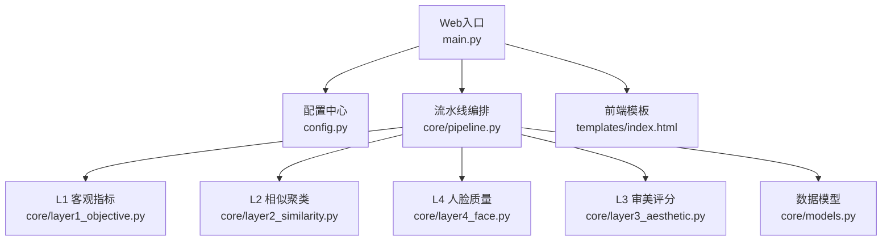
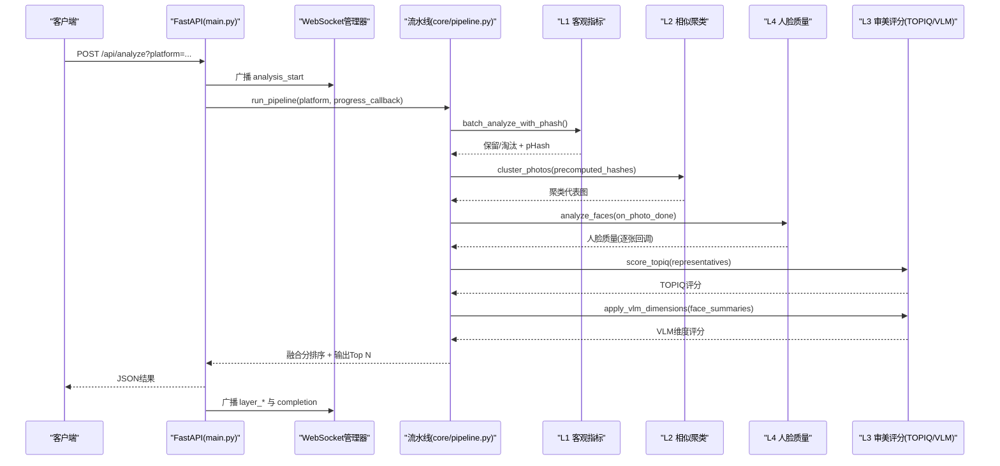
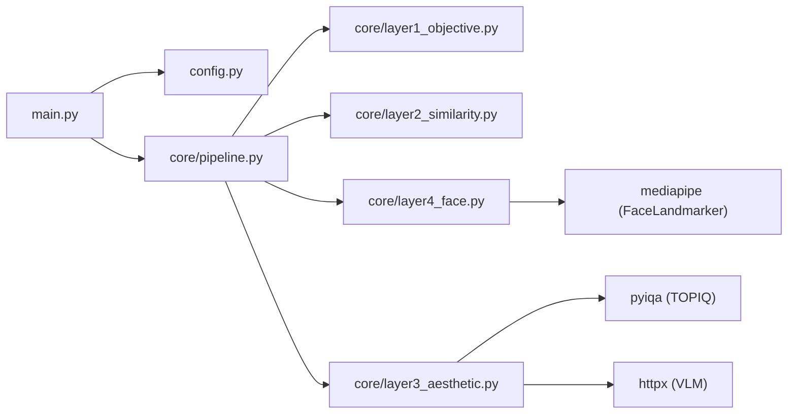

# 评估API接口

<cite>
**本文引用的文件**   
- [main.py](file://main.py)
- [config.py](file://config.py)
- [core/pipeline.py](file://core/pipeline.py)
- [core/layer1_objective.py](file://core/layer1_objective.py)
- [core/layer2_similarity.py](file://core/layer2_similarity.py)
- [core/layer3_aesthetic.py](file://core/layer3_aesthetic.py)
- [core/layer4_face.py](file://core/layer4_face.py)
- [core/models.py](file://core/models.py)
- [templates/index.html](file://templates/index.html)
- [requirements.txt](file://requirements.txt)
</cite>

## 目录
1. [简介](#简介)
2. [项目结构](#项目结构)
3. [核心组件](#核心组件)
4. [架构总览](#架构总览)
5. [详细组件分析](#详细组件分析)
6. [依赖关系分析](#依赖关系分析)
7. [性能考量](#性能考量)
8. [故障排查指南](#故障排查指南)
9. [结论](#结论)
10. [附录：API端点规范](#附录api端点规范)

## 简介
本技术规范面向“照片质量评估、美学评分、人脸检测与内容分析”的评估API，覆盖以下能力：
- 四层本地模型流水线（客观指标、相似聚类、人脸质量、审美评分）
- 基于VLM的多维度专业评分（构图/色彩/光影/综合审美）
- 视频抽帧精选榜（按时长比例分配名额）
- 批量处理、进度跟踪、断点续传、并发优化
- 自定义平台权重与扩展机制
- 完整的错误处理与调试建议

## 项目结构
- Web服务入口与路由：FastAPI应用、上传/分析/结果查询、WebSocket实时推送
- 配置中心：平台权重、阈值、路径、模型参数与环境变量
- 核心流水线：整合L1-L4各层，支持断点续传与进度回调
- 分层实现：
  - L1：清晰度/曝光/噪声等客观指标
  - L2：感知哈希+BK-Tree/并查集相似聚类
  - L3：TOPIQ-IAA客观审美 + VLM多维度评分
  - L4：MediaPipe人脸质量（闭眼/清晰度/表情/占比）
- 数据模型：Pydantic统一数据结构
- 前端模板：拖拽上传、双榜展示、进度条、详情弹窗

**图表来源** 
- [main.py:1-120](file://main.py#L1-L120)
- [config.py:1-123](file://config.py#L1-L123)
- [core/pipeline.py:165-594](file://core/pipeline.py#L165-L594)
- [core/layer1_objective.py:1-215](file://core/layer1_objective.py#L1-L215)
- [core/layer2_similarity.py:1-245](file://core/layer2_similarity.py#L1-L245)
- [core/layer3_aesthetic.py:1-536](file://core/layer3_aesthetic.py#L1-L536)
- [core/layer4_face.py:1-290](file://core/layer4_face.py#L1-L290)
- [core/models.py:1-123](file://core/models.py#L1-L123)
- [templates/index.html:1-800](file://templates/index.html#L1-L800)

**章节来源**
- [main.py:1-120](file://main.py#L1-L120)
- [config.py:1-123](file://config.py#L1-L123)

## 核心组件
- FastAPI应用与路由：提供上传、视频处理、列表、删除、结果获取与分析任务触发；WebSocket用于实时进度推送
- 配置系统：平台权重、阈值、路径、模型参数、环境变量加载
- 流水线编排：L1→L2→L4/L3并行、图片级流水、断点续传、多样性惩罚、融合评分
- 分层模块：
  - L1：多线程批处理，HEIC支持，pHash流水计算
  - L2：BK-Tree/暴力搜索自适应，Union-Find聚类，代表图选择
  - L3：TOPIQ-IAA批次归一化，VLM多维度评分（重试、钳制、分类）
  - L4：MediaPipe人脸质量，线程安全串行调用，提示文案生成
- 数据模型：Layer1/2/3/4/Final/Pipeline/Progress事件等

**章节来源**
- [core/pipeline.py:165-594](file://core/pipeline.py#L165-L594)
- [core/layer1_objective.py:1-215](file://core/layer1_objective.py#L1-L215)
- [core/layer2_similarity.py:1-245](file://core/layer2_similarity.py#L1-L245)
- [core/layer3_aesthetic.py:1-536](file://core/layer3_aesthetic.py#L1-L536)
- [core/layer4_face.py:1-290](file://core/layer4_face.py#L1-L290)
- [core/models.py:1-123](file://core/models.py#L1-L123)

## 架构总览
整体采用“Web服务 + 流水线 + 分层模型”的分层架构。请求进入FastAPI后，通过并发控制与WebSocket广播进度，调度核心流水线执行。流水线内部将耗时任务放入线程池，避免阻塞事件循环；关键网络IO（VLM）与CPU密集（TOPIQ、人脸）分离线程池，最大化吞吐。

**图表来源** 
- [main.py:336-379](file://main.py#L336-L379)
- [core/pipeline.py:165-594](file://core/pipeline.py#L165-L594)
- [core/layer1_objective.py:161-215](file://core/layer1_objective.py#L161-L215)
- [core/layer2_similarity.py:161-245](file://core/layer2_similarity.py#L161-L245)
- [core/layer4_face.py:198-232](file://core/layer4_face.py#L198-L232)
- [core/layer3_aesthetic.py:269-328](file://core/layer3_aesthetic.py#L269-L328)

## 详细组件分析

### 评估层级与API端点
- 照片上传：POST /api/upload
  - 功能：多文件上传，白名单校验（扩展名/MIME），大小限制，去重命名（内容哈希）
  - 返回：上传清单与总数
  - 错误：不支持类型/过大/非法MIME
- 视频上传与抽帧：POST /api/upload_video
  - 功能：流式保存、Content-Length预检、抽帧+本地快筛（L1/L2/L4）、合格帧落盘
  - 返回：统计信息（候选/保留/淘汰原因）
  - 错误：不支持格式/过大/抽帧失败
- 照片管理：GET /api/photos、GET /api/photos/{filename}、DELETE /api/photos/{filename}
  - 功能：列出/获取/删除照片，路径遍历防护
- 结果查询：GET /api/results/{platform}、GET /api/results/{platform}/{filename}、GET /api/results/{platform}/videos/{filename}
  - 功能：读取ranking.json与视频榜单，独立子目录隔离
- 分析任务：POST /api/analyze?platform=...
  - 功能：并发锁保护、进度回调、运行照片榜与视频榜、WebSocket广播阶段事件
  - 错误：任务冲突/内部异常

**章节来源**
- [main.py:111-163](file://main.py#L111-L163)
- [main.py:165-237](file://main.py#L165-L237)
- [main.py:240-334](file://main.py#L240-L334)
- [main.py:336-379](file://main.py#L336-L379)

### Layer 1：客观指标（清晰度/曝光/噪声）
- 输入：照片路径列表
- 处理：
  - HEIC支持（可选依赖）
  - 一次性灰度图计算，共享中间结果
  - 曝光区间不扣分策略（夜景/雪景友好）
  - 模糊/过曝/欠曝阈值判定与淘汰
  - 多线程批处理，逐张计算pHash供后续复用
- 输出：Layer1Result（sharpness/exposure/noise/overall/rejected/reject_reason）
- 复杂度：O(n) 单张线性；pHash O(1) 缓存命中

**章节来源**
- [core/layer1_objective.py:1-215](file://core/layer1_objective.py#L1-L215)

### Layer 2：相似聚类（感知哈希 + BK-Tree + Union-Find）
- 输入：候选路径列表、清晰度分数映射、可选预计算哈希
- 处理：
  - 小数据集暴力比较，大数据集BK-Tree范围查询
  - Union-Find合并等价类，取前2张代表进入审美层
  - 失败哈希回退为独立簇
- 输出：SimilarityCluster（cluster_id/members/representatives/member_scores）
- 复杂度：暴力O(n^2)，BK-Tree近似O(n log n)

**章节来源**
- [core/layer2_similarity.py:1-245](file://core/layer2_similarity.py#L1-L245)

### Layer 4：人脸质量（MediaPipe Face Landmarker）
- 输入：候选路径列表
- 处理：
  - 全局实例缓存，串行调用保证线程安全
  - 闭眼检测、主脸清晰度、表情微笑、人脸占比、主次分布
  - 多人场景降级策略（≥6张且主脸占比<10%视为环境元素）
- 输出：Layer4Result（face_count/has_face/blink_detected/expression_score/face_clarity/overall_face_score/face_ratio/second_face_ratio/main_face_blink）
- 提示文案：to_face_prompt_summary用于注入VLM prompt

**章节来源**
- [core/layer4_face.py:1-290](file://core/layer4_face.py#L1-L290)

### Layer 3：审美评分（TOPIQ-IAA + VLM多维度）
- 输入：候选路径列表
- 处理：
  - TOPIQ-IAA批次推理，设备自动选择（CUDA/CPU），模块级缓存
  - 批次归一化（p5-p95拉伸），防分数膨胀
  - VLM多维度评分（构图/色彩/光影/综合审美），指数退避重试，JSON解析与枚举校验
  - 人像硬伤钳制（闭眼/人脸模糊→综合审美上限6分）
- 输出：Layer3Result（aesthetic_score/technical_score/overall_score/final_score/composition_score/color_score/lighting_score/vlm_overall_score/score_reason/hard_flaws/category/error/device）

**章节来源**
- [core/layer3_aesthetic.py:1-536](file://core/layer3_aesthetic.py#L1-L536)

### 流水线编排与融合评分
- 流程：L1→L2→L4/L3并行→融合评分→多样性惩罚→Top N输出
- 特性：
  - 断点续传（v2 checkpoint累积保存）
  - 图片级流水（L4完成一张即发起该张VLM）
  - 平台权重加权（composition/color/lighting/face）
  - 融合公式：VLM有效分×w_vlm + TOPIQ×w_topiq + 人脸×w_face + 客观×w_obj
  - 多样性惩罚：pHash距离低于阈值对靠后照片按比例扣分
- 输出：PipelineResult（total/rejected/merged/ranked/output_count/output_dir/skipped_layers/results）

**章节来源**
- [core/pipeline.py:165-594](file://core/pipeline.py#L165-L594)

### 视频精选榜
- 输入：视频帧目录（含manifest.json）
- 处理：
  - 跨视频聚类（复用pHash）
  - L4/L3-TOPIQ并发，VLM维度分析
  - 融合评分+多样性惩罚（同视频内相似帧扣分）
  - 按视频时长比例分配名额（_allocate_quotas）
- 输出：视频榜单（output/{platform}/videos/video_ranking.json）

**章节来源**
- [core/pipeline.py:681-875](file://core/pipeline.py#L681-L875)

## 依赖关系分析
- Web框架：FastAPI + Uvicorn
- 图像处理：Pillow、OpenCV、numpy、imagehash、pillow-heif
- AI模型：pyiqa（TOPIQ-IAA）、mediapipe（人脸）
- HTTP客户端：httpx（VLM调用）
- 配置与环境：python-dotenv、PyYAML

**图表来源** 
- [requirements.txt:1-27](file://requirements.txt#L1-L27)
- [core/layer3_aesthetic.py:465-536](file://core/layer3_aesthetic.py#L465-L536)
- [core/layer4_face.py:1-120](file://core/layer4_face.py#L1-L120)

**章节来源**
- [requirements.txt:1-27](file://requirements.txt#L1-L27)

## 性能考量
- 并发策略：
  - L4与TOPIQ使用2-worker线程池并行
  - VLM独立线程池（默认8并发），网络IO密集
  - 异步转同步（asyncio.to_thread）避免阻塞事件循环
- 模型缓存：
  - TOPIQ模型按device模块级缓存，显存可释放
  - MediaPipe全局实例，串行调用防C++崩溃
- 数据处理：
  - L1流水阶段计算pHash，L2直接复用
  - VLM图片缩放与JPEG压缩降低传输体积
- 多样性惩罚：减少同场景重复入选，提升榜单多样性
- 断点续传：checkpoint累积保存，中断后可从任意层恢复

[本节为通用性能指导，不直接分析具体文件]

## 故障排查指南
- 常见错误与定位：
  - 上传失败：检查扩展名/MIME白名单、文件大小限制
  - 视频抽帧失败：确认格式支持、磁盘空间、解码库可用
  - L1失败：HEIC未安装pillow-heif、cv2.imread失败回退PIL
  - L2失败：哈希计算异常，回退暴力搜索或独立簇
  - L3失败：TOPIQ模型加载失败（GPU/CPU fallback）、VLM API超时/解析失败
  - L4失败：MediaPipe模型下载失败或初始化异常
- 日志与调试：
  - 启用logging，查看各层错误与跳过记录（skipped_layers）
  - 检查checkpoint.json了解已完成步骤
  - WebSocket事件追踪（analysis_start/layer_* /analysis_complete/error）
- 恢复策略：
  - 设置force=False以复用checkpoint
  - 清理损坏的缓存或模型文件后重试
  - 调整并发数与超时参数（VLM_TIMEOUT/_VLM_RETRIES）

**章节来源**
- [core/pipeline.py:114-163](file://core/pipeline.py#L114-L163)
- [core/layer1_objective.py:24-31](file://core/layer1_objective.py#L24-L31)
- [core/layer3_aesthetic.py:465-536](file://core/layer3_aesthetic.py#L465-L536)
- [core/layer4_face.py:48-86](file://core/layer4_face.py#L48-L86)

## 结论
本项目提供了完整、可扩展的照片评估API体系，涵盖客观指标、相似聚类、人脸质量与多维度审美评分，支持视频精选榜与实时进度反馈。通过模块化设计、并发优化与断点续传，兼顾性能与稳定性。用户可通过配置文件自定义平台权重与阈值，结合WebSocket实现端到端的交互体验。

[本节为总结性内容，不直接分析具体文件]

## 附录：API端点规范

### 上传与媒体处理
- POST /api/upload
  - 请求体：multipart/form-data，字段files（数组）
  - 响应：{uploaded:[{filename,original_name,size}], total:int}
  - 错误码：400（不支持类型/MIME）、413（过大）
- POST /api/upload_video
  - 请求体：multipart/form-data，字段file
  - 响应：{video:str, stats:{candidates:int, kept:int, blurry:int, dup:int, blink:int, failed:int}, message:str}
  - 错误码：400（不支持格式/MIME/抽帧失败）、413（过大）

### 照片管理
- GET /api/photos
  - 响应：{photos:[{filename,path,size}], total:int}
- GET /api/photos/{filename}
  - 响应：文件流
  - 错误码：400（非法文件名）、404（不存在）
- DELETE /api/photos/{filename}
  - 响应：{deleted:str}
  - 错误码：400（非法文件名）

### 结果查询
- GET /api/results/{platform}
  - 响应：{photos:[FinalResult], videos:[VideoFrameInfo], total:int, video_total:int}
  - 错误码：400（非法平台名）、404（无结果）
- GET /api/results/{platform}/{filename}
  - 响应：文件流
  - 错误码：400（非法路径）、404（不存在）
- GET /api/results/{platform}/videos/{filename}
  - 响应：文件流
  - 错误码：400（非法路径）、404（不存在）

### 分析任务
- POST /api/analyze?platform=...
  - 响应：{photos:PipelineResult, videos:dict}
  - 错误码：409（任务冲突）、500（内部错误）
- WebSocket /ws
  - 事件类型：upload_complete、video_frames_ready、analysis_start、layer_start、layer_end、analysis_complete、analysis_error
  - 用途：实时进度与状态推送

**章节来源**
- [main.py:111-163](file://main.py#L111-L163)
- [main.py:165-237](file://main.py#L165-L237)
- [main.py:240-334](file://main.py#L240-L334)
- [main.py:336-379](file://main.py#L336-L379)
- [core/models.py:76-123](file://core/models.py#L76-L123)