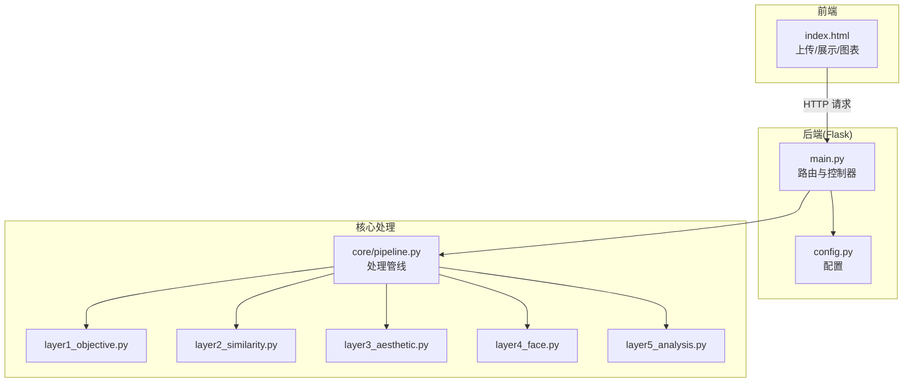
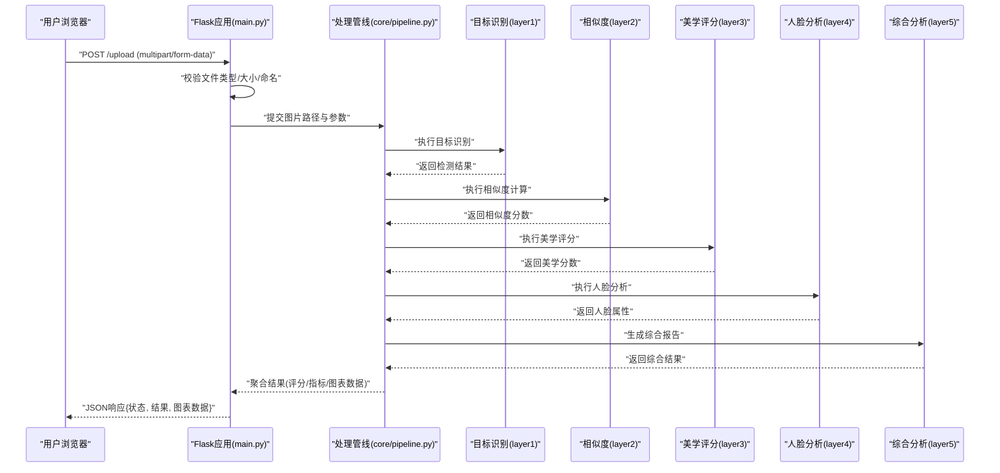
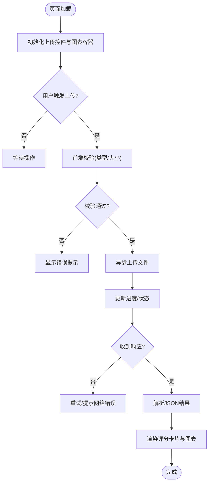
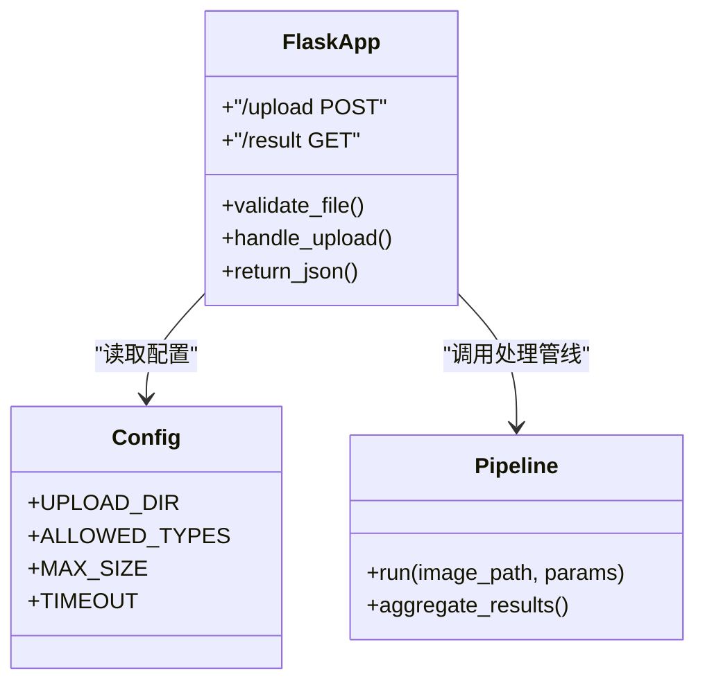
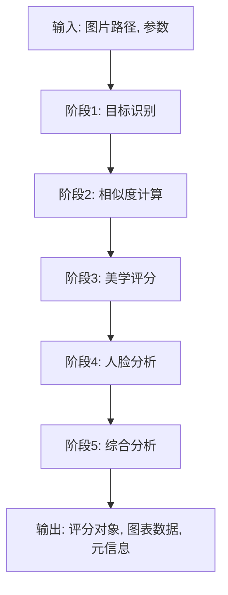
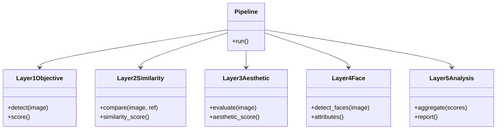
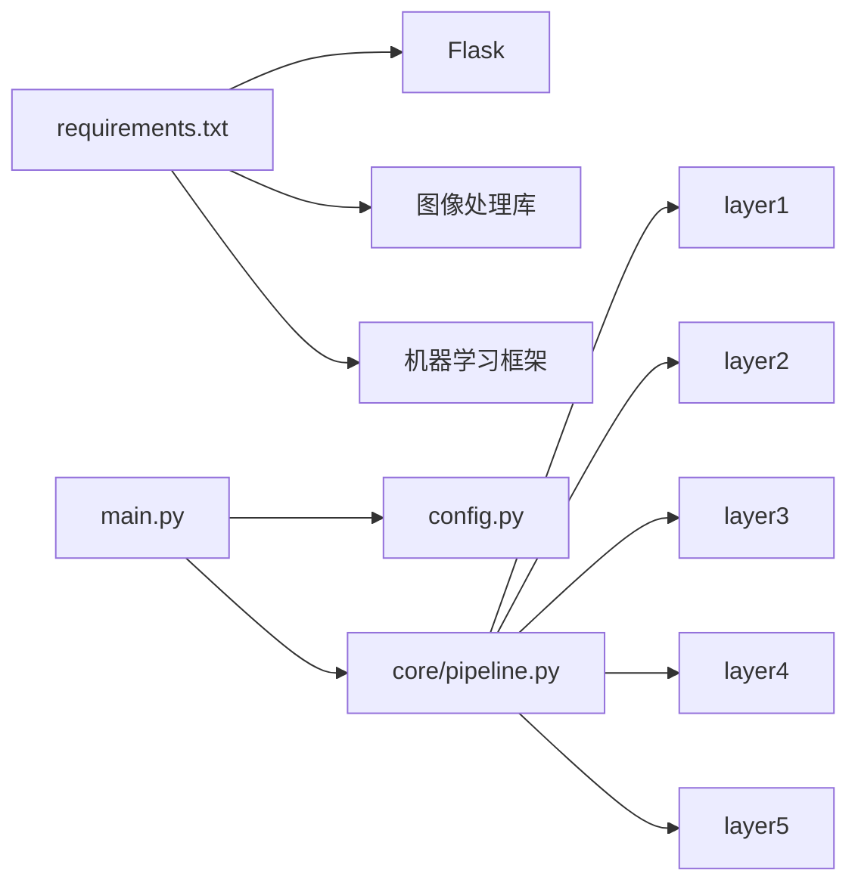

# Web界面系统

<cite>
**本文引用的文件**   
- [main.py](file://main.py)
- [config.py](file://config.py)
- [templates/index.html](file://templates/index.html)
- [core/pipeline.py](file://core/pipeline.py)
- [core/layer1_objective.py](file://core/layer1_objective.py)
- [core/layer2_similarity.py](file://core/layer2_similarity.py)
- [core/layer3_aesthetic.py](file://core/layer3_aesthetic.py)
- [core/layer4_face.py](file://core/layer4_face.py)
- [core/layer5_analysis.py](file://core/layer5_analysis.py)
- [requirements.txt](file://requirements.txt)
</cite>

## 目录
1. [简介](#简介)
2. [项目结构](#项目结构)
3. [核心组件](#核心组件)
4. [架构总览](#架构总览)
5. [详细组件分析](#详细组件分析)
6. [依赖关系分析](#依赖关系分析)
7. [性能考虑](#性能考虑)
8. [故障排查指南](#故障排查指南)
9. [结论](#结论)
10. [附录](#附录)

## 简介
本文件系统是一个基于Flask的Web应用，提供照片上传、评分与可视化展示能力。前端模板index.html负责用户交互（上传、结果展示、图表渲染），后端通过API接收图片并调用核心处理管线进行多维度分析与评分，最终返回结构化数据供前端渲染。系统强调前后端数据交换格式清晰、文件上传流程稳健、实时反馈友好，并提供界面定制指南以支持样式修改、功能扩展和多语言支持。

## 项目结构
- 入口与配置
  - main.py：Flask应用入口，定义路由、请求处理与响应格式。
  - config.py：应用配置项（如上传路径、模型参数、服务端口等）。
- 前端模板
  - templates/index.html：主页面模板，包含上传区域、结果展示区与图表容器。
- 核心处理管线
  - core/pipeline.py：编排层，串联各处理阶段。
  - core/layer*.py：分阶段实现目标检测、相似度、美学评分、人脸分析、综合分析等。
- 其他
  - requirements.txt：Python依赖声明。
  - uploads/：用户上传文件的临时存储目录。
  - output/：处理结果输出目录（可选）。

**图示来源** 
- [main.py:1-200](file://main.py#L1-L200)
- [config.py:1-120](file://config.py#L1-L120)
- [templates/index.html:1-600](file://templates/index.html#L1-L600)
- [core/pipeline.py:1-200](file://core/pipeline.py#L1-L200)
- [core/layer1_objective.py:1-150](file://core/layer1_objective.py#L1-L150)
- [core/layer2_similarity.py:1-150](file://core/layer2_similarity.py#L1-L150)
- [core/layer3_aesthetic.py:1-150](file://core/layer3_aesthetic.py#L1-L150)
- [core/layer4_face.py:1-150](file://core/layer4_face.py#L1-L150)
- [core/layer5_analysis.py:1-150](file://core/layer5_analysis.py#L1-L150)

**章节来源**
- [main.py:1-200](file://main.py#L1-L200)
- [config.py:1-120](file://config.py#L1-L120)
- [templates/index.html:1-600](file://templates/index.html#L1-L600)
- [core/pipeline.py:1-200](file://core/pipeline.py#L1-L200)

## 核心组件
- Flask应用与路由（main.py）
  - 定义上传接口与查询接口，解析表单或JSON，校验文件类型与大小，调用处理管线，返回统一JSON响应。
- 配置管理（config.py）
  - 集中管理上传目录、允许的文件类型、最大文件大小、超时时间、日志级别、模型相关参数等。
- 处理管线（core/pipeline.py）
  - 按顺序执行多阶段分析：目标识别、相似度计算、美学评分、人脸分析、综合分析，聚合结果并标准化输出。
- 分阶段模块（core/layer*.py）
  - layer1_objective：目标/主体识别与定位。
  - layer2_similarity：图像相似度或特征匹配。
  - layer3_aesthetic：美学评分与质量评估。
  - layer4_face：人脸检测与属性分析。
  - layer5_analysis：综合打分与报告生成。
- 前端模板（templates/index.html）
  - 提供拖拽/选择上传、进度提示、错误提示、结果卡片、雷达图/柱状图等可视化展示。

**章节来源**
- [main.py:1-200](file://main.py#L1-L200)
- [config.py:1-120](file://config.py#L1-L120)
- [core/pipeline.py:1-200](file://core/pipeline.py#L1-L200)
- [core/layer1_objective.py:1-150](file://core/layer1_objective.py#L1-L150)
- [core/layer2_similarity.py:1-150](file://core/layer2_similarity.py#L1-L150)
- [core/layer3_aesthetic.py:1-150](file://core/layer3_aesthetic.py#L1-L150)
- [core/layer4_face.py:1-150](file://core/layer4_face.py#L1-L150)
- [core/layer5_analysis.py:1-150](file://core/layer5_analysis.py#L1-L150)
- [templates/index.html:1-600](file://templates/index.html#L1-L600)

## 架构总览
系统采用“前端模板 + Flask后端 + 核心处理管线”的分层架构。前端通过AJAX/Fetch发起上传请求，后端校验并持久化到uploads目录，随后调用pipeline进行多阶段分析，最后将结构化结果返回给前端渲染。

**图示来源** 
- [main.py:1-200](file://main.py#L1-L200)
- [core/pipeline.py:1-200](file://core/pipeline.py#L1-L200)
- [core/layer1_objective.py:1-150](file://core/layer1_objective.py#L1-L150)
- [core/layer2_similarity.py:1-150](file://core/layer2_similarity.py#L1-L150)
- [core/layer3_aesthetic.py:1-150](file://core/layer3_aesthetic.py#L1-L150)
- [core/layer4_face.py:1-150](file://core/layer4_face.py#L1-L150)
- [core/layer5_analysis.py:1-150](file://core/layer5_analysis.py#L1-L150)

## 详细组件分析

### 前端模板 index.html
- 功能特性
  - 上传界面：支持点击选择与拖拽上传，显示文件名、大小与类型校验提示。
  - 进度与反馈：上传中显示进度条与状态消息；成功/失败时给出明确提示。
  - 结果展示：上传成功后渲染评分卡片、关键指标与说明文本。
  - 可视化图表：使用图表库渲染雷达图/柱状图，展示多维度评分。
- 交互流程
  - 用户选择/拖拽图片 -> 前端校验 -> 异步上传 -> 后端返回JSON -> 前端更新DOM与图表。
- 数据交换格式
  - 请求：multipart/form-data，字段名建议为image/file。
  - 响应：JSON，包含状态码、消息、评分对象、图表数据数组等。
- 实时反馈机制
  - 使用Fetch/AJAX发送请求，监听progress事件（若支持）或轮询状态；在UI上即时更新进度与结果。

**图示来源** 
- [templates/index.html:1-600](file://templates/index.html#L1-L600)

**章节来源**
- [templates/index.html:1-600](file://templates/index.html#L1-L600)

### 后端API接口设计（main.py）
- 上传接口
  - 方法：POST
  - 路径：/upload
  - 内容类型：multipart/form-data
  - 请求体：图片文件字段（如image）
  - 响应：JSON，包含状态、消息、评分对象、图表数据等
- 查询接口（可选）
  - 方法：GET
  - 路径：/result/{id}
  - 响应：JSON，包含历史结果或缓存数据
- 错误处理
  - 非法文件类型、过大文件、上传失败、处理异常均返回统一错误结构，便于前端提示。

**图示来源** 
- [main.py:1-200](file://main.py#L1-L200)
- [config.py:1-120](file://config.py#L1-L120)
- [core/pipeline.py:1-200](file://core/pipeline.py#L1-L200)

**章节来源**
- [main.py:1-200](file://main.py#L1-L200)
- [config.py:1-120](file://config.py#L1-L120)

### 核心处理管线（core/pipeline.py）
- 职责
  - 编排layer1~layer5的执行顺序，传递中间结果，聚合最终评分与指标。
- 输入/输出
  - 输入：图片路径、处理参数（如阈值、权重）。
  - 输出：标准化JSON结构，包含各维度分数、关键指标、图表数据数组。
- 错误与回退
  - 单阶段失败不影响整体流程，记录错误并跳过该阶段，保证可用性。

**图示来源** 
- [core/pipeline.py:1-200](file://core/pipeline.py#L1-L200)

**章节来源**
- [core/pipeline.py:1-200](file://core/pipeline.py#L1-L200)

### 分阶段模块（core/layer*.py）
- layer1_objective：目标/主体识别，返回主体位置与置信度。
- layer2_similarity：相似度计算，返回与参考图的相似度分数。
- layer3_aesthetic：美学评分，返回构图、色彩、清晰度等子分数。
- layer4_face：人脸检测与属性，返回人脸数量、表情、年龄估计等。
- layer5_analysis：综合打分，加权汇总各维度得分，生成报告摘要。

**图示来源** 
- [core/layer1_objective.py:1-150](file://core/layer1_objective.py#L1-L150)
- [core/layer2_similarity.py:1-150](file://core/layer2_similarity.py#L1-L150)
- [core/layer3_aesthetic.py:1-150](file://core/layer3_aesthetic.py#L1-L150)
- [core/layer4_face.py:1-150](file://core/layer4_face.py#L1-L150)
- [core/layer5_analysis.py:1-150](file://core/layer5_analysis.py#L1-L150)
- [core/pipeline.py:1-200](file://core/pipeline.py#L1-L200)

**章节来源**
- [core/layer1_objective.py:1-150](file://core/layer1_objective.py#L1-L150)
- [core/layer2_similarity.py:1-150](file://core/layer2_similarity.py#L1-L150)
- [core/layer3_aesthetic.py:1-150](file://core/layer3_aesthetic.py#L1-L150)
- [core/layer4_face.py:1-150](file://core/layer4_face.py#L1-L150)
- [core/layer5_analysis.py:1-150](file://core/layer5_analysis.py#L1-L150)
- [core/pipeline.py:1-200](file://core/pipeline.py#L1-L200)

## 依赖关系分析
- Python依赖
  - Flask用于Web服务，requests/urllib用于外部调用（如有），图像处理库（如OpenCV/Pillow）、机器学习框架（如PyTorch/TensorFlow）根据具体实现引入。
- 模块耦合
  - main.py依赖config.py与core/pipeline.py；pipeline依赖各layer模块；前端依赖HTML/CSS/JS与图表库。
- 潜在循环依赖
  - 各layer模块应仅被pipeline调用，避免反向依赖导致循环。

**图示来源** 
- [requirements.txt:1-200](file://requirements.txt#L1-L200)
- [main.py:1-200](file://main.py#L1-L200)
- [config.py:1-120](file://config.py#L1-L120)
- [core/pipeline.py:1-200](file://core/pipeline.py#L1-L200)

**章节来源**
- [requirements.txt:1-200](file://requirements.txt#L1-L200)
- [main.py:1-200](file://main.py#L1-L200)
- [config.py:1-120](file://config.py#L1-L120)
- [core/pipeline.py:1-200](file://core/pipeline.py#L1-L200)

## 性能考虑
- 文件上传
  - 限制最大文件大小与类型，减少无效请求；使用流式写入避免内存峰值。
- 处理管线
  - 对耗时阶段启用缓存（相同哈希的图片复用结果）；并行执行独立阶段（如相似度与美学评分可并发）。
- 前端渲染
  - 图表按需渲染，避免重复绘制；懒加载大图预览。
- 资源管理
  - 定期清理uploads与output目录；合理设置超时与重试策略。

[本节为通用指导，不直接分析具体文件]

## 故障排查指南
- 常见错误
  - 文件类型不支持：检查config.allowed_types与前端校验逻辑。
  - 文件过大：调整max_size与前端提示。
  - 处理阶段失败：查看pipeline日志与各layer异常捕获。
  - 图表不显示：确认JSON数据结构与图表库初始化。
- 调试建议
  - 开启Flask调试模式与详细日志；在前端控制台打印请求/响应。
  - 使用浏览器开发者工具检查网络请求与DOM更新。

**章节来源**
- [config.py:1-120](file://config.py#L1-L120)
- [main.py:1-200](file://main.py#L1-L200)
- [core/pipeline.py:1-200](file://core/pipeline.py#L1-L200)
- [templates/index.html:1-600](file://templates/index.html#L1-L600)

## 结论
本Web界面系统以Flask为核心，结合模块化处理管线与友好的前端模板，实现了从图片上传到多维评分与可视化的完整流程。通过清晰的API设计与稳健的错误处理，系统具备良好的可扩展性与可维护性。遵循界面定制指南与性能优化建议，可进一步提升用户体验与系统稳定性。

[本节为总结性内容，不直接分析具体文件]

## 附录

### 前后端数据交换格式
- 上传请求
  - 方法：POST
  - 路径：/upload
  - 内容类型：multipart/form-data
  - 字段：image（二进制文件）
- 响应JSON结构（示例字段）
  - status：整数状态码
  - message：字符串消息
  - scores：对象，包含各维度分数（如objective、similarity、aesthetic、face、overall）
  - chart_data：数组，包含图表所需的数据点
  - meta：对象，包含处理时长、模型版本等元信息

**章节来源**
- [main.py:1-200](file://main.py#L1-L200)
- [core/pipeline.py:1-200](file://core/pipeline.py#L1-L200)

### 界面定制指南
- 样式修改
  - 在index.html中调整CSS类与布局，确保移动端适配（媒体查询、弹性布局）。
- 功能扩展
  - 新增阶段：在pipeline中添加新layer，并在API响应中补充对应字段。
  - 新增图表：在前端增加图表容器与渲染逻辑，保持数据格式一致。
- 多语言支持
  - 使用i18n键值替换静态文案；根据浏览器语言或用户设置动态切换。

**章节来源**
- [templates/index.html:1-600](file://templates/index.html#L1-L600)
- [core/pipeline.py:1-200](file://core/pipeline.py#L1-L200)

### 响应式设计与浏览器兼容性
- 响应式设计
  - 使用相对单位与媒体查询，确保在不同屏幕尺寸下布局正常。
  - 图表容器自适应宽度，避免溢出。
- 浏览器兼容
  - 主流现代浏览器（Chrome、Firefox、Safari、Edge）均支持Fetch与Canvas/SVG图表。
  - 如需兼容旧版IE，可使用polyfill或降级方案。

**章节来源**
- [templates/index.html:1-600](file://templates/index.html#L1-L600)