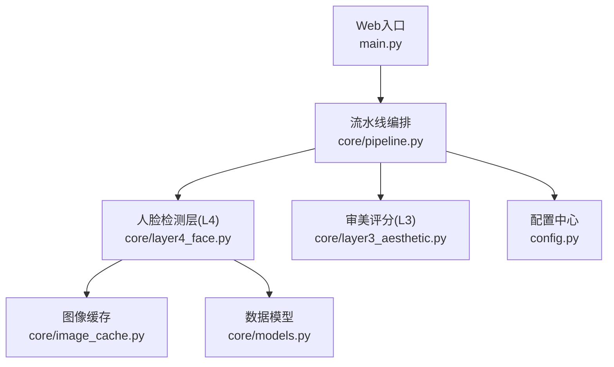
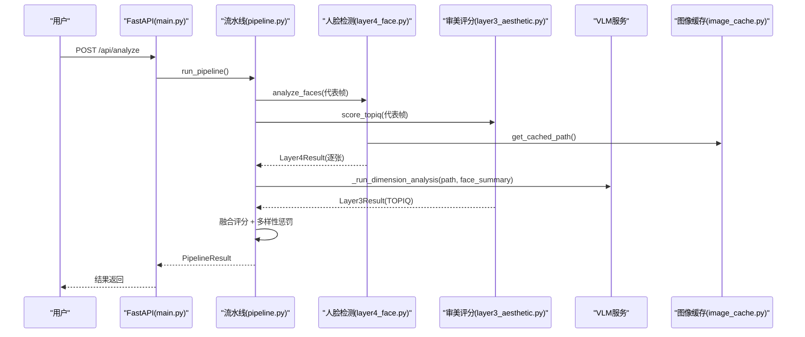
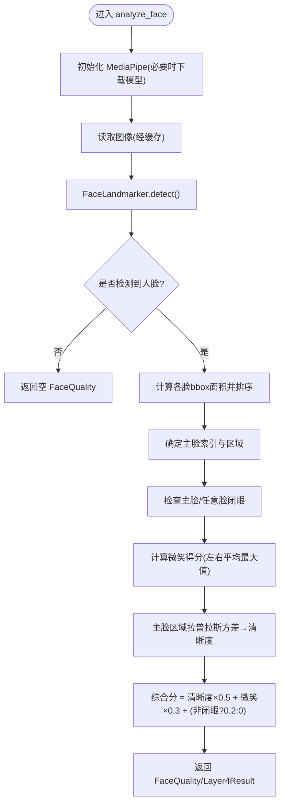
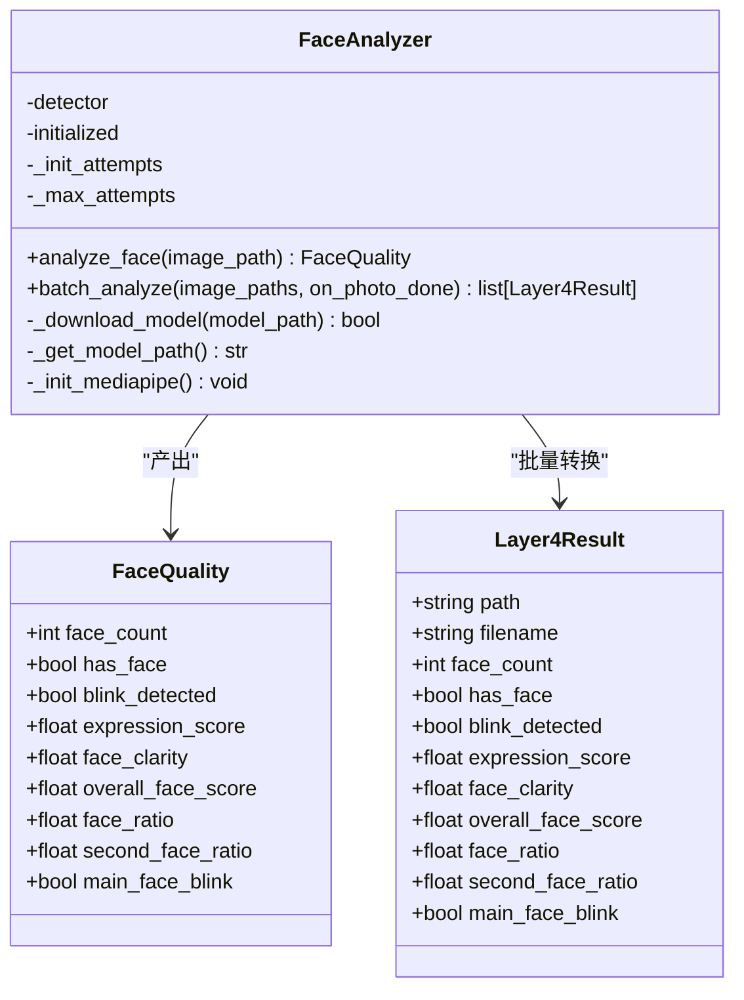
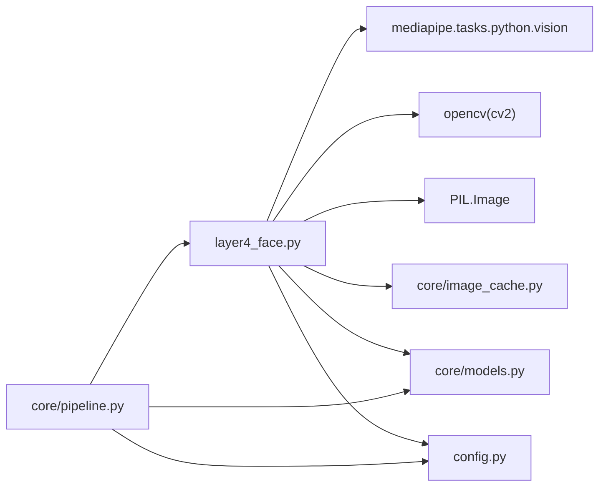

# 人脸检测层

<cite>
**本文引用的文件**   
- [core/layer4_face.py](file://core/layer4_face.py)
- [core/pipeline.py](file://core/pipeline.py)
- [config.py](file://config.py)
- [main.py](file://main.py)
- [core/models.py](file://core/models.py)
- [core/image_cache.py](file://core/image_cache.py)
</cite>

## 目录
1. [简介](#简介)
2. [项目结构](#项目结构)
3. [核心组件](#核心组件)
4. [架构总览](#架构总览)
5. [详细组件分析](#详细组件分析)
6. [依赖关系分析](#依赖关系分析)
7. [性能考量](#性能考量)
8. [故障排查指南](#故障排查指南)
9. [结论](#结论)
10. [附录：参数调优与扩展](#附录参数调优与扩展)

## 简介
本章节聚焦“第四层评估”的人脸检测模块，围绕人脸识别、表情分析与人像质量评估展开。该层基于 MediaPipe Face Landmarker 实现面部特征点定位与表情状态判断，并结合清晰度、占比等几何指标输出综合评分。其目标是在多人像、遮挡与不同光照条件下，稳定地识别主脸并给出可用于下游融合排序的客观信号。

## 项目结构
- 人脸检测核心逻辑位于 core/layer4_face.py，提供单张与批量分析能力，并通过全局实例与串行锁保证线程安全。
- 流水线编排位于 core/pipeline.py，将 L4 与 L3（TOPIQ/VLM）并发执行，并在 L4 完成每张图片后触发 VLM 调用，形成图片级流水。
- 配置项集中在 config.py，定义平台权重、融合权重、VLM 图像尺寸与质量等关键参数。
- Web 入口 main.py 负责上传、调度与分析任务广播。
- 数据模型 core/models.py 定义了 Layer4Result 等结构化结果。
- 图像缓存 core/image_cache.py 对 HEIC/超大图进行解码缓存，减少重复解码开销。

图表来源
- [core/pipeline.py:165-386](file://core/pipeline.py#L165-L386)
- [core/layer4_face.py:117-231](file://core/layer4_face.py#L117-L231)
- [core/image_cache.py:51-98](file://core/image_cache.py#L51-L98)
- [config.py:99-108](file://config.py#L99-L108)

章节来源
- [core/layer4_face.py:1-290](file://core/layer4_face.py#L1-L290)
- [core/pipeline.py:165-386](file://core/pipeline.py#L165-L386)
- [config.py:99-108](file://config.py#L99-L108)
- [core/models.py:55-74](file://core/models.py#L55-L74)
- [core/image_cache.py:1-119](file://core/image_cache.py#L1-L119)

## 核心组件
- FaceAnalyzer：封装 MediaPipe 初始化、模型下载与检测流程；支持单张 analyze_face 与批量 batch_analyze。
- analyze_faces：模块级入口，维护全局 FaceAnalyzer 实例与调用锁，确保并发安全。
- to_face_prompt_summary：将 L4 检测结果转换为中性提示文案，供 L3 VLM prompt 注入。
- FaceQuality：内部数据结构，承载人脸数量、闭眼标志、表情得分、清晰度、占比等指标。

章节来源
- [core/layer4_face.py:28-46](file://core/layer4_face.py#L28-L46)
- [core/layer4_face.py:41-116](file://core/layer4_face.py#L41-L116)
- [core/layer4_face.py:117-231](file://core/layer4_face.py#L117-L231)
- [core/layer4_face.py:234-290](file://core/layer4_face.py#L234-L290)

## 架构总览
L4 在流水线中与 L3-TOPIQ 并行执行，且通过回调机制在 L4 逐张完成后立即发起 VLM 维度分析，从而缩短端到端延迟。L4 的输出参与最终融合评分，同时为 VLM 提供客观事实描述，避免重复计算与主观偏差。

图表来源
- [core/pipeline.py:324-386](file://core/pipeline.py#L324-L386)
- [core/layer4_face.py:198-231](file://core/layer4_face.py#L198-L231)
- [core/image_cache.py:51-98](file://core/image_cache.py#L51-L98)

## 详细组件分析

### 人脸检测算法与特征点定位
- 模型加载与自动下载：首次运行或模型损坏时从官方地址下载 ~3MB 的 float16 模型，并进行大小校验与失败重试。
- 初始化选项：启用 blendshapes 输出，设置最大检测人脸数，创建 FaceLandmarker 实例。
- 输入处理：通过图像缓存获取可复用路径，读取为 RGB 数组并转为 mediapipe Image。
- 特征点与表情：利用 face_landmarks 计算每张脸的 bbox 面积，按面积排序确定主脸；使用 face_blendshapes 提取眨眼与微笑分数。
- 清晰度估计：对主脸区域灰度化后计算拉普拉斯方差，归一化为 0-1 的清晰度分数。

图表来源
- [core/layer4_face.py:48-116](file://core/layer4_face.py#L48-L116)
- [core/layer4_face.py:117-196](file://core/layer4_face.py#L117-L196)

章节来源
- [core/layer4_face.py:48-116](file://core/layer4_face.py#L48-L116)
- [core/layer4_face.py:117-196](file://core/layer4_face.py#L117-L196)

### 表情状态判断与多脸场景处理
- 表情判断：基于 eyeBlinkLeft/Right 与 mouthSmileLeft/Right 的 blendshapes 分数，阈值 0.5 判定闭眼；微笑得分为左右平均值取最大。
- 多脸处理：按 bbox 面积排序，主脸用于清晰度与闭眼判定；次脸面积与主脸比值用于区分“主次分明”和“合影”。
- 多人环境降级：当检测到 ≥6 张脸且主脸占比 < 10% 时，视为环境元素，不参与加分（在 pipeline 中应用）。

图表来源
- [core/layer4_face.py:28-46](file://core/layer4_face.py#L28-L46)
- [core/layer4_face.py:41-116](file://core/layer4_face.py#L41-L116)
- [core/models.py:55-74](file://core/models.py#L55-L74)

章节来源
- [core/layer4_face.py:117-196](file://core/layer4_face.py#L117-L196)
- [core/pipeline.py:387-398](file://core/pipeline.py#L387-L398)
- [core/models.py:55-74](file://core/models.py#L55-L74)

### 人像质量评估与融合权重
- 质量指标：face_ratio（主脸占比）、second_face_ratio（次脸相对大小）、face_clarity（清晰度）、blink_detected/main_face_blink（闭眼）、expression_score（微笑）。
- 综合分公式：overall_face_score = clarity×0.5 + smile×0.3 + (非主脸闭眼?0.2:0)。
- 融合阶段：根据平台权重与是否已 VLM 评分动态调整 face 权重；无人脸照片会重分配 face 权重到其他维度，避免系统性吃亏。

章节来源
- [core/layer4_face.py:183-196](file://core/layer4_face.py#L183-L196)
- [core/pipeline.py:33-54](file://core/pipeline.py#L33-L54)
- [config.py:99-108](file://config.py#L99-L108)

### 与流水线集成与图片级流水
- 并发策略：L4 与 TOPIQ 双线程池并行；L4 每完成一张即通过 on_photo_done 回调触发 VLM 维度分析，降低网络 IO 等待。
- 断点续传：checkpoint 保存已完成层数据，支持增量重跑（如仅重跑 l4 → vlm）。
- 硬伤钳制：主脸闭眼或明显模糊（face_clarity < 0.25）作为程序化硬伤标记，限制 VLM 综合分上限至 6 分。

章节来源
- [core/pipeline.py:324-386](file://core/pipeline.py#L324-L386)
- [core/pipeline.py:387-469](file://core/pipeline.py#L387-L469)

## 依赖关系分析
- 外部依赖：MediaPipe Face Landmarker（模型自动下载）、OpenCV（清晰度计算）、PIL（图像读取）、imagehash（哈希，间接由 L2/L3 使用）。
- 内部依赖：core.image_cache.get_cached_path 提供解码缓存；core.models.Layer4Result 提供结构化输出；config.FUSION_WEIGHTS 控制融合权重。
- 线程安全：全局 FaceAnalyzer 实例与 _analyze_call_lock 串行化调用，防止 C++ 层崩溃。

图表来源
- [core/layer4_face.py:101-116](file://core/layer4_face.py#L101-L116)
- [core/layer4_face.py:123-131](file://core/layer4_face.py#L123-L131)
- [core/image_cache.py:51-98](file://core/image_cache.py#L51-L98)
- [core/models.py:55-74](file://core/models.py#L55-L74)
- [config.py:99-108](file://config.py#L99-L108)

章节来源
- [core/layer4_face.py:101-131](file://core/layer4_face.py#L101-L131)
- [core/image_cache.py:51-98](file://core/image_cache.py#L51-L98)
- [core/models.py:55-74](file://core/models.py#L55-L74)
- [config.py:99-108](file://config.py#L99-L108)

## 性能考量
- 模型缓存与复用：FaceAnalyzer 全局实例避免重复初始化；模型下载带完整性校验与失败重试。
- 图像缓存：HEIC/超大图首解转 JPEG 缓存，后续层直接读缓存，显著减少重复解码与缩放开销。
- 并发与串行化：L4 与 TOPIQ 并行；但 L4 内部调用加锁串行化，避免 C++ 层崩溃。
- 多样性惩罚：在最终排序前对相似照片扣分，提升榜单多样性。

章节来源
- [core/layer4_face.py:17-22](file://core/layer4_face.py#L17-L22)
- [core/image_cache.py:25-35](file://core/image_cache.py#L25-L35)
- [core/pipeline.py:495-516](file://core/pipeline.py#L495-L516)

## 故障排查指南
- 模型下载失败：检查网络与磁盘空间；确认 EXPECTED_SIZE 校验逻辑；查看日志中的错误信息。
- MediaPipe 初始化失败：确认模型路径正确、权限可用；必要时清理 ~/.cache/mediapipe 后重试。
- 无人脸检测：检查输入图像质量与分辨率；确认图像缓存未损坏；必要时回退原图路径。
- 闭眼误判：调整 blink 阈值（当前 0.5），或在业务侧增加二次校验。
- 清晰度偏低：检查主脸区域裁剪是否正确；确认 OpenCV 版本与数据类型。

章节来源
- [core/layer4_face.py:48-85](file://core/layer4_face.py#L48-L85)
- [core/layer4_face.py:117-133](file://core/layer4_face.py#L117-L133)
- [core/image_cache.py:72-98](file://core/image_cache.py#L72-L98)

## 结论
第四层人脸检测层以 MediaPipe 为核心，结合几何与表情特征，提供稳定的人脸识别、表情分析与质量评估。通过与流水线的深度集成与图片级并发策略，既保证了性能，又提升了整体排序质量。在多人与复杂场景下，通过占比与清晰度等客观指标有效区分主体与环境，并为 VLM 提供中性事实描述，避免重复计算与主观偏差。

## 附录：参数调优与扩展

### 如何调整检测灵敏度
- 闭眼阈值：当前 blink 阈值为 0.5，可在 detect 后的条件判断处调整（例如增大到 0.6 以减少误判）。
- 清晰度阈值：face_clarity < 0.25 作为硬伤标记，可根据场景调整（如更严格的 0.3）。
- 主脸占比：face_ratio 用于定性（特写/半身/环境人像），可按平台风格微调。

章节来源
- [core/layer4_face.py:173-181](file://core/layer4_face.py#L173-L181)
- [core/pipeline.py:387-398](file://core/pipeline.py#L387-L398)

### 如何集成新的人脸模型
- 替换模型 URL：修改 MODEL_URL 指向新模型地址。
- 更新 EXPECTED_SIZE：根据新模型大小调整校验阈值。
- 初始化选项：根据需要调整 num_faces、output_face_blendshapes 等参数。

章节来源
- [core/layer4_face.py:24-25](file://core/layer4_face.py#L24-L25)
- [core/layer4_face.py:105-110](file://core/layer4_face.py#L105-L110)

### 优化检测性能的建议
- 启用图像缓存：确保 image_cache 正常工作，减少重复解码。
- 控制并发：合理设置 L4 与 TOPIQ 的线程池大小，避免 CPU 过载。
- 批量处理：优先使用 analyze_faces 批量接口，减少初始化与 I/O 开销。

章节来源
- [core/image_cache.py:51-98](file://core/image_cache.py#L51-L98)
- [core/pipeline.py:355-360](file://core/pipeline.py#L355-L360)

### 人脸质量标准与隐私保护
- 质量标准：face_ratio、second_face_ratio、face_clarity、blink_detected、expression_score、overall_face_score。
- 隐私措施：上传文件名净化、路径遍历防护、文件大小限制、MIME 类型白名单。
- 兼容性考虑：支持 HEIC/HEIF、JPEG、PNG 等格式；大尺寸图像自动缩放缓存。

章节来源
- [core/models.py:55-74](file://core/models.py#L55-L74)
- [main.py:63-70](file://main.py#L63-L70)
- [main.py:111-162](file://main.py#L111-L162)
- [core/image_cache.py:25-35](file://core/image_cache.py#L25-L35)