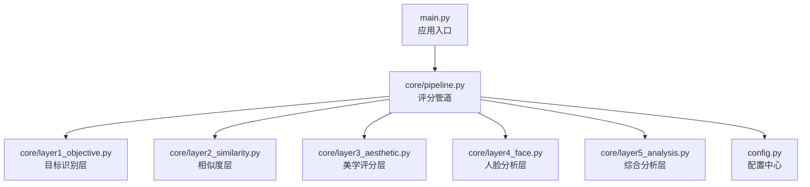
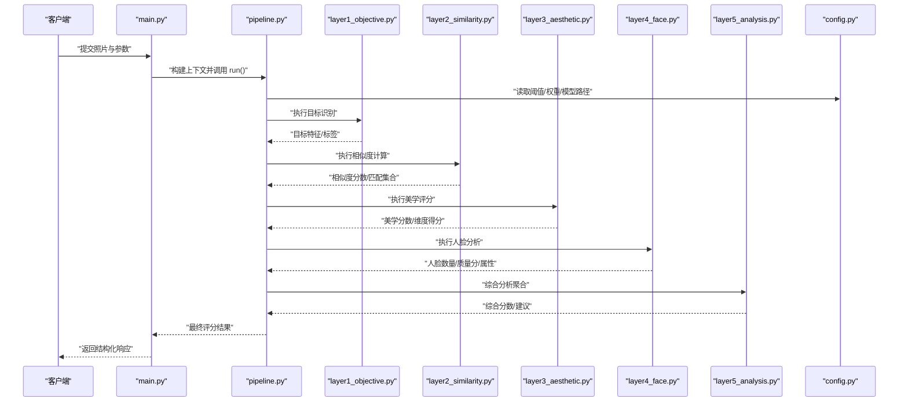
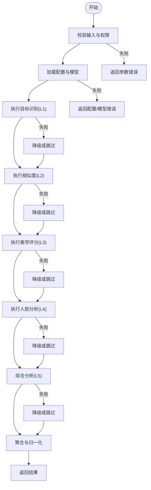
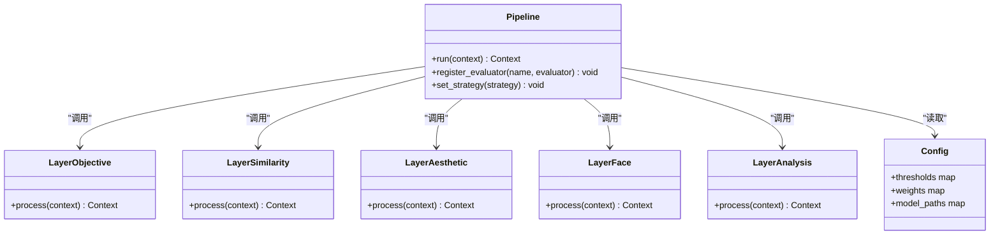
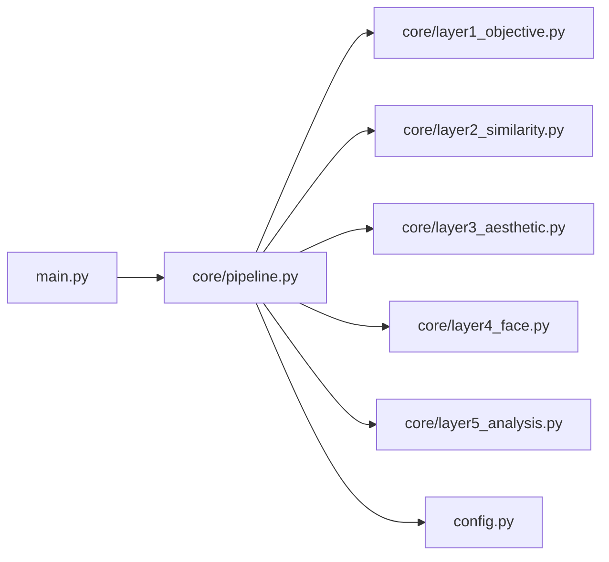

# 核心系统架构

<cite>
**本文引用的文件**   
- [core/pipeline.py](file://core/pipeline.py)
- [core/layer1_objective.py](file://core/layer1_objective.py)
- [core/layer2_similarity.py](file://core/layer2_similarity.py)
- [core/layer3_aesthetic.py](file://core/layer3_aesthetic.py)
- [core/layer4_face.py](file://core/layer4_face.py)
- [core/layer5_analysis.py](file://core/layer5_analysis.py)
- [config.py](file://config.py)
- [main.py](file://main.py)
</cite>

## 目录
1. [简介](#简介)
2. [项目结构](#项目结构)
3. [核心组件](#核心组件)
4. [架构总览](#架构总览)
5. [详细组件分析](#详细组件分析)
6. [依赖关系分析](#依赖关系分析)
7. [性能考量](#性能考量)
8. [故障排查指南](#故障排查指南)
9. [结论](#结论)
10. [附录](#附录)

## 简介
本文件面向照片评分系统的核心架构，重点阐述以 pipeline 为核心的分层处理流程、模块间通信机制与数据流转模式。文档将解释如何从照片上传到最终评分结果生成的端到端过程，并说明扩展点与插件化评估器的集成方式。同时提供架构图、流程图以及接口与参数约定，帮助读者快速理解并扩展系统。

## 项目结构
系统采用“核心层 + 管道编排”的组织方式：
- core/pipeline.py：定义评分管道的编排与执行逻辑，串联各层级分析器。
- core/layer*.py：各层级的独立分析器（目标检测、相似度、美学、人脸、综合分析）。
- config.py：全局配置项（模型路径、阈值、权重等）。
- main.py：应用入口，负责接收请求、调用管道并返回结果。

图表来源
- [main.py](file://main.py)
- [core/pipeline.py](file://core/pipeline.py)
- [core/layer1_objective.py](file://core/layer1_objective.py)
- [core/layer2_similarity.py](file://core/layer2_similarity.py)
- [core/layer3_aesthetic.py](file://core/layer3_aesthetic.py)
- [core/layer4_face.py](file://core/layer4_face.py)
- [core/layer5_analysis.py](file://core/layer5_analysis.py)
- [config.py](file://config.py)

章节来源
- [core/pipeline.py](file://core/pipeline.py)
- [config.py](file://config.py)
- [main.py](file://main.py)

## 核心组件
- 评分管道（Pipeline）
  - 职责：统一编排多层级分析器，管理输入校验、中间结果传递、错误处理与最终聚合。
  - 关键能力：顺序/并行执行策略、可插拔评估器注册、指标汇总与归一化。
- 层级分析器（Layer 1~5）
  - 职责：各自完成特定维度的分析（如目标、相似度、美学、人脸、综合语义），输出结构化特征或分数。
  - 接口约定：统一的输入格式（图像数据/元信息）、输出格式（特征向量/分数字典/标签列表）。
- 配置中心（Config）
  - 职责：集中管理模型路径、阈值、权重、超时、重试等运行参数。
- 应用入口（Main）
  - 职责：HTTP/CLI 接入，解析请求，调用管道，封装响应。

章节来源
- [core/pipeline.py](file://core/pipeline.py)
- [core/layer1_objective.py](file://core/layer1_objective.py)
- [core/layer2_similarity.py](file://core/layer2_similarity.py)
- [core/layer3_aesthetic.py](file://core/layer3_aesthetic.py)
- [core/layer4_face.py](file://core/layer4_face.py)
- [core/layer5_analysis.py](file://core/layer5_analysis.py)
- [config.py](file://config.py)
- [main.py](file://main.py)

## 架构总览
下图展示了从请求进入到评分输出的整体流程，以及各层之间的数据流转。

图表来源
- [main.py](file://main.py)
- [core/pipeline.py](file://core/pipeline.py)
- [core/layer1_objective.py](file://core/layer1_objective.py)
- [core/layer2_similarity.py](file://core/layer2_similarity.py)
- [core/layer3_aesthetic.py](file://core/layer3_aesthetic.py)
- [core/layer4_face.py](file://core/layer4_face.py)
- [core/layer5_analysis.py](file://core/layer5_analysis.py)
- [config.py](file://config.py)

## 详细组件分析

### 评分管道（pipeline.py）
- 设计要点
  - 输入上下文：包含原始图像数据、元信息（尺寸、格式、来源）、可选参考集与用户偏好。
  - 执行策略：支持顺序执行与关键路径并行（如 L1/L3/L4 可并行），由配置控制。
  - 中间状态：每层输出写入上下文，供后续层消费；异常层可选择降级或跳过。
  - 聚合规则：加权求和、阈值门控、置信度过滤、异常值修正。
  - 扩展点：评估器注册表、钩子函数（预处理/后处理）、自定义聚合策略。
- 典型流程
  - 校验输入 → 加载配置 → 逐层分析 → 异常捕获与降级 → 结果聚合 → 返回标准化响应。
- 关键数据结构
  - 上下文对象：保存图像、中间特征、分数字典、日志与错误信息。
  - 评估器接口：统一方法签名（输入上下文，返回更新后的上下文）。
- 错误处理
  - 层失败时记录日志并标记降级；根据配置决定是否继续或中断。
  - 超时与资源不足时的重试与回退策略。

图表来源
- [core/pipeline.py](file://core/pipeline.py)

章节来源
- [core/pipeline.py](file://core/pipeline.py)

### 层级分析器（Layer 1~5）
- Layer1 目标识别
  - 功能：识别画面中的主要目标与场景元素，输出标签与置信度。
  - 输入：图像数据、可选先验类别。
  - 输出：目标列表、置信度、裁剪区域（可选）。
- Layer2 相似度
  - 功能：与参考集进行特征比对，返回相似度分数与匹配结果。
  - 输入：当前图像特征、参考集索引。
  - 输出：相似度分数、Top-K 匹配、距离度量。
- Layer3 美学评分
  - 功能：基于美学模型对构图、色彩、亮度等进行打分。
  - 输入：图像数据、增强参数。
  - 输出：总分与维度分（构图、色彩、曝光等）。
- Layer4 人脸分析
  - 功能：检测人脸数量、质量与基本属性。
  - 输入：图像数据、检测阈值。
  - 输出：人脸计数、质量分、属性（表情、朝向等，可选）。
- Layer5 综合分析
  - 功能：融合前四层结果，生成最终评分与建议。
  - 输入：各层输出上下文。
  - 输出：综合分数、权重分配、改进建议。

图表来源
- [core/pipeline.py](file://core/pipeline.py)
- [core/layer1_objective.py](file://core/layer1_objective.py)
- [core/layer2_similarity.py](file://core/layer2_similarity.py)
- [core/layer3_aesthetic.py](file://core/layer3_aesthetic.py)
- [core/layer4_face.py](file://core/layer4_face.py)
- [core/layer5_analysis.py](file://core/layer5_analysis.py)
- [config.py](file://config.py)

章节来源
- [core/layer1_objective.py](file://core/layer1_objective.py)
- [core/layer2_similarity.py](file://core/layer2_similarity.py)
- [core/layer3_aesthetic.py](file://core/layer3_aesthetic.py)
- [core/layer4_face.py](file://core/layer4_face.py)
- [core/layer5_analysis.py](file://core/layer5_analysis.py)

### 公共接口与参数约定
- 管道入口
  - 方法：run(context)
  - 输入：上下文对象（含图像、元信息、参考集、用户偏好、执行选项）
  - 输出：标准化结果对象（总分、维度分、中间特征摘要、建议、日志）
- 评估器接口
  - 方法：process(context) -> context
  - 约定：不修改原始图像；仅追加或更新上下文字段；异常需抛出明确错误类型
- 配置项
  - 阈值：各层判定阈值（如人脸最小尺寸、相似度阈值）
  - 权重：各层对总分的贡献权重
  - 模型路径：各层模型或资源路径
  - 执行策略：顺序/并行、超时、重试次数
- 返回值格式
  - 总分：数值型（0~1 或 0~100，依配置）
  - 维度分：字典（键为维度名，值为分数）
  - 中间特征：可选（用于调试或二次分析）
  - 建议：字符串或结构化建议列表

章节来源
- [core/pipeline.py](file://core/pipeline.py)
- [config.py](file://config.py)

### 扩展点与插件机制
- 评估器注册
  - 通过注册表按名称绑定评估器实现，支持动态加载与替换。
- 钩子函数
  - 预处理钩子：在层执行前对图像或上下文做增强/裁剪/归一化。
  - 后处理钩子：在层输出后做校准、平滑或异常值修正。
- 自定义聚合策略
  - 支持按业务需求重写聚合函数（如引入时序一致性、用户画像权重）。
- 配置驱动
  - 通过配置文件切换启用/禁用某层、调整权重与阈值，无需改代码。

章节来源
- [core/pipeline.py](file://core/pipeline.py)
- [config.py](file://config.py)

## 依赖关系分析
- 内部依赖
  - pipeline.py 依赖所有 layer*.py 与 config.py。
  - main.py 依赖 pipeline.py 与 config.py。
- 外部依赖
  - 各层可能依赖视觉模型库（如图像处理、深度学习推理框架），具体由层内实现决定。
- 耦合与内聚
  - 层之间通过上下文解耦，降低直接依赖；pipeline 作为协调者提高内聚性。
- 潜在循环依赖
  - 层之间不应互相引用；如需跨层数据，应通过上下文共享。

图表来源
- [main.py](file://main.py)
- [core/pipeline.py](file://core/pipeline.py)
- [core/layer1_objective.py](file://core/layer1_objective.py)
- [core/layer2_similarity.py](file://core/layer2_similarity.py)
- [core/layer3_aesthetic.py](file://core/layer3_aesthetic.py)
- [core/layer4_face.py](file://core/layer4_face.py)
- [core/layer5_analysis.py](file://core/layer5_analysis.py)
- [config.py](file://config.py)

章节来源
- [main.py](file://main.py)
- [core/pipeline.py](file://core/pipeline.py)
- [config.py](file://config.py)

## 性能考量
- 并行执行
  - 将无依赖的层（如 L1/L3/L4）并行执行，缩短端到端延迟。
- 缓存与复用
  - 对重复输入的中间特征进行缓存（如哈希图像指纹）；参考集索引预构建。
- 模型加载
  - 模型懒加载与单例化，避免重复初始化开销。
- I/O 优化
  - 流式读取大图像，按需缩放与裁剪；批量处理时合并 I/O。
- 资源限制
  - 设置超时、内存上限与线程池大小，防止雪崩。

[本节为通用指导，不涉及具体文件分析]

## 故障排查指南
- 常见问题
  - 输入校验失败：检查图像格式、尺寸、编码与权限。
  - 模型加载失败：核对模型路径、依赖库版本与环境变量。
  - 层执行超时：调整超时阈值或减少并行度。
  - 分数异常：检查权重配置与阈值设置，查看中间特征是否合理。
- 定位手段
  - 开启详细日志，记录每层输入输出摘要。
  - 使用最小复现用例隔离问题层。
  - 对比不同配置下的输出差异。
- 恢复策略
  - 自动降级：跳过失败层并使用默认权重。
  - 重试与回退：对网络或临时错误进行有限次重试。

章节来源
- [core/pipeline.py](file://core/pipeline.py)
- [config.py](file://config.py)

## 结论
本系统以 pipeline 为核心编排多层级分析器，通过统一的上下文与接口实现松耦合与高扩展性。借助配置驱动的权重与阈值、可插拔的评估器与钩子机制，系统能够灵活适配不同业务场景与模型演进。建议在部署中关注并行策略、缓存与资源限制，以获得稳定且高效的评分服务。

[本节为总结性内容，不涉及具体文件分析]

## 附录
- 常见用例
  - 单张照片评分：传入图像与基础参数，获取总分与维度分。
  - 批量评分：传入多张图像与批处理选项，返回聚合结果。
  - 自定义评估器：实现 process(context) 并注册到管道，参与评分。
- 示例路径
  - 管道调用入口：[core/pipeline.py](file://core/pipeline.py)
  - 配置项定义：[config.py](file://config.py)
  - 应用入口：[main.py](file://main.py)

[本节为补充信息，不涉及具体文件分析]