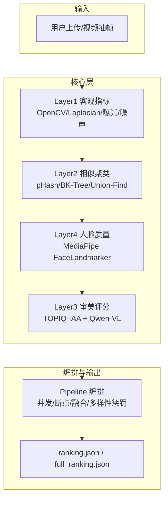
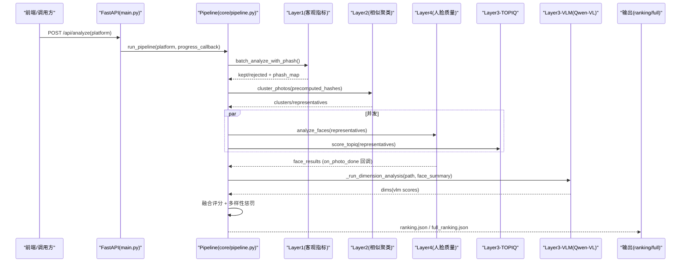
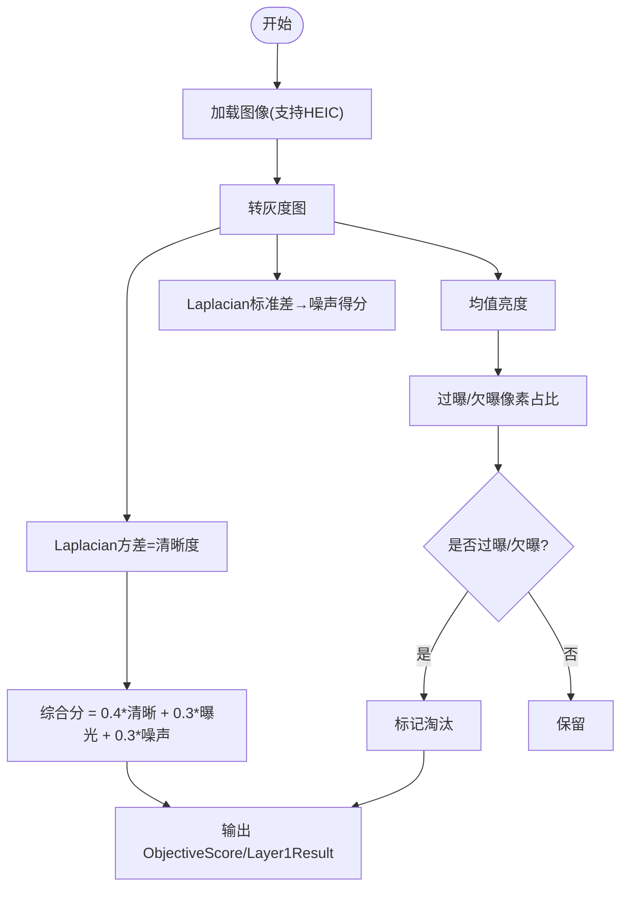
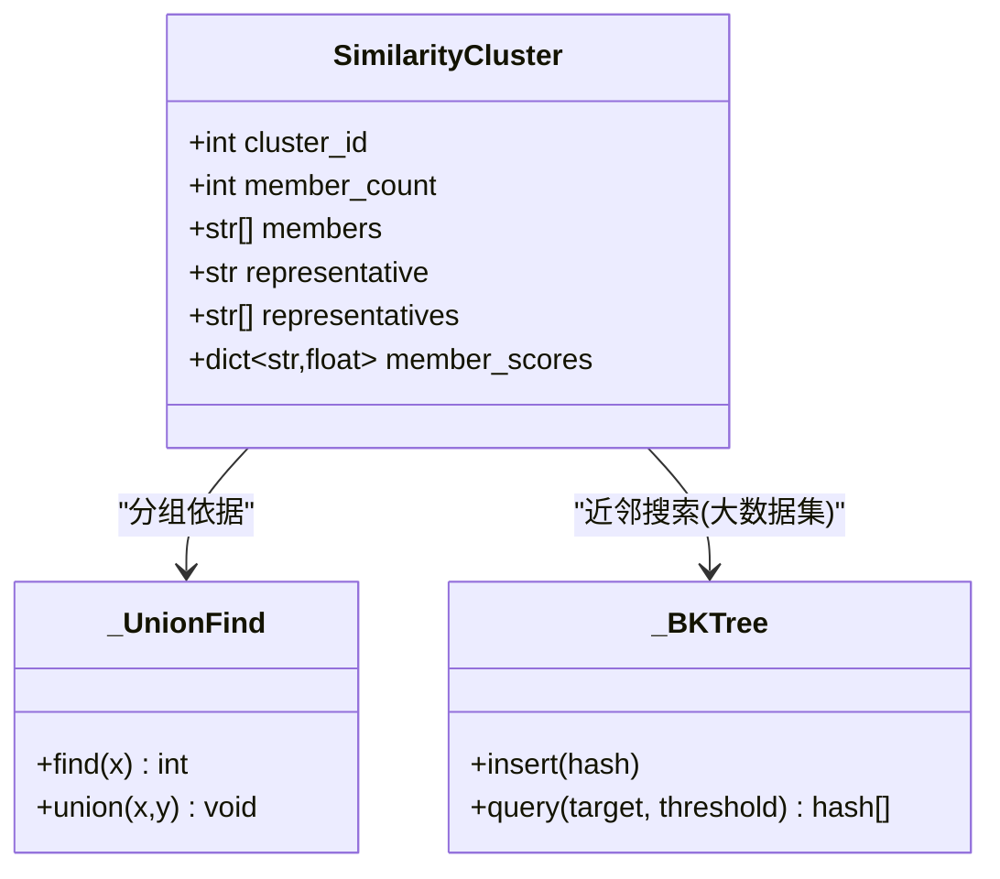
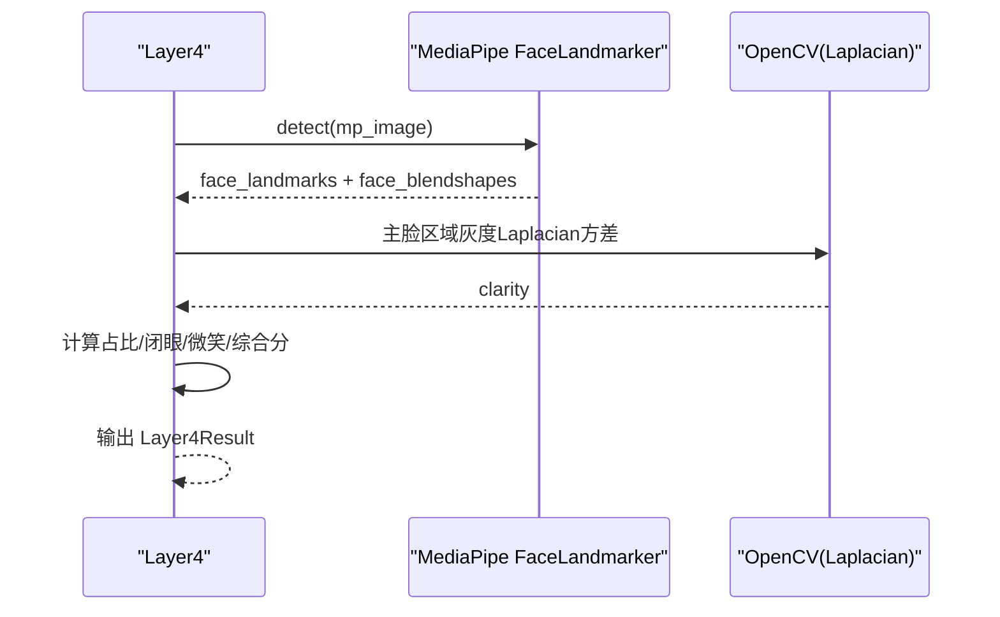
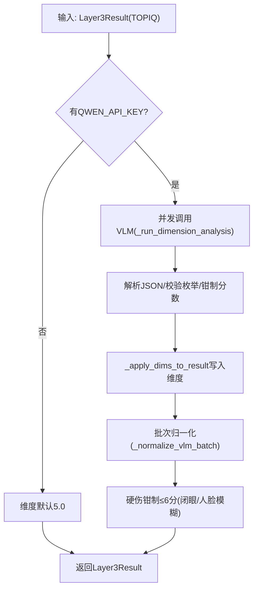
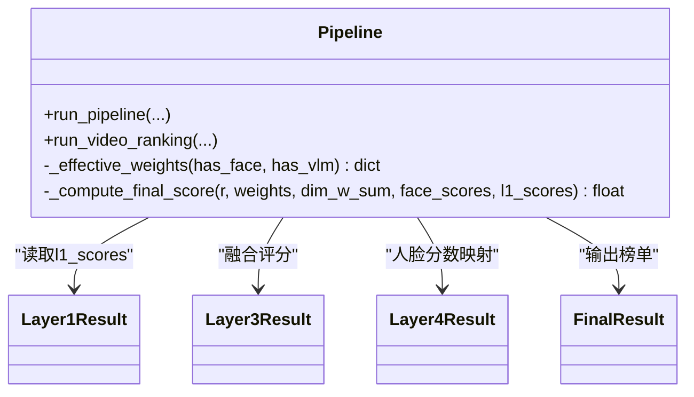
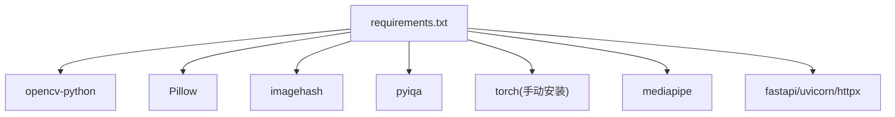

# 目标检测层

<cite>
**本文引用的文件**   
- [core/layer1_objective.py](file://core/layer1_objective.py)
- [core/layer2_similarity.py](file://core/layer2_similarity.py)
- [core/layer3_aesthetic.py](file://core/layer3_aesthetic.py)
- [core/layer4_face.py](file://core/layer4_face.py)
- [core/pipeline.py](file://core/pipeline.py)
- [config.py](file://config.py)
- [main.py](file://main.py)
- [requirements.txt](file://requirements.txt)
</cite>

## 目录
1. [引言](#引言)
2. [项目结构](#项目结构)
3. [核心组件](#核心组件)
4. [架构总览](#架构总览)
5. [详细组件分析](#详细组件分析)
6. [依赖关系分析](#依赖关系分析)
7. [性能考量](#性能考量)
8. [故障排查指南](#故障排查指南)
9. [结论](#结论)
10. [附录](#附录)

## 引言
本文件面向“目标检测层”的文档化说明，聚焦第一层评估的核心功能：主体识别、构图分析与视觉焦点检测。需要特别说明的是，当前代码库中的 Layer1（客观指标）并不包含通用对象检测（如 YOLO），而是通过 OpenCV 计算清晰度、曝光与噪声等客观指标；主体识别与构图分析由后续层级完成：Layer4（人脸质量）提供人脸几何与表情信息，Layer3（审美评分）结合 VLM（Qwen-VL）进行构图/色彩/光影等多维度专业评分，并在融合阶段统一加权。本文据此对“目标检测层”的职责边界、数据流、算法实现与集成方式进行系统化阐述，并给出可操作的自定义与优化建议。

## 项目结构
- core/layer1_objective.py：Layer1 客观指标（清晰度、曝光、噪声），支持 HEIC 与多线程批处理，输出淘汰决策与综合分。
- core/layer2_similarity.py：相似聚类（感知哈希 + BK-Tree + 并查集），用于去重与多样性控制。
- core/layer3_aesthetic.py：审美评分（TOPIQ-IAA 客观审美 + VLM 多维度评分），含批次归一化与硬伤钳制。
- core/layer4_face.py：人脸质量（MediaPipe Face Landmarker），输出人脸数量、闭眼、清晰度、占比等客观几何信息。
- core/pipeline.py：流水线编排（断点续传、并发调度、融合评分、多样性惩罚、结果输出）。
- config.py：全局配置（阈值、权重、平台策略、VLM 参数等）。
- main.py：Web API（上传、抽帧、触发分析、WebSocket 进度推送）。
- requirements.txt：第三方依赖声明（OpenCV、Pillow、imagehash、pyiqa、mediapipe 等）。

图表来源
- [core/pipeline.py:165-593](file://core/pipeline.py#L165-L593)
- [core/layer1_objective.py:1-215](file://core/layer1_objective.py#L1-L215)
- [core/layer2_similarity.py:1-245](file://core/layer2_similarity.py#L1-L245)
- [core/layer4_face.py:1-290](file://core/layer4_face.py#L1-L290)
- [core/layer3_aesthetic.py:1-536](file://core/layer3_aesthetic.py#L1-L536)

章节来源
- [core/pipeline.py:165-593](file://core/pipeline.py#L165-L593)
- [config.py:1-123](file://config.py#L1-L123)
- [main.py:1-399](file://main.py#L1-L399)

## 核心组件
- Layer1 客观指标：基于 OpenCV 的 Laplacian 方差衡量清晰度；均值亮度与过曝/欠曝像素比例判定曝光；噪声以 Laplacian 标准差估计信噪比；整体采用加权组合，并输出淘汰标记与原因。
- Layer2 相似聚类：使用 imagehash.phash 生成感知哈希，小数据集暴力比较，大数据集用 BK-Tree 范围查询，Union-Find 合并等价类，按清晰度取代表进入下游。
- Layer4 人脸质量：MediaPipe Face Landmarker 检测人脸关键点与 blendshapes，统计主脸面积占比、次脸占比、闭眼、表情微笑度、主脸清晰度，输出综合人脸质量分。
- Layer3 审美评分：TOPIQ-IAA 给出 0-10 客观审美分；Qwen-VL 按 rubric 输出构图/色彩/光影/综合审美与分类标签；批次归一化与硬伤钳制保证分数体系稳定。
- Pipeline 编排：串联 L1→L2→L4+L3 并发、融合评分（VLM×w_vlm + TOPIQ×w_topiq + 人脸×w_face + 客观×w_obj）、多样性惩罚（pHash 距离阈值扣分）、Top N 输出与持久化。

章节来源
- [core/layer1_objective.py:1-215](file://core/layer1_objective.py#L1-L215)
- [core/layer2_similarity.py:1-245](file://core/layer2_similarity.py#L1-L245)
- [core/layer4_face.py:1-290](file://core/layer4_face.py#L1-L290)
- [core/layer3_aesthetic.py:1-536](file://core/layer3_aesthetic.py#L1-L536)
- [core/pipeline.py:165-593](file://core/pipeline.py#L165-L593)

## 架构总览
系统采用分层流水线架构：
- 输入：照片或视频抽帧（L1/L2/L4 本地快筛后入池）。
- 处理：L1 客观指标 → L2 相似聚类 → L4 人脸质量 与 L3-TOPIQ 并发执行 → L3-VLM 维度分析（图片级流水）。
- 融合：按平台权重与有效权重（无脸/VLM 已评分时调整）计算最终分，施加多样性惩罚，输出 Top N。
- 输出：ranking.json（精选）、full_ranking.json（全量）、checkpoint.json（断点续传）。

图表来源
- [main.py:336-379](file://main.py#L336-L379)
- [core/pipeline.py:165-593](file://core/pipeline.py#L165-L593)
- [core/layer1_objective.py:129-215](file://core/layer1_objective.py#L129-L215)
- [core/layer2_similarity.py:161-245](file://core/layer2_similarity.py#L161-L245)
- [core/layer4_face.py:198-231](file://core/layer4_face.py#L198-L231)
- [core/layer3_aesthetic.py:353-369](file://core/layer3_aesthetic.py#L353-L369)
- [core/layer3_aesthetic.py:465-536](file://core/layer3_aesthetic.py#L465-L536)

## 详细组件分析

### Layer1 客观指标（清晰度/曝光/噪声）
- 输入：图像路径（支持 HEIC/HEIF，失败回退 PIL）。
- 处理：
  - 清晰度：灰度图 Laplacian 方差。
  - 曝光：均值亮度落入合理区间不扣分，否则按距离衰减；过曝/欠曝像素占比超过阈值直接淘汰。
  - 噪声：Laplacian 标准差估计噪声，SNR 映射为噪声得分。
  - 综合分：清晰度×0.4 + 曝光×0.3 + 噪声×0.3，归一化到 0-1。
- 输出：ObjectiveScore（sharpness/exposure/noise/overall/is_blurry/is_overexposed/is_underexposed/rejected/reject_reason）。
- 批量：多线程并行，返回 Layer1Result 列表；同时流水计算 pHash 供 L2 复用。

图表来源
- [core/layer1_objective.py:46-127](file://core/layer1_objective.py#L46-L127)
- [core/layer1_objective.py:129-215](file://core/layer1_objective.py#L129-L215)

章节来源
- [core/layer1_objective.py:1-215](file://core/layer1_objective.py#L1-L215)
- [config.py:58-67](file://config.py#L58-L67)

### Layer2 相似聚类（去重与多样性）
- 输入：候选路径列表、清晰度分数映射、可选预计算哈希。
- 处理：
  - 计算/复用 pHash。
  - 小数据集暴力两两比较；大数据集用 BK-Tree 范围查询。
  - Union-Find 合并等价类，每组按清晰度排序取前 2 张作为代表。
- 输出：SimilarityCluster 列表（cluster_id/members/representatives/member_scores）。

图表来源
- [core/layer2_similarity.py:21-27](file://core/layer2_similarity.py#L21-L27)
- [core/layer2_similarity.py:29-81](file://core/layer2_similarity.py#L29-L81)
- [core/layer2_similarity.py:128-148](file://core/layer2_similarity.py#L128-L148)
- [core/layer2_similarity.py:161-245](file://core/layer2_similarity.py#L161-L245)

章节来源
- [core/layer2_similarity.py:1-245](file://core/layer2_similarity.py#L1-L245)

### Layer4 人脸质量（主体相关几何与表情）
- 输入：图像路径。
- 处理：
  - MediaPipe Face Landmarker 检测关键点与 blendshapes。
  - 统计人脸数量、主脸 bbox 面积占比、次脸占比、闭眼、微笑度、主脸清晰度（Laplacian 方差归一化）。
  - 综合分：清晰度×0.5 + 微笑×0.3 + 非闭眼奖励×0.2。
- 输出：Layer4Result（face_count/has_face/blink_detected/expression_score/face_clarity/overall_face_score/face_ratio/second_face_ratio/main_face_blink）。
- 注意：仅产出客观几何信息，不判定主体；主体判断交由 VLM。

图表来源
- [core/layer4_face.py:117-196](file://core/layer4_face.py#L117-L196)
- [core/layer4_face.py:198-231](file://core/layer4_face.py#L198-L231)

章节来源
- [core/layer4_face.py:1-290](file://core/layer4_face.py#L1-L290)

### Layer3 审美评分（TOPIQ + VLM）
- TOPIQ-IAA：逐张推理，模块级缓存设备模型，批次归一化（p5-p95 拉伸至 0-10）。
- VLM（Qwen-VL）：按 rubric 输出构图/色彩/光影/综合审美与分类标签；失败重试、指数退避；解析 JSON 并校验枚举白名单；批次归一化与硬伤钳制（闭眼/人脸模糊上限 6 分）。
- 应用：apply_vlm_dimensions 将维度写入 Layer3Result，缺失字段默认 5.0。

图表来源
- [core/layer3_aesthetic.py:130-232](file://core/layer3_aesthetic.py#L130-L232)
- [core/layer3_aesthetic.py:269-327](file://core/layer3_aesthetic.py#L269-L327)
- [core/layer3_aesthetic.py:465-536](file://core/layer3_aesthetic.py#L465-L536)

章节来源
- [core/layer3_aesthetic.py:1-536](file://core/layer3_aesthetic.py#L1-L536)

### Pipeline 编排与融合评分
- 断点续传：保存/恢复 checkpoint（v2 版本累积式保存已完成层数据）。
- 并发：L4 与 L3-TOPIQ 双线程池；VLM 独立线程池（图片级流水）。
- 融合：_effective_weights 动态调整权重（VLM 已评分移除 face 权重；无人脸重分配）；_compute_final_score 加权 VLM/TOPIQ/人脸/客观。
- 多样性惩罚：基于 pHash 汉明距离 < 阈值则对靠后者扣分（DIVERSITY_PENALTY）。
- 输出：ranking.json（Top N）、full_ranking.json（全量）、checkpoint.json。

图表来源
- [core/pipeline.py:33-111](file://core/pipeline.py#L33-L111)
- [core/pipeline.py:165-593](file://core/pipeline.py#L165-L593)

章节来源
- [core/pipeline.py:165-593](file://core/pipeline.py#L165-L593)

### 概念性总览（目标检测职责边界）
- 通用对象检测（如 YOLO）不在当前实现中；主体识别由 Layer4（人脸）与 Layer3（VLM 主观判断）共同承担。
- 构图分析由 VLM 按 rubric 输出构图/色彩/光影维度分，并结合平台权重加权。
- 视觉焦点检测通过人脸占比、清晰度与 VLM 主体判断间接体现。

[本节为概念性说明，不直接分析具体文件]

## 依赖关系分析
- 图像处理：OpenCV（Laplacian/颜色转换）、Pillow（HEIC/格式转换）、imagehash（pHash）。
- 审美评分：pyiqa（TOPIQ-IAA）、torch（GPU/CPU 自动切换）。
- 人脸检测：mediapipe（Face Landmarker）。
- Web 服务：fastapi、uvicorn、httpx（VLM 异步请求）。
- 配置与环境：python-dotenv、环境变量覆盖（QWEN_BASE_URL/QWEN_MODEL/HTTPS_PROXY/HOST/PORT 等）。

图表来源
- [requirements.txt:1-27](file://requirements.txt#L1-L27)

章节来源
- [requirements.txt:1-27](file://requirements.txt#L1-L27)
- [config.py:1-123](file://config.py#L1-L123)

## 性能考量
- 解码与缓存：image_cache 复用解码结果，避免重复解压（尤其 HEIC/大图）。
- 并发与流水：L1 多线程；L4 与 L3-TOPIQ 双线程池；VLM 独立线程池且图片级流水，减少网络 IO 空等。
- 模型缓存：TOPIQ 模型按 device 模块级缓存，避免重复加载；显存紧张时可主动释放。
- 相似度计算：小数据集暴力比较更快；大数据集 BK-Tree 剪枝降低复杂度。
- 多样性惩罚：复用 L1 流水阶段的 pHash，避免重复计算。

[本节为通用指导，不直接分析具体文件]

## 故障排查指南
- HEIC 不支持：确保安装 pillow-heif；日志提示未安装时将跳过 HEIC。
- VLM 调用失败：检查 QWEN_API_KEY、代理 HTTPS_PROXY、超时与重试；失败降级为默认维度 5.0。
- TOPIQ 加载失败：自动 CPU fallback；若仍失败，记录 error 并跳过该张。
- MediaPipe 初始化失败：模型下载/完整性校验失败会重试；不可用时跳过人脸分析。
- 断点续传：checkpoint.json 累积保存各层数据，中断后可从任意层继续。

章节来源
- [core/layer1_objective.py:23-31](file://core/layer1_objective.py#L23-L31)
- [core/layer3_aesthetic.py:465-536](file://core/layer3_aesthetic.py#L465-L536)
- [core/layer3_aesthetic.py:130-232](file://core/layer3_aesthetic.py#L130-L232)
- [core/layer4_face.py:48-85](file://core/layer4_face.py#L48-L85)
- [core/pipeline.py:114-163](file://core/pipeline.py#L114-L163)

## 结论
当前“目标检测层”并非传统意义上的通用对象检测（YOLO），而是以 Layer1 客观指标为基础，结合 Layer4 人脸质量与 Layer3 审美评分（TOPIQ + VLM）完成主体识别、构图分析与视觉焦点评估。该设计在性能与稳定性上做了充分优化（并发、缓存、断点续传、多样性惩罚），并通过平台权重与有效权重机制灵活适配不同场景。若需引入通用对象检测（如 YOLO），可在 L1/L2 之前增加检测分支，将检测结果（bbox、类别、置信度）注入后续融合评分与多样性控制流程。

[本节为总结性内容，不直接分析具体文件]

## 附录

### 输入输出格式
- 输入：
  - 照片路径列表（支持 jpg/png/heic/heif/webp 等）。
  - 视频路径（抽帧后进入视频榜流程）。
- 输出：
  - Layer1Result：path/filename/sharpness/exposure/noise/overall/rejected/reject_reason。
  - Layer3Result：aesthetic_score/technical_score/overall_score/composition_score/color_score/lighting_score/vlm_overall_score/score_reason/hard_flaws/category。
  - Layer4Result：face_count/has_face/blink_detected/expression_score/face_clarity/overall_face_score/face_ratio/second_face_ratio/main_face_blink。
  - FinalResult：path/filename/aesthetic_score/overall_score/final_score/category/source_video/timestamp。
  - ranking.json / full_ranking.json：Top N 与全量排行。
  - checkpoint.json：断点续传中间状态。

章节来源
- [core/models.py:13-123](file://core/models.py#L13-L123)
- [core/pipeline.py:516-593](file://core/pipeline.py#L516-L593)

### 自定义检测模型与参数调整
- 替换/新增对象检测（示例思路）：
  - 在 L1 之前插入检测模块（如 YOLO），输出 bbox、类别、置信度。
  - 将检测结果转换为 Layer1Result 扩展字段（如 subject_type、bbox、confidence），供 L2/L3/L4 使用。
  - 在融合评分中引入检测置信度与主体类型权重，影响 final_score。
- 关键可调参数（config.py）：
  - L1 阈值：LAPLACIAN_THRESHOLD、OVEREXPOSURE_THRESHOLD、UNDEREXPOSURE_THRESHOLD、OVEREXPOSURE_RATIO_THRESHOLD、UNDEREXPOSURE_RATIO_THRESHOLD、EXPOSURE_BAND。
  - L2 阈值：HAMMING_THRESHOLD（pHash 汉明距离）。
  - 多样性：DIVERSITY_PENALTY、DIVERSITY_DISTANCE_THRESHOLD。
  - VLM：VLM_IMAGE_MAX_SIDE、VLM_JPEG_QUALITY、QWEN_BASE_URL、QWEN_MODEL、QWEN_API_KEY。
  - 融合权重：FUSION_WEIGHTS（vlm/topiq/face/objective）。
  - 平台权重：PLATFORMS[*].weights（composition/color/lighting/face）。

章节来源
- [config.py:58-108](file://config.py#L58-L108)
- [core/pipeline.py:33-111](file://core/pipeline.py#L33-L111)

### 性能指标与优化建议
- 指标参考：
  - L1 单张耗时：取决于分辨率与 CPU/GPU；多线程批处理提升吞吐。
  - L2 聚类：小数据集 O(n²) 常数低；大数据集 BK-Tree 近似 O(n log n)。
  - L3-TOPIQ：模型加载 ~4s，推理速度依赖 GPU；批次归一化拉开区分度。
  - L3-VLM：网络 IO 密集，图片级流水与并发池显著降低延迟。
- 优化建议：
  - 启用 GPU（CUDA）加速 TOPIQ 与潜在的对象检测模型。
  - 增大 VLM_CONCURRENCY 与超时/重试策略以适应网络波动。
  - 使用 image_cache 与 pHash 缓存减少重复计算。
  - 根据平台需求调整权重与阈值，平衡召回与精度。

[本节为通用指导，不直接分析具体文件]