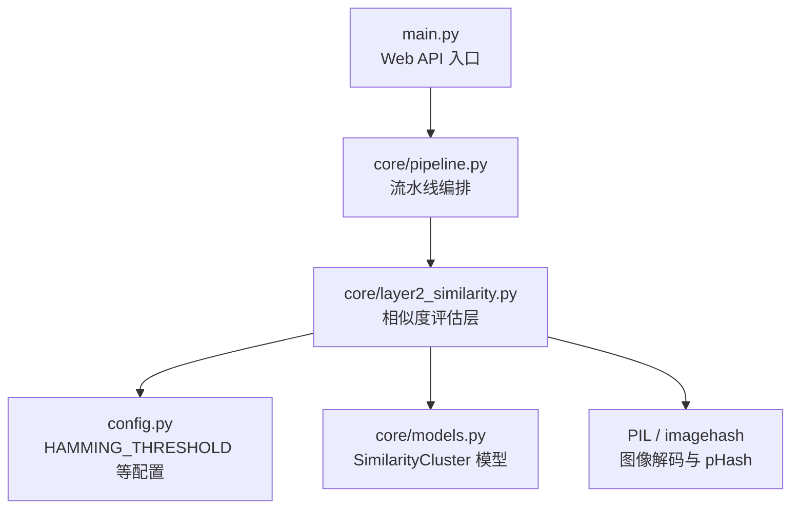
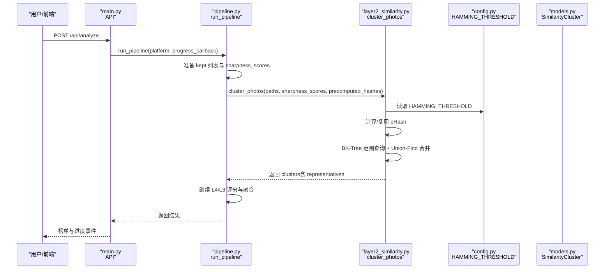
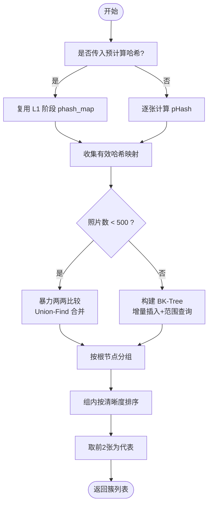
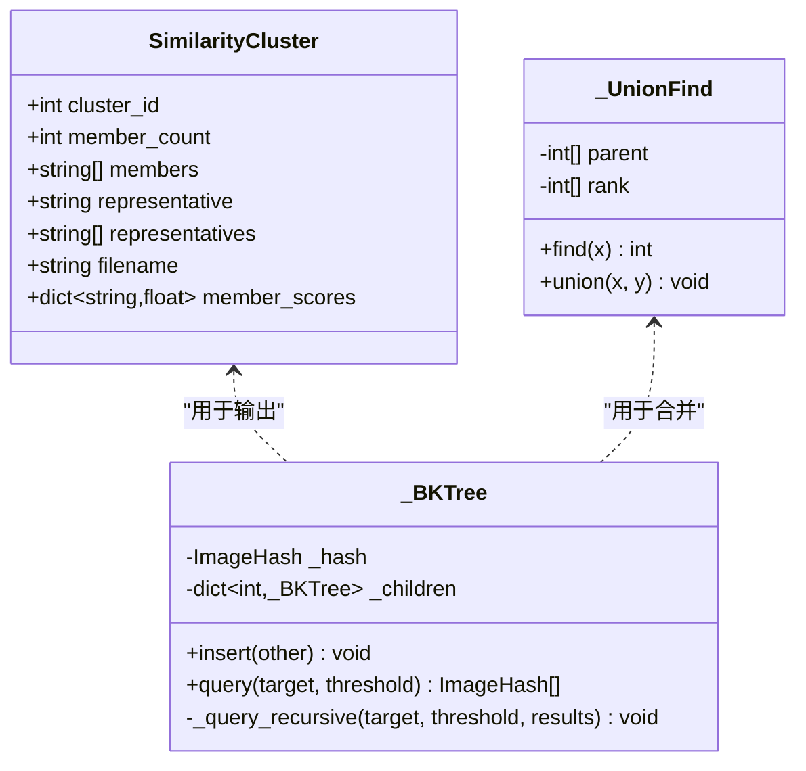
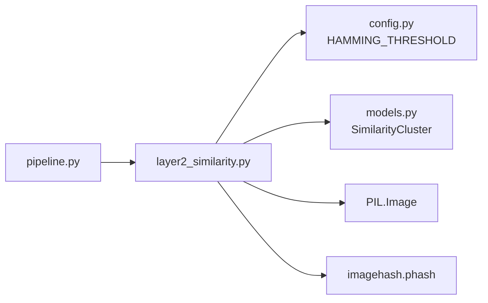

# 相似度评估层

<cite>
**本文引用的文件**   
- [core/layer2_similarity.py](file://core/layer2_similarity.py)
- [config.py](file://config.py)
- [core/pipeline.py](file://core/pipeline.py)
- [core/models.py](file://core/models.py)
- [main.py](file://main.py)
</cite>

## 目录
1. [简介](#简介)
2. [项目结构](#项目结构)
3. [核心组件](#核心组件)
4. [架构总览](#架构总览)
5. [详细组件分析](#详细组件分析)
6. [依赖关系分析](#依赖关系分析)
7. [性能考量](#性能考量)
8. [故障排查指南](#故障排查指南)
9. [结论](#结论)
10. [附录：参数调优与扩展指南](#附录参数调优与扩展指南)

## 简介
相似度评估层（Layer 2）负责在客观指标筛选之后，对候选照片进行“相似聚类与去重”，以消除连拍、重复截图或极相似帧的冗余。该层基于感知哈希（pHash）计算图像指纹，使用 BK-Tree 进行高效的汉明距离近邻搜索，并结合并查集完成连通分量的合并，最终输出若干簇，每簇选取清晰度最高的前两张作为代表进入后续审美评分阶段。

本层的关键目标：
- 高效生成图像指纹（感知哈希），支持大图片与 HEIC 等格式的缓存复用
- 在大规模数据下避免 O(n²) 全量比较，采用 BK-Tree + 并查集实现近似 O(n log n) 的聚类
- 通过可配置的汉明阈值控制相似度判断，平衡召回与误判
- 为多样性惩罚提供基础（与上层融合阶段配合）

## 项目结构
相似度评估层位于 core/layer2_similarity.py，由 pipeline 编排调用，配置项集中在 config.py，数据结构定义在 core/models.py。

图表来源
- [main.py:336-379](file://main.py#L336-L379)
- [core/pipeline.py:281-306](file://core/pipeline.py#L281-L306)
- [core/layer2_similarity.py:161-244](file://core/layer2_similarity.py#L161-L244)
- [config.py:69-72](file://config.py#L69-L72)
- [core/models.py:25-34](file://core/models.py#L25-L34)

章节来源
- [core/layer2_similarity.py:1-244](file://core/layer2_similarity.py#L1-L244)
- [config.py:69-72](file://config.py#L69-L72)
- [core/pipeline.py:281-306](file://core/pipeline.py#L281-L306)
- [core/models.py:25-34](file://core/models.py#L25-L34)

## 核心组件
- 感知哈希计算 compute_phash：读取图像（经缓存路径）、转 RGB，调用 imagehash.phash 生成指纹
- BK-Tree：在汉明距离空间进行范围查询，利用三角不等式剪枝，避免全量比较
- 并查集 _UnionFind：维护连通分量，O(α(n)) 的查找与合并
- 聚类主流程 cluster_photos：优先复用 L1 阶段的 pHash，缺失则回退串行计算；按阈值连接边，构建簇并按清晰度取代表

章节来源
- [core/layer2_similarity.py:150-159](file://core/layer2_similarity.py#L150-L159)
- [core/layer2_similarity.py:29-81](file://core/layer2_similarity.py#L29-L81)
- [core/layer2_similarity.py:128-148](file://core/layer2_similarity.py#L128-L148)
- [core/layer2_similarity.py:161-244](file://core/layer2_similarity.py#L161-L244)

## 架构总览
相似度评估层在流水线中的位置与数据流如下：

图表来源
- [main.py:336-379](file://main.py#L336-L379)
- [core/pipeline.py:281-306](file://core/pipeline.py#L281-L306)
- [core/layer2_similarity.py:161-244](file://core/layer2_similarity.py#L161-L244)
- [config.py:69-72](file://config.py#L69-L72)
- [core/models.py:25-34](file://core/models.py#L25-L34)

## 详细组件分析

### 图像指纹生成（感知哈希）
- 输入：图片路径（支持 HEIC、超大图）
- 处理：通过缓存路径获取已解码图像，转换为 RGB，调用 imagehash.phash
- 输出：imagehash.ImageHash 对象；失败时记录警告并返回 None
- 适用场景：对平移、缩放、轻微压缩鲁棒，适合快速去重与相似性初筛

章节来源
- [core/layer2_similarity.py:150-159](file://core/layer2_similarity.py#L150-L159)

### 相似性计算与去重机制
- 算法选择：感知哈希 + 汉明距离；BK-Tree 加速近邻搜索；并查集合并连通分量
- 小数据集策略：当数量小于阈值（默认 500）时，使用暴力两两比较，常数开销更低
- 大数据集策略：增量插入 BK-Tree，每次插入前查询已有树中距离 ≤ threshold 的邻居，天然避免重复配对
- 阈值：HAMMING_THRESHOLD（默认 20），越小越严格，越大越宽松

图表来源
- [core/layer2_similarity.py:161-244](file://core/layer2_similarity.py#L161-L244)
- [core/layer2_similarity.py:83-126](file://core/layer2_similarity.py#L83-L126)

章节来源
- [core/layer2_similarity.py:83-126](file://core/layer2_similarity.py#L83-L126)
- [core/layer2_similarity.py:161-244](file://core/layer2_similarity.py#L161-L244)

### 类与数据结构
- SimilarityCluster（Pydantic 模型）：包含 cluster_id、member_count、members、representative(s)、filename、member_scores
- _BKTree：内部类，封装插入与范围查询逻辑，利用三角不等式剪枝
- _UnionFind：并查集，支持 find/union，带路径压缩与秩优化

图表来源
- [core/models.py:25-34](file://core/models.py#L25-L34)
- [core/layer2_similarity.py:29-81](file://core/layer2_similarity.py#L29-L81)
- [core/layer2_similarity.py:128-148](file://core/layer2_similarity.py#L128-L148)

章节来源
- [core/models.py:25-34](file://core/models.py#L25-L34)
- [core/layer2_similarity.py:29-81](file://core/layer2_similarity.py#L29-L81)
- [core/layer2_similarity.py:128-148](file://core/layer2_similarity.py#L128-L148)

### 与流水线的集成
- pipeline 在 L1 阶段即计算 pHash 并保存至 checkpoint，L2 直接复用，避免重复计算
- L2 失败时降级为“不过滤”的路径，保证后续流程继续
- L2 输出的 representatives 将进入 L4（人脸）与 L3（TOPIQ/VLM）评分阶段

章节来源
- [core/pipeline.py:244-306](file://core/pipeline.py#L244-L306)

## 依赖关系分析
- 外部库：PIL（图像解码）、imagehash（感知哈希）
- 模块依赖：config.HAMMING_THRESHOLD、core.models.SimilarityCluster
- 流水线耦合：接收 L1 的 sharpness_scores 与 phash_map，输出 clusters 给上层

图表来源
- [core/layer2_similarity.py:1-14](file://core/layer2_similarity.py#L1-L14)
- [config.py:69-72](file://config.py#L69-L72)
- [core/models.py:25-34](file://core/models.py#L25-L34)
- [core/pipeline.py:281-306](file://core/pipeline.py#L281-L306)

章节来源
- [core/layer2_similarity.py:1-14](file://core/layer2_similarity.py#L1-L14)
- [config.py:69-72](file://config.py#L69-L72)
- [core/models.py:25-34](file://core/models.py#L25-L34)
- [core/pipeline.py:281-306](file://core/pipeline.py#L281-L306)

## 性能考量
- 时间复杂度
  - 小数据集（n < 500）：暴力 O(n²)，但 Python 层常数更小，实际更快
  - 大数据集（n ≥ 500）：BK-Tree 插入与查询均摊 O(log n)，整体接近 O(n log n)
- 空间复杂度
  - BK-Tree 存储所有哈希，内存随 n 线性增长
  - 并查集数组规模 O(n)
- I/O 与解码
  - 通过缓存路径减少重复解码，HEIC/超大图不重复解原图
- 阈值选择
  - HAMMING_THRESHOLD=20：兼顾速度与精度，可根据数据集调整

章节来源
- [core/layer2_similarity.py:16-18](file://core/layer2_similarity.py#L16-L18)
- [core/layer2_similarity.py:150-159](file://core/layer2_similarity.py#L150-L159)
- [config.py:69-72](file://config.py#L69-L72)

## 故障排查指南
- 哈希计算失败
  - 现象：compute_phash 返回 None，对应图片被放入独立簇
  - 可能原因：解码失败、路径不存在、格式不支持
  - 处理：检查日志警告信息，确认图片可读性与缓存路径正确
- 聚类结果为空或异常
  - 现象：clusters 数量异常，或 representatives 为空
  - 可能原因：precomputed_hashes 缺失或类型错误
  - 处理：确保 pipeline 传递正确的 phash_map；必要时回退到内部串行计算
- 阈值不当导致去重过度或不足
  - 现象：过多照片被合并或过少合并
  - 处理：调整 HAMMING_THRESHOLD，观察日志中的合并数量变化

章节来源
- [core/layer2_similarity.py:150-159](file://core/layer2_similarity.py#L150-L159)
- [core/layer2_similarity.py:161-244](file://core/layer2_similarity.py#L161-L244)

## 结论
相似度评估层通过感知哈希与 BK-Tree 的高效近邻搜索，结合并查集的连通分量合并，实现了可扩展且稳定的图像去重与相似聚类。其设计兼顾了小数据集的性能与大集合的可扩展性，并通过可配置阈值灵活适配不同场景。与流水线其他层的紧密集成确保了端到端的效率与稳定性。

## 附录：参数调优与扩展指南

### 如何调整相似度阈值
- 修改配置文件中的 HAMMING_THRESHOLD（默认 20）
- 影响：阈值越小，去重越严格；越大，允许更多相似照片进入后续阶段
- 建议：根据数据集的连拍密度与内容差异逐步调优，观察合并数量与最终榜单多样性

章节来源
- [config.py:69-72](file://config.py#L69-L72)

### 如何集成新的特征提取方法
- 替换 compute_phash 的实现，保持输入为路径、输出为可比较的指纹对象
- 若新指纹非二进制位串，需相应调整 BK-Tree 的距离度量与查询逻辑
- 在 cluster_photos 中统一接入新指纹，确保与现有阈值和流程兼容

章节来源
- [core/layer2_similarity.py:150-159](file://core/layer2_similarity.py#L150-L159)
- [core/layer2_similarity.py:29-81](file://core/layer2_similarity.py#L29-L81)

### 算法选择依据与适用场景
- 感知哈希（pHash）：对平移、缩放、轻微压缩鲁棒，适合快速去重与相似性初筛
- 不适用场景：需要像素级精确对比（如医学影像诊断）或语义级相似（如风格迁移）
- 备选方案：SSIM/PSNR 适用于像素级质量评估；感知哈希更适合大规模去重

[本节为概念性说明，不直接分析具体文件]

### 性能优化策略
- 启用预计算哈希：从 L1 阶段复用 phash_map，避免重复计算
- 合理设置阈值：根据数据集特性调整 HAMMING_THRESHOLD
- 监控日志：关注合并数量与失败率，及时定位问题

章节来源
- [core/pipeline.py:244-306](file://core/pipeline.py#L244-L306)
- [config.py:69-72](file://config.py#L69-L72)