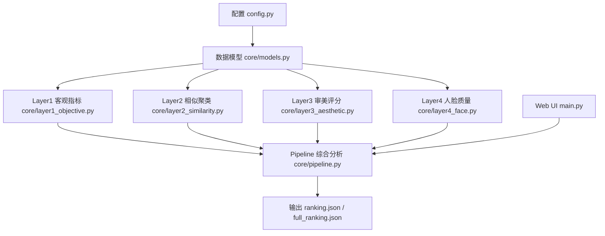
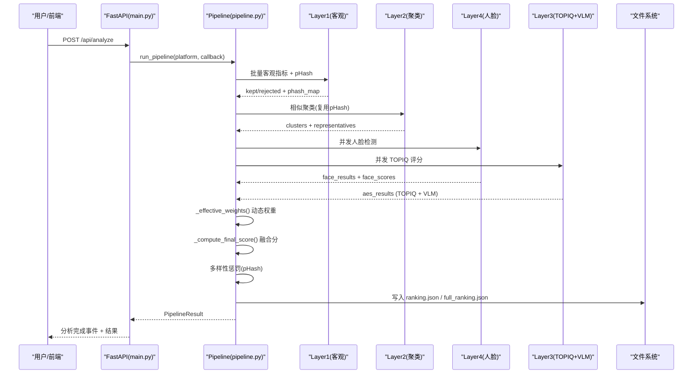
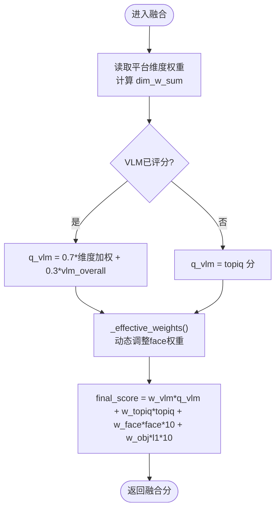
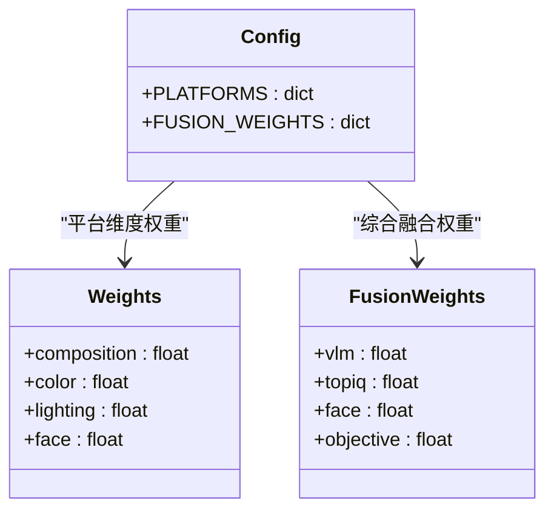
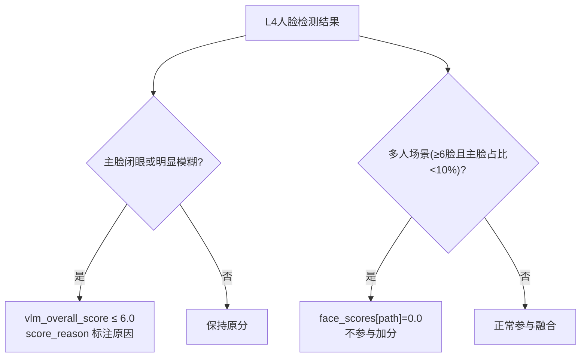
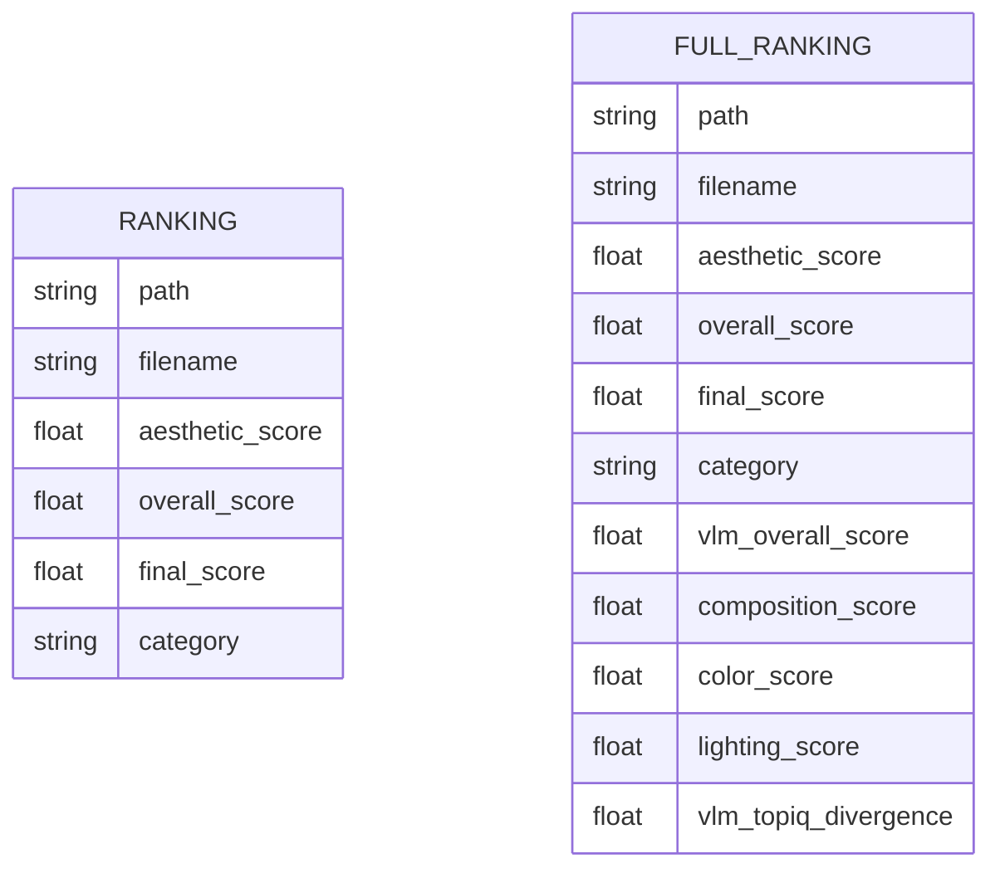
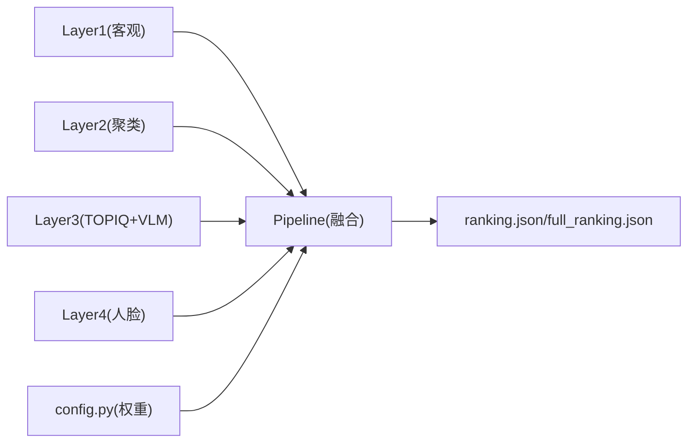

# 综合分析层

<cite>
**本文引用的文件**   
- [core/pipeline.py](file://core/pipeline.py)
- [config.py](file://config.py)
- [main.py](file://main.py)
- [core/layer1_objective.py](file://core/layer1_objective.py)
- [core/layer2_similarity.py](file://core/layer2_similarity.py)
- [core/layer3_aesthetic.py](file://core/layer3_aesthetic.py)
- [core/layer4_face.py](file://core/layer4_face.py)
- [core/models.py](file://core/models.py)
</cite>

## 目录
1. [引言](#引言)
2. [项目结构](#项目结构)
3. [核心组件](#核心组件)
4. [架构总览](#架构总览)
5. [详细组件分析](#详细组件分析)
6. [依赖关系分析](#依赖关系分析)
7. [性能考量](#性能考量)
8. [故障排查指南](#故障排查指南)
9. [结论](#结论)
10. [附录：扩展与自定义](#附录扩展与自定义)

## 引言
本章节聚焦“综合分析层”（第五层评估）的设计与实现，系统阐述多指标融合、最终评分计算与报告生成的完整流程。该层整合前四层（客观指标、相似聚类、审美评分、人脸质量）的结果，通过可配置的权重体系与平台差异化策略生成综合评分，并输出结构化报告与榜单。文档同时给出如何自定义评分公式、新增评估维度以及扩展接口的实践指引。

## 项目结构
本项目采用分层流水线架构，核心由配置、模型定义与各层处理模块组成；综合分析层位于 pipeline 的融合阶段，负责将各层结果统一加权、去重与多样性惩罚后输出最终排行。

图表来源 
- [config.py:22-56](file://config.py#L22-L56)
- [core/models.py:13-123](file://core/models.py#L13-L123)
- [core/layer1_objective.py:1-215](file://core/layer1_objective.py#L1-L215)
- [core/layer2_similarity.py:1-245](file://core/layer2_similarity.py#L1-L245)
- [core/layer3_aesthetic.py:1-536](file://core/layer3_aesthetic.py#L1-L536)
- [core/layer4_face.py:1-290](file://core/layer4_face.py#L1-L290)
- [core/pipeline.py:1-891](file://core/pipeline.py#L1-L891)
- [main.py:1-399](file://main.py#L1-L399)

章节来源
- [config.py:1-123](file://config.py#L1-L123)
- [core/models.py:1-123](file://core/models.py#L1-L123)
- [core/pipeline.py:1-891](file://core/pipeline.py#L1-L891)

## 核心组件
- 配置中心（config.py）：集中管理平台权重、阈值、输出数量、VLM 参数等，支持环境变量覆盖。
- 数据模型（models.py）：以 Pydantic 定义各层输入输出结构，保证类型安全与序列化一致性。
- 层1-4（objective/similarity/aesthetic/face）：分别完成客观指标、相似聚类、审美评分（TOPIQ + VLM）、人脸质量检测。
- 综合分析层（pipeline.py）：融合 L1/L3/L4 与 TOPIQ/VLM 分数，应用平台权重与动态权重调整，执行多样性惩罚，生成最终排序与报告。

章节来源
- [config.py:22-56](file://config.py#L22-L56)
- [core/models.py:13-123](file://core/models.py#L13-L123)
- [core/pipeline.py:471-530](file://core/pipeline.py#L471-L530)

## 架构总览
综合分析层在流水线中承担“终审”职责：对候选照片进行多维度打分融合、相似度惩罚与 Top N 选择，并持久化结果。其关键特性包括：
- 多源指标融合：VLM 多维审美、TOPIQ 客观审美、人脸质量、L1 客观指标。
- 动态权重：根据是否有人脸、是否启用 VLM 自动调整 face 权重分配，避免重复计数或无脸照片吃亏。
- 多样性惩罚：基于感知哈希汉明距离对相似照片扣分，提升榜单多样性。
- 断点续传与增量重跑：支持从任意层恢复，减少重复计算。

图表来源 
- [main.py:336-379](file://main.py#L336-L379)
- [core/pipeline.py:165-609](file://core/pipeline.py#L165-L609)
- [core/layer1_objective.py:161-215](file://core/layer1_objective.py#L161-L215)
- [core/layer2_similarity.py:161-245](file://core/layer2_similarity.py#L161-L245)
- [core/layer4_face.py:220-232](file://core/layer4_face.py#L220-L232)
- [core/layer3_aesthetic.py:130-232](file://core/layer3_aesthetic.py#L130-L232)

## 详细组件分析

### 多指标融合与最终评分计算
综合分析层的核心是融合函数与权重机制：
- 维度权重：平台配置中的 composition/color/lighting/face 决定 VLM 维度加权方式。
- 综合权重：FUSION_WEIGHTS 控制 vlm/topiq/face/objective 四者比例。
- 动态权重：_effective_weights 根据 has_vlm 与 has_face 调整 face 权重，避免重复计分或无脸照片劣势。
- 融合公式：q_vlm = 0.7 × 维度加权 + 0.3 × vlm_overall_score；若未评分则回退为 topiq 分。
- 最终得分：vlm×w_vlm + topiq×w_topiq + face×w_face + objective×w_obj。

图表来源 
- [core/pipeline.py:66-111](file://core/pipeline.py#L66-L111)
- [config.py:99-108](file://config.py#L99-L108)

章节来源
- [core/pipeline.py:66-111](file://core/pipeline.py#L66-L111)
- [config.py:99-108](file://config.py#L99-L108)

### 评分权重配置与动态调整机制
- 平台维度权重：不同平台（小红书/朋友圈/抖音）具有不同的构图/色彩/光影/人脸权重，影响 q_vlm 的计算。
- 综合权重：FUSION_WEIGHTS 固定总和为 1.0，确保评分归一化。
- 动态调整：当 VLM 已评分时，face 权重被归零并重分配至其他维度；无人脸照片同样触发 face 权重重分配，避免系统性吃亏。

图表来源 
- [config.py:22-56](file://config.py#L22-L56)
- [config.py:99-108](file://config.py#L99-L108)

章节来源
- [config.py:22-56](file://config.py#L22-L56)
- [config.py:99-108](file://config.py#L99-L108)
- [core/pipeline.py:33-54](file://core/pipeline.py#L33-L54)

### 个性化评分规则与硬伤钳制
- 人像硬伤：主脸闭眼或明显模糊时，VLM 综合审美上限钳制至 6 分，并在 score_reason 中标注原因。
- 多人场景：≥6 张脸且主脸占比 < 10% 时，判定人脸为环境元素，不参与加分。
- 分类标签：VLM 输出 category（风景/建筑/人像等），用于报告展示与后续分析。

图表来源 
- [core/pipeline.py:387-398](file://core/pipeline.py#L387-L398)
- [core/layer3_aesthetic.py:235-267](file://core/layer3_aesthetic.py#L235-L267)

章节来源
- [core/pipeline.py:387-398](file://core/pipeline.py#L387-L398)
- [core/layer3_aesthetic.py:235-267](file://core/layer3_aesthetic.py#L235-L267)

### 报告生成与输出结构
- ranking.json：Top N 结果，包含 path/filename/aesthetic_score/overall_score/final_score/category。
- full_ranking.json：全部候选的完整排行，额外包含 vlm_overall_score/composition_score/color_score/lighting_score/vlm_topiq_divergence。
- 展示文件名：复制 Top N 照片并重命名为序号名，便于前端访问。

图表来源 
- [core/pipeline.py:541-578](file://core/pipeline.py#L541-L578)
- [core/models.py:76-89](file://core/models.py#L76-L89)

章节来源
- [core/pipeline.py:541-578](file://core/pipeline.py#L541-L578)
- [core/models.py:76-89](file://core/models.py#L76-L89)

## 依赖关系分析
综合分析层依赖前四层产物与配置：
- Layer1：提供 l1_scores（0-1 范围）作为 objective 维度输入。
- Layer2：提供聚类代表与 pHash，用于多样性惩罚。
- Layer3：提供 TOPIQ 与 VLM 评分，构成 q_vlm 与 topiq 分。
- Layer4：提供 face_scores 与人像硬伤标志。
- 配置：platform_config.weights 与 FUSION_WEIGHTS 决定权重。

图表来源 
- [core/pipeline.py:471-530](file://core/pipeline.py#L471-L530)
- [config.py:22-56](file://config.py#L22-L56)

章节来源
- [core/pipeline.py:471-530](file://core/pipeline.py#L471-L530)
- [config.py:22-56](file://config.py#L22-L56)

## 性能考量
- 并发优化：L4 与 L3-TOPIQ 并行执行；VLM 使用独立线程池（默认 8 并发）实现图片级流水，避免网络 IO 阻塞。
- 缓存复用：TOPIQ 模型按设备模块级缓存；pHash 在 L1 阶段计算并复用，避免 L2 重复计算。
- 断点续传：checkpoint 累积保存已完成层数据，支持从任意层恢复，减少重复计算。
- 多样性惩罚：基于 pHash 汉明距离快速判断相似性，仅对排名靠后的相似照片施加惩罚。

章节来源
- [core/pipeline.py:324-485](file://core/pipeline.py#L324-L485)
- [core/layer3_aesthetic.py:27-52](file://core/layer3_aesthetic.py#L27-L52)
- [core/layer2_similarity.py:150-158](file://core/layer2_similarity.py#L150-L158)

## 故障排查指南
- VLM 未评分：检查 QWEN_API_KEY 是否配置；若无 key，VLM 维度默认 5.0，q_vlm 回退为 topiq 分。
- 人像硬伤钳制：确认 L4 主脸闭眼或模糊标志是否正确设置；score_reason 应包含“已钳制至 6 分上限”。
- 多样性惩罚异常：检查 pHash 是否成功计算；若缺失，将兜底重算，但可能影响性能。
- 权重配置错误：确认 FUSION_WEIGHTS 总和为 1.0；平台维度权重合理分布。

章节来源
- [core/pipeline.py:400-469](file://core/pipeline.py#L400-L469)
- [core/layer3_aesthetic.py:269-327](file://core/layer3_aesthetic.py#L269-L327)
- [config.py:99-108](file://config.py#L99-L108)

## 结论
综合分析层通过严谨的多指标融合、动态权重调整与多样性惩罚，实现了跨平台、可定制的图像评分体系。其设计兼顾性能与可扩展性，支持断点续传与增量重跑，为上层应用提供稳定可靠的评分与报告能力。

## 附录：扩展与自定义

### 自定义评分公式
- 修改融合权重：编辑 config.py 中的 FUSION_WEIGHTS，确保总和为 1.0。
- 调整平台维度权重：在 PLATFORMS 中修改 composition/color/lighting/face 比例。
- 重写融合逻辑：在 pipeline.py 的 _compute_final_score 中替换加权公式，注意保持数值范围一致。

章节来源
- [config.py:99-108](file://config.py#L99-L108)
- [core/pipeline.py:92-111](file://core/pipeline.py#L92-L111)

### 添加新的评估维度
- 定义新维度：在 models.py 的 Layer3Result 中添加字段（如 contrast_score）。
- 集成 L3：在 layer3_aesthetic.py 的 apply_vlm_dimensions 中解析并写入新维度。
- 更新融合：在 pipeline.py 的 _compute_final_score 中加入新维度的加权项。

章节来源
- [core/models.py:36-53](file://core/models.py#L36-L53)
- [core/layer3_aesthetic.py:269-327](file://core/layer3_aesthetic.py#L269-L327)
- [core/pipeline.py:92-111](file://core/pipeline.py#L92-L111)

### 生成详细分析报告
- 扩展 full_ranking.json：在 pipeline.py 中追加新字段（如 contrast_score、custom_metric）。
- 前端展示：在 main.py 的 /api/results 接口中返回新增字段，供前端渲染。

章节来源
- [core/pipeline.py:557-578](file://core/pipeline.py#L557-L578)
- [main.py:278-303](file://main.py#L278-L303)