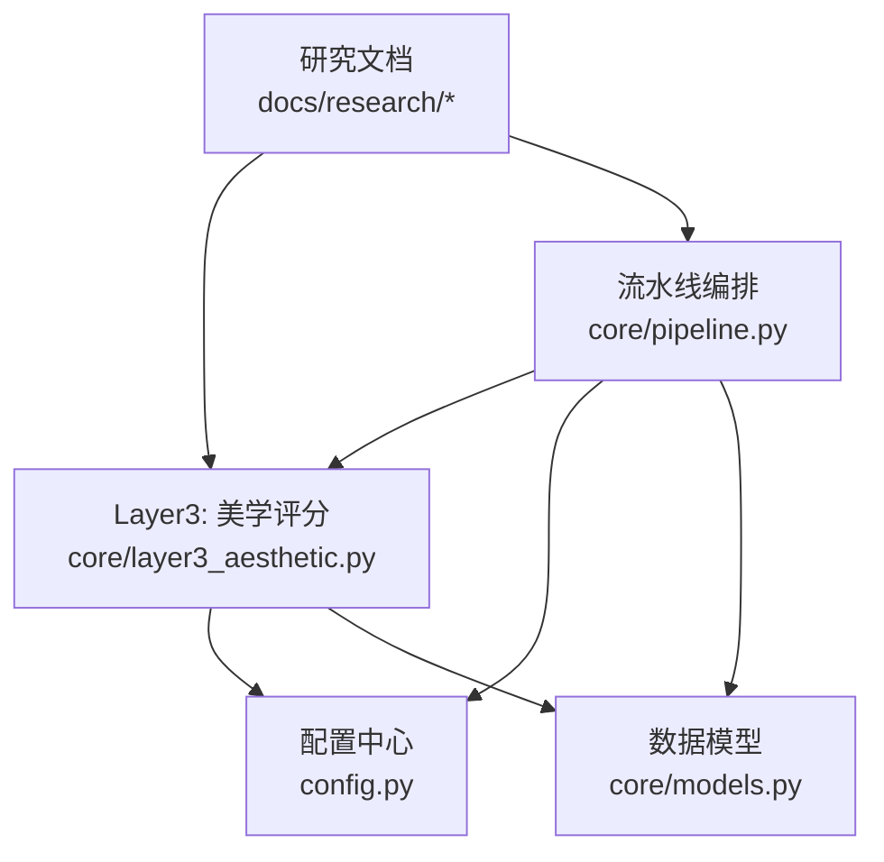
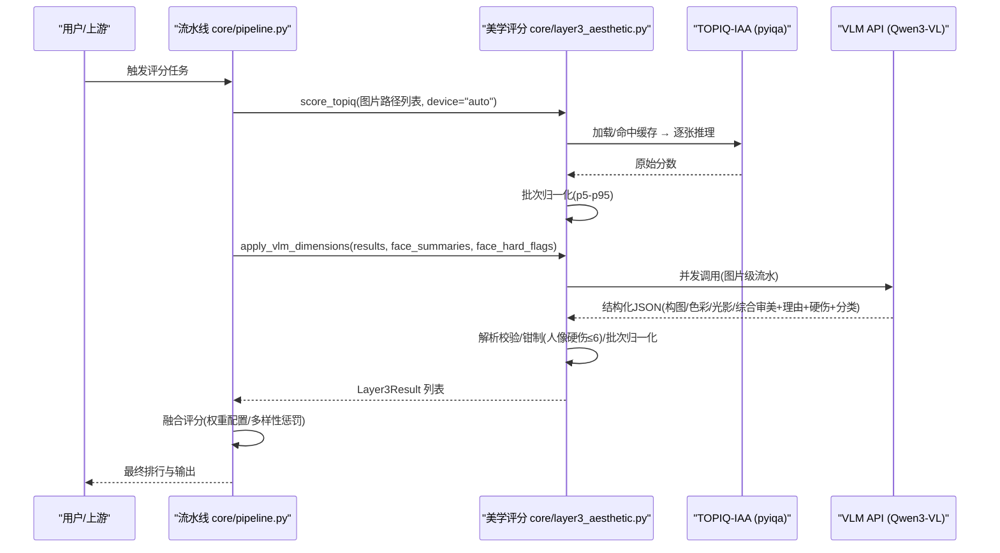
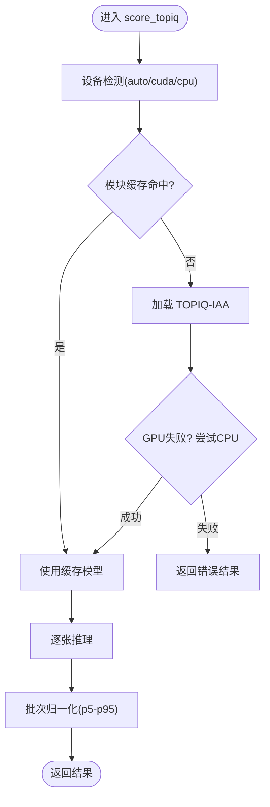
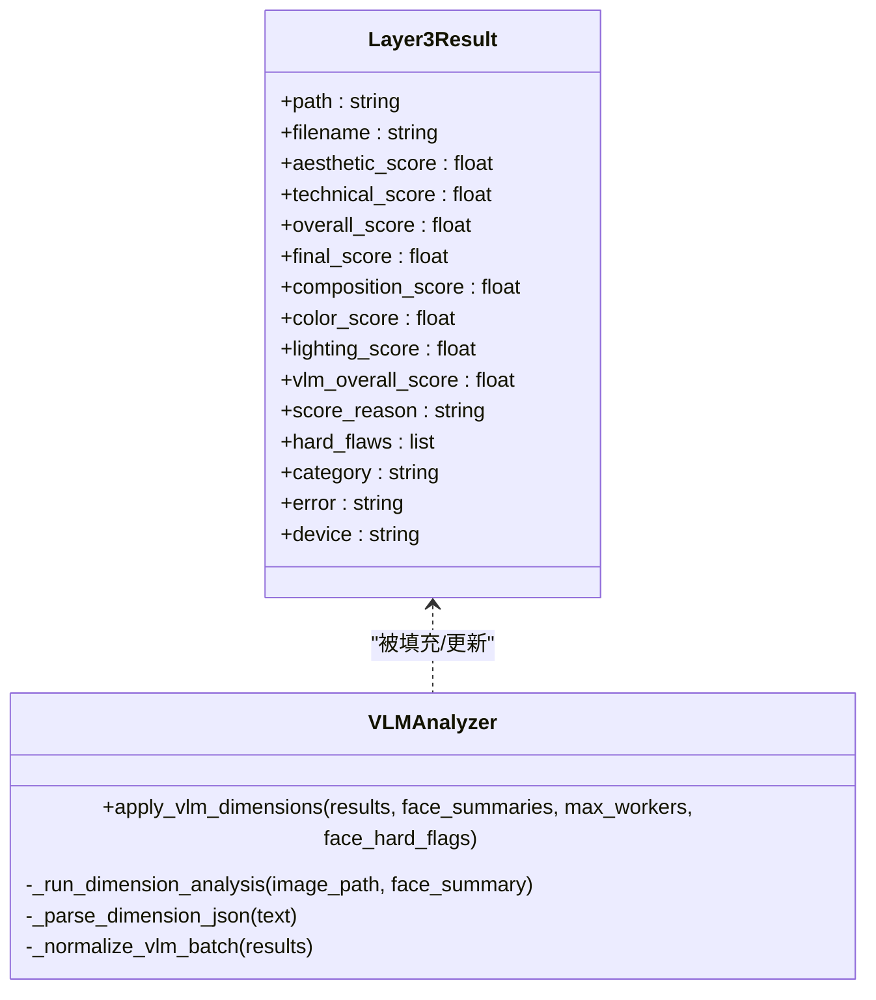
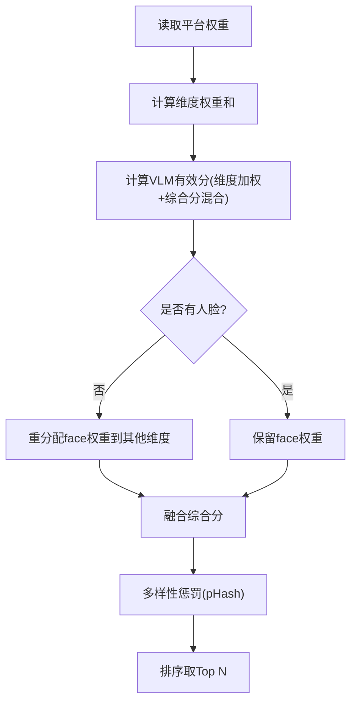
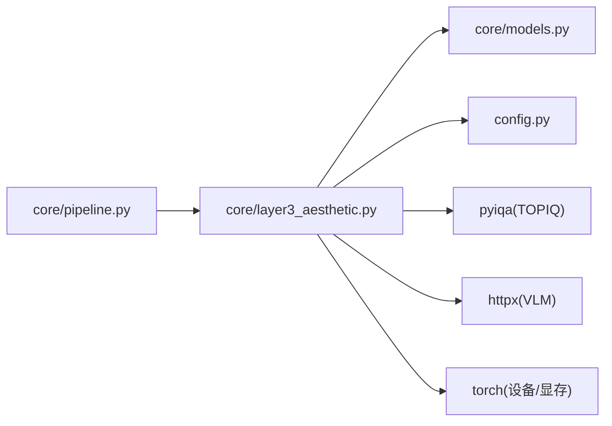

# 美学评分层

<cite>
**本文引用的文件**   
- [core/layer3_aesthetic.py](file://core/layer3_aesthetic.py)
- [config.py](file://config.py)
- [core/pipeline.py](file://core/pipeline.py)
- [core/models.py](file://core/models.py)
- [docs/research/photo-aesthetic-research-report.md](file://docs/research/photo-aesthetic-research-report.md)
- [docs/research/photo_aesthetic_models_research.md](file://docs/research/photo_aesthetic_models_research.md)
</cite>

## 目录
1. [简介](#简介)
2. [项目结构](#项目结构)
3. [核心组件](#核心组件)
4. [架构总览](#架构总览)
5. [详细组件分析](#详细组件分析)
6. [依赖关系分析](#依赖关系分析)
7. [性能考量](#性能考量)
8. [故障排查指南](#故障排查指南)
9. [结论](#结论)
10. [附录](#附录)

## 简介
本章节聚焦“第三层评估”——美学评分层，围绕以下目标展开：
- 解释 TOPIQ-IAA 客观审美评分与 VLM 多维度专业评分（构图、色彩、光影、综合审美）的协同机制。
- 说明如何使用预训练的美学模型（如 TOPIQ-IAA、可选 Q-ReAlign/Q-Align）进行质量打分，并结合多种指标进行综合评估。
- 描述色彩和谐度、亮度分布、对比度和视觉平衡等指标的量化思路与落地方式。
- 提供调整美学权重、集成新评分模型的实践路径。
- 记录评分标准、校准方法与用户体验优化要点。

该层在整体流水线中承担“从技术质量到主观审美的桥梁”，既保留可解释的多维度分数，又通过批次归一化与融合策略保证跨平台、跨场景的稳定排序能力。

## 项目结构
美学评分层的核心代码位于 core/layer3_aesthetic.py，配置项集中在 config.py，流水线编排与融合逻辑在 core/pipeline.py，数据模型定义在 core/models.py。研究背景与模型选型参考 docs/research 下的两份报告。

图表来源
- [core/layer3_aesthetic.py:1-536](file://core/layer3_aesthetic.py#L1-L536)
- [config.py:1-123](file://config.py#L1-L123)
- [core/pipeline.py:1-800](file://core/pipeline.py#L1-L800)
- [core/models.py:1-123](file://core/models.py#L1-L123)
- [docs/research/photo-aesthetic-research-report.md:1-277](file://docs/research/photo-aesthetic-research-report.md#L1-L277)
- [docs/research/photo_aesthetic_models_research.md:1-239](file://docs/research/photo_aesthetic_models_research.md#L1-L239)

章节来源
- [core/layer3_aesthetic.py:1-536](file://core/layer3_aesthetic.py#L1-L536)
- [config.py:1-123](file://config.py#L1-L123)
- [core/pipeline.py:1-800](file://core/pipeline.py#L1-L800)
- [core/models.py:1-123](file://core/models.py#L1-L123)

## 核心组件
- 客观审美评分（TOPIQ-IAA）
  - 逐张推理 + 批次归一化（p5-p95 拉伸），输出 0-10 分，用于稳定排序与区分度提升。
  - 模块级缓存按设备复用，支持 CPU fallback 与显存释放接口。
- VLM 多维度评分（构图/色彩/光影/综合审美）
  - 基于 Qwen3-VL 的专业评审 Prompt，返回结构化 JSON，含理由、硬伤枚举、分类标签。
  - 并发调用、指数退避重试、失败回退默认值；对“人像硬伤”进行程序化钳制（≤6）。
- 结果写入与归一化
  - Layer3Result 字段包含各维度分数、VLM 综合分、评分理由、硬伤列表、分类标签等。
  - 批次归一化防止分数膨胀，保持跨批可比性。

章节来源
- [core/layer3_aesthetic.py:130-232](file://core/layer3_aesthetic.py#L130-L232)
- [core/layer3_aesthetic.py:269-327](file://core/layer3_aesthetic.py#L269-L327)
- [core/layer3_aesthetic.py:330-351](file://core/layer3_aesthetic.py#L330-L351)
- [core/models.py:36-53](file://core/models.py#L36-L53)

## 架构总览
美学评分层与流水线协作的关键流程如下：

图表来源
- [core/pipeline.py:324-469](file://core/pipeline.py#L324-L469)
- [core/layer3_aesthetic.py:130-232](file://core/layer3_aesthetic.py#L130-L232)
- [core/layer3_aesthetic.py:269-327](file://core/layer3_aesthetic.py#L269-L327)

## 详细组件分析

### 组件 A：TOPIQ-IAA 客观审美评分
- 功能要点
  - 自动设备检测（优先 CUDA），CPU fallback 保障鲁棒性。
  - 模块级缓存避免重复加载，显存紧张时可主动释放。
  - 单图推理后做 p5-p95 归一化，确保区分度与稳定性。
- 复杂度与性能
  - 模型加载耗时显著（约数秒），但推理阶段较快；适合批量处理。
  - 显存占用低，适合多模型并行或与其他 GPU 任务共享。
- 错误处理
  - 异常捕获并记录日志；失败时返回带 error 字段的 Layer3Result。
  - 支持设备降级与重试策略。

图表来源
- [core/layer3_aesthetic.py:130-232](file://core/layer3_aesthetic.py#L130-L232)
- [core/layer3_aesthetic.py:445-463](file://core/layer3_aesthetic.py#L445-L463)

章节来源
- [core/layer3_aesthetic.py:130-232](file://core/layer3_aesthetic.py#L130-L232)
- [core/layer3_aesthetic.py:445-463](file://core/layer3_aesthetic.py#L445-L463)

### 组件 B：VLM 多维度评分（构图/色彩/光影/综合审美）
- 功能要点
  - 专业 Prompt 引导 LLM 输出结构化 JSON，包含评分、理由、硬伤枚举、分类标签。
  - 并发线程池执行（网络 IO 密集），指数退避重试，失败回退默认值。
  - 人像硬伤（闭眼/人脸模糊）触发综合审美上限钳制（≤6）。
- 数据流与校验
  - 解析函数严格校验字段范围与枚举白名单，过滤噪声与幻觉。
  - 批次归一化防分数膨胀，维持跨批一致性。
- 与人脸信息联动
  - 将 L4 的人脸检测结果注入 Prompt，提升人像场景评分准确性。

图表来源
- [core/models.py:36-53](file://core/models.py#L36-L53)
- [core/layer3_aesthetic.py:269-327](file://core/layer3_aesthetic.py#L269-L327)
- [core/layer3_aesthetic.py:398-442](file://core/layer3_aesthetic.py#L398-L442)
- [core/layer3_aesthetic.py:330-351](file://core/layer3_aesthetic.py#L330-L351)

章节来源
- [core/layer3_aesthetic.py:269-327](file://core/layer3_aesthetic.py#L269-L327)
- [core/layer3_aesthetic.py:398-442](file://core/layer3_aesthetic.py#L398-L442)
- [core/models.py:36-53](file://core/models.py#L36-L53)

### 组件 C：融合评分与平台权重
- 融合公式
  - 综合分 = VLM有效分×w_vlm + TOPIQ×w_topiq + 人脸×w_face + 客观×w_obj
  - VLM 已评分时，face 权重归零并重分配，避免双重计数。
- 平台权重
  - 不同平台（小红书/朋友圈/抖音）对构图/色彩/光影/人脸赋予不同权重。
  - 维度加权后的 VLM 得分由平台权重计算得出。
- 多样性惩罚
  - 基于 pHash 汉明距离对相似照片扣分，避免同场景占据多个名额。

图表来源
- [core/pipeline.py:33-111](file://core/pipeline.py#L33-L111)
- [core/pipeline.py:471-530](file://core/pipeline.py#L471-L530)
- [config.py:22-56](file://config.py#L22-L56)
- [config.py:99-108](file://config.py#L99-L108)

章节来源
- [core/pipeline.py:33-111](file://core/pipeline.py#L33-L111)
- [core/pipeline.py:471-530](file://core/pipeline.py#L471-L530)
- [config.py:22-56](file://config.py#L22-L56)
- [config.py:99-108](file://config.py#L99-L108)

## 依赖关系分析
- 模块耦合
  - layer3_aesthetic.py 依赖 config.py（API 地址、模型名、图像缩放参数）、core/models.py（数据结构）。
  - pipeline.py 整合 L1/L2/L4/L3，负责调度与融合。
- 外部依赖
  - pyiqa（TOPIQ-IAA 等模型）、httpx（VLM API 调用）、torch（设备检测与显存管理）。
- 潜在循环依赖
  - 当前设计为单向依赖（pipeline → layer3 → models/config），无循环引用风险。

图表来源
- [core/pipeline.py:1-800](file://core/pipeline.py#L1-L800)
- [core/layer3_aesthetic.py:1-536](file://core/layer3_aesthetic.py#L1-L536)
- [core/models.py:1-123](file://core/models.py#L1-L123)
- [config.py:1-123](file://config.py#L1-L123)

章节来源
- [core/pipeline.py:1-800](file://core/pipeline.py#L1-L800)
- [core/layer3_aesthetic.py:1-536](file://core/layer3_aesthetic.py#L1-L536)
- [core/models.py:1-123](file://core/models.py#L1-L123)
- [config.py:1-123](file://config.py#L1-L123)

## 性能考量
- 模型缓存与显存管理
  - TOPIQ 模型按设备缓存，减少重复加载；显存紧张时可主动释放。
  - VLM 并发调用（默认 8 线程），图片级流水最大化吞吐。
- 输入压缩与传输优化
  - VLM 上传前缩放到指定长边（默认 1024），JPEG 质量 80，降低体积与延迟。
- 批次归一化
  - p5-p95 拉伸避免分数集中，提升区分度与稳定性。
- 降级与容错
  - 无 API Key 时维度默认 5.0；网络异常指数退避重试；CPU fallback 保障可用性。

[本节为通用指导，不直接分析具体文件]

## 故障排查指南
- 常见问题
  - VLM 调用失败：检查 QWEN_API_KEY、代理设置、网络连通性。
  - 分数异常：确认批次归一化是否生效，检查硬伤钳制逻辑。
  - 显存不足：调用 release_topiq_model() 释放缓存，或切换 CPU 模式。
- 诊断建议
  - 查看日志中的进度与错误信息（如“维度分析失败”“模型加载失败”）。
  - 检查 Layer3Result.error 字段与 score_reason 提示。
  - 验证配置文件中的权重与阈值是否符合预期。

章节来源
- [core/layer3_aesthetic.py:465-536](file://core/layer3_aesthetic.py#L465-L536)
- [core/layer3_aesthetic.py:130-232](file://core/layer3_aesthetic.py#L130-L232)
- [core/pipeline.py:461-469](file://core/pipeline.py#L461-L469)

## 结论
美学评分层通过“TOPIQ-IAA 客观评分 + VLM 多维度专业评分”的双轨机制，实现了高区分度、强可解释性的审美评估。结合平台权重、多样性惩罚与批次归一化，系统在不同场景下均能保持稳定排序与良好用户体验。未来可扩展更多美学模型（如 Q-ReAlign）与更细粒度的色彩/光影指标，进一步提升评估精度与灵活性。

[本节为总结性内容，不直接分析具体文件]

## 附录

### 如何调整美学权重
- 平台权重
  - 修改 config.py 中 PLATFORMS 对应平台的 weights 字典（composition/color/lighting/face）。
- 融合权重
  - 调整 FUSION_WEIGHTS（vlm/topiq/face/objective），总和需为 1.0。
- 示例路径
  - [config.py:22-56](file://config.py#L22-L56)
  - [config.py:99-108](file://config.py#L99-L108)

### 如何集成新的评分模型
- 替换/扩展 TOPIQ
  - 在 score_topiq 中切换 pyiqa.create_metric 的参数（如 qrealign/qalign）。
  - 参考模型研究文档选择合适的变体（Mini/Lite/Pro）。
- 新增 VLM 维度
  - 扩展 _DIMENSION_PROMPT 与 _VLM_DIM_KEYS，适配新字段。
  - 在 _parse_dimension_json 中增加字段校验与默认值处理。
- 示例路径
  - [core/layer3_aesthetic.py:130-232](file://core/layer3_aesthetic.py#L130-L232)
  - [core/layer3_aesthetic.py:269-327](file://core/layer3_aesthetic.py#L269-L327)
  - [docs/research/photo_aesthetic_models_research.md:1-239](file://docs/research/photo_aesthetic_models_research.md#L1-L239)

### 评分标准与校准方法
- 评分标准
  - 构图/色彩/光影/综合审美采用 1-10 分制，5 分为普通水准，8+ 为专业级。
  - 人像硬伤（闭眼/人脸模糊）触发综合审美上限 ≤6。
- 校准方法
  - 批次归一化（p5-p95 拉伸）防止分数膨胀。
  - 硬伤钳制与默认值回退确保稳定性。
- 示例路径
  - [core/layer3_aesthetic.py:59-127](file://core/layer3_aesthetic.py#L59-L127)
  - [core/layer3_aesthetic.py:330-351](file://core/layer3_aesthetic.py#L330-L351)

### 用户体验优化
- 进度反馈
  - 流水线层间事件回调（layer_start/layer_end）便于前端展示。
- 输出可读性
  - score_reason 提供评分理由，hard_flaws 列出具体问题，category 标注类型。
- 示例路径
  - [core/pipeline.py:57-64](file://core/pipeline.py#L57-L64)
  - [core/models.py:36-53](file://core/models.py#L36-L53)