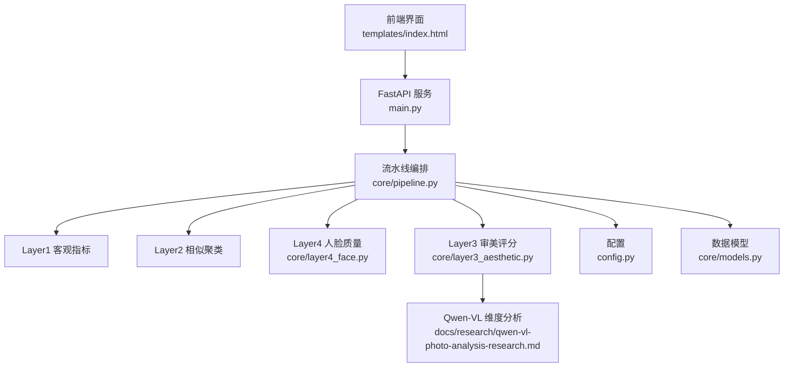
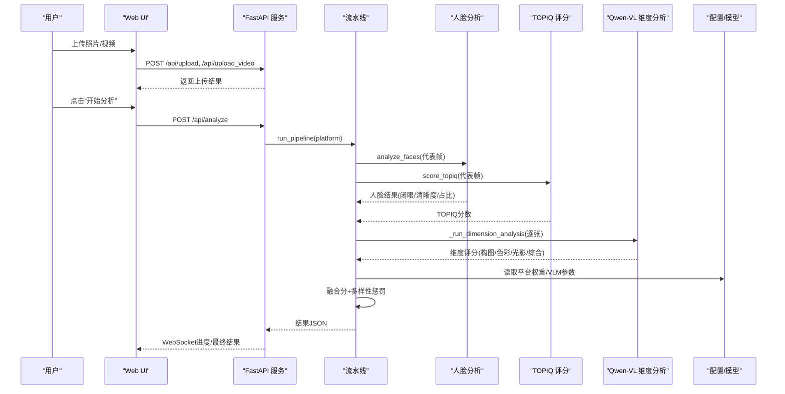
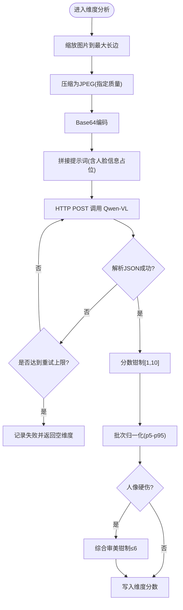
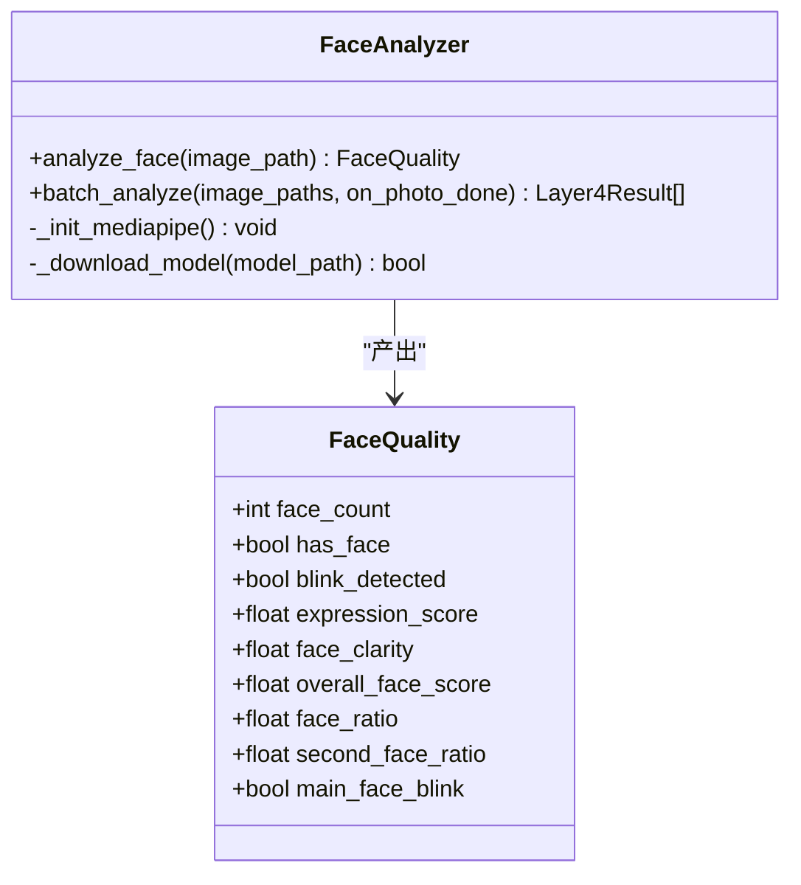
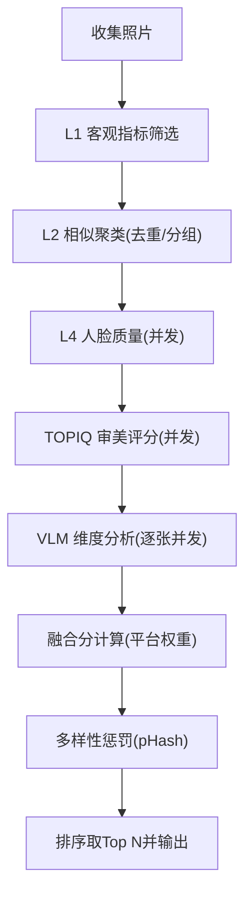
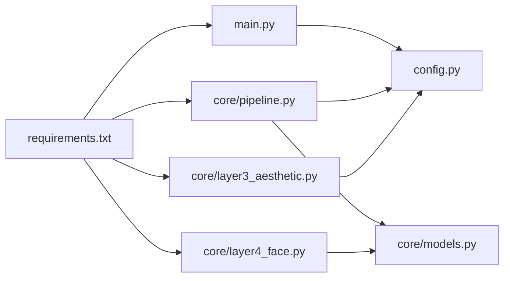

# Qwen-VL照片分析研究

<cite>
**本文引用的文件**
- [main.py](file://main.py)
- [config.py](file://config.py)
- [core/pipeline.py](file://core/pipeline.py)
- [core/layer3_aesthetic.py](file://core/layer3_aesthetic.py)
- [core/layer4_face.py](file://core/layer4_face.py)
- [core/models.py](file://core/models.py)
- [requirements.txt](file://requirements.txt)
- [templates/index.html](file://templates/index.html)
- [docs/research/qwen-vl-photo-analysis-research.md](file://docs/research/qwen-vl-photo-analysis-research.md)
</cite>

## 目录
1. [简介](#简介)
2. [项目结构](#项目结构)
3. [核心组件](#核心组件)
4. [架构总览](#架构总览)
5. [详细组件分析](#详细组件分析)
6. [依赖关系分析](#依赖关系分析)
7. [性能与优化](#性能与优化)
8. [故障排查指南](#故障排查指南)
9. [结论](#结论)
10. [附录](#附录)

## 简介
本技术文档围绕Qwen-VL视觉语言模型在照片分析中的应用，系统阐述多模态信息融合机制、图像理解能力与文本生成能力，并结合代码实现说明模型微调策略（提示工程）、输出格式控制、应用场景示例、推理加速与内存管理、批处理策略，以及如何在照片评估系统中集成API调用与错误处理。

## 项目结构
本项目采用分层流水线架构：
- Web服务层：FastAPI提供上传、查询、分析与结果展示接口，并通过WebSocket推送进度。
- 流水线编排：按Layer 1→2→4→3顺序执行，支持断点续传与并发优化。
- 模型层：TOPIQ-IAA客观审美评分、MediaPipe人脸质量分析、Qwen-VL多维度审美评分。
- 配置与数据：统一配置项、Pydantic数据模型、输出榜单与中间检查点。

图表来源
- [main.py:102-379](file://main.py#L102-L379)
- [core/pipeline.py:165-593](file://core/pipeline.py#L165-L593)
- [core/layer3_aesthetic.py:130-327](file://core/layer3_aesthetic.py#L130-L327)
- [core/layer4_face.py:117-231](file://core/layer4_face.py#L117-L231)
- [config.py:21-118](file://config.py#L21-L118)
- [core/models.py:13-123](file://core/models.py#L13-L123)

章节来源
- [main.py:102-379](file://main.py#L102-L379)
- [config.py:11-118](file://config.py#L11-L118)

## 核心组件
- 流水线编排器：负责收集照片、分阶段执行、保存检查点、计算融合分与多样性惩罚、输出榜单。
- Layer 1 客观指标：基于清晰度、曝光、噪声等阈值进行初筛。
- Layer 2 相似聚类：使用感知哈希进行去重与分组，提升多样性。
- Layer 4 人脸质量：检测人脸数量、闭眼、表情、清晰度与占比，用于VLM提示注入与硬伤判定。
- Layer 3 审美评分：TOPIQ-IAA客观审美评分 + Qwen-VL多维度专业评分（构图/色彩/光影/综合审美），并进行批次归一化与硬伤钳制。
- 配置与模型：平台权重、VLM参数、设备选择、代理设置；Pydantic模型保证类型安全与序列化兼容。

章节来源
- [core/pipeline.py:165-593](file://core/pipeline.py#L165-L593)
- [core/layer3_aesthetic.py:130-327](file://core/layer3_aesthetic.py#L130-L327)
- [core/layer4_face.py:117-231](file://core/layer4_face.py#L117-L231)
- [config.py:21-118](file://config.py#L21-L118)
- [core/models.py:13-123](file://core/models.py#L13-L123)

## 架构总览
端到端流程如下：
- 用户上传照片或视频，后端校验并存储。
- 触发分析后，流水线依次执行L1/L2/L4/L3，期间通过线程池并发执行人脸与TOPIQ推理，并在L4完成后立即发起VLM维度分析（图片级流水）。
- 计算融合分（VLM×w_vlm + TOPIQ×w_topiq + 人脸×w_face + 客观×w_obj），应用多样性惩罚，输出Top N榜单。
- 通过REST与WebSocket向UI返回结果与进度。

图表来源
- [main.py:336-379](file://main.py#L336-L379)
- [core/pipeline.py:308-453](file://core/pipeline.py#L308-L453)
- [core/layer3_aesthetic.py:371-536](file://core/layer3_aesthetic.py#L371-L536)
- [core/layer4_face.py:198-231](file://core/layer4_face.py#L198-L231)
- [config.py:110-118](file://config.py#L110-L118)

## 详细组件分析

### Qwen-VL 多维度审美评分（Layer 3）
- 输入：单张照片（缩放到长边上限，JPEG压缩至指定质量），附带由L4生成的中性人脸提示文案。
- 提示工程：结构化Prompt定义评分维度、硬伤枚举、分类标签与输出JSON格式；低温度确保稳定结构化输出。
- 解析与校验：从回复中提取JSON，仅接受白名单内的硬伤枚举与分类；分数钳制到[1,10]。
- 批次归一化：对VLM综合审美分进行p5-p95拉伸，避免分数膨胀或缺乏区分度；对硬伤照片重新钳制≤6。
- 并发与重试：独立线程池并发调用，指数退避重试，超时保护。

图表来源
- [core/layer3_aesthetic.py:465-536](file://core/layer3_aesthetic.py#L465-L536)
- [core/layer3_aesthetic.py:330-327](file://core/layer3_aesthetic.py#L330-L327)
- [docs/research/qwen-vl-photo-analysis-research.md:14-49](file://docs/research/qwen-vl-photo-analysis-research.md#L14-L49)

章节来源
- [core/layer3_aesthetic.py:130-327](file://core/layer3_aesthetic.py#L130-L327)
- [core/layer3_aesthetic.py:371-536](file://core/layer3_aesthetic.py#L371-L536)
- [docs/research/qwen-vl-photo-analysis-research.md:14-49](file://docs/research/qwen-vl-photo-analysis-research.md#L14-L49)

### 人脸质量分析（Layer 4）
- 功能：检测人脸数量、闭眼状态、表情得分、主脸清晰度与占比，计算综合人脸质量分。
- 提示注入：将检测结果转换为中性文案，供VLM提示使用，避免主观臆测主体。
- 线程安全：全局实例缓存与串行调用锁，防止MediaPipe非线程安全问题。
- 硬伤信号：主脸闭眼或明显模糊作为VLM综合审美的程序化钳制依据。

图表来源
- [core/layer4_face.py:41-231](file://core/layer4_face.py#L41-L231)

章节来源
- [core/layer4_face.py:117-231](file://core/layer4_face.py#L117-L231)
- [core/layer4_face.py:234-290](file://core/layer4_face.py#L234-L290)

### 流水线编排与融合评分
- 阶段顺序：L1→L2→L4→L3，支持断点续传（checkpoint.json），失败可跳过相应层继续。
- 并发策略：L4与TOPIQ并行执行；L4完成后立即启动该张的VLM维度分析（图片级流水）。
- 融合公式：q_vlm = 0.7×(平台维度加权) + 0.3×vlm_overall_score；最终分 = w_vlm×q_vlm + w_topiq×topiq + w_face×face + w_obj×obj。
- 多样性惩罚：基于pHash汉明距离对相似照片扣分，避免同场景占据多个名额。
- 输出：ranking.json与full_ranking.json，复制Top N照片到输出目录。

图表来源
- [core/pipeline.py:165-593](file://core/pipeline.py#L165-L593)
- [core/pipeline.py:681-800](file://core/pipeline.py#L681-L800)

章节来源
- [core/pipeline.py:165-593](file://core/pipeline.py#L165-L593)
- [core/pipeline.py:681-800](file://core/pipeline.py#L681-L800)

### 提示工程设计与输出格式控制
- 系统提示：设定专家角色与评分标准，明确维度与硬伤枚举，要求严格JSON输出。
- 用户提示：针对具体任务（美学评分、构图分析、改进建议、社交媒体文案、情感映射、风格识别）给出明确指令。
- 输出控制：temperature低值、max_tokens限制、JSON提取与容错（支持markdown代码块包裹）、字段校验与默认值回退。
- 多图叙事：支持多图输入，输出故事主题、序列分析、封面推荐、重排建议与社交平台文案包。

章节来源
- [docs/research/qwen-vl-photo-analysis-research.md:14-218](file://docs/research/qwen-vl-photo-analysis-research.md#L14-L218)
- [docs/research/qwen-vl-photo-analysis-research.md:263-391](file://docs/research/qwen-vl-photo-analysis-research.md#L263-L391)

### 应用场景示例
- 照片描述生成：根据画面内容生成多平台文案（小红书、Instagram、抖音、朋友圈），包含标题、正文、标签与语气选项。
- 情感分析：识别主要情感、强度、情感光谱、氛围、背后故事与音乐搭配建议。
- 场景识别：分类为风景/建筑/人像/人文纪实/美食/动物/夜景/其他，辅助后续权重与展示。

章节来源
- [docs/research/qwen-vl-photo-analysis-research.md:126-218](file://docs/research/qwen-vl-photo-analysis-research.md#L126-L218)

## 依赖关系分析
- 外部依赖：FastAPI、Uvicorn、httpx、Pillow、OpenCV、NumPy、imagehash、pyiqa、mediapipe、torch（需手动安装匹配CUDA版本）。
- 内部模块：pipeline编排层与各Layer模块通过config与models解耦；WebSocket与REST接口提供前后端交互。
- 环境变量：QWEN_BASE_URL、QWEN_MODEL、QWEN_API_KEY、HTTPS_PROXY、HOST、PORT等。

图表来源
- [requirements.txt:1-27](file://requirements.txt#L1-L27)
- [main.py:22-34](file://main.py#L22-L34)
- [core/pipeline.py:10-28](file://core/pipeline.py#L10-L28)
- [core/layer3_aesthetic.py:16-17](file://core/layer3_aesthetic.py#L16-L17)
- [core/layer4_face.py:13](file://core/layer4_face.py#L13)

章节来源
- [requirements.txt:1-27](file://requirements.txt#L1-L27)
- [config.py:110-118](file://config.py#L110-L118)

## 性能与优化
- 推理加速
  - GPU/CPU自动切换：TOPIQ优先使用CUDA，失败回退CPU；VLM网络IO密集，使用独立线程池并发。
  - 图片预处理：缩放到最大长边、JPEG压缩降低体积，减少传输与解析开销。
  - 模型缓存：TOPIQ模型模块级缓存复用，避免重复加载；MediaPipe全局实例与串行锁防崩溃。
- 内存管理
  - 显存释放：提供release_topiq_model()主动释放显存，便于分时加载其他GPU模型。
  - 解码缓存：统一图片缓存路径，避免重复IO；失败不影响流水线。
- 批处理策略
  - 批次归一化：TOPIQ与VLM综合分均进行p5-p95拉伸，拉开区分度。
  - 多样性惩罚：基于pHash汉明距离对相似照片扣分，避免同质化结果。
  - 配额分配：视频榜按视频时长比例分配名额，保证公平性。

章节来源
- [core/layer3_aesthetic.py:27-52](file://core/layer3_aesthetic.py#L27-L52)
- [core/layer3_aesthetic.py:130-232](file://core/layer3_aesthetic.py#L130-L232)
- [core/layer3_aesthetic.py:330-327](file://core/layer3_aesthetic.py#L330-L327)
- [core/pipeline.py:465-503](file://core/pipeline.py#L465-L503)
- [core/pipeline.py:630-678](file://core/pipeline.py#L630-L678)

## 故障排查指南
- 常见问题
  - VLM API失败：检查QWEN_API_KEY、QWEN_BASE_URL、代理设置；查看重试日志与超时配置。
  - JSON解析失败：确认提示词要求严格JSON输出；检查回复中是否包含markdown代码块；使用容错解析逻辑。
  - 人脸检测失败：确认MediaPipe模型下载与初始化；检查网络与缓存路径；关注串行锁导致的阻塞。
  - TOPIQ加载失败：检查torch与pyiqa版本；尝试CPU回退；必要时释放显存后重试。
- 错误处理机制
  - 层失败降级：某层失败时记录skipped_layers并继续后续步骤，保证整体可用性。
  - 断点续传：checkpoint.json保存已完成层数据，重启后可恢复。
  - 前端错误提示：WebSocket广播analysis_error，UI显示友好消息。

章节来源
- [core/pipeline.py:210-238](file://core/pipeline.py#L210-L238)
- [core/pipeline.py:308-453](file://core/pipeline.py#L308-L453)
- [core/layer3_aesthetic.py:465-536](file://core/layer3_aesthetic.py#L465-L536)
- [core/layer4_face.py:48-116](file://core/layer4_face.py#L48-L116)
- [main.py:336-379](file://main.py#L336-L379)

## 结论
本项目将Qwen-VL多维度审美评分与本地模型（TOPIQ、MediaPipe）有机结合，形成稳健的照片分析流水线。通过提示工程与输出格式控制，实现了稳定的结构化评分与丰富的应用场景；借助并发、缓存与归一化策略，显著提升了推理效率与结果区分度。系统具备良好的可扩展性与容错能力，适合集成到照片评估与精选系统中。

## 附录
- API调用方式
  - REST：/api/upload、/api/upload_video、/api/analyze、/api/results/{platform}
  - WebSocket：/ws实时推送进度与事件
- 环境变量
  - QWEN_BASE_URL、QWEN_MODEL、QWEN_API_KEY、HTTPS_PROXY、HOST、PORT
- 最佳实践
  - 始终要求JSON输出；使用系统提示设定角色与标准；低温度与合理max_tokens；中文提示效果更佳；健壮解析与重试；高质量图片输入；多图请求注意token限制。

章节来源
- [main.py:102-379](file://main.py#L102-L379)
- [config.py:110-118](file://config.py#L110-L118)
- [docs/research/qwen-vl-photo-analysis-research.md:356-391](file://docs/research/qwen-vl-photo-analysis-research.md#L356-L391)