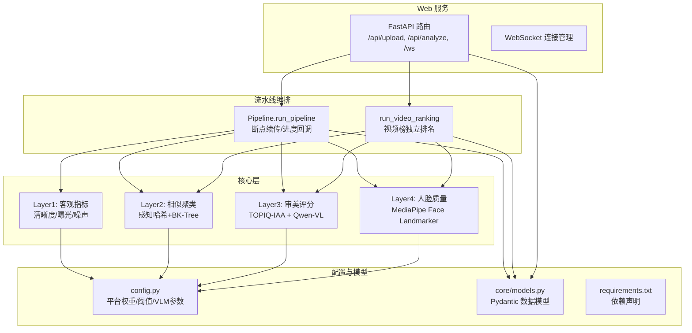
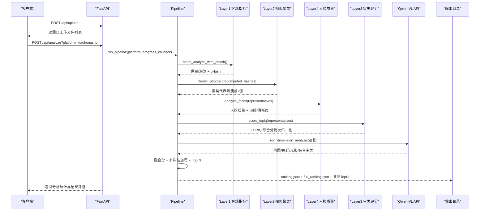
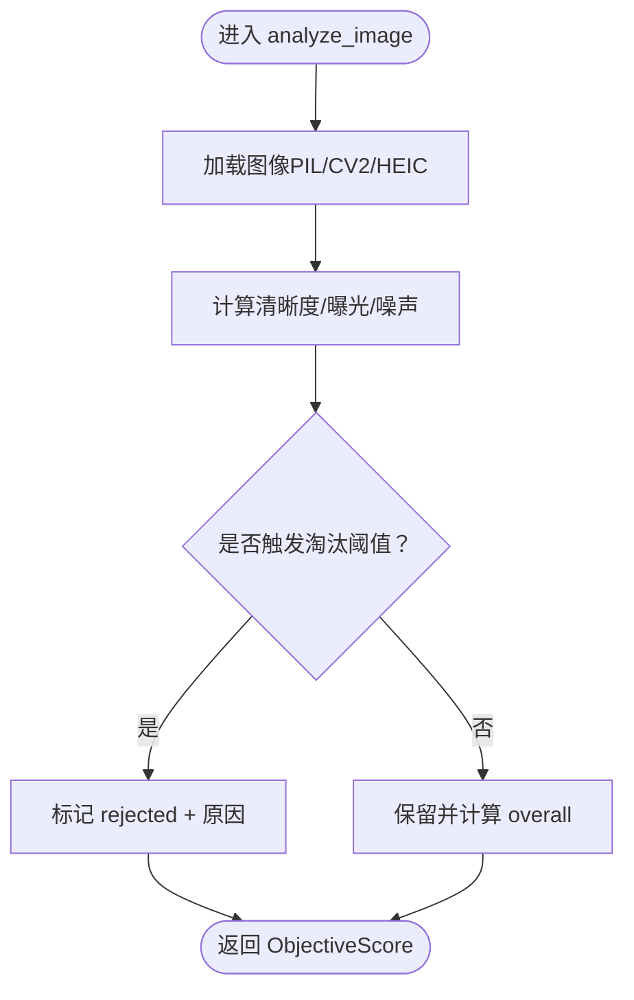
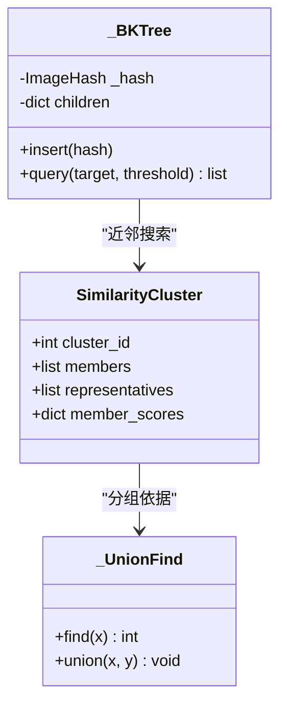
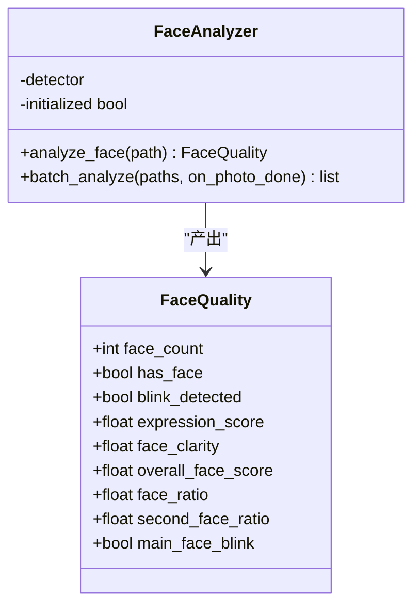
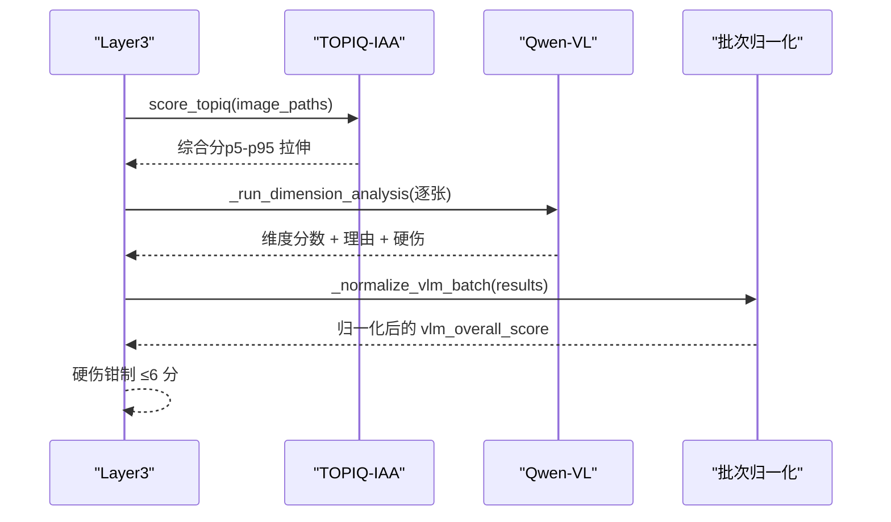
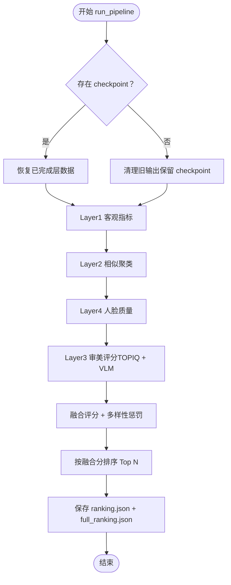
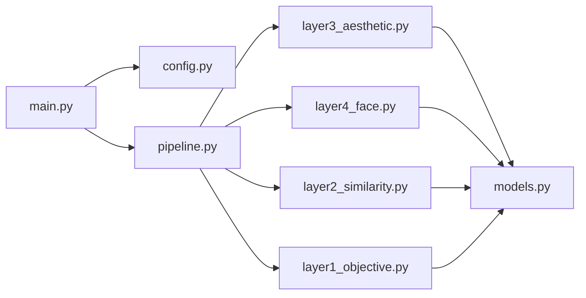

# 照片美学模型研究

<cite>
**本文引用的文件**   
- [config.py](file://config.py)
- [main.py](file://main.py)
- [pipeline.py](file://core\pipeline.py)
- [layer1_objective.py](file://core\layer1_objective.py)
- [layer2_similarity.py](file://core\layer2_similarity.py)
- [layer3_aesthetic.py](file://core\layer3_aesthetic.py)
- [layer4_face.py](file://core\layer4_face.py)
- [models.py](file://core\models.py)
- [requirements.txt](file://requirements.txt)
- [photo-aesthetic-research-report.md](file://docs\research\photo-aesthetic-research-report.md)
- [photo_aesthetic_models_research.md](file://docs\research\photo_aesthetic_models_research.md)
- [qwen-vl-photo-analysis-research.md](file://docs\research\qwen-vl-photo-analysis-research.md)
- [Quick-Start.md](file://docs\wiki\Quick-Start.md)
</cite>

## 目录
1. [引言](#引言)
2. [项目结构](#项目结构)
3. [核心组件](#核心组件)
4. [架构总览](#架构总览)
5. [详细组件分析](#详细组件分析)
6. [依赖关系分析](#依赖关系分析)
7. [性能考量](#性能考量)
8. [故障排查指南](#故障排查指南)
9. [结论](#结论)
10. [附录](#附录)

## 引言
本技术文档围绕“照片美学评估”展开，系统梳理传统机器学习方法与深度学习（含多模态大模型）在照片美学评分中的优缺点、架构设计、训练策略与性能表现。结合本项目实现，给出模型选择标准与评估指标（准确率、召回率、F1等），并提供具体模型的配置参数、输入输出格式与数据预处理流程。最后说明如何将选定的美学模型集成到系统中，包括API接口设计与推理优化方案，帮助读者快速落地并扩展。

## 项目结构
本项目采用分层流水线架构：
- Web 服务层：FastAPI + WebSocket，提供上传、抽帧、分析与结果查询能力
- 流水线编排：按 Layer1→Layer2→Layer4→Layer3 的顺序执行，支持断点续传与并发优化
- 各层模块：客观指标、相似聚类、人脸质量、审美评分（TOPIQ + VLM）
- 配置与环境：统一通过环境变量加载，平台权重与阈值集中管理

图表来源
- [main.py:102-399](file://main.py#L102-L399)
- [pipeline.py:165-594](file://core\pipeline.py#L165-L594)
- [config.py:1-123](file://config.py#L1-123)
- [models.py:1-123](file://core\models.py#L1-L123)

章节来源
- [main.py:1-399](file://main.py#L1-L399)
- [config.py:1-123](file://config.py#L1-L123)

## 核心组件
- 配置中心（config.py）：集中管理平台权重、阈值、VLM 参数、代理与 Web 服务端口
- 数据模型（models.py）：使用 Pydantic 定义层间数据结构，保证类型安全与序列化兼容
- 流水线（pipeline.py）：整合四层处理，支持断点续传、进度回调、多样性惩罚与融合评分
- 客观指标（layer1_objective.py）：清晰度、曝光、噪声，支持 HEIC 与多线程批处理
- 相似聚类（layer2_similarity.py）：感知哈希 + BK-Tree + Union-Find，高效去重与代表选取
- 人脸质量（layer4_face.py）：MediaPipe 人脸关键点与表情分析，生成中性提示文案供 VLM 注入
- 审美评分（layer3_aesthetic.py）：TOPIQ-IAA 客观审美 + Qwen-VL 多维度专业评分，批次归一化与硬伤钳制

章节来源
- [config.py:1-123](file://config.py#L1-L123)
- [models.py:1-123](file://core\models.py#L1-L123)
- [pipeline.py:165-594](file://core\pipeline.py#L165-L594)
- [layer1_objective.py:1-215](file://core\layer1_objective.py#L1-L215)
- [layer2_similarity.py:1-245](file://core\layer2_similarity.py#L1-L245)
- [layer4_face.py:1-290](file://core\layer4_face.py#L1-L290)
- [layer3_aesthetic.py:1-536](file://core\layer3_aesthetic.py#L1-L536)

## 架构总览
系统以 FastAPI 为入口，提供 REST 与 WebSocket 接口；核心流水线按层串行但关键阶段并发执行（L4 与 TOPIQ 并行，VLM 图片级流水）。最终融合分由 VLM、TOPIQ、人脸质量与客观指标加权计算，并进行多样性惩罚与 Top-N 排序。

图表来源
- [main.py:336-379](file://main.py#L336-L379)
- [pipeline.py:165-594](file://core\pipeline.py#L165-L594)
- [layer3_aesthetic.py:371-536](file://core\layer3_aesthetic.py#L371-L536)

## 详细组件分析

### 组件 A：客观指标（Layer1）
- 功能：计算清晰度（拉普拉斯方差）、曝光（亮度区间不扣分）、噪声（信噪比），并基于阈值淘汰模糊/过曝/欠曝
- 复杂度：单图 O(WH)，批处理线程池并发；pHash 在 L1 流水阶段即时计算，避免 L2 重复
- 错误处理：HEIC 解码失败回退 PIL；异常日志记录并标记 rejected
- 性能：CPU 友好，适合大规模预筛

图表来源
- [layer1_objective.py:98-127](file://core\layer1_objective.py#L98-L127)

章节来源
- [layer1_objective.py:1-215](file://core\layer1_objective.py#L1-L215)

### 组件 B：相似聚类（Layer2）
- 功能：基于感知哈希的汉明距离进行聚类，小数据集暴力搜索，大数据集启用 BK-Tree 范围查询；Union-Find 合并等价类
- 复杂度：插入 O(log n)，查询 O(log n)；整体接近 O(n log n)
- 代表选取：每簇按清晰度取前 2 张进入审美层，兼顾连拍第二张机会
- 容错：哈希失败照片独立成簇，不影响整体流程

图表来源
- [layer2_similarity.py:29-81](file://core\layer2_similarity.py#L29-L81)
- [layer2_similarity.py:128-148](file://core\layer2_similarity.py#L128-L148)

章节来源
- [layer2_similarity.py:1-245](file://core\layer2_similarity.py#L1-L245)

### 组件 C：人脸质量（Layer4）
- 功能：MediaPipe Face Landmarker 检测人脸关键点与表情，计算主脸清晰度、闭眼、占比与综合分
- 并发与安全：全局实例缓存 + 调用锁，避免 MediaPipe 非线程安全崩溃
- 提示文案：to_face_prompt_summary 生成中性描述，供 VLM 注入，避免主观臆测主体

图表来源
- [layer4_face.py:41-196](file://core\layer4_face.py#L41-L196)

章节来源
- [layer4_face.py:1-290](file://core\layer4_face.py#L1-L290)

### 组件 D：审美评分（Layer3）
- 功能：TOPIQ-IAA 客观审美评分（批次归一化）+ Qwen-VL 多维度专业评分（构图/色彩/光影/综合审美）
- 并发与重试：VLM 并发度 8，指数退避重试，JSON 解析鲁棒性高
- 硬伤钳制：人像硬伤（闭眼/人脸模糊）综合审美上限 6 分，程序化兜底
- 降级策略：无 API Key 时维度默认 5.0，确保可排序

图表来源
- [layer3_aesthetic.py:130-233](file://core\layer3_aesthetic.py#L130-L233)
- [layer3_aesthetic.py:371-536](file://core\layer3_aesthetic.py#L371-L536)

章节来源
- [layer3_aesthetic.py:1-536](file://core\layer3_aesthetic.py#L1-L536)

### 组件 E：流水线编排（Pipeline）
- 功能：串联 L1→L2→L4→L3，支持断点续传、进度回调、多样性惩罚与融合评分
- 并发优化：L4 与 TOPIQ 并行，VLM 图片级流水提前发起，减少网络 IO 空等
- 融合策略：VLM×w_vlm + TOPIQ×w_topiq + 人脸×w_face + 客观×w_obj，按平台维度权重加权
- 输出：ranking.json（Top N）、full_ranking.json（完整排行）、复制 Top N 展示

图表来源
- [pipeline.py:165-594](file://core\pipeline.py#L165-L594)

章节来源
- [pipeline.py:165-594](file://core\pipeline.py#L165-L594)

### 组件 F：视频精选榜（Video Ranking）
- 功能：对视频抽帧进行跨视频聚类、深度评分与融合排名，名额按视频时长比例分配
- 复用 L1/L2/L4 快筛结果，L3 VLM + TOPIQ 评分，多样性惩罚同照片榜
- 输出：output/{platform}/videos/video_ranking.json

章节来源
- [pipeline.py:681-875](file://core\pipeline.py#L681-L875)

## 依赖关系分析
- 外部依赖：FastAPI、Uvicorn、httpx、Pillow、OpenCV、imagehash、pyiqa、mediapipe、torch（需手动安装匹配 CUDA）
- 内部依赖：config.py 统一管理阈值与权重；models.py 提供类型安全的数据结构；各层模块通过 pipeline.py 编排

图表来源
- [main.py:22-34](file://main.py#L22-L34)
- [pipeline.py:10-28](file://core\pipeline.py#L10-L28)
- [requirements.txt:1-27](file://requirements.txt#L1-L27)

章节来源
- [requirements.txt:1-27](file://requirements.txt#L1-L27)

## 性能考量
- 设备选择：TOPIQ 自动检测 GPU/CPU，显存紧张时可主动释放模型缓存
- 并发策略：L4 与 TOPIQ 双线程池并行，VLM 独立线程池（8 并发）避免阻塞
- 内存管理：解码缓存复用，HEIC 支持避免重复解码；批量归一化减少分数膨胀
- 推理速度：TOPIQ-IAA 极快（~21 img/s），Qwen-VL 较慢但提供多维解释；建议先 TOPIQ 预筛再 VLM 精评

[本节为通用指导，无需特定文件引用]

## 故障排查指南
- 上传失败：检查文件大小限制与 MIME 白名单；HEIC/HEIF 浏览器 Content-Type 可能为 octet-stream，由下游解码验证
- 视频抽帧失败：Content-Length 预检超限直接拒绝；IO 异常清理半成品文件
- 分析中断：checkpoint 版本 v2 支持从任意层恢复；旧版 v1 仅复用 L1/L2
- VLM 调用失败：指数退避重试 3 次；无 API Key 时维度默认 5.0
- 人脸检测失败：MediaPipe 模型下载失败或初始化异常，重试最多 3 次

章节来源
- [main.py:111-237](file://main.py#L111-L237)
- [pipeline.py:214-231](file://core\pipeline.py#L214-L231)
- [layer3_aesthetic.py:465-536](file://core\layer3_aesthetic.py#L465-L536)
- [layer4_face.py:87-116](file://core\layer4_face.py#L87-L116)

## 结论
本项目构建了一个完整的照片美学评估流水线，结合传统方法（清晰度/曝光/噪声）与深度学习（TOPIQ-IAA + Qwen-VL），实现了高精度、可解释、可扩展的美学评分。通过平台权重、多样性惩罚与融合策略，满足不同社交平台的内容偏好。建议在 RTX 5070 上优先使用 TOPIQ-IAA 预筛，再对候选照片进行 VLM 深度分析，平衡精度与效率。

[本节为总结性内容，无需特定文件引用]

## 附录

### 模型对比与选择标准
- 传统方法（如 NIMA、CLIP-based）：速度快、资源占用低，但缺乏语义理解与可解释性
- 深度学习方法（TOPIQ-IAA、Q-ReAlign、Q-Align）：精度高、可解释性强，但推理成本较高
- 多模态大模型（Qwen-VL）：提供多维度专业评分与理由，适合精细化评审，但延迟高、成本高

评估指标建议：
- 准确率/召回率/F1：适用于分类任务（如类别识别、硬伤检测）
- SRCC/PLCC：用于回归任务（如 MOS 分数预测）
- 业务指标：Top-N 命中率、多样性得分、用户满意度

章节来源
- [photo_aesthetic_models_research.md:1-239](file://docs\research\photo_aesthetic_models_research.md#L1-L239)
- [photo-aesthetic-research-report.md:1-277](file://docs\research\photo-aesthetic-research-report.md#L1-L277)

### 配置参数与输入输出格式
- 平台权重：composition/color/lighting/face（不同平台差异化）
- 融合权重：vlm/topiq/face/objective（总和 1.0）
- VLM 参数：最大边长、JPEG 质量、超时、重试次数
- 输入：照片路径列表、平台名、进度回调
- 输出：ranking.json（Top N）、full_ranking.json（完整排行）、视频榜 video_ranking.json

章节来源
- [config.py:22-108](file://config.py#L22-L108)
- [pipeline.py:455-562](file://core\pipeline.py#L455-L562)

### API 接口设计与推理优化
- REST API：/api/upload、/api/upload_video、/api/analyze、/api/results/{platform}
- WebSocket：/ws 实时推送进度事件
- 推理优化：TOPIQ 模型缓存、VLM 并发与重试、多样性惩罚、断点续传

章节来源
- [main.py:111-379](file://main.py#L111-L379)
- [layer3_aesthetic.py:269-327](file://core\layer3_aesthetic.py#L269-L327)

### 数据预处理流程
- 图像加载：支持 HEIC/HEIF，失败回退 PIL
- 尺寸缩放：VLM 前长边缩放到 1024，JPEG 质量 80
- 哈希计算：L1 流水阶段即时计算 pHash，供 L2 与多样性惩罚复用
- 人脸提示：中性描述注入 VLM prompt，避免主观臆测

章节来源
- [layer1_objective.py:46-67](file://core\layer1_objective.py#L46-L67)
- [layer3_aesthetic.py:475-495](file://core\layer3_aesthetic.py#L475-L495)
- [layer4_face.py:234-290](file://core\layer4_face.py#L234-L290)

### 快速开始与环境配置
- 前提：Python 3.11+、NVIDIA GPU（RTX 5070+）、CUDA 12.6+
- 安装：克隆仓库、创建虚拟环境、安装依赖、配置 .env
- 启动：python main.py，访问 http://127.0.0.1:8080

章节来源
- [Quick-Start.md:1-88](file://docs\wiki\Quick-Start.md#L1-L88)