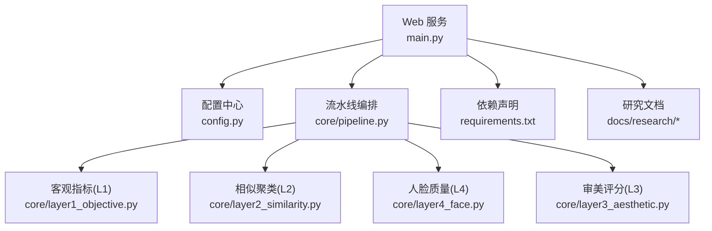
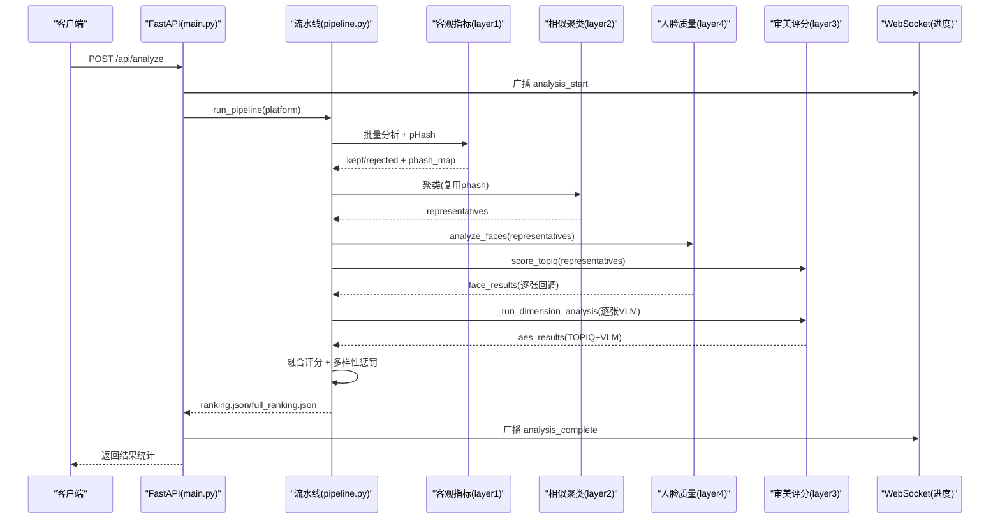
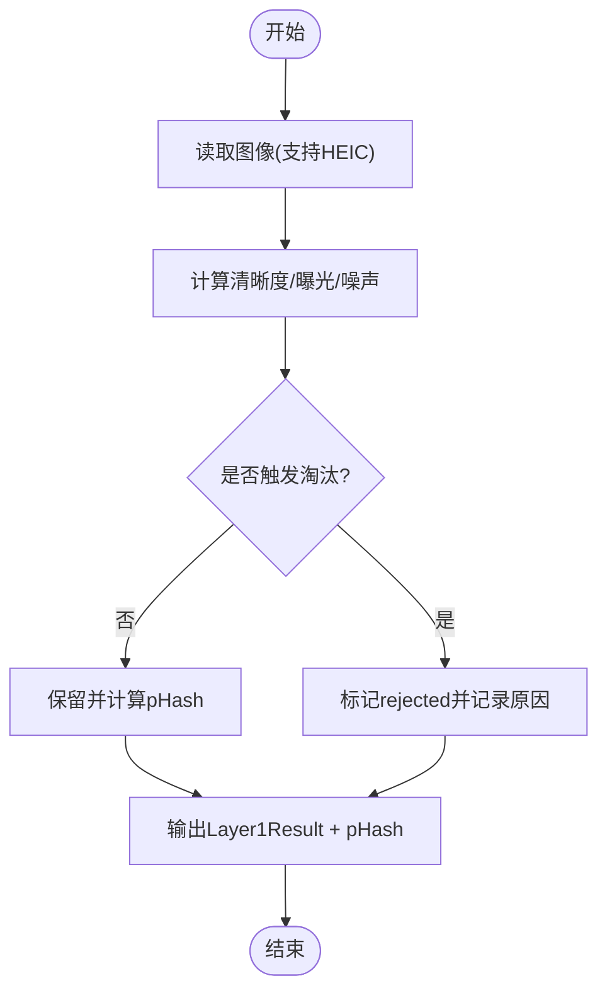
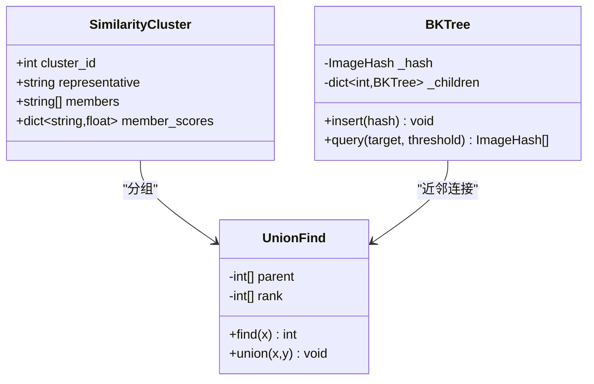
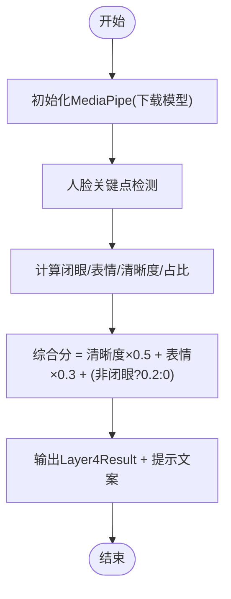
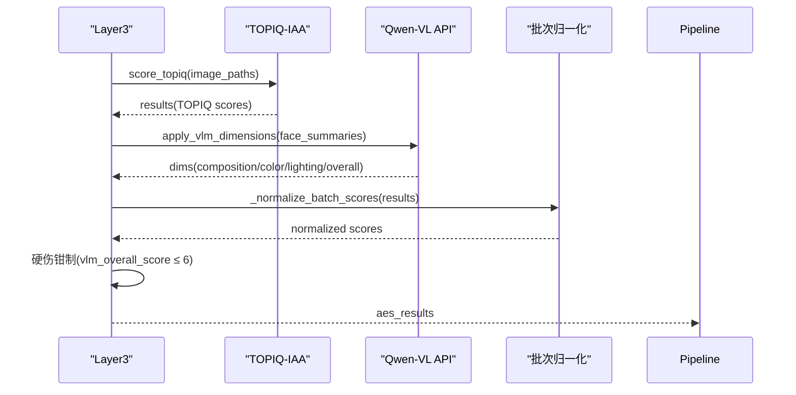
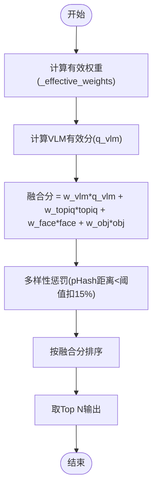
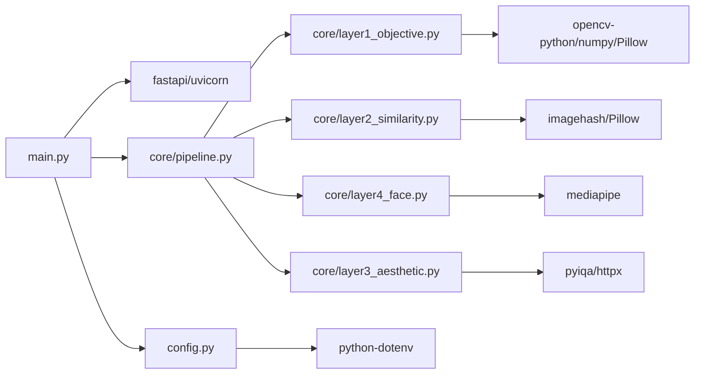

# 照片美学评估研究

<cite>
**本文引用的文件**   
- [main.py](file://main.py)
- [config.py](file://config.py)
- [core/pipeline.py](file://core/pipeline.py)
- [core/layer1_objective.py](file://core/layer1_objective.py)
- [core/layer2_similarity.py](file://core/layer2_similarity.py)
- [core/layer3_aesthetic.py](file://core/layer3_aesthetic.py)
- [core/layer4_face.py](file://core/layer4_face.py)
- [requirements.txt](file://requirements.txt)
- [docs/research/photo-aesthetic-research-report.md](file://docs/research/photo-aesthetic-research-report.md)
- [docs/research/photo_aesthetic_models_research.md](file://docs/research/photo_aesthetic_models_research.md)
- [docs/research/qwen-vl-photo-analysis-research.md](file://docs/research/qwen-vl-photo-analysis-research.md)
</cite>

## 目录
1. [引言](#引言)
2. [项目结构](#项目结构)
3. [核心组件](#核心组件)
4. [架构总览](#架构总览)
5. [详细组件分析](#详细组件分析)
6. [依赖关系分析](#依赖关系分析)
7. [性能考量](#性能考量)
8. [故障排查指南](#故障排查指南)
9. [结论](#结论)
10. [附录](#附录)

## 引言
本技术文档围绕“照片美学评估”的研究与工程实现展开，系统阐述理论基础、算法原理与落地方法。内容涵盖：
- 美学评分模型选择依据（TOPIQ-IAA + Qwen-VL VLM）
- 特征提取技术（清晰度/曝光/噪声、感知哈希聚类、人脸质量）
- 评分标准制定过程（平台权重、融合策略、多样性惩罚）
- 实验设计与数据集准备（多平台配置、阈值设定）
- 模型训练与推理流程（批次归一化、并发流水线、断点续传）
- 性能评估指标（VLM维度分、TOPIQ综合分、人脸质量、客观指标）
- 实际应用集成方案（Web API、WebSocket 进度推送、视频精选榜）

该体系以“客观指标快筛 → 相似去重 → 人脸质量 → 审美评分（TOPIQ+VLM）→ 融合排序”为主线，兼顾可解释性与可扩展性，适用于社交平台图片质量评估与自动选片场景。

**章节来源**
- [config.py:22-56](file://config.py#L22-L56)
- [core/pipeline.py:165-594](file://core/pipeline.py#L165-L594)

## 项目结构
- Web 服务入口：FastAPI + Uvicorn，提供上传、列表、结果查询与分析任务接口，并通过 WebSocket 推送进度
- 核心流水线：按 Layer1~Layer4 顺序执行，支持断点续传与并发优化
- 配置中心：统一环境变量覆盖路径、平台权重、阈值、模型参数等
- 研究文档：美学评估前沿论文与模型选型参考、Qwen-VL 使用最佳实践

**图表来源**
- [main.py:1-399](file://main.py#L1-L399)
- [config.py:1-123](file://config.py#L1-L123)
- [core/pipeline.py:1-800](file://core/pipeline.py#L1-L800)

**章节来源**
- [main.py:1-399](file://main.py#L1-L399)
- [config.py:1-123](file://config.py#L1-L123)
- [requirements.txt:1-27](file://requirements.txt#L1-L27)

## 核心组件
- 客观指标层（L1）：基于拉普拉斯方差、曝光区间、噪声估计，快速淘汰模糊/过曝/欠曝照片，并输出 pHash 供后续复用
- 相似聚类层（L2）：感知哈希 + BK-Tree/暴力搜索 + 并查集，合并连拍/重复帧，保留代表图参与深度评分
- 人脸质量层（L4）：MediaPipe Face Landmarker 检测闭眼、表情、主脸清晰度与占比，生成中性提示文案注入 VLM
- 审美评分层（L3）：TOPIQ-IAA 客观审美 + Qwen-VL 多维度专业评分（构图/色彩/光影/综合审美），批次归一化与硬伤钳制
- 融合与排序：平台维度权重加权，VLM/TOPIQ/人脸/客观指标统一加权，多样性惩罚避免同场景占位过多

**章节来源**
- [core/layer1_objective.py:1-215](file://core/layer1_objective.py#L1-L215)
- [core/layer2_similarity.py:1-245](file://core/layer2_similarity.py#L1-L245)
- [core/layer4_face.py:1-290](file://core/layer4_face.py#L1-L290)
- [core/layer3_aesthetic.py:1-536](file://core/layer3_aesthetic.py#L1-L536)
- [core/pipeline.py:165-594](file://core/pipeline.py#L165-L594)

## 架构总览
整体采用“分层流水线 + 并发优化 + 断点续传”的架构设计。关键特性：
- L4 与 L3-TOPIQ 并发执行，L4 完成即触发 VLM 调用（图片级流水），减少网络 IO 等待
- 模型缓存（TOPIQ 模块级缓存、FaceAnalyzer 全局实例）降低加载开销
- 断点续传（checkpoint.json）支持中断恢复，避免重复计算
- 多样性惩罚（pHash 汉明距离）提升榜单多样性

**图表来源**
- [main.py:336-379](file://main.py#L336-L379)
- [core/pipeline.py:165-594](file://core/pipeline.py#L165-L594)
- [core/layer1_objective.py:161-215](file://core/layer1_objective.py#L161-L215)
- [core/layer2_similarity.py:161-245](file://core/layer2_similarity.py#L161-L245)
- [core/layer4_face.py:198-232](file://core/layer4_face.py#L198-L232)
- [core/layer3_aesthetic.py:130-233](file://core/layer3_aesthetic.py#L130-L233)

## 详细组件分析

### 客观指标层（L1）
- 指标定义：
  - 清晰度：拉普拉斯方差归一化
  - 曝光：亮度均值落入合理区间不扣分，越界线性衰减
  - 噪声：拉普拉斯标准差与信号强度比值估计
  - 综合分：清晰度×0.4 + 曝光×0.3 + 噪声×0.3
- 淘汰规则：模糊/过曝/欠曝超过阈值直接淘汰
- 输出：Layer1Result 与 pHash 映射（供 L2/L3 复用）

**图表来源**
- [core/layer1_objective.py:70-127](file://core/layer1_objective.py#L70-L127)
- [core/layer1_objective.py:161-215](file://core/layer1_objective.py#L161-L215)

**章节来源**
- [core/layer1_objective.py:1-215](file://core/layer1_objective.py#L1-L215)

### 相似聚类层（L2）
- 算法：感知哈希（pHash）+ BK-Tree/暴力搜索 + 并查集
- 复杂度：小数据 O(n²)，大数据 O(n log n)
- 输出：每组取前2张清晰者作为代表，进入深度评分阶段

**图表来源**
- [core/layer2_similarity.py:21-28](file://core/layer2_similarity.py#L21-L28)
- [core/layer2_similarity.py:29-81](file://core/layer2_similarity.py#L29-L81)
- [core/layer2_similarity.py:128-148](file://core/layer2_similarity.py#L128-L148)

**章节来源**
- [core/layer2_similarity.py:1-245](file://core/layer2_similarity.py#L1-L245)

### 人脸质量层（L4）
- 检测：MediaPipe Face Landmarker，支持闭眼、表情、主脸清晰度与占比
- 输出：Layer4Result，包含人脸数量、闭眼标志、表情得分、主脸清晰度、人脸占比等
- 提示文案：to_face_prompt_summary 生成中性描述，注入 VLM prompt

**图表来源**
- [core/layer4_face.py:117-196](file://core/layer4_face.py#L117-L196)
- [core/layer4_face.py:234-290](file://core/layer4_face.py#L234-L290)

**章节来源**
- [core/layer4_face.py:1-290](file://core/layer4_face.py#L1-L290)

### 审美评分层（L3）
- TOPIQ-IAA：客观审美评分，批次归一化（p5-p95拉伸至0-10）
- VLM 维度分析：Qwen-VL 对构图/色彩/光影/综合审美进行专业评分，JSON解析与重试机制
- 硬伤钳制：人像硬伤（闭眼/人脸模糊）综合审美上限6分
- 融合策略：VLM有效分 = 0.7×维度加权 + 0.3×综合审美

**图表来源**
- [core/layer3_aesthetic.py:130-233](file://core/layer3_aesthetic.py#L130-L233)
- [core/layer3_aesthetic.py:269-328](file://core/layer3_aesthetic.py#L269-L328)
- [core/layer3_aesthetic.py:445-463](file://core/layer3_aesthetic.py#L445-L463)

**章节来源**
- [core/layer3_aesthetic.py:1-536](file://core/layer3_aesthetic.py#L1-L536)

### 融合与排序
- 融合公式：final_score = w_vlm×q_vlm + w_topiq×topiq + w_face×face + w_obj×objective
- 动态权重：VLM已评分时face权重归零重分配；无人脸照片face权重重分配
- 多样性惩罚：pHash 汉明距离 < 阈值则对后排名照片扣分（默认15%）
- 输出：ranking.json（Top N）、full_ranking.json（完整排行）

**图表来源**
- [core/pipeline.py:33-54](file://core/pipeline.py#L33-L54)
- [core/pipeline.py:92-111](file://core/pipeline.py#L92-L111)
- [core/pipeline.py:476-504](file://core/pipeline.py#L476-L504)

**章节来源**
- [core/pipeline.py:165-594](file://core/pipeline.py#L165-L594)

## 依赖关系分析
- Web 框架：FastAPI + Uvicorn，异步处理与 WebSocket 支持
- 图像处理：Pillow、OpenCV、imagehash、pillow-heif（HEIC支持）
- AI 模型：pyiqa（TOPIQ-IAA）、mediapipe（人脸检测）、httpx（Qwen-VL API）
- 配置管理：python-dotenv 环境变量覆盖

**图表来源**
- [requirements.txt:1-27](file://requirements.txt#L1-L27)
- [main.py:1-399](file://main.py#L1-L399)
- [config.py:1-123](file://config.py#L1-L123)

**章节来源**
- [requirements.txt:1-27](file://requirements.txt#L1-L27)
- [config.py:1-123](file://config.py#L1-L123)

## 性能考量
- 并发优化：L4与L3-TOPIQ并行，VLM独立线程池（8并发），避免阻塞事件循环
- 模型缓存：TOPIQ模型模块级缓存（按device区分），FaceAnalyzer全局实例
- 内存管理：图片解码缓存、显存释放（release_topiq_model）、GC回收
- 批处理：TOPIQ/VLM批次归一化，拉开区分度，避免分数膨胀
- 断点续传：checkpoint.json累积保存各层数据，支持任意步骤恢复

**章节来源**
- [core/layer3_aesthetic.py:27-52](file://core/layer3_aesthetic.py#L27-L52)
- [core/layer4_face.py:17-22](file://core/layer4_face.py#L17-L22)
- [core/pipeline.py:114-163](file://core/pipeline.py#L114-L163)

## 故障排查指南
- HEIC 不支持：安装 pillow-heif，或转换格式
- TOPIQ 模型加载失败：检查CUDA版本、显存不足，尝试CPU fallback
- MediaPipe 模型下载失败：检查网络代理，清理~/.cache/mediapipe后重试
- VLM API 超时：检查QWEN_API_KEY、HTTPS_PROXY、网络连通性
- 分析任务冲突：_analysis_lock 防止并发执行，等待或重启服务

**章节来源**
- [core/layer1_objective.py:23-31](file://core/layer1_objective.py#L23-L31)
- [core/layer3_aesthetic.py:163-188](file://core/layer3_aesthetic.py#L163-L188)
- [core/layer4_face.py:48-85](file://core/layer4_face.py#L48-L85)
- [core/layer3_aesthetic.py:498-535](file://core/layer3_aesthetic.py#L498-L535)
- [main.py:42-42](file://main.py#L42-L42)

## 结论
本系统通过“客观指标快筛 + 相似去重 + 人脸质量 + 审美评分（TOPIQ+VLM）+ 融合排序”的分层架构，实现了高效、可解释、可扩展的照片美学评估。关键技术包括：
- 多模态融合：TOPIQ客观审美与VLM主观审美的互补
- 并发优化：图片级流水与模型缓存显著提升吞吐
- 鲁棒性：断点续传、降级路径、异常处理保障稳定性
- 实用性：平台权重定制、多样性惩罚、视频精选榜扩展

未来方向可探索：更多VLM模型集成（如Q-ReAlign）、细粒度构图分析（AesFormer 7维度）、个性化美学偏好建模。

[无章节来源]

## 附录

### 美学评估指标定义与计算方法
- 清晰度：拉普拉斯方差归一化，反映边缘锐利程度
- 曝光：亮度均值落入[70,180]区间不扣分，越界线性衰减
- 噪声：拉普拉斯标准差与信号强度比值，SNR越高噪声越低
- 人脸质量：闭眼检测、表情得分、主脸清晰度与占比综合
- 审美评分：TOPIQ-IAA客观分 + VLM多维度分（构图/色彩/光影/综合审美）
- 融合分：w_vlm×q_vlm + w_topiq×topiq + w_face×face + w_obj×objective

**章节来源**
- [core/layer1_objective.py:70-127](file://core/layer1_objective.py#L70-L127)
- [core/layer4_face.py:183-192](file://core/layer4_face.py#L183-L192)
- [core/layer3_aesthetic.py:130-233](file://core/layer3_aesthetic.py#L130-L233)
- [core/pipeline.py:92-111](file://core/pipeline.py#L92-L111)

### 平台权重与评分标准
- 小红书：氛围感、故事感、封面感（构图0.35/色彩0.30/光影0.20/人脸0.15）
- 朋友圈：九宫格叙事（构图0.25/色彩0.25/光影0.30/人脸0.20）
- 抖音：冲击力、竖版适配（构图0.30/色彩0.25/光影0.25/人脸0.20）

**章节来源**
- [config.py:22-56](file://config.py#L22-L56)

### 实验设计与数据集准备
- 输入：uploads目录下的JPG/PNG/HEIC图片，支持视频抽帧
- 预处理：L1淘汰低质图，L2聚类去重，L4人脸检测
- 评分：L3 TOPIQ-IAA + VLM多维度分析
- 输出：output/{platform}/ranking.json + full_ranking.json

**章节来源**
- [core/pipeline.py:187-197](file://core/pipeline.py#L187-L197)
- [core/pipeline.py:516-576](file://core/pipeline.py#L516-L576)

### 研究成果应用与集成方案
- Web API：/api/upload、/api/analyze、/api/results/{platform}
- WebSocket：实时进度推送（analysis_start/layer_end/analysis_complete）
- 视频精选榜：按视频时长比例分配名额，跨视频聚类与评分
- 优化策略：模型缓存、并发流水线、断点续传、多样性惩罚

**章节来源**
- [main.py:111-379](file://main.py#L111-L379)
- [core/pipeline.py:681-800](file://core/pipeline.py#L681-L800)

### 研究背景与模型选型参考
- 前沿论文：Venus、RED-Aes、AesFormer、RealQA等MMLM美学评估方法
- 模型对比：Q-ReAlign、Q-Align、TOPIQ-IAA在AVA数据集上的表现
- Qwen-VL最佳实践：结构化Prompt、JSON输出、重试机制、Base64输入

**章节来源**
- [docs/research/photo-aesthetic-research-report.md:1-277](file://docs/research/photo-aesthetic-research-report.md#L1-L277)
- [docs/research/photo_aesthetic_models_research.md:1-239](file://docs/research/photo_aesthetic_models_research.md#L1-L239)
- [docs/research/qwen-vl-photo-analysis-research.md:1-391](file://docs/research/qwen-vl-photo-analysis-research.md#L1-L391)