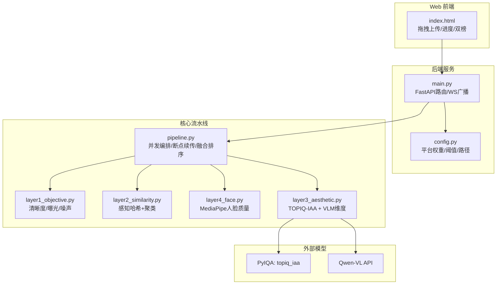
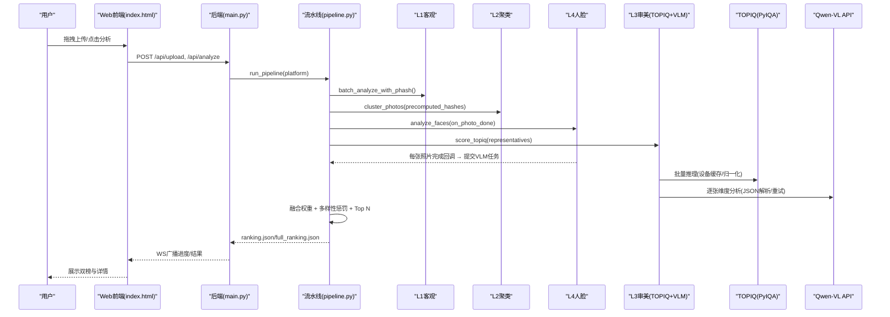
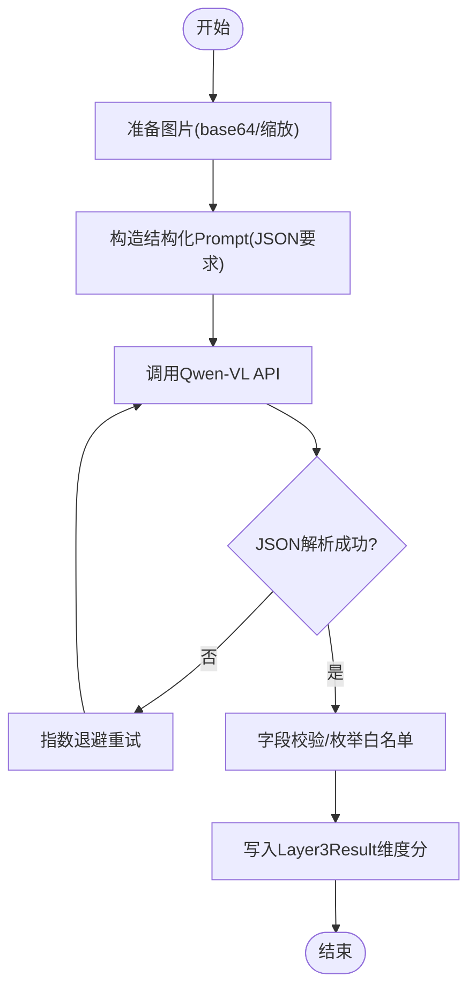
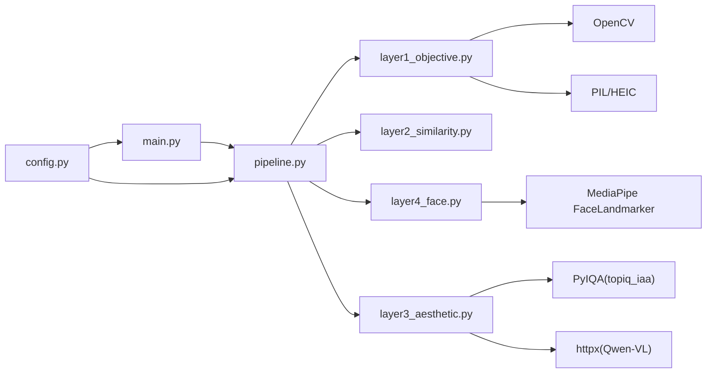

# 研究文档

<cite>
**本文引用的文件**   
- [photo-aesthetic-research-report.md](file://docs/research/photo-aesthetic-research-report.md)
- [photo_aesthetic_models_research.md](file://docs/research/photo_aesthetic_models_research.md)
- [qwen-vl-photo-analysis-research.md](file://docs/research/qwen-vl-photo-analysis-research.md)
- [web_ui_framework_research.md](file://docs/research/web_ui_framework_research.md)
- [layer3_aesthetic.py](file://core/layer3_aesthetic.py)
- [pipeline.py](file://core/pipeline.py)
- [main.py](file://main.py)
- [config.py](file://config.py)
- [layer1_objective.py](file://core/layer1_objective.py)
- [layer2_similarity.py](file://core/layer2_similarity.py)
- [layer4_face.py](file://core/layer4_face.py)
- [index.html](file://templates/index.html)
</cite>

## 目录
1. [引言](#引言)
2. [项目结构](#项目结构)
3. [核心组件](#核心组件)
4. [架构总览](#架构总览)
5. [详细组件分析](#详细组件分析)
6. [依赖关系分析](#依赖关系分析)
7. [性能考量](#性能考量)
8. [故障排查指南](#故障排查指南)
9. [结论](#结论)
10. [附录：延伸阅读与引用](#附录：延伸阅读与引用)

## 引言
本文件面向“照片排名系统”的研究与实践，系统化梳理并解释三项关键研究成果及其在系统中的落地方式：
- 照片美学评估算法研究：从传统CNN到多模态大模型（MLLM）的演进、相对评分与可解释性趋势、以及针对RTX 5070 12GB的部署建议。
- Qwen-VL视觉语言模型在照片分析中的应用：API配置、结构化提示工程、JSON输出解析、多图叙事与文案生成等最佳实践。
- Web UI框架技术选型分析：FastAPI + 原生HTML/JS的优势、实时进度推送、与AI推理集成的简洁性与高效性。

这些研究直接指导了系统的算法选择（TOPIQ-IAA + Qwen-VL）、模型优化策略（批次归一化、VLM图片级流水、显存分时加载）与架构决策（四层流水线+断点续传+双榜单）。

## 项目结构
本项目采用分层流水线架构，将客观指标、相似聚类、人脸质量、审美评分与融合排序解耦为独立层，并通过统一入口进行编排。Web端通过FastAPI提供REST与WebSocket接口，前端使用原生HTML/JS实现拖拽上传、实时进度与结果展示。



**图表来源** 
- [main.py:102-399](file://main.py#L102-L399)
- [pipeline.py:165-593](file://pipeline.py#L165-L593)
- [layer3_aesthetic.py:130-368](file://layer3_aesthetic.py#L130-L368)
- [layer1_objective.py:129-215](file://core/layer1_objective.py#L129-L215)
- [layer2_similarity.py:161-245](file://core/layer2_similarity.py#L161-L245)
- [layer4_face.py:198-232](file://core/layer4_face.py#L198-L232)
- [config.py:22-108](file://config.py#L22-L108)

**章节来源**
- [main.py:102-399](file://main.py#L102-L399)
- [pipeline.py:165-593](file://pipeline.py#L165-L593)
- [config.py:22-108](file://config.py#L22-L108)

## 核心组件
- 客观指标层（L1）：基于OpenCV计算清晰度（拉普拉斯方差）、曝光（亮度区间惩罚）、噪声（信噪比），支持HEIC，多线程批处理，并在不淘汰的照片上即时计算感知哈希供后续复用。
- 相似聚类层（L2）：使用感知哈希与BK-Tree/暴力搜索结合，Union-Find合并相似组，每组取前两张代表进入深度评分，避免重复场景占据过多名额。
- 人脸质量层（L4）：MediaPipe Face Landmarker检测闭眼、表情、主脸清晰度与占比，输出中性分档提示文案注入VLM prompt，程序化钳制人像硬伤综合分上限。
- 审美评分层（L3）：TOPIQ-IAA客观审美分（批次p5-p95归一化）+ Qwen-VL多维度评分（构图/色彩/光影/综合审美），失败回退默认值；VLM调用图片级并发流水，减少空等。
- 融合排序（Pipeline）：按平台权重加权VLM维度分、TOPIQ分、人脸分与客观分，应用多样性惩罚（pHash汉明距离），Top N输出并保存完整排行与可视化副本。

**章节来源**
- [layer1_objective.py:129-215](file://core/layer1_objective.py#L129-L215)
- [layer2_similarity.py:161-245](file://core/layer2_similarity.py#L161-L245)
- [layer4_face.py:198-232](file://core/layer4_face.py#L198-L232)
- [layer3_aesthetic.py:130-368](file://layer3_aesthetic.py#L130-L368)
- [pipeline.py:455-593](file://pipeline.py#L455-L593)

## 架构总览
系统以“快速本地快筛 + 深度VLM分析”的双阶段为核心思想：L1/L2/L4在本地完成，L3同时运行TOPIQ与VLM，且VLM在L4每完成一张即发起调用，最大化网络IO利用率。最终融合分考虑平台特性与多样性，确保榜单兼具质量与丰富度。



**图表来源** 
- [main.py:336-379](file://main.py#L336-L379)
- [pipeline.py:308-453](file://pipeline.py#L308-L453)
- [layer3_aesthetic.py:269-368](file://layer3_aesthetic.py#L269-L368)
- [layer4_face.py:198-232](file://core/layer4_face.py#L198-L232)

## 详细组件分析

### 照片美学评估算法研究
- 背景与趋势：从绝对MOS回归转向相对编辑差异学习（RED-Aes）、多模态大模型的可解释评分（Venus/RealQA）、扩散模型作为质量判别（DRM）。对社交平台而言，构图、色彩、光影、主体表达、技术质量、情感共鸣是核心维度。
- 方法论：采用TOPIQ-IAA作为客观审美基线，结合Qwen-VL的多维度结构化评分；引入批次归一化（p5-p95拉伸）提升区分度；人像硬伤（闭眼/模糊）程序化钳制综合分上限。
- 实验结果与结论：Q-ReAlign系列在AVA上表现优异，但受限于显存；TOPIQ-IAA速度快、资源占用低，适合大规模初筛；VLM提供可解释维度与改进建议，适合精细分析与文案生成。
- 系统落地：L3层实现TOPIQ与VLM并行，失败回退与默认值保障鲁棒性；融合权重按平台定制（小红书/朋友圈/抖音）。

**章节来源**
- [photo-aesthetic-research-report.md:121-277](file://docs/research/photo-aesthetic-research-report.md#L121-L277)
- [photo_aesthetic_models_research.md:188-239](file://docs/research/photo_aesthetic_models_research.md#L188-L239)
- [layer3_aesthetic.py:130-368](file://layer3_aesthetic.py#L130-L368)

### Qwen-VL视觉语言模型在照片分析中的应用
- API配置：OpenAI兼容端点、Bearer鉴权、image_url输入、多图支持。
- 提示工程：严格JSON输出、六维评分（构图/光影/色彩/主体/技术/情感）、强项/弱项/风格标签/一句话总结；多图叙事、文案生成、风格识别与情感映射。
- 解析与容错：正则提取最外层花括号、枚举白名单过滤（hard_flaws）、指数退避重试、温度控制保证稳定性。
- 系统落地：L3层在L4每完成一张即发起VLM调用，face_summary注入中性事实，避免臆测；失败时维度默认值5.0，保障排序稳定。



**图表来源** 
- [qwen-vl-photo-analysis-research.md:263-391](file://docs/research/qwen-vl-photo-analysis-research.md#L263-L391)
- [layer3_aesthetic.py:465-536](file://layer3_aesthetic.py#L465-L536)

**章节来源**
- [qwen-vl-photo-analysis-research.md:1-391](file://docs/research/qwen-vl-photo-analysis-research.md#L1-L391)
- [layer3_aesthetic.py:269-368](file://layer3_aesthetic.py#L269-L368)

### Web UI框架的技术选型分析
- 选型依据：FastAPI已安装、零构建步骤、原生WebSocket支持、Python直连AI模型、无框架开销、开发效率最高。
- 功能实现：拖拽上传、视频流式抽帧、实时进度（WS广播）、双榜展示（照片/视频）、路径遍历防护、安全文件名净化。
- 前端交互：原生HTML/JS实现状态管理、DOM操作、WS自动重连、Tab切换与详情弹窗。

```mermaid
classDiagram
class FastAPIApp {
+"/" index()
+"/api/upload" upload_photos()
+"/api/upload_video" upload_video()
+"/api/photos" list_photos()
+"/api/results/{platform}" get_results()
+"/ws" websocket_endpoint()
}
class ConnectionManager {
+active_connections
+connect(websocket)
+disconnect(websocket)
+broadcast(message)
}
class Frontend {
+拖拽上传
+视频抽帧
+WS进度
+双榜展示
}
FastAPIApp --> ConnectionManager : "管理连接"
Frontend --> FastAPIApp : "HTTP/WS调用"
```

**图表来源** 
- [main.py:78-96](file://main.py#L78-L96)
- [main.py:111-399](file://main.py#L111-L399)
- [index.html:621-800](file://templates/index.html#L621-L800)

**章节来源**
- [web_ui_framework_research.md:1-800](file://docs/research/web_ui_framework_research.md#L1-L800)
- [main.py:102-399](file://main.py#L102-L399)
- [index.html:1-800](file://templates/index.html#L1-L800)

## 依赖关系分析
- 模块耦合：pipeline.py聚合L1/L2/L4/L3，通过ThreadPoolExecutor实现并发；L3依赖pyiqa与httpx；L4依赖mediapipe；L1依赖cv2/PIL。
- 外部依赖：Qwen-VL API（OpenAI兼容）、PyIQA（topiq_iaa）、MediaPipe模型下载。
- 配置驱动：config.py集中管理平台权重、阈值、路径、模型参数，环境变量覆盖。



**图表来源** 
- [pipeline.py:165-593](file://pipeline.py#L165-L593)
- [layer3_aesthetic.py:130-368](file://layer3_aesthetic.py#L130-L368)
- [layer4_face.py:198-232](file://core/layer4_face.py#L198-L232)
- [layer1_objective.py:129-215](file://core/layer1_objective.py#L129-L215)
- [config.py:22-108](file://config.py#L22-L108)

**章节来源**
- [pipeline.py:165-593](file://pipeline.py#L165-L593)
- [config.py:22-108](file://config.py#L22-L108)

## 性能考量
- 设备与显存：TOPIQ-IAA轻量快速，VLM需GPU或云端API；RTX 5070 12GB下推荐TOPIQ为主、VLM按需调用。
- 并发与流水：L4与TOPIQ并发执行，VLM在L4每完成一张即发起，避免网络等待瓶颈。
- 归一化与回退：批次p5-p95归一化提升区分度；VLM失败回退默认值，保障排序稳定。
- 存储与缓存：模型模块级缓存、解码缓存清理、checkpoint断点续传，减少重复计算与IO。

[本节为通用性能讨论，不直接分析具体文件]

## 故障排查指南
- 模型加载失败：检查pyiqa/MediaPipe依赖与环境变量；CPU fallback机制已内置。
- VLM调用失败：确认QWEN_API_KEY与BASE_URL；网络代理HTTPS_PROXY；JSON解析失败时查看原始文本。
- 人脸检测异常：MediaPipe模型下载失败或损坏，自动重试；多人场景闭眼判定影响综合分上限。
- 进度卡住：检查WS连接状态与浏览器控制台；确认后端日志与checkpoint文件。

**章节来源**
- [layer3_aesthetic.py:164-187](file://layer3_aesthetic.py#L164-L187)
- [layer4_face.py:48-85](file://core/layer4_face.py#L48-L85)
- [main.py:336-379](file://main.py#L336-L379)

## 结论
本项目将前沿的美学评估研究与工程实践紧密结合：以TOPIQ-IAA为客观基线，Qwen-VL提供可解释多维度评分，结合人脸质量与平台权重，形成高质量、多样化、可扩展的照片排名系统。研究文献为算法选择与优化提供了坚实依据，Web UI选型确保了用户体验与开发效率。未来可进一步探索相对评分（RED-Aes）与扩散模型判别（DRM）在系统中的集成。

[本节为总结性内容，不直接分析具体文件]

## 附录：延伸阅读与引用
- 照片美学评估研究报告：涵盖Venus、RED-Aes、AesFormer、HPSv3等最新进展与部署建议。
- Qwen-VL最佳实践：API配置、提示工程、JSON解析、多图叙事与文案生成。
- Web UI框架对比：FastAPI+原生HTML/JS的优势与示例代码。

**章节来源**
- [photo-aesthetic-research-report.md:1-277](file://docs/research/photo-aesthetic-research-report.md#L1-L277)
- [qwen-vl-photo-analysis-research.md:1-391](file://docs/research/qwen-vl-photo-analysis-research.md#L1-L391)
- [web_ui_framework_research.md:1-800](file://docs/research/web_ui_framework_research.md#L1-L800)