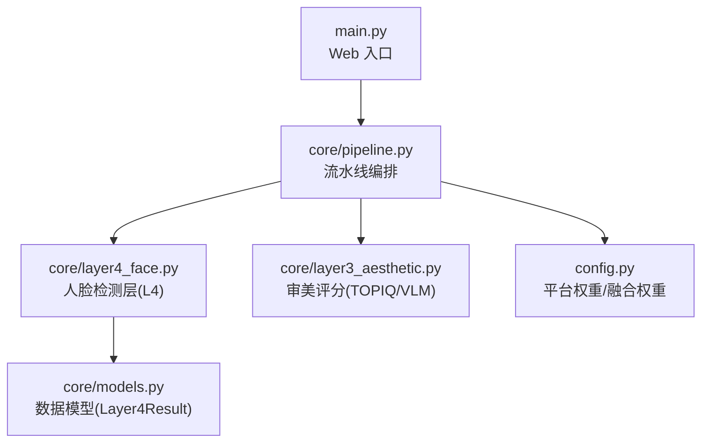
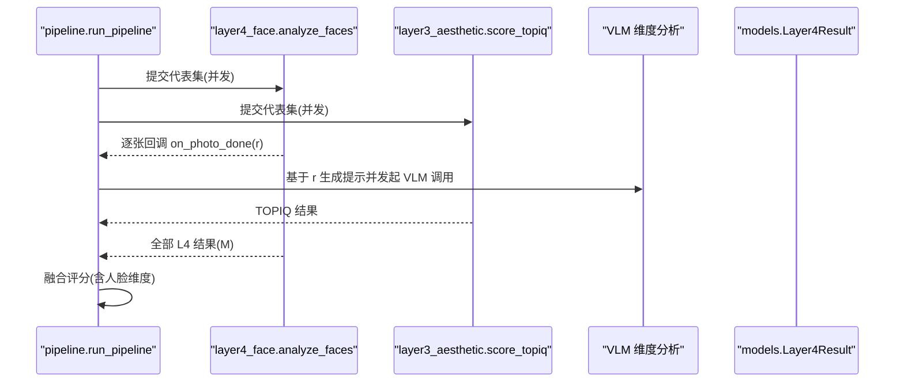
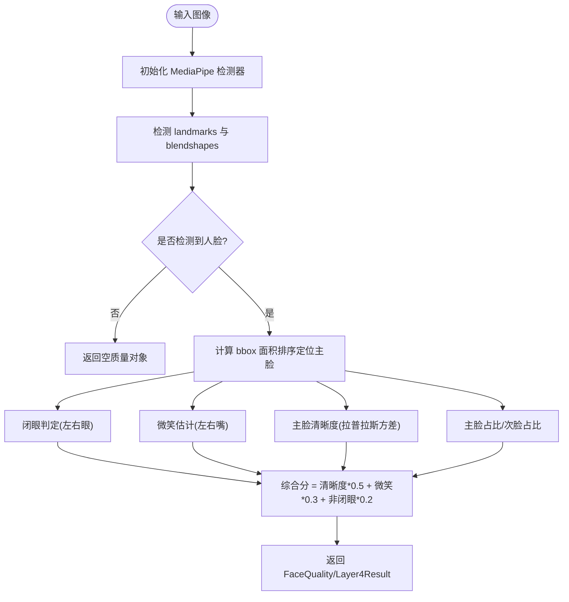
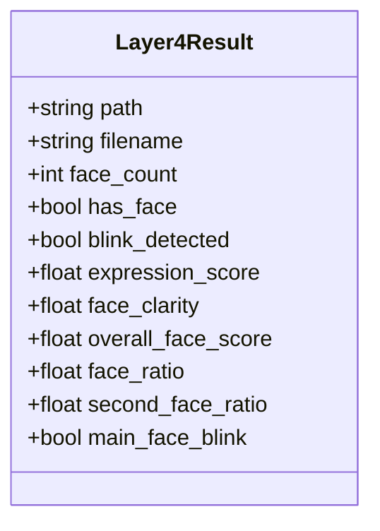
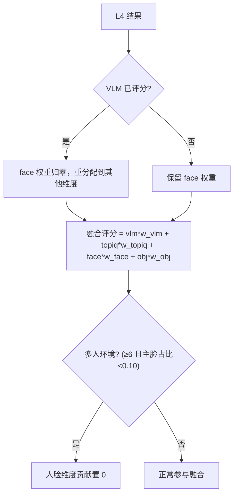
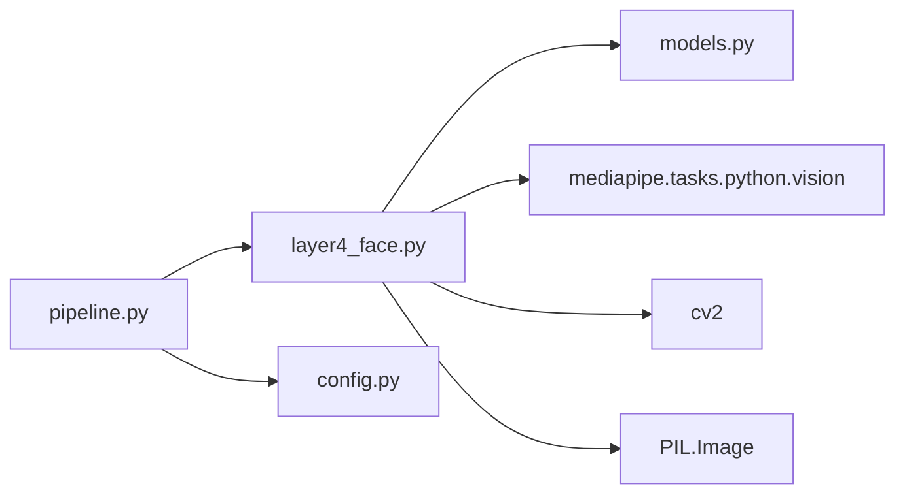

# 人脸检测层

<cite>
**本文引用的文件**   
- [core/layer4_face.py](file://core/layer4_face.py)
- [core/pipeline.py](file://core/pipeline.py)
- [config.py](file://config.py)
- [main.py](file://main.py)
- [core/models.py](file://core/models.py)
- [tests/test_layer4.py](file://tests/test_layer4.py)
</cite>

## 目录
1. [简介](#简介)
2. [项目结构](#项目结构)
3. [核心组件](#核心组件)
4. [架构总览](#架构总览)
5. [详细组件分析](#详细组件分析)
6. [依赖关系分析](#依赖关系分析)
7. [性能与精度优化](#性能与精度优化)
8. [API 文档](#api-文档)
9. [实际应用示例](#实际应用示例)
10. [隐私与安全](#隐私与安全)
11. [故障排查](#故障排查)
12. [结论](#结论)

## 简介
本文件为“人脸检测层”（Layer 4）的完整技术文档，聚焦以下目标：
- 解释人脸检测的技术实现：算法选择、关键指标计算、精度与性能调优策略。
- 说明支持的人脸特征识别能力：闭眼检测、表情（微笑）估计、主脸清晰度等；并明确当前未实现的属性（如年龄估计、性别识别）。
- 提供完整的 API 文档：方法、参数、结果字段与使用方式。
- 给出实际应用场景：人脸数量统计、质量检测、内容审核等。
- 阐述隐私保护措施、数据安全考虑，以及与整体评估流程（流水线）的集成方式。

## 项目结构
人脸检测层位于 core/layer4_face.py，作为流水线的一个独立模块被 pipeline.py 调用，并通过 models.py 定义统一的数据结构。Web 入口 main.py 负责对外暴露接口与编排任务。

**图表来源** 
- [main.py:1-120](file://main.py#L1-L120)
- [core/pipeline.py:165-230](file://core/pipeline.py#L165-L230)
- [core/layer4_face.py:1-60](file://core/layer4_face.py#L1-L60)
- [core/models.py:55-74](file://core/models.py#L55-L74)
- [config.py:99-108](file://config.py#L99-L108)

**章节来源**
- [core/layer4_face.py:1-60](file://core/layer4_face.py#L1-L60)
- [core/pipeline.py:165-230](file://core/pipeline.py#L165-L230)
- [core/models.py:55-74](file://core/models.py#L55-L74)
- [config.py:99-108](file://config.py#L99-L108)

## 核心组件
- FaceQuality：内部数据结构，承载单张图像的人脸质量指标（人数、是否有人脸、闭眼、表情分、清晰度、综合分、主脸占比、次脸占比、主脸闭眼）。
- FaceAnalyzer：核心分析器，负责 MediaPipe 模型下载/初始化、单图分析与批量分析。
- analyze_faces / batch_analyze：对外批量分析入口，线程安全封装，支持图片级回调以驱动下游 VLM 并行。
- to_face_prompt_summary：将 L4 结果转换为中性提示文案，注入到 L3 VLM 的 prompt 中，辅助审美评分。

**章节来源**
- [core/layer4_face.py:28-39](file://core/layer4_face.py#L28-L39)
- [core/layer4_face.py:41-116](file://core/layer4_face.py#L41-L116)
- [core/layer4_face.py:117-197](file://core/layer4_face.py#L117-L197)
- [core/layer4_face.py:198-231](file://core/layer4_face.py#L198-L231)
- [core/layer4_face.py:234-290](file://core/layer4_face.py#L234-L290)

## 架构总览
人脸检测层在流水线中的角色与交互如下：
- 流水线在代表集上并发执行 L4（人脸）与 L3（TOPIQ），并在 L4 每完成一张时立即触发 VLM 维度分析（图片级流水）。
- L4 输出 Layer4Result，包含人脸数量、闭眼、表情、清晰度、主脸占比等，用于后续融合评分与 VLM 提示注入。
- 融合阶段根据平台权重与配置动态调整人脸维度的贡献，并对多人环境场景进行降级处理。

**图表来源** 
- [core/pipeline.py:324-386](file://core/pipeline.py#L324-L386)
- [core/layer4_face.py:198-231](file://core/layer4_face.py#L198-L231)
- [core/models.py:55-74](file://core/models.py#L55-L74)

**章节来源**
- [core/pipeline.py:324-386](file://core/pipeline.py#L324-L386)

## 详细组件分析

### 算法选择与实现要点
- 算法选型：MediaPipe Face Landmarker（关键点+Blendshapes），用于人脸检测、闭眼检测、微笑估计。
- 模型管理：自动下载与完整性校验，缓存至用户目录，失败重试与损坏恢复。
- 线程安全：全局实例复用 + 调用锁，避免 C++ 层并发崩溃。
- 指标计算：
  - 人脸数量与存在性：基于 landmarks 计数。
  - 闭眼检测：左右眼 blink 分数阈值判定。
  - 表情估计：mouthSmileLeft/Right 平均作为 expression_score。
  - 主脸清晰度：对主脸区域灰度图计算拉普拉斯方差归一化。
  - 主脸占比与次脸占比：bbox 面积比，用于合影/主次判断。
  - 综合分：清晰度×0.5 + 微笑×0.3 + (非闭眼奖励0.2)。

**图表来源** 
- [core/layer4_face.py:117-197](file://core/layer4_face.py#L117-L197)

**章节来源**
- [core/layer4_face.py:48-116](file://core/layer4_face.py#L48-L116)
- [core/layer4_face.py:117-197](file://core/layer4_face.py#L117-L197)

### 数据模型与字段说明
- Layer4Result（用于流水线与外部交互）：
  - path, filename：图像路径与文件名。
  - face_count：检测到的人脸数量。
  - has_face：是否存在人脸。
  - blink_detected：任一闭眼。
  - expression_score：表情分（微笑估计，0-1）。
  - face_clarity：主脸清晰度（0-1）。
  - overall_face_score：人脸综合分（0-1）。
  - face_ratio：主脸面积/画面面积。
  - second_face_ratio：次脸面积/主脸面积。
  - main_face_blink：主脸是否闭眼。

**图表来源** 
- [core/models.py:55-74](file://core/models.py#L55-L74)

**章节来源**
- [core/models.py:55-74](file://core/models.py#L55-L74)

### 与流水线集成与融合评分
- 人脸维度权重：由 config.FUSION_WEIGHTS 控制，默认 0.15；当 VLM 已评分时，face 权重归零以避免双重计数。
- 多人环境降级：若人脸数≥6 且主脸占比<0.10，视为环境元素，不参与加分。
- 人像硬伤钳制：主脸闭眼或明显模糊时，VLM 综合审美上限钳制至 6 分。

**图表来源** 
- [core/pipeline.py:33-54](file://core/pipeline.py#L33-L54)
- [core/pipeline.py:387-398](file://core/pipeline.py#L387-L398)
- [config.py:99-108](file://config.py#L99-L108)

**章节来源**
- [core/pipeline.py:33-54](file://core/pipeline.py#L33-L54)
- [core/pipeline.py:387-398](file://core/pipeline.py#L387-L398)
- [config.py:99-108](file://config.py#L99-L108)

## 依赖关系分析
- 外部依赖：
  - mediapipe.tasks.python.vision.FaceLandmarker：人脸关键点与 Blendshapes 检测。
  - cv2（OpenCV）：灰度转换与拉普拉斯清晰度计算。
  - PIL：图像读取与格式转换。
- 内部依赖：
  - core.models.Layer4Result：统一结果结构。
  - core.pipeline：并发调度与回调机制。
  - config：平台权重与融合权重。

**图表来源** 
- [core/layer4_face.py:1-20](file://core/layer4_face.py#L1-L20)
- [core/pipeline.py:165-230](file://core/pipeline.py#L165-L230)
- [config.py:99-108](file://config.py#L99-L108)

**章节来源**
- [core/layer4_face.py:1-20](file://core/layer4_face.py#L1-L20)
- [core/pipeline.py:165-230](file://core/pipeline.py#L165-L230)

## 性能与精度优化
- 性能优化
  - 全局实例复用与调用锁：避免重复初始化与并发崩溃。
  - 模型缓存与完整性校验：减少网络开销与失败重试。
  - 图片级流水：L4 完成后立即触发 VLM，降低端到端延迟。
  - 批处理并发：L4 与 TOPIQ 双线程池并行。
- 精度优化
  - 主脸清晰度采用拉普拉斯方差，结合阈值截断，提升鲁棒性。
  - 闭眼阈值 0.5，平衡误检与漏检。
  - 多人环境降级策略避免背景人群干扰主体评分。
- 可观测性与容错
  - 详细的日志记录（下载、初始化、失败原因）。
  - 异常捕获与降级（无人脸/模型不可用返回空结果）。

**章节来源**
- [core/layer4_face.py:17-23](file://core/layer4_face.py#L17-L23)
- [core/layer4_face.py:48-116](file://core/layer4_face.py#L48-L116)
- [core/layer4_face.py:117-197](file://core/layer4_face.py#L117-L197)
- [core/pipeline.py:324-386](file://core/pipeline.py#L324-L386)

## API 文档
- 批量人脸分析
  - 函数：analyze_faces(image_paths, on_photo_done=None) -> list[Layer4Result]
  - 参数：
    - image_paths：图像路径列表（str | Path）。
    - on_photo_done：可选回调，每完成一张即触发，传入 Layer4Result。
  - 返回：Layer4Result 列表，包含人脸数量、闭眼、表情、清晰度、占比等。
  - 线程安全：内部使用全局实例与调用锁保证并发安全。
- 单图分析
  - 方法：FaceAnalyzer.analyze_face(image_path) -> FaceQuality
  - 用途：直接获取 FaceQuality 中间结果，便于自定义处理。
- 提示文案生成
  - 函数：to_face_prompt_summary(r: Layer4Result) -> str
  - 用途：生成中性描述文本，注入 L3 VLM 的 prompt，辅助审美评分。

**章节来源**
- [core/layer4_face.py:198-231](file://core/layer4_face.py#L198-L231)
- [core/layer4_face.py:117-197](file://core/layer4_face.py#L117-L197)
- [core/layer4_face.py:234-290](file://core/layer4_face.py#L234-L290)

## 实际应用示例
- 人脸数量统计
  - 通过 Layer4Result.face_count 统计每张照片的人脸数量，可用于合影筛选或人群密度分析。
- 质量检测
  - 使用 face_clarity 与 overall_face_score 评估主脸清晰度与整体质量，过滤模糊或闭眼照片。
- 内容审核
  - 利用 blink_detected 与 main_face_blink 标记人像硬伤，配合 VLM 上限钳制确保低质内容不被高评。
- 流水线集成
  - 在 pipeline 中，L4 结果用于融合评分与多样性惩罚，最终输出 Top N 榜单。

**章节来源**
- [core/models.py:55-74](file://core/models.py#L55-L74)
- [core/pipeline.py:387-398](file://core/pipeline.py#L387-L398)

## 隐私与安全
- 本地模型与数据处理
  - 模型下载至用户目录（~/.cache/mediapipe），不上传至第三方服务。
  - 图像处理在本地完成，仅 VLM 维度分析可能涉及网络请求（需配置 API Key）。
- 输入校验与路径安全
  - Web 接口对文件名进行净化与白名单校验，防止路径遍历与恶意类型。
- 数据最小化
  - 仅提取必要的人脸指标，不存储原始人脸图像或敏感生物特征。
- 代理与网络
  - 支持 HTTPS_PROXY 环境变量，便于企业内网部署与访问控制。

**章节来源**
- [main.py:63-76](file://main.py#L63-L76)
- [config.py:117-118](file://config.py#L117-L118)
- [core/layer4_face.py:71-85](file://core/layer4_face.py#L71-L85)

## 故障排查
- 模型下载失败
  - 检查网络连接与代理设置，确认 EXPECTED_SIZE 校验逻辑。
  - 查看日志中的“模型下载失败”与文件大小异常信息。
- MediaPipe 初始化失败
  - 确认 mediapipe 依赖安装正确，尝试重新初始化（最多 3 次）。
  - 检查模型文件是否损坏，必要时删除后重新下载。
- 无人脸检测结果
  - 确认输入图像分辨率与质量，必要时调整清晰度阈值。
  - 检查是否有遮挡或极端角度导致关键点缺失。
- 并发问题
  - 确保 analyze_faces 的调用锁生效，避免多线程同时调用底层 C++ 层。

**章节来源**
- [core/layer4_face.py:48-116](file://core/layer4_face.py#L48-L116)
- [core/layer4_face.py:117-197](file://core/layer4_face.py#L117-L197)

## 结论
人脸检测层基于 MediaPipe 关键点与 Blendshapes，实现了高效、可靠的人脸质量评估。通过与流水线的深度集成，既保证了性能（并发、图片级流水），又提升了精度（主脸清晰度、闭眼检测、多人环境降级）。当前版本支持闭眼与微笑估计，未实现年龄估计与性别识别，未来可扩展更多面部属性。在隐私与安全方面，系统遵循本地处理与最小化原则，并提供完善的错误处理与可观测性。