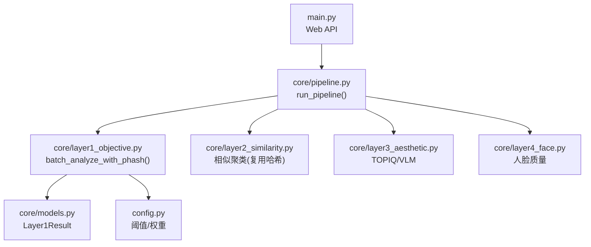
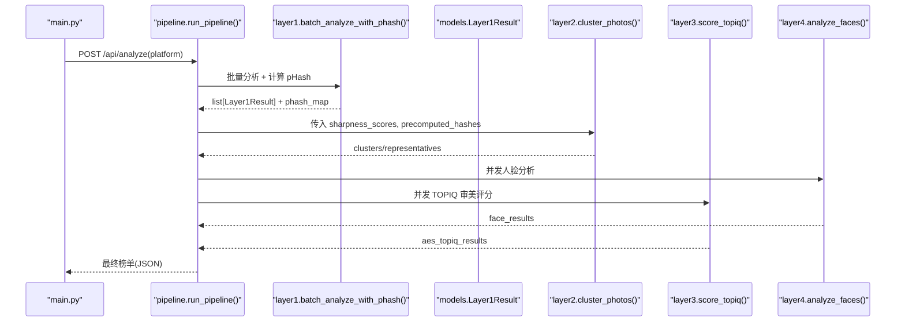
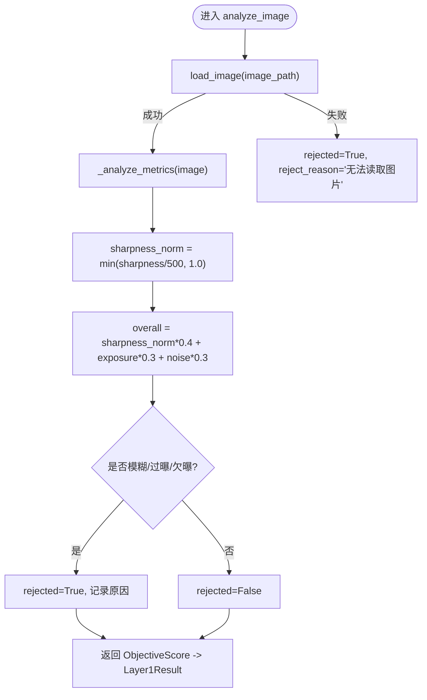
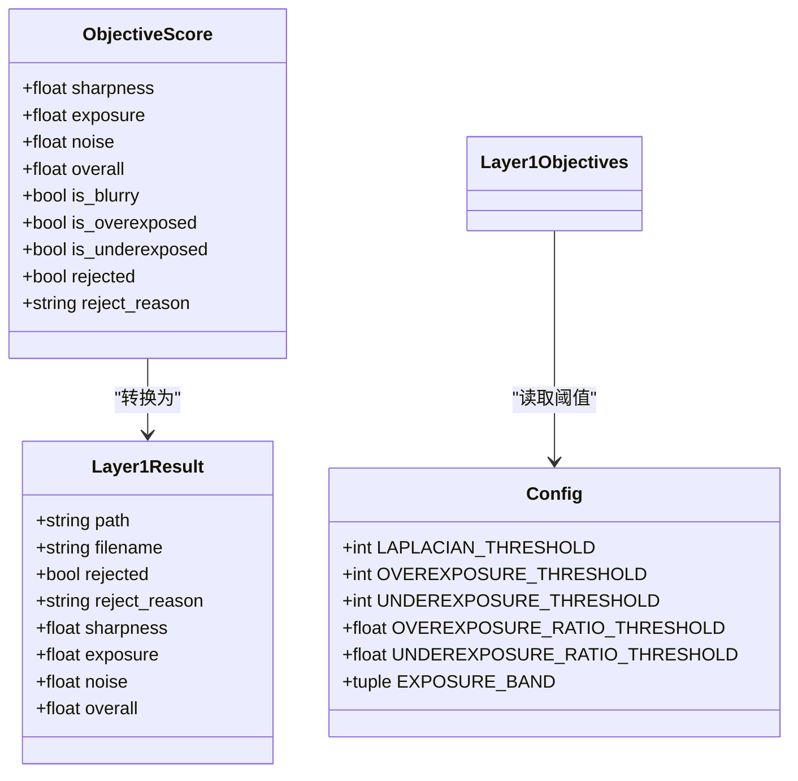

# 客观质量评估层

<cite>
**本文引用的文件**   
- [core/layer1_objective.py](file://core/layer1_objective.py)
- [config.py](file://config.py)
- [core/models.py](file://core/models.py)
- [core/pipeline.py](file://core/pipeline.py)
- [main.py](file://main.py)
</cite>

## 目录
1. [简介](#简介)
2. [项目结构](#项目结构)
3. [核心组件](#核心组件)
4. [架构总览](#架构总览)
5. [详细组件分析](#详细组件分析)
6. [依赖关系分析](#依赖关系分析)
7. [性能考量](#性能考量)
8. [故障排查指南](#故障排查指南)
9. [结论](#结论)
10. [附录：API 与使用示例](#附录api-与使用示例)

## 简介
本章节面向“客观质量评估层”（Layer 1），该层基于图像的物理属性进行质量评估，涵盖清晰度、曝光度、噪声水平等客观指标测量，并给出淘汰规则与综合评分。其输出将作为后续审美评分、人脸质量、相似度聚类与最终融合排名的基础输入之一。

## 项目结构
客观质量评估层位于 core/layer1_objective.py，通过配置项 config.py 控制阈值与权重，并通过 core/models.py 中的 Layer1Result 统一数据模型。流水线编排在 core/pipeline.py 中调用该层，Web 入口在 main.py 提供上传与分析接口。

图表来源
- [core/pipeline.py:165-276](file://core/pipeline.py#L165-L276)
- [core/layer1_objective.py:98-158](file://core/layer1_objective.py#L98-L158)
- [config.py:58-67](file://config.py#L58-L67)
- [core/models.py:13-23](file://core/models.py#L13-L23)

章节来源
- [core/layer1_objective.py:1-215](file://core/layer1_objective.py#L1-L215)
- [config.py:1-123](file://config.py#L1-L123)
- [core/models.py:1-123](file://core/models.py#L1-L123)
- [core/pipeline.py:165-276](file://core/pipeline.py#L165-L276)
- [main.py:336-379](file://main.py#L336-L379)

## 核心组件
- ObjectiveScore：内部评分数据结构，包含清晰度、曝光、噪声、总体分及淘汰标记与原因。
- load_image：图片加载器，支持 HEIC/HEIF 与常见格式，失败返回 None 并记录日志。
- _analyze_metrics：一次性计算清晰度、曝光、噪声三项指标，避免重复色彩空间转换。
- analyze_image：单张分析入口，归一化清晰度、计算加权总分、判定模糊/过曝/欠曝并生成淘汰原因。
- batch_analyze：多线程批量分析，返回 Layer1Result 列表。
- batch_analyze_with_phash：在 L1 流水阶段并行计算感知哈希，供 L2 聚类与多样性惩罚复用，减少重复计算。

章节来源
- [core/layer1_objective.py:33-44](file://core/layer1_objective.py#L33-L44)
- [core/layer1_objective.py:46-67](file://core/layer1_objective.py#L46-L67)
- [core/layer1_objective.py:70-96](file://core/layer1_objective.py#L70-L96)
- [core/layer1_objective.py:98-127](file://core/layer1_objective.py#L98-L127)
- [core/layer1_objective.py:129-158](file://core/layer1_objective.py#L129-L158)
- [core/layer1_objective.py:161-215](file://core/layer1_objective.py#L161-L215)

## 架构总览
客观质量评估层在整体流水线中的位置与职责如下：
- 输入：照片路径列表（支持 HEIC/HEIF）
- 处理：多线程并发 + 指标计算 + 淘汰判定 + 感知哈希（可选）
- 输出：Layer1Result 列表（含 sharpness/exposure/noise/overall/rejected/reject_reason）
- 下游：L2 相似度聚类、L3 审美评分、L4 人脸质量、最终融合排名

图表来源
- [main.py:336-379](file://main.py#L336-L379)
- [core/pipeline.py:165-276](file://core/pipeline.py#L165-L276)
- [core/layer1_objective.py:161-215](file://core/layer1_objective.py#L161-L215)
- [core/layer2_similarity.py:161-200](file://core/layer2_similarity.py#L161-L200)
- [core/layer3_aesthetic.py:130-200](file://core/layer3_aesthetic.py#L130-L200)
- [core/layer4_face.py:未在本节直接引用:1-200](file://core/layer4_face.py#L1-L200)

## 详细组件分析

### 指标测量算法
- 清晰度（sharpness）：拉普拉斯算子方差，反映边缘锐利程度。数值越大越清晰。
- 曝光（exposure）：基于灰度均值落入合理区间不扣分；超出区间按距离线性衰减，上限为 1.0。
- 噪声（noise）：以拉普拉斯图的标准差估计噪声强度，结合信号（均值亮度）计算信噪比，映射到 0-1 分数。
- 综合分（overall）：清晰度归一化后乘以权重 0.4，曝光 0.3，噪声 0.3，求和得到 0-1 分数。

图表来源
- [core/layer1_objective.py:98-127](file://core/layer1_objective.py#L98-L127)
- [core/layer1_objective.py:70-96](file://core/layer1_objective.py#L70-L96)

章节来源
- [core/layer1_objective.py:70-127](file://core/layer1_objective.py#L70-L127)

### 评分标准与权重分配机制
- 单项权重：清晰度 0.4、曝光 0.3、噪声 0.3（总和 1.0）。
- 归一化策略：清晰度采用固定阈值 500 做线性截断；曝光按区间与距离衰减；噪声按信噪比映射至 0-1。
- 淘汰阈值：
  - 模糊：拉普拉斯方差低于 LAPLACIAN_THRESHOLD
  - 过曝：高亮像素占比超过 OVEREXPOSURE_RATIO_THRESHOLD
  - 欠曝：低亮像素占比超过 UNDEREXPOSURE_RATIO_THRESHOLD
- 这些阈值均来源于 config.py，便于统一调参与环境覆盖。

章节来源
- [core/layer1_objective.py:106-126](file://core/layer1_objective.py#L106-L126)
- [config.py:58-67](file://config.py#L58-L67)

### 阈值设定与可调参数
- LAPLACIAN_THRESHOLD：清晰度阈值（默认 100）
- OVEREXPOSURE_THRESHOLD：过曝亮度阈值（默认 240）
- UNDEREXPOSURE_THRESHOLD：欠曝亮度阈值（默认 15）
- OVEREXPOSURE_RATIO_THRESHOLD：过曝像素占比阈值（默认 0.4）
- UNDEREXPOSURE_RATIO_THRESHOLD：欠曝像素占比阈值（默认 0.8）
- EXPOSURE_BAND：曝光评分的合理亮度区间（默认 (70, 180)）
- 可通过环境变量或修改 config.py 调整，实现不同场景下的灵敏度控制。

章节来源
- [config.py:58-67](file://config.py#L58-L67)

### 错误处理机制
- 图片加载失败：返回 rejected=True，reject_reason="无法读取图片"
- 分析异常：线程池捕获异常，记录日志并返回 rejected=True，reject_reason="分析异常"
- HEIC 支持：若未安装 pillow-heif，则提示警告并跳过 HEIC 解析

章节来源
- [core/layer1_objective.py:46-67](file://core/layer1_objective.py#L46-L67)
- [core/layer1_objective.py:151-158](file://core/layer1_objective.py#L151-L158)
- [core/layer1_objective.py:24-31](file://core/layer1_objective.py#L24-L31)

### 与其他层的集成与数据传递
- 与 L2（相似度聚类）：L1 在批处理时即计算感知哈希（phash_map），L2 可直接复用，避免重复计算大图哈希。
- 与 L3（审美评分）：L1 的 overall 作为“客观指标”维度参与最终融合评分（权重由 FUSION_WEIGHTS 控制）。
- 与 L4（人脸质量）：L1 不参与人脸判断，但淘汰结果影响后续流程候选集。
- Pipeline 整合：run_pipeline 在 L1 完成后保存 checkpoint，支持断点续传与跳过已完成步骤。

章节来源
- [core/pipeline.py:179-276](file://core/pipeline.py#L179-L276)
- [core/pipeline.py:455-514](file://core/pipeline.py#L455-L514)
- [core/layer1_objective.py:161-215](file://core/layer1_objective.py#L161-L215)

## 依赖关系分析
- 模块内依赖：
  - layer1_objective 依赖 config 中的阈值与权重
  - 依赖 models.Layer1Result 作为统一输出结构
  - 依赖 cv2/numpy/PIL 进行图像处理
- 跨层依赖：
  - pipeline 调用 layer1 并复用其 phash_map 给 layer2
  - 最终融合评分使用 FUSION_WEIGHTS 中的 objective 权重

图表来源
- [core/layer1_objective.py:33-44](file://core/layer1_objective.py#L33-L44)
- [core/models.py:13-23](file://core/models.py#L13-L23)
- [config.py:58-67](file://config.py#L58-L67)

章节来源
- [core/layer1_objective.py:1-215](file://core/layer1_objective.py#L1-L215)
- [core/models.py:1-123](file://core/models.py#L1-L123)
- [config.py:1-123](file://config.py#L1-L123)

## 性能考量
- 多线程批处理：使用 ThreadPoolExecutor 并发分析多张图片，提高吞吐。
- 共享灰度图：_analyze_metrics 仅一次 BGR→GRAY 转换，避免三次重复转换。
- 感知哈希提前计算：L1 流水阶段计算 phash，L2 直接使用，避免大图重复哈希（1-3秒/张）。
- 设备与解码缓存：底层依赖 image_cache 与 PIL/cv2 缓存，减少重复解码开销。
- 超时与容错：HEIC 缺失时降级处理；异常捕获保证批次稳定性。

章节来源
- [core/layer1_objective.py:129-158](file://core/layer1_objective.py#L129-L158)
- [core/layer1_objective.py:161-215](file://core/layer1_objective.py#L161-L215)
- [core/layer2_similarity.py:150-158](file://core/layer2_similarity.py#L150-L158)

## 故障排查指南
- 无法读取图片：检查路径与权限，确认 HEIC 支持已安装 pillow-heif。
- 分析异常：查看日志定位具体图片与异常信息，必要时降低并发数或重试。
- 阈值不合理导致误杀：调整 LAPLACIAN_THRESHOLD、OVEREXPOSURE_RATIO_THRESHOLD、UNDEREXPOSURE_RATIO_THRESHOLD 与 EXPOSURE_BAND。
- 性能瓶颈：增大 max_workers 或优化 I/O（如启用解码缓存、减少超大图尺寸）。

章节来源
- [core/layer1_objective.py:46-67](file://core/layer1_objective.py#L46-L67)
- [core/layer1_objective.py:151-158](file://core/layer1_objective.py#L151-L158)
- [config.py:58-67](file://config.py#L58-L67)

## 结论
客观质量评估层通过清晰的物理指标测量与合理的阈值/权重设计，为后续审美与融合评分提供了稳定可靠的客观基础。其在流水线中的关键作用包括：快速淘汰明显不合格图片、提供可复用的感知哈希、以及作为最终融合评分的一个维度。通过灵活调整配置参数，可在不同拍摄场景下获得更准确的评估结果。

## 附录：API 与使用示例

### 调用方式（Web API）
- 上传照片：POST /api/upload，支持 JPG/PNG/HEIC/HEIF 等，限制文件大小与 MIME 类型。
- 运行分析：POST /api/analyze?platform=xiaohongshu（或其他平台），触发完整流水线（包含 L1/L2/L3/L4）。
- 获取结果：GET /api/results/{platform}，返回照片榜与视频榜 JSON。

章节来源
- [main.py:111-162](file://main.py#L111-L162)
- [main.py:336-379](file://main.py#L336-L379)
- [main.py:278-303](file://main.py#L278-L303)

### 调用方式（Python SDK）
- 单张分析：调用 analyze_image(image_path)，返回 ObjectiveScore（内部结构）。
- 批量分析：调用 batch_analyze(image_paths, max_workers=4)，返回 list[Layer1Result]。
- 带哈希的批量分析：调用 batch_analyze_with_phash(image_paths, max_workers=4)，返回 (list[Layer1Result], phash_map)。

章节来源
- [core/layer1_objective.py:98-127](file://core/layer1_objective.py#L98-L127)
- [core/layer1_objective.py:129-158](file://core/layer1_objective.py#L129-L158)
- [core/layer1_objective.py:161-215](file://core/layer1_objective.py#L161-L215)

### 输入参数格式
- image_path：字符串或 Path 对象，指向本地图片路径（支持 .jpg/.jpeg/.png/.heic/.heif）。
- image_paths：字符串或 Path 对象的列表。
- max_workers：并发工作线程数（默认 4）。

章节来源
- [core/layer1_objective.py:98-127](file://core/layer1_objective.py#L98-L127)
- [core/layer1_objective.py:129-158](file://core/layer1_objective.py#L129-L158)

### 输出结果结构
- Layer1Result：
  - path：原始路径
  - filename：文件名
  - rejected：是否被淘汰
  - reject_reason：淘汰原因（模糊/过曝/欠曝/无法读取图片/分析异常）
  - sharpness：清晰度原始值
  - exposure：曝光得分（0-1）
  - noise：噪声得分（0-1）
  - overall：综合得分（0-1）

章节来源
- [core/models.py:13-23](file://core/models.py#L13-L23)

### 错误处理机制
- 加载失败：rejected=True，reject_reason="无法读取图片"
- 分析异常：rejected=True，reject_reason="分析异常"
- HEIC 不支持：记录警告并跳过 HEIC 文件

章节来源
- [core/layer1_objective.py:46-67](file://core/layer1_objective.py#L46-L67)
- [core/layer1_objective.py:151-158](file://core/layer1_objective.py#L151-L158)
- [core/layer1_objective.py:24-31](file://core/layer1_objective.py#L24-L31)

### 调整评估参数的建议
- 提升清晰度敏感度：降低 LAPLACIAN_THRESHOLD
- 放宽过曝/欠曝淘汰：提高 OVEREXPOSURE_RATIO_THRESHOLD 或 UNDEREXPOSURE_RATIO_THRESHOLD
- 调整曝光评分区间：修改 EXPOSURE_BAND，适应夜景/雪景等特殊场景
- 调节权重：如需强调某项指标，可在后续融合阶段调整 FUSION_WEIGHTS（objective 权重）

章节来源
- [config.py:58-67](file://config.py#L58-L67)
- [core/pipeline.py:455-514](file://core/pipeline.py#L455-L514)