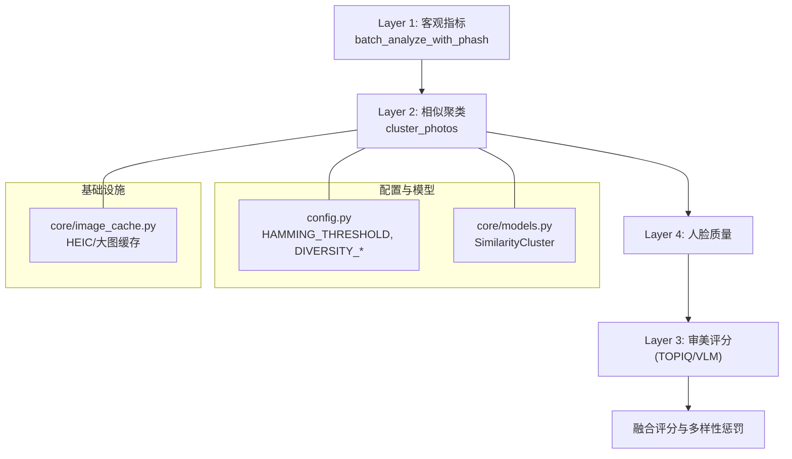
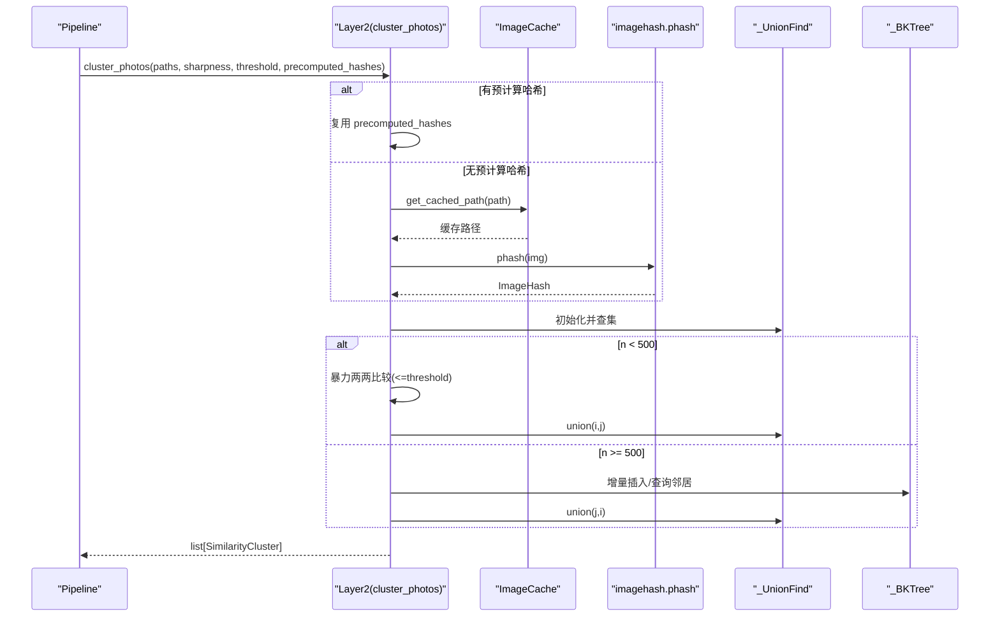
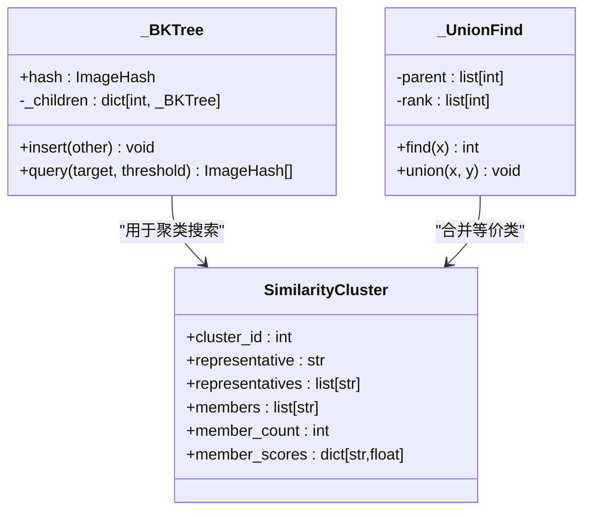
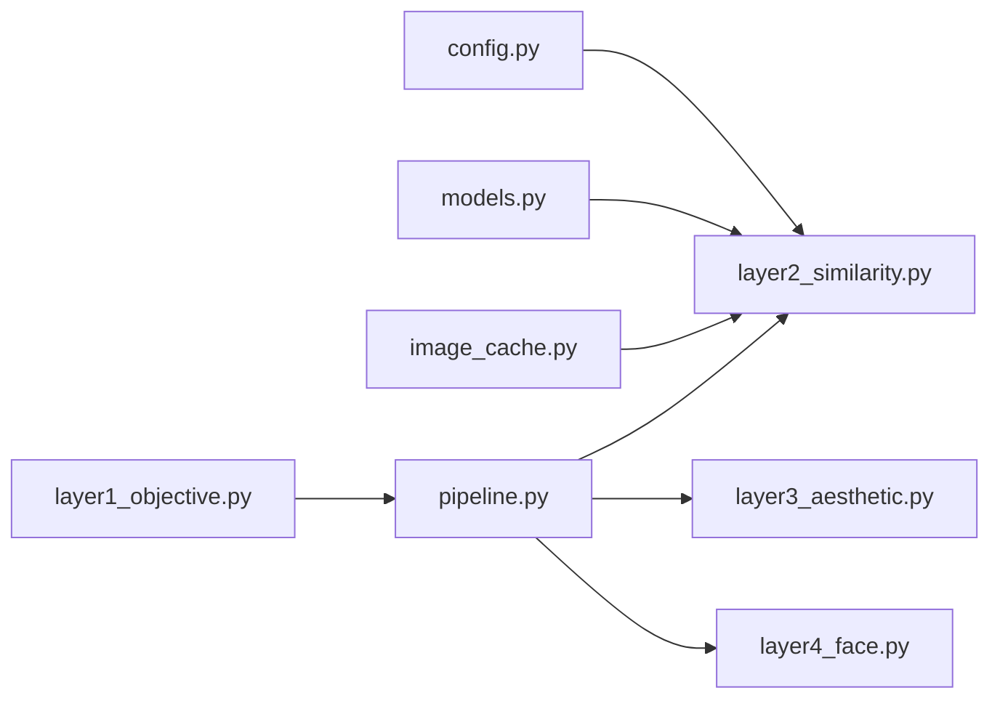
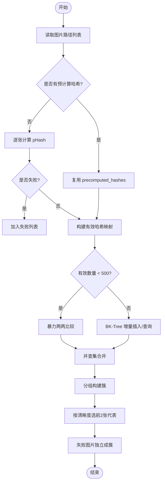

# 相似度分析层

<cite>
**本文引用的文件**   
- [core/layer2_similarity.py](file://core/layer2_similarity.py)
- [core/pipeline.py](file://core/pipeline.py)
- [config.py](file://config.py)
- [core/models.py](file://core/models.py)
- [core/image_cache.py](file://core/image_cache.py)
- [main.py](file://main.py)
</cite>

## 目录
1. [简介](#简介)
2. [项目结构](#项目结构)
3. [核心组件](#核心组件)
4. [架构总览](#架构总览)
5. [详细组件分析](#详细组件分析)
6. [依赖关系分析](#依赖关系分析)
7. [性能考量](#性能考量)
8. [故障排查指南](#故障排查指南)
9. [结论](#结论)
10. [附录：API 参考与使用示例](#附录api-参考与使用示例)

## 简介
本章节面向“相似度分析层”（Layer 2），系统性说明图像相似度的计算原理、算法实现、输入输出、参数配置以及与整体评估流水线的集成方式。该层基于感知哈希（pHash）+ BK-Tree + 并查集，对照片进行高效聚类，剔除重复或高度相似的连拍帧，并为后续审美评分提供代表性候选。

## 项目结构
相似度分析层位于 core/layer2_similarity.py，通过 pipeline.py 在完整流水线中被调用；其阈值与权重由 config.py 统一配置；数据模型定义在 core/models.py；解码缓存由 core/image_cache.py 提供加速；Web API 入口在 main.py。

图表来源
- [core/pipeline.py:281-306](file://core/pipeline.py#L281-L306)
- [core/layer2_similarity.py:161-245](file://core/layer2_similarity.py#L161-L245)
- [config.py:69-81](file://config.py#L69-L81)
- [core/models.py:25-34](file://core/models.py#L25-L34)
- [core/image_cache.py:51-99](file://core/image_cache.py#L51-L99)

章节来源
- [core/pipeline.py:281-306](file://core/pipeline.py#L281-L306)
- [config.py:69-81](file://config.py#L69-L81)

## 核心组件
- 感知哈希计算：compute_phash(image_path) → ImageHash | None
- 聚类主函数：cluster_photos(image_paths, sharpness_scores, threshold=HAMMING_THRESHOLD, precomputed_hashes=None) → list[SimilarityCluster]
- 数据结构：_BKTree（汉明距离空间近邻搜索）、_UnionFind（并查集）
- 结果模型：SimilarityCluster（簇 ID、代表图、成员列表、成员清晰度分等）

章节来源
- [core/layer2_similarity.py:150-158](file://core/layer2_similarity.py#L150-L158)
- [core/layer2_similarity.py:161-245](file://core/layer2_similarity.py#L161-L245)
- [core/models.py:25-34](file://core/models.py#L25-L34)

## 架构总览
相似度分析层在流水线中的位置与职责：
- 接收 Layer 1 输出的保留图片及其清晰度分数，以及可选的预计算 pHash 映射。
- 根据汉明距离阈值将相似图片归入同一簇，失败或无法计算哈希的图片自成单元素簇。
- 每个簇按清晰度排序，选取前 2 张作为代表进入后续审美层（避免仅留一张导致多样性不足）。
- 最终返回 SimilarityCluster 列表，供上层进行多样性惩罚与融合评分。

图表来源
- [core/layer2_similarity.py:161-245](file://core/layer2_similarity.py#L161-L245)
- [core/image_cache.py:51-99](file://core/image_cache.py#L51-L99)

## 详细组件分析

### 感知哈希与距离度量
- 特征提取：使用 imagehash.phash 生成感知哈希，对亮度/对比度变化鲁棒，适合去重与相似性判断。
- 距离度量：汉明距离（int(hash1 - hash2)），阈值 HAMMING_THRESHOLD 默认 20。
- 支持格式：通过 PIL 解码，结合 HEIC 支持（pillow-heif），并通过解码缓存避免重复解码 HEIC/超大图。

章节来源
- [core/layer2_similarity.py:150-158](file://core/layer2_similarity.py#L150-L158)
- [config.py:69-71](file://config.py#L69-L71)
- [core/image_cache.py:51-99](file://core/image_cache.py#L51-L99)

### 聚类算法：BK-Tree + 并查集
- BK-Tree：在汉明距离空间构建索引，范围查询 O(log n) 均摊，利用三角不等式剪枝。
- 并查集：维护等价类，合并相似图片索引，查找/合并近似 O(α(n))。
- 小数据集回退：当有效图片数小于 500 时，采用 O(n²) 暴力比较，常数开销更低。

图表来源
- [core/layer2_similarity.py:29-81](file://core/layer2_similarity.py#L29-L81)
- [core/layer2_similarity.py:128-148](file://core/layer2_similarity.py#L128-L148)
- [core/models.py:25-34](file://core/models.py#L25-L34)

章节来源
- [core/layer2_similarity.py:29-81](file://core/layer2_similarity.py#L29-L81)
- [core/layer2_similarity.py:128-148](file://core/layer2_similarity.py#L128-L148)

### 预处理与后处理
- 预处理：
  - 解码缓存：HEIC/超大图首次解码转存 JPEG（长边上限 4096），后续直接读缓存，显著降低重复解码成本。
  - 灰度转换与 RGB 标准化：phash 内部处理，外部仅需确保可被 PIL 打开。
- 后处理：
  - 失败哈希：无法计算的图片单独成簇，避免阻塞流水线。
  - 代表选择：每簇按清晰度降序取前 2 张作为代表，提升多样性与后续评分竞争力。

章节来源
- [core/image_cache.py:51-99](file://core/image_cache.py#L51-L99)
- [core/layer2_similarity.py:213-245](file://core/layer2_similarity.py#L213-L245)

### 支持的图像类型
- 支持扩展名：jpg、jpeg、png、heic、heif（需 pillow-heif 支持）。
- 解码策略：优先 cv2，失败回退 PIL；HEIC 通过 pillow-heif 注册。

章节来源
- [core/layer1_objective.py:23-31](file://core/layer1_objective.py#L23-L31)
- [core/image_cache.py:34-42](file://core/image_cache.py#L34-L42)

### 与整体评估系统的集成
- 流水线调用：pipeline.run_pipeline 在 L1 阶段即计算 pHash，L2 直接复用，避免重复计算。
- 多样性惩罚：在融合评分阶段，对 pHash 汉明距离低于阈值的相邻排名图片施加比例扣分，防止同场景多图占据名额。
- 权重与平台：FUSION_WEIGHTS 与 PLATFORMS 配置影响最终排序，但 L2 本身不依赖这些权重。

章节来源
- [core/pipeline.py:243-306](file://core/pipeline.py#L243-L306)
- [core/pipeline.py:465-500](file://core/pipeline.py#L465-L500)
- [config.py:99-108](file://config.py#L99-L108)

## 依赖关系分析
- 模块内依赖：
  - layer2_similarity 依赖 config.HAMMING_THRESHOLD、core.models.SimilarityCluster、core.image_cache.get_cached_path。
- 跨层依赖：
  - pipeline 调用 layer2_similarity.cluster_photos，并传入 L1 阶段的 phash_map。
  - 多样性惩罚阶段再次使用 pHash 进行相似度判定。

图表来源
- [core/layer2_similarity.py:11-13](file://core/layer2_similarity.py#L11-L13)
- [core/pipeline.py:179-181](file://core/pipeline.py#L179-L181)

章节来源
- [core/layer2_similarity.py:11-13](file://core/layer2_similarity.py#L11-L13)
- [core/pipeline.py:179-181](file://core/pipeline.py#L179-L181)

## 性能考量
- 时间复杂度：
  - 小数据集（n < 500）：O(n²) 暴力比较，常数低，实际更快。
  - 大数据集（n ≥ 500）：BK-Tree 插入/查询均摊 O(log n)，总体接近 O(n log n)。
  - 并查集操作近似 O(α(n))。
- 空间复杂度：
  - BK-Tree 节点存储哈希与子树指针，内存随 n 线性增长。
  - 并查集 parent/rank 数组 O(n)。
- I/O 优化：
  - 解码缓存避免重复解码 HEIC/大图，减少 CPU 与磁盘 IO。
  - 预计算哈希复用，避免 L2 重复计算。
- 并发与线程池：
  - L1/L3/L4 使用线程池并行，L2 为纯计算逻辑，串行即可保证正确性与稳定性。

章节来源
- [core/layer2_similarity.py:17-18](file://core/layer2_similarity.py#L17-L18)
- [core/layer2_similarity.py:197-203](file://core/layer2_similarity.py#L197-L203)
- [core/image_cache.py:101-118](file://core/image_cache.py#L101-L118)

## 故障排查指南
- 哈希计算失败：
  - 现象：某张图片无法计算 pHash，日志记录警告，该图片独立成簇。
  - 排查：确认文件可读、格式受支持、解码缓存未损坏。
- 聚类异常：
  - 现象：相似图片未被合并或过度合并。
  - 调整：修改 HAMMING_THRESHOLD（默认 20），增大更严格，减小更宽松。
- 性能瓶颈：
  - 现象：大量大图导致解码慢。
  - 解决：启用解码缓存，清理过期缓存（clean_image_cache），必要时提高 CACHE_MAX_SIDE。
- 流水线中断恢复：
  - 现象：中途失败后需要续跑。
  - 解决：pipeline 支持 checkpoint 断点续传，L2 可从已保存 clusters 恢复。

章节来源
- [core/layer2_similarity.py:156-158](file://core/layer2_similarity.py#L156-L158)
- [core/layer2_similarity.py:231-245](file://core/layer2_similarity.py#L231-L245)
- [core/image_cache.py:101-118](file://core/image_cache.py#L101-L118)
- [core/pipeline.py:114-163](file://core/pipeline.py#L114-L163)

## 结论
相似度分析层以感知哈希为核心，结合 BK-Tree 与并查集，实现了高效、可扩展的照片去重与聚类。通过解码缓存与预计算哈希复用，显著降低 I/O 与计算开销；通过双代表策略与多样性惩罚，保障最终榜单的多样性与美观度。该层与流水线紧密集成，具备良好的容错与可恢复能力。

## 附录：API 参考与使用示例

### API 参考
- compute_phash(image_path: str | Path) -> imagehash.ImageHash | None
  - 功能：计算感知哈希，失败返回 None。
  - 输入：图片路径（支持 jpg/png/heic/heif）。
  - 输出：ImageHash 对象或 None。
  - 依赖：core.image_cache.get_cached_path。
  - 章节来源
    - [core/layer2_similarity.py:150-158](file://core/layer2_similarity.py#L150-L158)

- cluster_photos(image_paths: list[str | Path], sharpness_scores: dict[str, float], threshold: int = HAMMING_THRESHOLD, precomputed_hashes: dict[str, imagehash.ImageHash] | None = None) -> list[SimilarityCluster]
  - 功能：将相似照片聚类，返回簇列表。
  - 输入：
    - image_paths：待聚类的图片路径列表。
    - sharpness_scores：path -> 清晰度分数（用于代表选择）。
    - threshold：汉明距离阈值（默认 20）。
    - precomputed_hashes：可选的预计算哈希映射（来自 L1 阶段）。
  - 输出：list[SimilarityCluster]，包含 cluster_id、representative、representatives、members、member_count、member_scores。
  - 行为：
    - 小数据集（n < 500）：暴力两两比较。
    - 大数据集（n ≥ 500）：BK-Tree 范围查询。
    - 失败哈希：独立成簇。
    - 代表选择：每簇按清晰度取前 2 张。
  - 章节来源
    - [core/layer2_similarity.py:161-245](file://core/layer2_similarity.py#L161-L245)
    - [core/models.py:25-34](file://core/models.py#L25-L34)

### 使用场景与示例（代码片段路径）
- 批量比较（直接使用 cluster_photos）：
  - 参考路径：[core/layer2_similarity.py:161-245](file://core/layer2_similarity.py#L161-L245)
- 阈值设置（HAMMING_THRESHOLD）：
  - 参考路径：[config.py:69-71](file://config.py#L69-L71)
- 结果过滤（按 member_count > 1 筛选相似簇）：
  - 参考路径：[core/pipeline.py:281-306](file://core/pipeline.py#L281-L306)
- 与流水线集成（复用 L1 的 phash_map）：
  - 参考路径：[core/pipeline.py:243-306](file://core/pipeline.py#L243-L306)
- Web API 触发分析（POST /api/analyze）：
  - 参考路径：[main.py:336-379](file://main.py#L336-L379)

### 流程图：相似度聚类决策

图表来源
- [core/layer2_similarity.py:161-245](file://core/layer2_similarity.py#L161-L245)