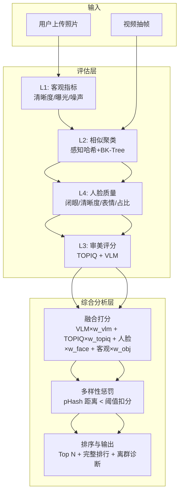
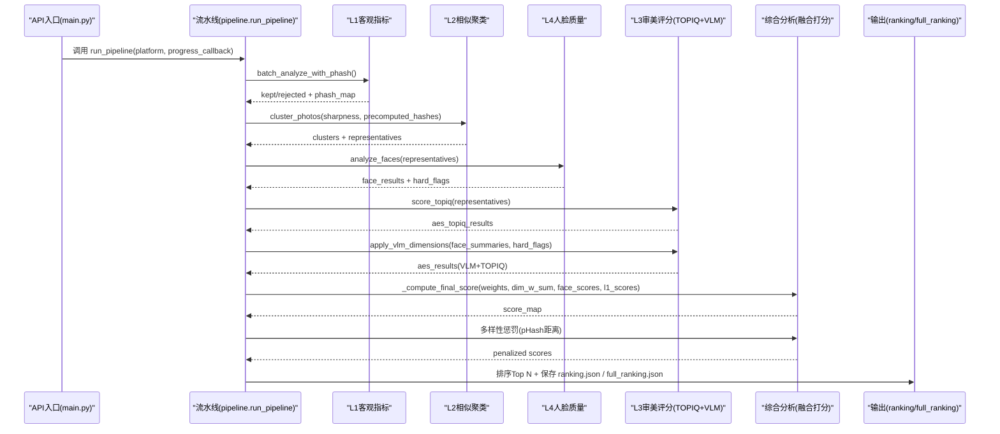
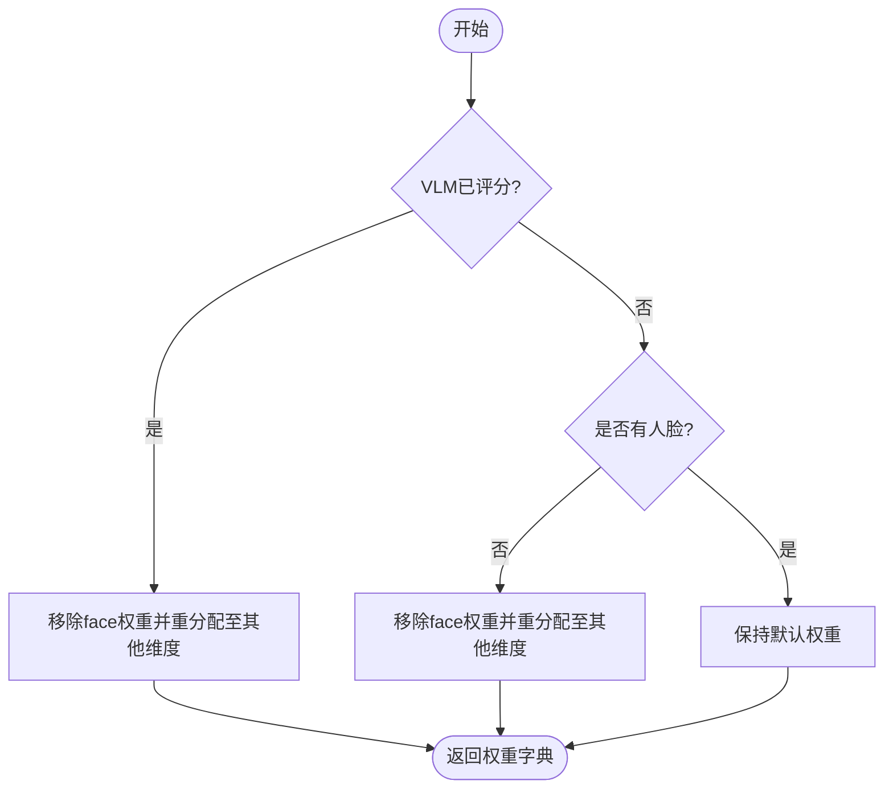
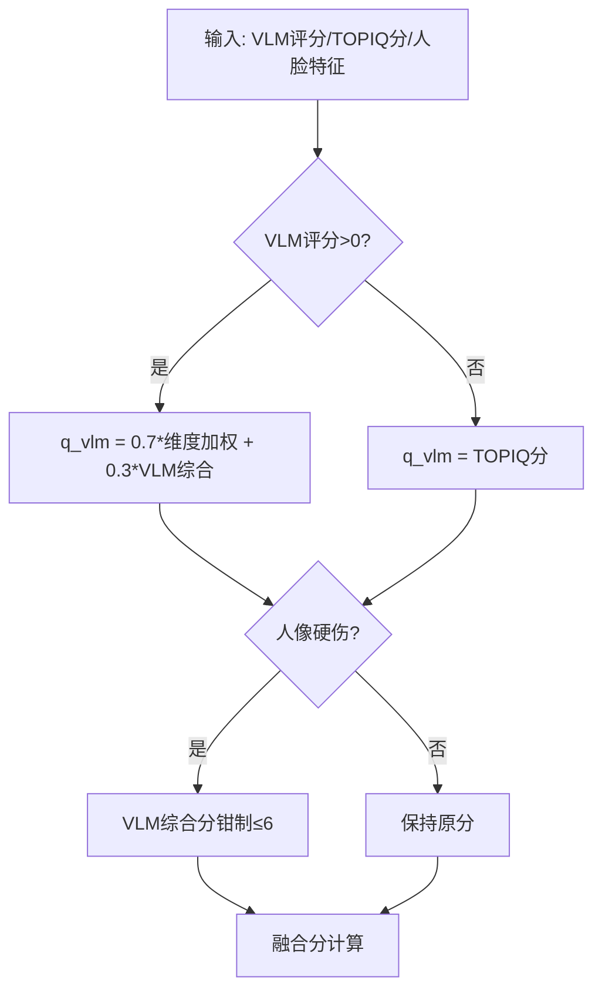
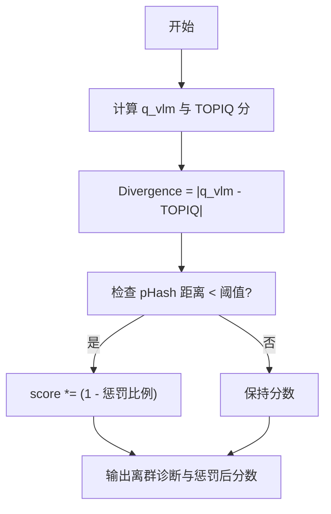
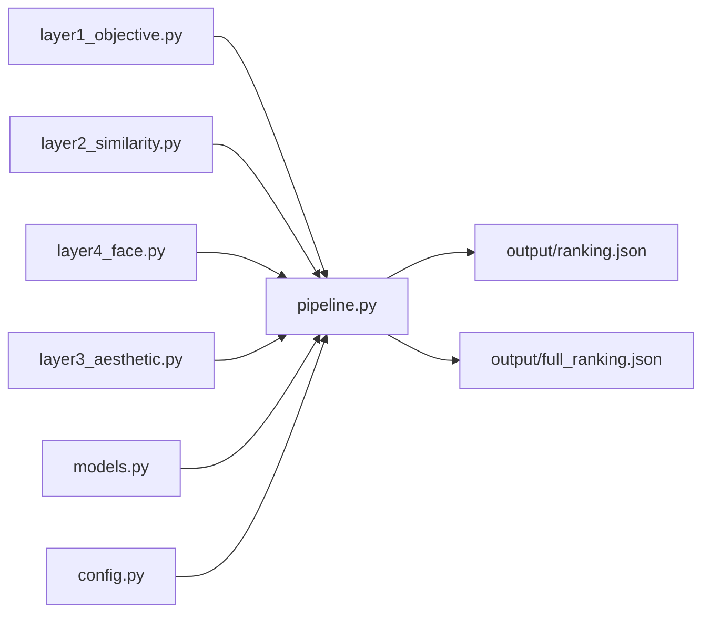

# 综合分析层

<cite>
**本文引用的文件**   
- [pipeline.py](file://core/pipeline.py)
- [config.py](file://config.py)
- [layer1_objective.py](file://core/layer1_objective.py)
- [layer2_similarity.py](file://core/layer2_similarity.py)
- [layer3_aesthetic.py](file://core/layer3_aesthetic.py)
- [layer4_face.py](file://core/layer4_face.py)
- [models.py](file://core/models.py)
- [main.py](file://main.py)
</cite>

## 目录
1. [简介](#简介)
2. [项目结构](#项目结构)
3. [核心组件](#核心组件)
4. [架构总览](#架构总览)
5. [详细组件分析](#详细组件分析)
6. [依赖关系分析](#依赖关系分析)
7. [性能考量](#性能考量)
8. [故障排查指南](#故障排查指南)
9. [结论](#结论)
10. [附录：配置与使用示例](#附录配置与使用示例)

## 简介
综合分析层负责将来自四个评估层的输出进行多源信息融合，生成最终评分与排序。其核心职责包括：
- 权重分配策略：按平台维度权重（构图/色彩/光影）与综合融合权重（VLM/TOPIQ/人脸/客观指标）动态计算每张照片的有效分。
- 冲突解决机制：当 VLM 未评分或失败时回退到 TOPIQ；对“人像硬伤”进行程序化钳制，避免 LLM 主观偏差导致高分异常。
- 置信度计算：通过 VLM 与 TOPIQ 的离群诊断差值、多样性惩罚、以及各层中间结果的可信度标记辅助解释。
- 可配置性：支持通过配置文件为不同平台自定义维度权重与融合权重，并提供运行时参数控制重跑与增量更新。
- 可解释性与可视化：输出完整排行与离群诊断字段，便于前端展示与人工复核。

## 项目结构
综合分析层位于流水线核心模块中，贯穿四层评估并产出最终排名。关键文件与职责如下：
- core/pipeline.py：整合 L1/L2/L3/L4 结果，执行融合打分、多样性惩罚、Top N 选择与结果持久化。
- config.py：平台维度权重、融合权重、阈值与运行参数集中管理。
- core/layer1_objective.py：客观指标（清晰度/曝光/噪声），提供 phash 预计算以复用。
- core/layer2_similarity.py：相似聚类（感知哈希 + BK-Tree + 并查集），减少重复候选。
- core/layer3_aesthetic.py：审美评分（TOPIQ 客观审美 + VLM 多维度专业评分），含批次归一化与硬伤钳制。
- core/layer4_face.py：人脸质量（闭眼/清晰度/表情/占比等），为 VLM 注入提示与融合打分提供信号。
- core/models.py：统一数据模型（Layer1/2/3/4/Final/PipelineResult 等）。
- main.py：Web API 入口，触发分析与结果获取。

图表来源
- [pipeline.py:165-609](file://core/pipeline.py#L165-L609)
- [layer1_objective.py:161-215](file://core/layer1_objective.py#L161-L215)
- [layer2_similarity.py:161-245](file://core/layer2_similarity.py#L161-L245)
- [layer3_aesthetic.py:130-328](file://core/layer3_aesthetic.py#L130-L328)
- [layer4_face.py:198-232](file://core/layer4_face.py#L198-L232)

章节来源
- [pipeline.py:165-609](file://core/pipeline.py#L165-L609)
- [config.py:22-108](file://config.py#L22-L108)

## 核心组件
综合分析层的关键函数与流程：
- _effective_weights：根据是否有人脸与是否 VLM 已评分，动态调整融合权重，避免人脸被双重计数。
- _compute_final_score：计算融合综合分（0-10），包含 VLM 有效分、TOPIQ 分、人脸分、客观指标分。
- 多样性惩罚：基于 pHash 汉明距离对相似照片施加比例扣分，提升榜单多样性。
- 断点续传与增量重跑：checkpoint 保存中间结果，支持指定层重跑并自动传播依赖。

章节来源
- [pipeline.py:33-112](file://core/pipeline.py#L33-L112)
- [pipeline.py:471-531](file://core/pipeline.py#L471-L531)
- [pipeline.py:114-163](file://core/pipeline.py#L114-L163)

## 架构总览
综合分析层在流水线中的位置与交互：
- 输入：L1 保留集合、L2 代表照片、L4 人脸结果、L3 TOPIQ/VLM 评分。
- 处理：计算融合权重、融合分、多样性惩罚、排序与 Top N 选择。
- 输出：ranking.json（Top N）、full_ranking.json（完整排行含离群诊断）、复制展示图片。

图表来源
- [main.py:336-379](file://main.py#L336-L379)
- [pipeline.py:165-609](file://core/pipeline.py#L165-L609)
- [layer1_objective.py:161-215](file://core/layer1_objective.py#L161-L215)
- [layer2_similarity.py:161-245](file://core/layer2_similarity.py#L161-L245)
- [layer3_aesthetic.py:269-328](file://core/layer3_aesthetic.py#L269-L328)
- [layer4_face.py:198-232](file://core/layer4_face.py#L198-L232)

## 详细组件分析

### 权重分配策略
- 平台维度权重：每个平台（如小红书、朋友圈、抖音）定义构图/色彩/光影/人脸的权重，用于计算 VLM 多维度的加权分。
- 融合权重：全局 FUSION_WEIGHTS 定义 VLM/TOPIQ/人脸/客观指标的权重总和为 1.0。
- 动态调整：_effective_weights 根据 has_face 与 has_vlm 调整权重，避免人脸被双重计数或无人脸照片吃亏。

图表来源
- [pipeline.py:33-54](file://core/pipeline.py#L33-L54)
- [config.py:22-56](file://config.py#L22-L56)
- [config.py:99-108](file://config.py#L99-L108)

章节来源
- [pipeline.py:33-54](file://core/pipeline.py#L33-L54)
- [config.py:22-56](file://config.py#L22-L56)
- [config.py:99-108](file://config.py#L99-L108)

### 冲突解决机制
- VLM 未评分降级：q_vlm 回退为 TOPIQ 分，保证仍可排序。
- 人像硬伤钳制：主脸闭眼或明显模糊时，VLM 综合审美上限 6 分，防止 LLM 主观偏差。
- 多人环境场景：≥6 张脸且主脸占比 < 10% 视为环境元素，不参与加分。

图表来源
- [pipeline.py:92-112](file://core/pipeline.py#L92-L112)
- [layer3_aesthetic.py:242-267](file://core/layer3_aesthetic.py#L242-L267)
- [layer4_face.py:198-232](file://core/layer4_face.py#L198-L232)

章节来源
- [pipeline.py:92-112](file://core/pipeline.py#L92-L112)
- [layer3_aesthetic.py:242-267](file://core/layer3_aesthetic.py#L242-L267)
- [layer4_face.py:198-232](file://core/layer4_face.py#L198-L232)

### 置信度计算方法
- 离群诊断：vlm_topiq_divergence = |q_vlm - TOPIQ分|，用于识别 VLM 与 TOPIQ 严重分歧的照片。
- 多样性惩罚：对 pHash 距离小于阈值的相似照片施加比例扣分，降低重复内容入选概率。
- 中间结果可信度：skipped_layers 记录失败的层，便于诊断与重试。

图表来源
- [pipeline.py:84-90](file://core/pipeline.py#L84-L90)
- [pipeline.py:495-516](file://core/pipeline.py#L495-L516)
- [config.py:77-81](file://config.py#L77-L81)

章节来源
- [pipeline.py:84-90](file://core/pipeline.py#L84-L90)
- [pipeline.py:495-516](file://core/pipeline.py#L495-L516)
- [config.py:77-81](file://config.py#L77-L81)

### 配置接口说明
- 平台维度权重：PLATFORMS 中每个平台定义 composition/color/lighting/face 权重。
- 融合权重：FUSION_WEIGHTS 定义 vlm/topiq/face/objective 权重，总和为 1.0。
- 多样性阈值：DIVERSITY_DISTANCE_THRESHOLD 与 DIVERSITY_PENALTY 控制相似度惩罚。
- 环境变量：QWEN_API_KEY、QWEN_BASE_URL、QWEN_MODEL 控制 VLM 调用。

章节来源
- [config.py:22-56](file://config.py#L22-L56)
- [config.py:99-108](file://config.py#L99-L108)
- [config.py:77-81](file://config.py#L77-L81)
- [config.py:110-118](file://config.py#L110-L118)

### 实际使用示例
- 调用综合分析：通过 API 触发 run_pipeline，支持进度回调与增量重跑。
- 调整融合策略：修改 config.py 中的 PLATFORMS 与 FUSION_WEIGHTS，或传入 rerun_layers 指定层重跑。
- 查看结果：GET /api/results/{platform} 获取 ranking.json 与 video_ranking.json。

章节来源
- [main.py:336-379](file://main.py#L336-L379)
- [pipeline.py:165-231](file://core/pipeline.py#L165-L231)
- [main.py:278-303](file://main.py#L278-L303)

### 结果的可解释性与可视化选项
- 完整排行：full_ranking.json 包含所有照片的融合分、VLM/TOPIQ 分、离群诊断、分类标签。
- 理由与硬伤：score_reason 与 hard_flaws 提供 VLM 评分理由与自报硬伤。
- 前端展示：ranking.json 仅 Top N，filename 为序号名，便于直接访问图片。

章节来源
- [pipeline.py:556-578](file://core/pipeline.py#L556-L578)
- [layer3_aesthetic.py:242-267](file://core/layer3_aesthetic.py#L242-L267)
- [pipeline.py:581-590](file://core/pipeline.py#L581-L590)

### 与其他组件的数据交互模式
- 与 L1/L2/L3/L4：通过 models.py 定义的 Pydantic 模型传递结构化数据。
- 与 Web API：main.py 暴露 REST 接口，接收上传、触发分析、返回结果。
- 与文件系统：checkpoint.json 保存中间状态，ranking.json/full_ranking.json 输出结果。

章节来源
- [models.py:13-123](file://core/models.py#L13-L123)
- [main.py:111-162](file://main.py#L111-L162)
- [pipeline.py:114-163](file://core/pipeline.py#L114-L163)

## 依赖关系分析
综合分析层依赖各评估层的结果，并通过 pipeline.py 协调。关键依赖关系如下：

图表来源
- [pipeline.py:165-609](file://core/pipeline.py#L165-L609)
- [models.py:13-123](file://core/models.py#L13-L123)
- [config.py:22-108](file://config.py#L22-L108)

章节来源
- [pipeline.py:165-609](file://core/pipeline.py#L165-L609)
- [models.py:13-123](file://core/models.py#L13-L123)
- [config.py:22-108](file://config.py#L22-L108)

## 性能考量
- 并发优化：L4 与 L3-TOPIQ 并行执行，VLM 独立线程池（8 并发）实现图片级流水。
- 缓存复用：TOPIQ 模型模块级缓存、phash_map 复用、image_cache 解码缓存。
- 批量归一化：TOPIQ 与 VLM 综合分均进行 p5-p95 拉伸，提升区分度与稳定性。
- 内存管理：显存紧张时可主动释放 TOPIQ 模型缓存。

章节来源
- [pipeline.py:324-385](file://core/pipeline.py#L324-L385)
- [layer3_aesthetic.py:27-52](file://core/layer3_aesthetic.py#L27-L52)
- [layer3_aesthetic.py:445-463](file://core/layer3_aesthetic.py#L445-L463)

## 故障排查指南
- VLM 未评分：检查 QWEN_API_KEY 是否设置，确认网络连通与模型可用。
- 人脸分析失败：MediaPipe 模型下载失败或初始化错误，检查缓存路径与权限。
- 多样性惩罚异常：确认 pHash 计算成功，检查 DIVERSITY_DISTANCE_THRESHOLD 与 DIVERSITY_PENALTY 配置。
- 增量重跑无效：确保 checkpoint 存在且版本兼容，检查 skipped_layers 记录。

章节来源
- [layer3_aesthetic.py:371-387](file://core/layer3_aesthetic.py#L371-L387)
- [layer4_face.py:48-85](file://core/layer4_face.py#L48-L85)
- [pipeline.py:114-163](file://core/pipeline.py#L114-L163)

## 结论
综合分析层通过多源信息融合算法，将 L1/L2/L3/L4 的结果整合为最终评分，具备灵活的权重配置、健壮的冲突解决机制与可解释的输出。其设计兼顾性能与可扩展性，适用于多平台、多场景的照片评选需求。

## 附录：配置与使用示例

### 配置接口
- 平台维度权重：编辑 config.py 中 PLATFORMS 字典，调整 composition/color/lighting/face 权重。
- 融合权重：修改 FUSION_WEIGHTS 字典，确保总和为 1.0。
- 多样性阈值：调整 DIVERSITY_DISTANCE_THRESHOLD 与 DIVERSITY_PENALTY。
- 环境变量：设置 QWEN_API_KEY、QWEN_BASE_URL、QWEN_MODEL。

章节来源
- [config.py:22-56](file://config.py#L22-L56)
- [config.py:99-108](file://config.py#L99-L108)
- [config.py:77-81](file://config.py#L77-L81)
- [config.py:110-118](file://config.py#L110-L118)

### 使用示例
- 调用综合分析：POST /api/analyze?platform=xiaohongshu，支持进度回调与增量重跑。
- 调整融合策略：修改 config.py 后重启服务，或通过 rerun_layers 指定层重跑。
- 查看结果：GET /api/results/xiaohongshu 获取 ranking.json 与 video_ranking.json。

章节来源
- [main.py:336-379](file://main.py#L336-L379)
- [pipeline.py:165-231](file://core/pipeline.py#L165-L231)
- [main.py:278-303](file://main.py#L278-L303)