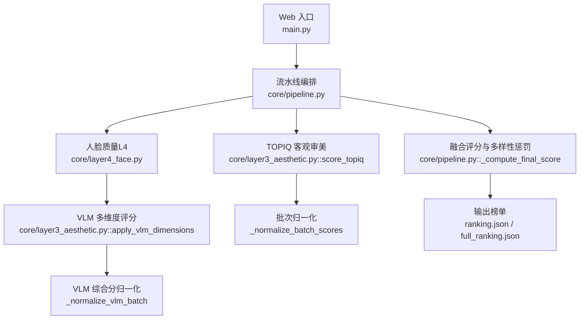
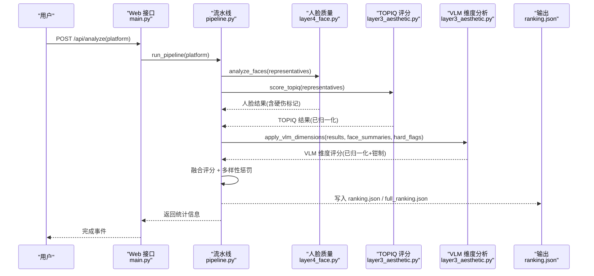
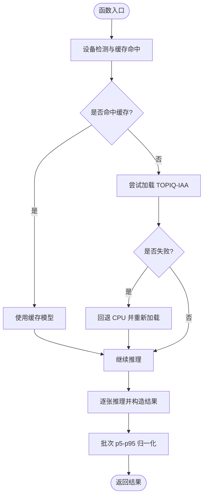
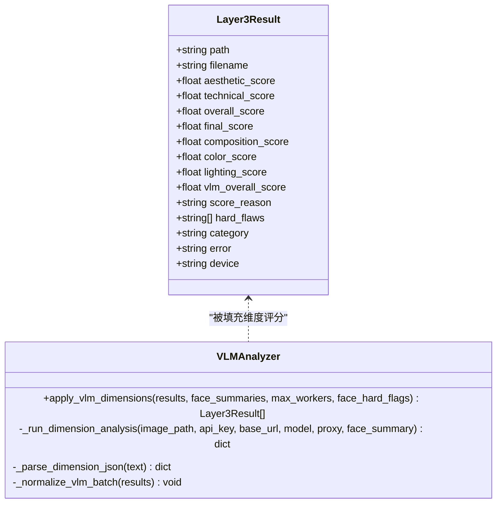
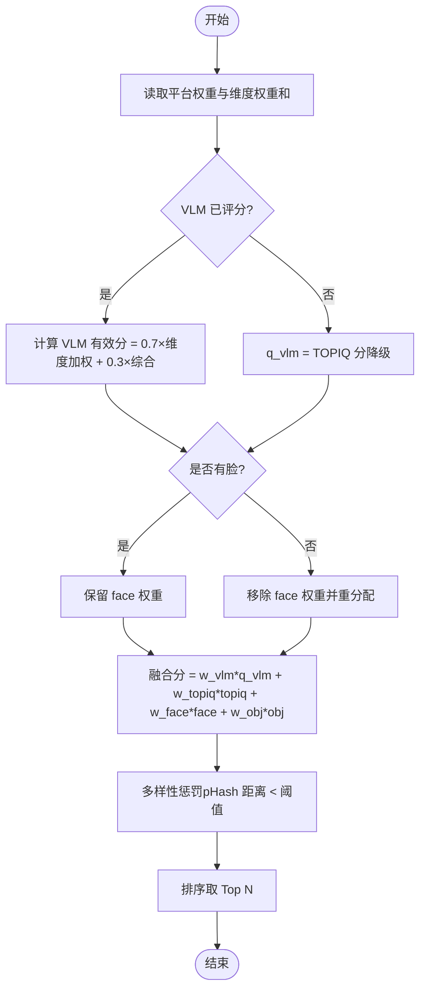
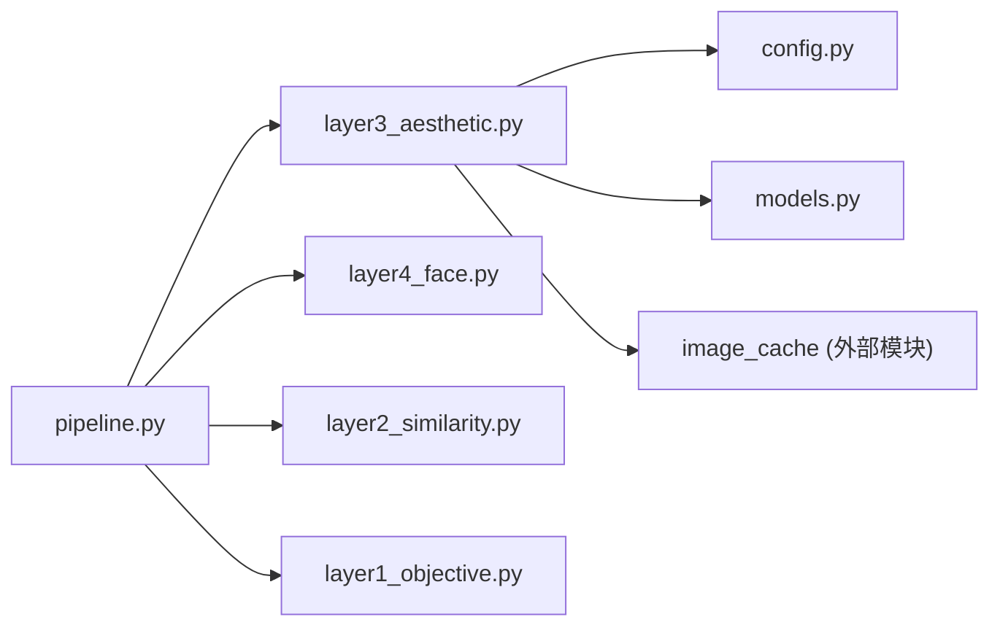

# 美学评分层

<cite>
**本文引用的文件**   
- [core/layer3_aesthetic.py](file://core/layer3_aesthetic.py)
- [config.py](file://config.py)
- [core/pipeline.py](file://core/pipeline.py)
- [core/models.py](file://core/models.py)
- [main.py](file://main.py)
- [docs/research/photo-aesthetic-research-report.md](file://docs/research/photo-aesthetic-research-report.md)
- [docs/research/photo_aesthetic_models_research.md](file://docs/research/photo_aesthetic_models_research.md)
</cite>

## 目录
1. [引言](#引言)
2. [项目结构](#项目结构)
3. [核心组件](#核心组件)
4. [架构总览](#架构总览)
5. [详细组件分析](#详细组件分析)
6. [依赖关系分析](#依赖关系分析)
7. [性能考量](#性能考量)
8. [故障排查指南](#故障排查指南)
9. [结论](#结论)
10. [附录：配置与使用示例](#附录配置与使用示例)

## 引言
本章节面向“美学评分层”（Layer 3）的完整说明，涵盖算法原理、维度量化方法、模型选择与训练数据背景、验证流程、配置项与权重调整、个性化定制以及与用户偏好结合的方式。该层通过“客观审美 + 多维度专业评分”的双通道设计，兼顾速度与可解释性：
- 客观审美：基于 TOPIQ-IAA 的图像质量与审美打分（快速、稳定、可批处理）。
- 多维度专业评分：基于 VLM（Qwen3-VL）按构图、色彩、光影、综合审美四个维度进行结构化评分，并支持人像硬伤钳制与类别标签输出。

## 项目结构
美学评分层位于 core/layer3_aesthetic.py，与 pipeline 编排、平台权重配置、数据模型定义紧密协作。整体调用路径为：
- Web API（main.py）触发分析任务 → 流水线（pipeline.py）调度 L1/L2/L4/L3 → Layer3 执行 TOPIQ 与 VLM 评分 → 结果写入 ranking.json/full_ranking.json。

图表来源
- [main.py:336-379](file://main.py#L336-L379)
- [core/pipeline.py:165-593](file://core/pipeline.py#L165-L593)
- [core/layer3_aesthetic.py:130-232](file://core/layer3_aesthetic.py#L130-L232)
- [core/layer3_aesthetic.py:269-327](file://core/layer3_aesthetic.py#L269-L327)

章节来源
- [core/layer3_aesthetic.py:1-536](file://core/layer3_aesthetic.py#L1-L536)
- [core/pipeline.py:1-800](file://core/pipeline.py#L1-L800)
- [config.py:1-123](file://config.py#L1-L123)
- [core/models.py:36-53](file://core/models.py#L36-L53)
- [main.py:336-379](file://main.py#L336-L379)

## 核心组件
- 客观审美评分（TOPIQ-IAA）
  - 设备自动检测与缓存复用，失败回退 CPU；单张推理 + 批次 p5-p95 归一化，保证区分度与稳定性。
- VLM 多维度评分（构图/色彩/光影/综合审美）
  - 结构化 prompt 与枚举白名单校验，指数退避重试，线程池并发；缺失时默认值兜底。
- 人像硬伤钳制
  - 主脸闭眼或明显模糊时，综合审美上限 6 分（程序化保障，不依赖 LLM 自觉）。
- 分类标签与理由
  - 从 VLM 返回中解析 category 与 reason，用于展示与诊断。

章节来源
- [core/layer3_aesthetic.py:130-232](file://core/layer3_aesthetic.py#L130-L232)
- [core/layer3_aesthetic.py:269-327](file://core/layer3_aesthetic.py#L269-L327)
- [core/layer3_aesthetic.py:371-443](file://core/layer3_aesthetic.py#L371-L443)
- [core/layer3_aesthetic.py:445-463](file://core/layer3_aesthetic.py#L445-L463)
- [core/models.py:36-53](file://core/models.py#L36-L53)

## 架构总览
美学评分层在流水线中的位置与交互如下：
- L4（人脸质量）完成后立即发起对应图片的 VLM 调用（图片级流水），与 TOPIQ 并行执行，最大化吞吐。
- TOPIQ 结果经批次归一化后进入融合阶段；VLM 维度评分经归一化与人像硬伤钳制后参与融合。
- 最终融合分由 VLM 有效分（维度加权 + 综合审美）、TOPIQ 客观分、人脸质量、Layer1 客观指标按平台权重融合，并进行多样性惩罚。

图表来源
- [main.py:336-379](file://main.py#L336-L379)
- [core/pipeline.py:308-453](file://core/pipeline.py#L308-L453)
- [core/layer3_aesthetic.py:269-327](file://core/layer3_aesthetic.py#L269-L327)
- [core/layer3_aesthetic.py:130-232](file://core/layer3_aesthetic.py#L130-L232)

## 详细组件分析

### 组件 A：TOPIQ-IAA 客观审美评分
- 功能要点
  - 设备自动选择（auto/cuda/cpu），模块级缓存避免重复加载；失败回退 CPU。
  - 单张推理 + 批次 p5-p95 归一化，将分数拉伸到 0-10 区间，提升区分度。
  - 异常照片记录 error 字段，不影响整体流程。
- 关键实现路径
  - 模型加载与缓存：[core/layer3_aesthetic.py:145-188](file://core/layer3_aesthetic.py#L145-L188)
  - 单张推理与结果构造：[core/layer3_aesthetic.py:192-217](file://core/layer3_aesthetic.py#L192-L217)
  - 批次归一化：[core/layer3_aesthetic.py:445-463](file://core/layer3_aesthetic.py#L445-L463)
- 复杂度与性能
  - 模型加载开销较大（~4s），缓存命中后推理较快；GPU 下显存占用可控。
  - 适合批量处理，配合流水线并发策略提升吞吐。

图表来源
- [core/layer3_aesthetic.py:145-232](file://core/layer3_aesthetic.py#L145-L232)
- [core/layer3_aesthetic.py:445-463](file://core/layer3_aesthetic.py#L445-L463)

章节来源
- [core/layer3_aesthetic.py:130-232](file://core/layer3_aesthetic.py#L130-L232)
- [core/layer3_aesthetic.py:445-463](file://core/layer3_aesthetic.py#L445-L463)

### 组件 B：VLM 多维度专业评分（构图/色彩/光影/综合审美）
- 功能要点
  - 结构化 prompt 指定评分标准与输出 JSON 格式，包含 reason、hard_flaws、category。
  - 指数退避重试（最多 3 次），超时保护；失败时维度默认 5.0。
  - 人像硬伤钳制：若 L4 检测到主脸闭眼/明显模糊，或 VLM 自报“闭眼/人脸模糊”，则综合审美上限 6 分。
  - 批次归一化：对 vlm_overall_score 做 p5-p95 拉伸，防止分数膨胀或缺乏区分度。
- 关键实现路径
  - 维度评分参数与并发控制：[core/layer3_aesthetic.py:21-26](file://core/layer3_aesthetic.py#L21-L26)
  - 应用维度评分与硬伤钳制：[core/layer3_aesthetic.py:242-267](file://core/layer3_aesthetic.py#L242-L267)
  - 异步调用与重试：[core/layer3_aesthetic.py:465-536](file://core/layer3_aesthetic.py#L465-L536)
  - VLM 综合分归一化：[core/layer3_aesthetic.py:330-351](file://core/layer3_aesthetic.py#L330-L351)
- 数据流与校验
  - 解析 JSON 时仅接受枚举白名单内的 hard_flaws 与 category，过滤无效项，去重保序。
  - 缺失字段回落默认值，确保鲁棒性。

图表来源
- [core/models.py:36-53](file://core/models.py#L36-L53)
- [core/layer3_aesthetic.py:269-327](file://core/layer3_aesthetic.py#L269-L327)
- [core/layer3_aesthetic.py:371-443](file://core/layer3_aesthetic.py#L371-L443)
- [core/layer3_aesthetic.py:330-351](file://core/layer3_aesthetic.py#L330-L351)

章节来源
- [core/layer3_aesthetic.py:21-26](file://core/layer3_aesthetic.py#L21-L26)
- [core/layer3_aesthetic.py:242-267](file://core/layer3_aesthetic.py#L242-L267)
- [core/layer3_aesthetic.py:330-351](file://core/layer3_aesthetic.py#L330-L351)
- [core/layer3_aesthetic.py:371-443](file://core/layer3_aesthetic.py#L371-L443)
- [core/layer3_aesthetic.py:465-536](file://core/layer3_aesthetic.py#L465-L536)
- [core/models.py:36-53](file://core/models.py#L36-L53)

### 组件 C：融合评分与多样性惩罚
- 功能要点
  - 融合分 = VLM 有效分 × w_vlm + TOPIQ 分 × w_topiq + 人脸分 × w_face + 客观分 × w_obj。
  - VLM 已评分时，face 权重归零并重分配，避免双重计数；无人脸照片也进行权重重分配。
  - 多样性惩罚：基于 pHash 汉明距离，相似照片扣分，避免同场景占据多个名额。
- 关键实现路径
  - 融合权重与计算：[core/pipeline.py:33-111](file://core/pipeline.py#L33-L111)
  - 多样性惩罚逻辑：[core/pipeline.py:466-500](file://core/pipeline.py#L466-L500)
  - 平台权重配置：[config.py:22-56](file://config.py#L22-L56)

图表来源
- [core/pipeline.py:33-111](file://core/pipeline.py#L33-L111)
- [core/pipeline.py:466-500](file://core/pipeline.py#L466-L500)
- [config.py:22-56](file://config.py#L22-L56)

章节来源
- [core/pipeline.py:33-111](file://core/pipeline.py#L33-L111)
- [core/pipeline.py:466-500](file://core/pipeline.py#L466-L500)
- [config.py:22-56](file://config.py#L22-L56)

## 依赖关系分析
- 模块耦合
  - layer3_aesthetic.py 依赖 config.py（VLM 参数、图像尺寸与质量）、models.py（Layer3Result 数据结构）、image_cache（缓存路径）。
  - pipeline.py 整合 L1/L2/L4/L3，负责并发调度、断点续传、结果持久化。
- 外部依赖
  - pyiqa（TOPIQ-IAA）、torch（设备检测与 GPU 管理）、httpx（VLM API 调用）、PIL（图像处理）。
- 潜在循环依赖
  - 无直接循环；通过函数式调用与模块级缓存解耦。

图表来源
- [core/layer3_aesthetic.py:1-536](file://core/layer3_aesthetic.py#L1-L536)
- [core/pipeline.py:1-800](file://core/pipeline.py#L1-L800)
- [config.py:1-123](file://config.py#L1-L123)
- [core/models.py:1-123](file://core/models.py#L1-L123)

章节来源
- [core/layer3_aesthetic.py:1-536](file://core/layer3_aesthetic.py#L1-L536)
- [core/pipeline.py:1-800](file://core/pipeline.py#L1-L800)
- [config.py:1-123](file://config.py#L1-L123)
- [core/models.py:1-123](file://core/models.py#L1-L123)

## 性能考量
- 模型加载与缓存
  - TOPIQ 模型按设备缓存，避免重复加载；显存紧张时可主动释放。
- 并发策略
  - VLM 调用为网络 IO 密集，采用线程池并发（默认 8）；L4 与 TOPIQ 并行启动，VLM 图片级流水提前发起。
- 归一化与钳制
  - p5-p95 归一化提升区分度；人像硬伤钳制保障下限质量。
- 资源优化
  - VLM 上传前缩放与 JPEG 压缩降低体积与延迟；失败重试与超时保护增强鲁棒性。

章节来源
- [core/layer3_aesthetic.py:21-26](file://core/layer3_aesthetic.py#L21-L26)
- [core/layer3_aesthetic.py:145-188](file://core/layer3_aesthetic.py#L145-L188)
- [core/layer3_aesthetic.py:330-351](file://core/layer3_aesthetic.py#L330-L351)
- [config.py:94-97](file://config.py#L94-L97)

## 故障排查指南
- 常见问题
  - VLM API 不可用或未设置 QWEN_API_KEY：维度评分默认 5.0，综合分回退 TOPIQ。
  - TOPIQ 模型加载失败：自动回退 CPU；仍失败则记录 error 并跳过该图。
  - 人像硬伤未生效：检查 L4 结果与 VLM 自报 hard_flaws 是否包含“闭眼/人脸模糊”。
- 调试建议
  - 查看日志中的进度与错误信息；确认 checkpoint 状态与 skipped_layers。
  - 检查环境变量（QWEN_BASE_URL、QWEN_MODEL、HTTPS_PROXY）与网络连通性。

章节来源
- [core/layer3_aesthetic.py:269-327](file://core/layer3_aesthetic.py#L269-L327)
- [core/layer3_aesthetic.py:145-188](file://core/layer3_aesthetic.py#L145-L188)
- [core/pipeline.py:210-231](file://core/pipeline.py#L210-L231)

## 结论
美学评分层通过“TOPIQ 客观审美 + VLM 多维度专业评分”的双通道设计，实现了速度、准确性与可解释性的平衡。结合人像硬伤钳制、批次归一化与多样性惩罚，系统能够在复杂场景下稳定输出高质量榜单。平台权重与融合策略支持灵活定制，满足不同平台的审美偏好。

## 附录：配置与使用示例

### 配置选项说明
- 平台权重（composition/color/lighting/face）
  - 小红书、朋友圈、抖音等平台的维度权重不同，可在 config.py 中调整。
- 融合权重（FUSION_WEIGHTS）
  - vlm/topiq/face/objective 四者之和为 1.0，影响最终融合分。
- VLM 参数
  - QWEN_BASE_URL、QWEN_MODEL、HTTPS_PROXY、VLM_IMAGE_MAX_SIDE、VLM_JPEG_QUALITY。
- 多样性惩罚
  - DIVERSITY_PENALTY 与 DIVERSITY_DISTANCE_THRESHOLD 控制相似照片扣分幅度与阈值。

章节来源
- [config.py:22-56](file://config.py#L22-L56)
- [config.py:99-108](file://config.py#L99-L108)
- [config.py:110-123](file://config.py#L110-L123)
- [config.py:77-82](file://config.py#L77-L82)

### 实际使用示例
- 调用美学评分功能
  - 通过 Web API POST /api/analyze(platform) 触发分析；流水线自动执行 L1/L2/L4/L3。
  - 结果保存在 output/{platform}/ranking.json 与 full_ranking.json。
- 解读评分结果
  - Layer3Result 字段包括 aesthetic_score、overall_score、final_score、vlm_overall_score、composition_score、color_score、lighting_score、hard_flaws、category、score_reason。
  - final_score 为融合分，考虑平台权重与多样性惩罚；vlm_overall_score > 0 表示真实 VLM 评分。

章节来源
- [main.py:336-379](file://main.py#L336-L379)
- [core/pipeline.py:516-562](file://core/pipeline.py#L516-L562)
- [core/models.py:36-53](file://core/models.py#L36-L53)

### 与用户偏好的结合与个性化定制
- 平台权重调整
  - 根据目标平台（如小红书强调色彩和谐与干净背景）调整 composition/color/lighting/face 权重。
- 自定义评分规则
  - 修改 VLM prompt 以适配特定审美标准；扩展 hard_flaws 枚举与 category 列表。
- 个性化定制
  - 通过 FUSION_WEIGHTS 调整各维度贡献；结合 L4 人脸质量与 L1 客观指标实现细粒度控制。

章节来源
- [config.py:22-56](file://config.py#L22-L56)
- [core/layer3_aesthetic.py:59-127](file://core/layer3_aesthetic.py#L59-L127)
- [core/pipeline.py:33-111](file://core/pipeline.py#L33-L111)

### 研究背景与模型选择
- 研究趋势
  - 从绝对分数回归转向相对排名与可解释的多维度分析；MLLM 成为主流。
- 模型对比
  - Q-ReAlign、Q-Align、TOPIQ-IAA 等在 AVA 数据集上表现优异；TOPIQ-IAA 速度快、资源占用低。
- 推荐方案
  - 本地推理优先选择轻量模型（如 TOPIQ-IAA）与 VLM 组合，兼顾速度与准确性。

章节来源
- [docs/research/photo-aesthetic-research-report.md:1-277](file://docs/research/photo-aesthetic-research-report.md#L1-L277)
- [docs/research/photo_aesthetic_models_research.md:1-239](file://docs/research/photo_aesthetic_models_research.md#L1-L239)