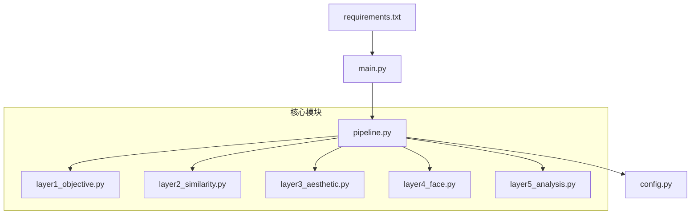
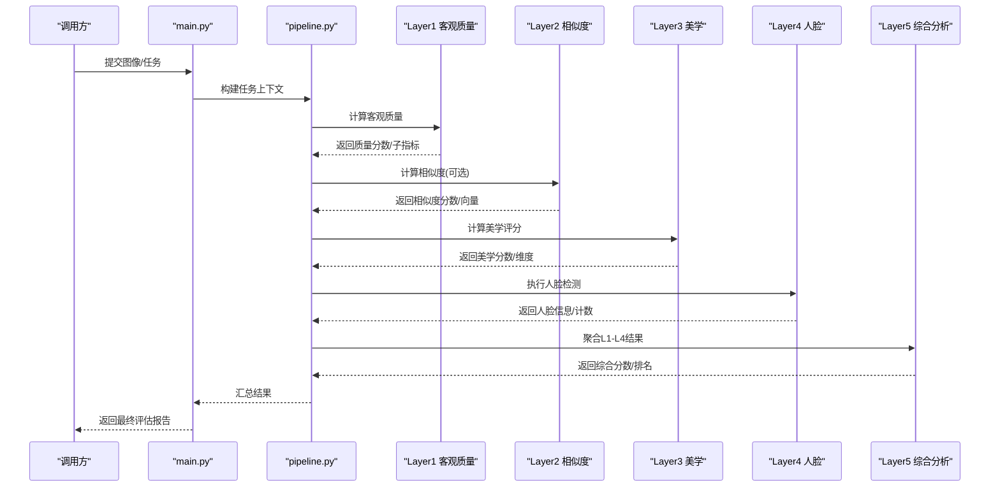
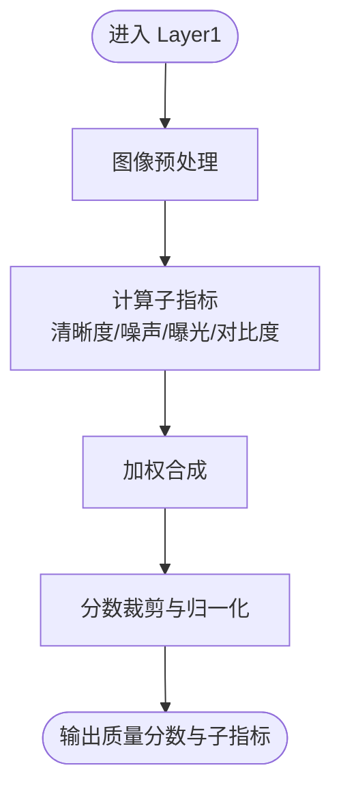
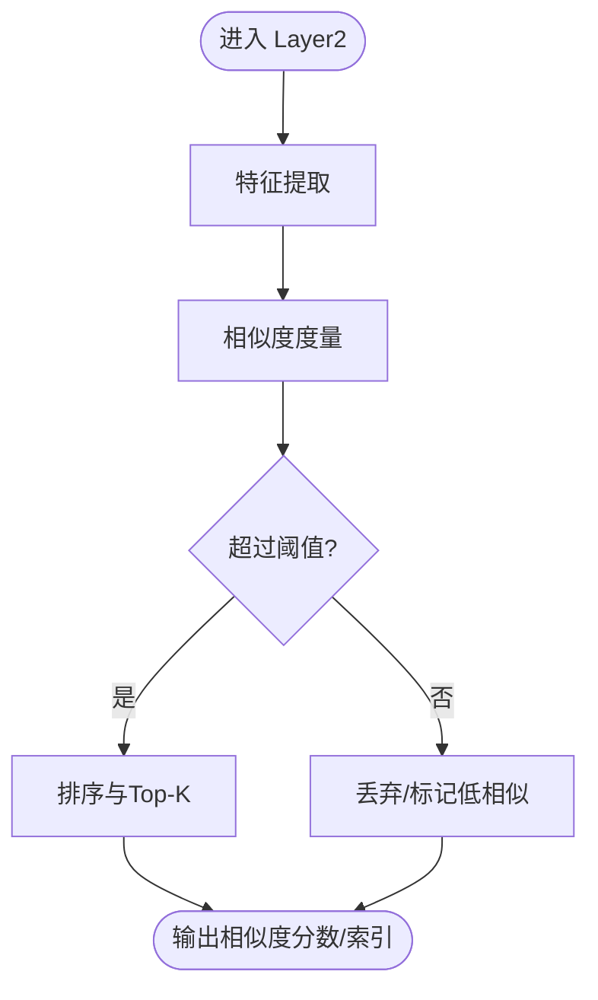
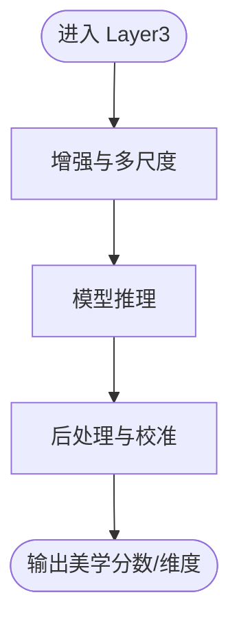
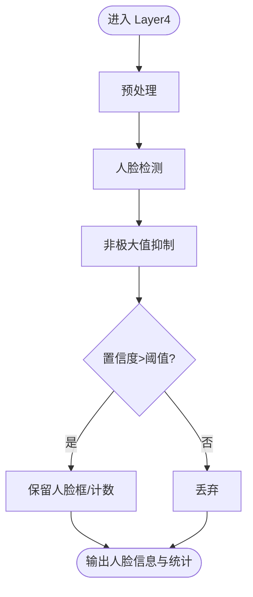
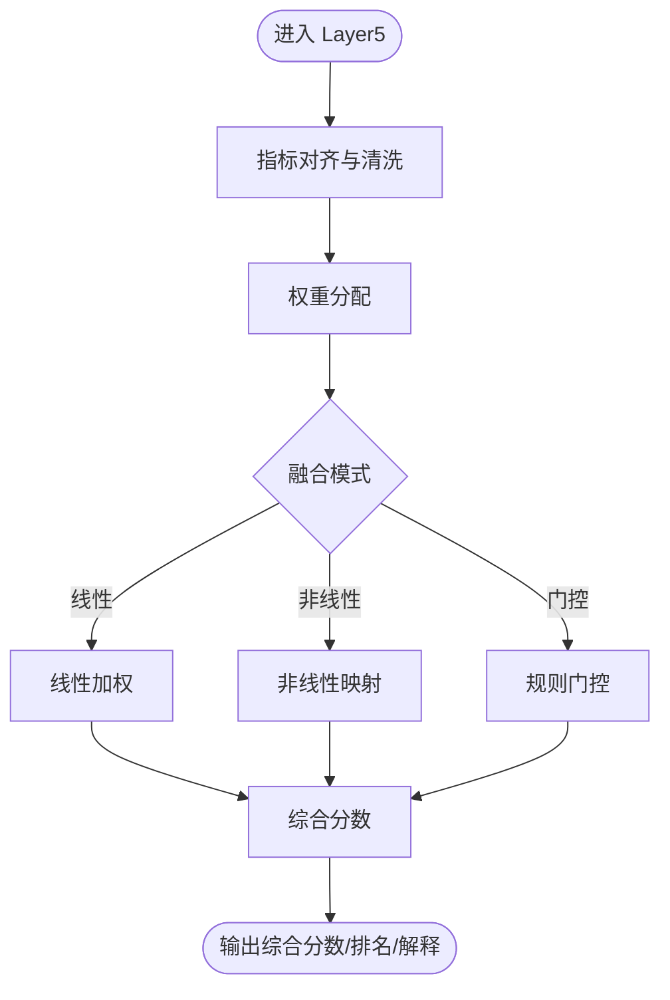
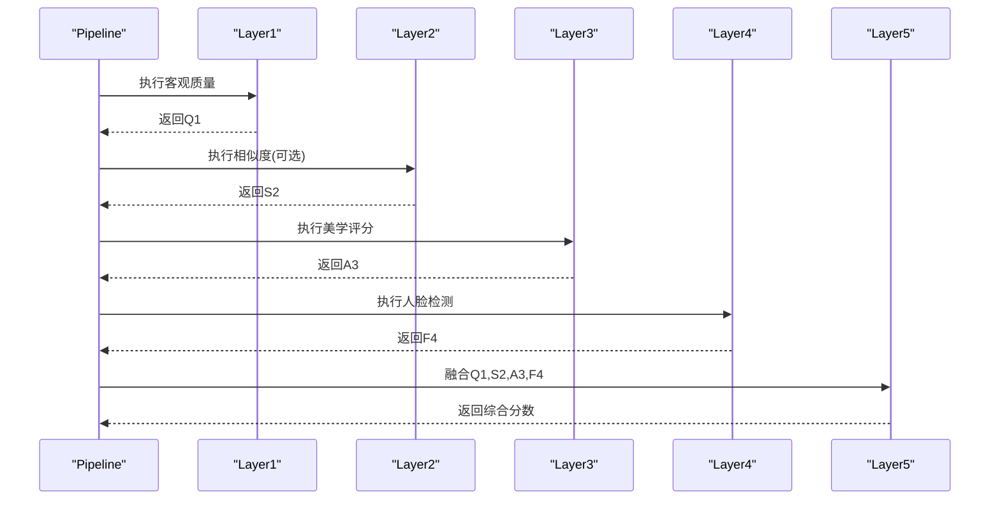
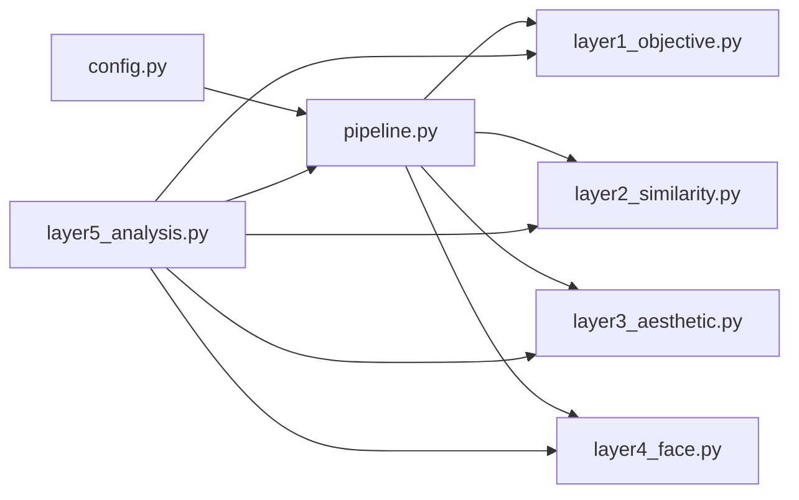

# 评估层级系统

<cite>
**本文引用的文件**   
- [core/layer1_objective.py](file://core/layer1_objective.py)
- [core/layer2_similarity.py](file://core/layer2_similarity.py)
- [core/layer3_aesthetic.py](file://core/layer3_aesthetic.py)
- [core/layer4_face.py](file://core/layer4_face.py)
- [core/layer5_analysis.py](file://core/layer5_analysis.py)
- [core/pipeline.py](file://core/pipeline.py)
- [config.py](file://config.py)
- [main.py](file://main.py)
- [requirements.txt](file://requirements.txt)
</cite>

## 目录
1. [简介](#简介)
2. [项目结构](#项目结构)
3. [核心组件](#核心组件)
4. [架构总览](#架构总览)
5. [详细组件分析](#详细组件分析)
6. [依赖关系分析](#依赖关系分析)
7. [性能考虑](#性能考虑)
8. [故障排查指南](#故障排查指南)
9. [结论](#结论)
10. [附录](#附录)

## 简介
本文件系统性地梳理并文档化“五层评估架构”的设计与实现，涵盖：
- 客观质量评估（Layer 1）
- 相似度分析（Layer 2）
- 美学评分（Layer 3）
- 人脸检测（Layer 4）
- 综合分析（Layer 5）

文档将解释每层的算法思路、权重计算方式、结果融合策略、层间依赖与数据传递机制，并提供配置选项、参数调优建议与性能优化要点。同时给出调用示例路径与扩展新评估标准的实践方法，帮助读者快速上手与二次开发。

## 项目结构
本项目采用分层模块化设计，核心评估逻辑位于 core 目录，各层职责清晰：
- layer1_objective.py：客观质量评估
- layer2_similarity.py：相似度分析
- layer3_aesthetic.py：美学评分
- layer4_face.py：人脸检测
- layer5_analysis.py：综合分析（多指标融合）
- pipeline.py：流水线编排与执行

根目录提供配置与入口：
- config.py：全局配置与默认参数
- main.py：应用入口与命令行/接口封装
- requirements.txt：依赖声明

图表来源
- [core/pipeline.py](file://core/pipeline.py)
- [core/layer1_objective.py](file://core/layer1_objective.py)
- [core/layer2_similarity.py](file://core/layer2_similarity.py)
- [core/layer3_aesthetic.py](file://core/layer3_aesthetic.py)
- [core/layer4_face.py](file://core/layer4_face.py)
- [core/layer5_analysis.py](file://core/layer5_analysis.py)
- [config.py](file://config.py)
- [main.py](file://main.py)

章节来源
- [core/pipeline.py](file://core/pipeline.py)
- [config.py](file://config.py)
- [main.py](file://main.py)
- [requirements.txt](file://requirements.txt)

## 核心组件
- 客观质量评估（Layer 1）
  - 目标：对单张图像进行基础质量打分，如清晰度、噪声、曝光、对比度等可量化指标。
  - 输入：图像数据（像素矩阵或路径）。
  - 输出：质量分数及可选子指标。
  - 典型实现要点：基于传统图像处理特征或轻量模型；支持阈值裁剪与归一化。

- 相似度分析（Layer 2）
  - 目标：衡量两张或多张图像的视觉相似性，用于去重、分组或候选集筛选。
  - 输入：一对或多对图像。
  - 输出：相似度分数（通常为[0,1]区间），可选关键点对或嵌入向量。
  - 典型实现要点：特征提取（如感知哈希、局部描述符或深度学习特征）+ 距离度量。

- 美学评分（Layer 3）
  - 目标：评估图像的美学质量，包括构图、色彩、光影等主观维度。
  - 输入：图像数据。
  - 输出：美学得分（通常归一化到[0,1]），可选维度分解。
  - 典型实现要点：预训练美学模型或回归器；支持多尺度与增强鲁棒性。

- 人脸检测（Layer 4）
  - 目标：检测图像中的人脸数量、位置与置信度，支撑人像优先或人脸相关规则。
  - 输入：图像数据。
  - 输出：人脸框、置信度、人数统计，可选属性（性别/年龄估计等）。
  - 典型实现要点：高效检测器；支持批量推理与阈值过滤。

- 综合分析（Layer 5）
  - 目标：融合前四层结果，生成最终综合评分与排序依据。
  - 输入：L1-L4 的输出指标集合。
  - 输出：综合分数、排名、可选解释性指标。
  - 典型实现要点：加权求和、线性/非线性融合、规则门控、异常值处理。

章节来源
- [core/layer1_objective.py](file://core/layer1_objective.py)
- [core/layer2_similarity.py](file://core/layer2_similarity.py)
- [core/layer3_aesthetic.py](file://core/layer3_aesthetic.py)
- [core/layer4_face.py](file://core/layer4_face.py)
- [core/layer5_analysis.py](file://core/layer5_analysis.py)

## 架构总览
五层评估以流水线形式组织，数据自下而上逐层汇聚，最终由综合分析层完成融合与决策。

图表来源
- [main.py](file://main.py)
- [core/pipeline.py](file://core/pipeline.py)
- [core/layer1_objective.py](file://core/layer1_objective.py)
- [core/layer2_similarity.py](file://core/layer2_similarity.py)
- [core/layer3_aesthetic.py](file://core/layer3_aesthetic.py)
- [core/layer4_face.py](file://core/layer4_face.py)
- [core/layer5_analysis.py](file://core/layer5_analysis.py)

## 详细组件分析

### Layer 1：客观质量评估
- 功能概述
  - 从图像中提取客观质量特征，输出统一量纲的分数与子指标。
- 关键流程
  - 输入校验与预处理（缩放、归一化、通道顺序）
  - 特征计算（清晰度、噪声、曝光、对比度等）
  - 分数合成与裁剪（边界处理、平滑）
- 权重与融合
  - 子指标按预设权重线性组合，支持动态权重覆盖。
- 错误处理
  - 输入非法、模型加载失败、数值溢出等异常捕获与降级策略。
- 配置项
  - 是否启用特定子指标、权重字典、阈值与裁剪范围、并行批大小。
- 性能优化
  - 向量化计算、缓存中间特征、GPU加速（若可用）、批处理。

图表来源
- [core/layer1_objective.py](file://core/layer1_objective.py)

章节来源
- [core/layer1_objective.py](file://core/layer1_objective.py)

### Layer 2：相似度分析
- 功能概述
  - 计算图像对的相似度，用于去重、聚类与候选推荐。
- 关键流程
  - 特征提取（感知哈希/局部描述符/深度特征）
  - 相似度度量（余弦/欧氏/Jaccard等）
  - 阈值过滤与结果排序
- 权重与融合
  - 多特征时可加权融合，支持自适应权重（基于验证集）。
- 错误处理
  - 尺寸不一致、特征维度不匹配、内存不足等异常处理。
- 配置项
  - 特征类型、相似度度量、阈值、Top-K、是否返回嵌入向量。
- 性能优化
  - 特征缓存、近似最近邻检索、降维（PCA/随机投影）、批推理。

图表来源
- [core/layer2_similarity.py](file://core/layer2_similarity.py)

章节来源
- [core/layer2_similarity.py](file://core/layer2_similarity.py)

### Layer 3：美学评分
- 功能概述
  - 评估图像美学质量，输出综合美学分与可选维度分解。
- 关键流程
  - 图像增强与多尺度输入
  - 模型推理（分类/回归）
  - 后处理（校准、平滑、置信度估计）
- 权重与融合
  - 维度分数可按主题/风格加权，支持用户自定义权重。
- 错误处理
  - 模型加载失败、输入分辨率过低、推理超时等。
- 配置项
  - 模型路径、输入尺寸、增强开关、置信度阈值、维度权重。
- 性能优化
  - 模型量化、ONNX/TensorRT 加速、批处理、异步推理。

图表来源
- [core/layer3_aesthetic.py](file://core/layer3_aesthetic.py)

章节来源
- [core/layer3_aesthetic.py](file://core/layer3_aesthetic.py)

### Layer 4：人脸检测
- 功能概述
  - 检测人脸数量、位置与置信度，为后续人像优先策略提供依据。
- 关键流程
  - 预处理（缩放、归一化）
  - 检测器推理
  - NMS 与非人脸过滤
- 权重与融合
  - 人脸数量与置信度可作为规则门控因子影响综合评分。
- 错误处理
  - 检测器不可用、图像过小、内存不足等。
- 配置项
  - 检测器类型、置信阈值、NMS 阈值、最小人脸尺寸、是否返回属性。
- 性能优化
  - 多分辨率金字塔、ROI裁剪、批处理、GPU加速。

图表来源
- [core/layer4_face.py](file://core/layer4_face.py)

章节来源
- [core/layer4_face.py](file://core/layer4_face.py)

### Layer 5：综合分析
- 功能概述
  - 融合 L1-L4 的多源指标，生成最终综合评分与排序。
- 关键流程
  - 指标对齐与缺失值处理
  - 权重分配（静态/动态/学习式）
  - 融合策略（线性加权、非线性映射、规则门控）
  - 异常值处理与稳定性保障
- 权重与融合
  - 支持多种融合模式：简单加权、指数加权、阈值门控、分段函数。
  - 可根据业务场景调整权重，支持在线学习与离线校准。
- 错误处理
  - 指标缺失、维度不一致、权重非法等异常回退策略。
- 配置项
  - 融合模式、权重表、阈值、门控条件、输出字段。
- 性能优化
  - 向量化融合、惰性计算、缓存中间结果、并行评估。

图表来源
- [core/layer5_analysis.py](file://core/layer5_analysis.py)

章节来源
- [core/layer5_analysis.py](file://core/layer5_analysis.py)

### 流水线编排（Pipeline）
- 功能概述
  - 协调 L1-L5 的执行顺序、数据传递与错误恢复。
- 关键流程
  - 任务解析与上下文构建
  - 按需执行各层（可跳过非必要层）
  - 结果聚合与格式化输出
- 配置项
  - 层开关、重试策略、超时设置、日志级别、并发度。
- 性能优化
  - 并行执行独立层、结果缓存、增量更新。

图表来源
- [core/pipeline.py](file://core/pipeline.py)
- [core/layer1_objective.py](file://core/layer1_objective.py)
- [core/layer2_similarity.py](file://core/layer2_similarity.py)
- [core/layer3_aesthetic.py](file://core/layer3_aesthetic.py)
- [core/layer4_face.py](file://core/layer4_face.py)
- [core/layer5_analysis.py](file://core/layer5_analysis.py)

章节来源
- [core/pipeline.py](file://core/pipeline.py)

## 依赖关系分析
- 模块耦合
  - Pipeline 作为编排中心，依赖各评估层接口；Layer5 强依赖 L1-L4 的输出结构。
- 外部依赖
  - 图像处理库、深度学习框架、检测/美学模型、数值计算库。
- 循环依赖
  - 各层单向依赖 Pipeline 与配置，避免循环导入。
- 接口契约
  - 统一的输入输出格式（图像、指标字典、元数据），便于替换与扩展。

图表来源
- [config.py](file://config.py)
- [core/pipeline.py](file://core/pipeline.py)
- [core/layer1_objective.py](file://core/layer1_objective.py)
- [core/layer2_similarity.py](file://core/layer2_similarity.py)
- [core/layer3_aesthetic.py](file://core/layer3_aesthetic.py)
- [core/layer4_face.py](file://core/layer4_face.py)
- [core/layer5_analysis.py](file://core/layer5_analysis.py)

章节来源
- [config.py](file://config.py)
- [core/pipeline.py](file://core/pipeline.py)
- [core/layer5_analysis.py](file://core/layer5_analysis.py)

## 性能考虑
- 通用优化
  - 批处理与并行：对独立层（L1/L3/L4）进行批推理与并行执行。
  - 缓存与复用：特征与中间结果缓存，避免重复计算。
  - 精度与速度权衡：使用量化、半精度、近似算法提升吞吐。
- 层内优化
  - L1：向量化计算、减少重复预处理。
  - L2：特征降维、ANN检索、Top-K剪枝。
  - L3：模型轻量化、多尺度早停、缓存嵌入。
  - L4：多分辨率金字塔、ROI裁剪、NMS优化。
  - L5：向量化融合、惰性计算、异常值快速剔除。
- 资源管理
  - GPU/CPU 切换、显存监控、OOM 保护、超时与重试。

## 故障排查指南
- 常见问题
  - 输入图像无效：检查路径、格式、尺寸与通道顺序。
  - 模型加载失败：确认依赖安装、模型路径与权限。
  - 内存不足：降低批大小、启用流式处理、释放中间变量。
  - 指标缺失：检查层开关与依赖链，确保必要层已执行。
- 调试建议
  - 开启详细日志，记录每层输入输出摘要。
  - 逐步禁用层定位问题，隔离异常来源。
  - 使用小样本数据集复现问题，逐步扩大规模。
- 回退策略
  - 当某层失败时，使用默认权重或历史均值进行降级融合。

章节来源
- [core/pipeline.py](file://core/pipeline.py)
- [config.py](file://config.py)

## 结论
五层评估架构通过清晰的职责划分与流水线编排，实现了从客观质量到主观美学的全面评估，并以综合分析层完成多源指标融合与决策。该设计具备良好的可扩展性与可配置性，能够灵活适配不同业务场景与性能需求。通过合理的参数调优与性能优化，可在保证准确率的同时显著提升吞吐与稳定性。

## 附录

### 配置与参数调优指南
- 全局配置（config.py）
  - 层开关：控制是否启用 L1-L4，默认按需启用。
  - 权重表：定义各层指标权重，支持覆盖默认值。
  - 阈值与裁剪：设定各层阈值、分数裁剪范围。
  - 并发与批大小：控制并行度与批处理大小。
- 层内参数
  - L1：子指标权重、归一化方式、阈值。
  - L2：特征类型、相似度度量、Top-K、阈值。
  - L3：模型路径、输入尺寸、增强开关、置信度阈值。
  - L4：检测器类型、置信阈值、NMS 阈值、最小人脸尺寸。
  - L5：融合模式、权重表、门控条件、输出字段。
- 调优建议
  - 先固定其他层，单独调优当前层权重与阈值。
  - 使用验证集进行网格搜索或贝叶斯优化。
  - 关注长尾分布与异常值，必要时引入鲁棒融合。

章节来源
- [config.py](file://config.py)
- [core/layer1_objective.py](file://core/layer1_objective.py)
- [core/layer2_similarity.py](file://core/layer2_similarity.py)
- [core/layer3_aesthetic.py](file://core/layer3_aesthetic.py)
- [core/layer4_face.py](file://core/layer4_face.py)
- [core/layer5_analysis.py](file://core/layer5_analysis.py)

### 调用示例与扩展新评估标准
- 调用示例（参考路径）
  - 入口调用：参见 [main.py](file://main.py)，了解如何构造任务并提交评估请求。
  - 流水线调用：参见 [core/pipeline.py](file://core/pipeline.py)，了解如何配置层开关与参数。
  - 层级调用：分别参考各层文件，了解输入输出结构与参数说明。
- 扩展新评估标准
  - 新增一层（例如 LayerX）：
    - 在 core 目录下创建 layerX_xxx.py，实现统一接口（输入图像、输出指标字典）。
    - 在 pipeline.py 中添加对该层的编排逻辑与数据传递。
    - 在 config.py 中增加对应配置项（开关、权重、阈值）。
    - 在 Layer5 中接入新指标，更新融合策略与权重表。
  - 测试与验证：
    - 使用小样本数据集验证接口与结果合理性。
    - 逐步扩大规模并进行性能基准测试。

章节来源
- [main.py](file://main.py)
- [core/pipeline.py](file://core/pipeline.py)
- [config.py](file://config.py)

### 依赖与环境
- 依赖声明：参见 [requirements.txt](file://requirements.txt)，包含图像处理、深度学习框架与工具库。
- 环境建议：
  - Python 版本与虚拟环境隔离。
  - GPU 驱动与 CUDA 版本匹配（如需加速）。
  - 模型文件与权重路径配置正确。

章节来源
- [requirements.txt](file://requirements.txt)