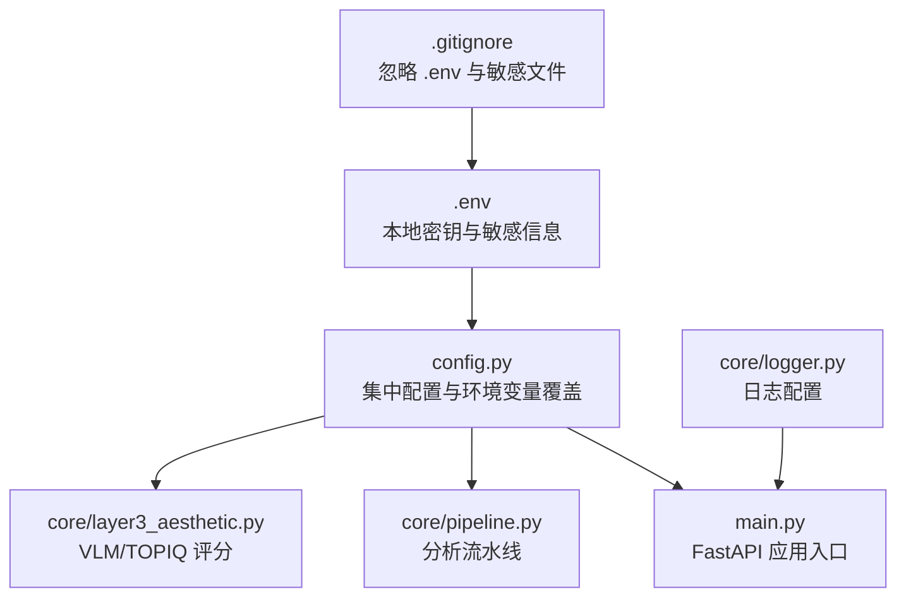
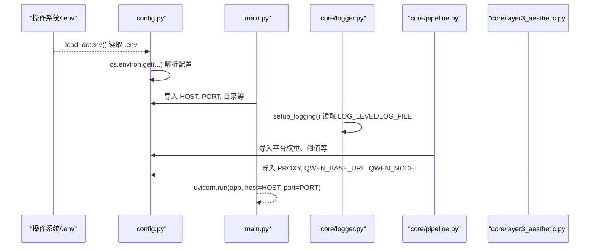
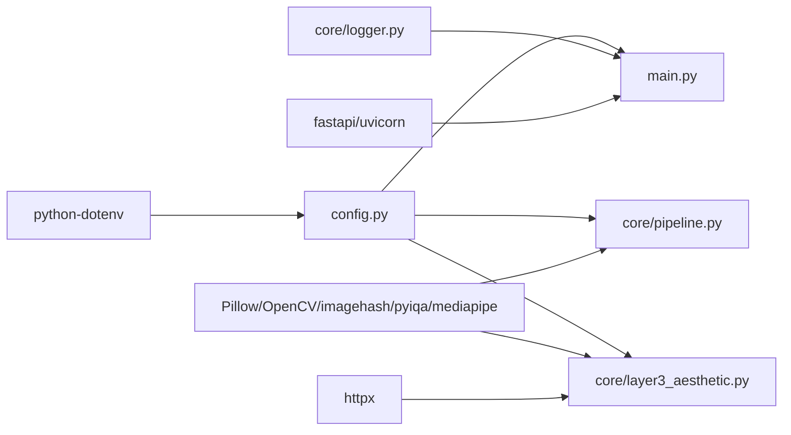

# 配置管理

<cite>
**本文引用的文件**   
- [config.py](file://config.py)
- [main.py](file://main.py)
- [core/logger.py](file://core/logger.py)
- [core/layer3_aesthetic.py](file://core/layer3_aesthetic.py)
- [core/pipeline.py](file://core/pipeline.py)
- [tests/test_config.py](file://tests/test_config.py)
- [.gitignore](file://.gitignore)
- [requirements.txt](file://requirements.txt)
</cite>

## 目录
1. [简介](#简介)
2. [项目结构](#项目结构)
3. [核心组件](#核心组件)
4. [架构总览](#架构总览)
5. [详细组件分析](#详细组件分析)
6. [依赖关系分析](#依赖关系分析)
7. [性能与调优建议](#性能与调优建议)
8. [故障排除指南](#故障排除指南)
9. [结论](#结论)
10. [附录：环境变量清单与示例](#附录环境变量清单与示例)

## 简介
本文件为 PhotoRank 项目的“配置管理”文档，聚焦 config.py 中的全部配置项与环境变量覆盖机制。内容涵盖：
- 数据库连接设置（本项目未使用数据库）
- 模型路径与平台权重配置
- 评估参数与融合权重
- 系统环境变量与代理设置
- 开发/测试/生产环境的配置策略与优先级规则
- 动态加载与热重载机制说明
- 最佳实践、安全注意事项与常见问题排查
- 具体配置示例与常见场景解决方案

## 项目结构
PhotoRank 采用单点集中式配置（config.py），通过 python-dotenv 统一加载 .env，并通过 os.environ.get 实现运行时覆盖。Web 服务入口 main.py 从 config.py 导入 HOST、PORT、目录等关键配置，驱动 FastAPI 应用启动与路由处理。日志子系统 core/logger.py 提供基于环境变量的日志级别与输出目标控制。

图表来源
- [config.py:1-123](file://config.py#L1-L123)
- [main.py:22-38](file://main.py#L22-L38)
- [core/logger.py:17-66](file://core/logger.py#L17-L66)

章节来源
- [config.py:1-123](file://config.py#L1-L123)
- [main.py:22-38](file://main.py#L22-L38)
- [core/logger.py:17-66](file://core/logger.py#L17-L66)

## 核心组件
本节对 config.py 的关键配置进行系统化梳理，并给出用途与影响范围。

- 项目路径与目录
  - PROJECT_ROOT、PHOTOS_DIR、OUTPUT_DIR、VIDEOS_DIR、VIDEO_FRAMES_DIR：定义上传、输出与视频帧目录，确保输入输出隔离与可预测的文件组织。
- 分类与平台
  - CATEGORIES：照片分类枚举，用于后续分析与榜单分组。
  - PLATFORMS：平台级配置（名称、风格描述、输出数量、维度权重 composition/color/lighting/face）。
- Layer 1 客观指标阈值
  - LAPLACIAN_THRESHOLD、OVEREXPOSURE_THRESHOLD、UNDEREXPOSURE_THRESHOLD、OVEREXPOSURE_RATIO_THRESHOLD、UNDEREXPOSURE_RATIO_THRESHOLD、EXPOSURE_BAND：控制曝光与清晰度筛选、合理亮度区间。
- Layer 2 相似聚类
  - SIMILARITY_THRESHOLD（备用）、HAMMING_THRESHOLD：感知哈希汉明距离阈值，用于去重与多样性控制。
- 通用评分参数
  - TOP_K_PER_CATEGORY、FINAL_OUTPUT_COUNT：每类候选数与最终输出总数。
- 多样性惩罚
  - DIVERSITY_PENALTY、DIVERSITY_DISTANCE_THRESHOLD：对相似照片施加扣分，避免同场景占位过多。
- 视频抽帧参数
  - VIDEO_FRAME_INTERVAL、VIDEO_MAX_FRAMES、VIDEO_EXTS、VIDEO_OUTPUT_COUNT、VIDEO_FRAME_MIN_SHARPNESS、VIDEO_FRAME_BLUR_RATIO：控制视频流式抽帧、质量判定与淘汰比例。
- VLM 图像预处理
  - VLM_IMAGE_MAX_SIDE、VLM_JPEG_QUALITY：限制上传尺寸与压缩质量，降低 API 延迟与带宽消耗。
- 综合分融合权重
  - FUSION_WEIGHTS：vlm/topiq/face/objective 四者权重，总和应为 1.0。
- Qwen API 与代理
  - QWEN_BASE_URL、QWEN_MODEL、PROXY：通过环境变量注入，支持多模型与网络代理。
- Web UI 运行参数
  - HOST、PORT：默认值可通过环境变量覆盖。

章节来源
- [config.py:11-123](file://config.py#L11-L123)

## 架构总览
配置在模块加载时一次性读取，随后被多个子模块引用。环境变量优先于代码默认值，.env 文件由 load_dotenv() 统一加载，保证所有模块一致获取密钥与配置。

图表来源
- [config.py:1-123](file://config.py#L1-L123)
- [main.py:396-399](file://main.py#L396-L399)
- [core/logger.py:17-66](file://core/logger.py#L17-L66)
- [core/pipeline.py:300-499](file://core/pipeline.py#L300-L499)
- [core/layer3_aesthetic.py:270-390](file://core/layer3_aesthetic.py#L270-L390)

## 详细组件分析

### 配置项详解与影响范围
- 目录与路径
  - 作用：决定上传、输出与中间结果存放位置；影响磁盘 I/O 与权限。
  - 风险：若路径不在项目根下，可能导致权限或清理问题。
- 平台权重
  - 作用：不同平台的审美侧重点（构图/色彩/光影/人脸）；直接影响排序与榜单构成。
  - 调优：根据业务反馈调整权重，保持总和为 1.0。
- 阈值与比例
  - 作用：控制 L1/L2 的过滤与去重；过高/过低会影响召回率与误杀率。
  - 调优：结合数据集分布与业务需求微调，如夜景/雪景场景需放宽曝光阈值。
- 视频参数
  - 作用：控制抽帧频率、质量底线与淘汰比例；影响速度与质量平衡。
  - 调优：长视频可适当增大间隔与上限，提升吞吐。
- VLM 参数
  - 作用：控制图片尺寸与压缩质量；影响 API 延迟与成本。
  - 调优：在视觉质量与延迟之间权衡，通常 1024 边长与 80 质量较均衡。
- 融合权重
  - 作用：将多维度分数归一化后加权；决定最终排名。
  - 调优：按平台风格与用户偏好迭代优化。
- 环境变量
  - 作用：在不改代码的情况下切换模型、代理、监听地址与端口。
  - 优先级：环境变量 > .env > 代码默认值。

章节来源
- [config.py:11-123](file://config.py#L11-L123)

### 环境变量覆盖与优先级规则
- 优先级顺序
  - 进程环境变量（最高）> .env 文件（load_dotenv 加载）> 代码默认值（最低）。
- 覆盖方式
  - 通过 os.environ.get("KEY", "DEFAULT") 实现，任何模块均可读取同一份环境变量。
- 典型覆盖项
  - HOST、PORT、QWEN_BASE_URL、QWEN_MODEL、HTTPS_PROXY、LOG_LEVEL、LOG_FILE、QWEN_API_KEY（在子模块中直接读取）。

章节来源
- [config.py:110-123](file://config.py#L110-L123)
- [core/logger.py:17-66](file://core/logger.py#L17-L66)
- [core/layer3_aesthetic.py:270-390](file://core/layer3_aesthetic.py#L270-L390)
- [core/pipeline.py:300-499](file://core/pipeline.py#L300-L499)

### 不同环境的配置策略
- 开发环境
  - 建议：HOST=127.0.0.1，PORT=8080，LOG_LEVEL=DEBUG，启用详细日志；QWEN_API_KEY 可选，便于快速验证。
  - 目的：便于调试与定位问题。
- 测试环境
  - 建议：固定 PORT 与 HOST，禁用真实 API（不设置 QWEN_API_KEY），使用较小数据集与较低并发；可设置模拟代理。
  - 目的：稳定复现与自动化测试。
- 生产环境
  - 建议：HOST=0.0.0.0（或通过反向代理），PORT 由部署平台分配；LOG_LEVEL=INFO/WARNING；HTTPS_PROXY 按需配置；严格限制上传大小与扩展名白名单。
  - 目的：安全、稳定与高性能。

章节来源
- [main.py:396-399](file://main.py#L396-L399)
- [core/logger.py:17-66](file://core/logger.py#L17-L66)

### 配置文件优先级与热重载机制
- 优先级
  - 环境变量始终优先于 .env 与默认值；适用于容器编排与 CI/CD 注入。
- 热重载
  - 当前设计为模块加载时一次性读取配置，不支持运行时热重载。
  - 如需热重载，可在应用层封装配置读取函数并在请求前重新加载（谨慎使用，注意线程安全与一致性）。
- 建议
  - 通过重启服务或进程外配置中心更新配置；避免频繁 reload 导致状态不一致。

章节来源
- [config.py:1-123](file://config.py#L1-L123)
- [tests/test_config.py:65-91](file://tests/test_config.py#L65-L91)

### 安全注意事项
- 敏感信息
  - QWEN_API_KEY、代理地址等应通过环境变量或 .env 注入，严禁硬编码。
  - .gitignore 已忽略 .env 与敏感文件，确保不提交到仓库。
- 输入校验
  - 文件名净化与扩展名/MIME 白名单已在 main.py 中实现，防止路径遍历与恶意上传。
- 资源限制
  - MAX_UPLOAD_SIZE、MAX_VIDEO_UPLOAD_SIZE 限制请求体大小，避免 DoS。
- 日志脱敏
  - 日志中避免打印敏感字段；必要时对路径与文件名做脱敏处理。

章节来源
- [main.py:48-76](file://main.py#L48-L76)
- [.gitignore:23-41](file://.gitignore#L23-L41)

### 动态加载配置与热重载机制（现状与建议）
- 现状
  - 配置在模块导入时读取一次，无内置热重载。
- 建议方案
  - 封装配置访问器：每次读取时检查环境变量变化或外部配置源（如 Redis/KV），返回最新值。
  - 使用进程内缓存与版本戳，避免频繁 IO。
  - 在 WebSocket 或管理接口暴露“重载配置”能力，但需谨慎处理并发与一致性。

章节来源
- [config.py:1-123](file://config.py#L1-L123)

## 依赖关系分析
- 模块耦合
  - main.py 依赖 config.py 的路径与运行参数。
  - core/pipeline.py 与 core/layer3_aesthetic.py 依赖 config.py 的平台权重、阈值与 VLM 配置。
  - core/logger.py 独立提供日志配置，受环境变量控制。
- 外部依赖
  - python-dotenv 用于加载 .env。
  - FastAPI/Uvicorn 用于 Web 服务。
  - Pillow/OpenCV/imagehash/pyiqa/mediapipe 用于图像处理与评分。
  - httpx 用于 HTTP 客户端（VLM 调用）。

图表来源
- [config.py:1-123](file://config.py#L1-L123)
- [main.py:22-38](file://main.py#L22-L38)
- [core/logger.py:17-66](file://core/logger.py#L17-L66)
- [core/pipeline.py:300-499](file://core/pipeline.py#L300-L499)
- [core/layer3_aesthetic.py:270-390](file://core/layer3_aesthetic.py#L270-L390)
- [requirements.txt:1-27](file://requirements.txt#L1-L27)

章节来源
- [requirements.txt:1-27](file://requirements.txt#L1-L27)

## 性能与调优建议
- 图像预处理
  - VLM_IMAGE_MAX_SIDE 与 VLM_JPEG_QUALITY 可降低上传体积与 API 延迟；建议在高分辨率场景下调至 1024/80。
- 相似度与多样性
  - HAMMING_THRESHOLD 与 DIVERSITY_DISTANCE_THRESHOLD 影响去重与多样性；过大可能漏掉相似图，过小可能导致重复。
- 视频抽帧
  - VIDEO_FRAME_INTERVAL 与 VIDEO_MAX_FRAMES 控制采样密度；长视频建议增大间隔与上限以提升吞吐。
- 融合权重
  - FUSION_WEIGHTS 应按平台风格与用户反馈迭代优化，保持总和为 1.0。
- 并发与线程池
  - pipeline 中对 L3/L4/VLM 使用线程池并发；可根据 CPU/GPU 与网络状况调整 _VLM_CONCURRENCY。

章节来源
- [config.py:58-108](file://config.py#L58-L108)
- [core/pipeline.py:300-499](file://core/pipeline.py#L300-L499)
- [core/layer3_aesthetic.py:270-390](file://core/layer3_aesthetic.py#L270-L390)

## 故障排除指南
- 无法连接 VLM API
  - 检查 QWEN_API_KEY、QWEN_BASE_URL、HTTPS_PROXY 是否正确设置。
  - 确认网络可达与代理配置有效。
- 分析结果为空或异常
  - 检查上传目录与输出目录权限；确认 PHOTOS_DIR/OUTPUT_DIR 存在且可写。
  - 查看日志级别与输出目标（LOG_LEVEL/LOG_FILE），定位错误原因。
- 视频抽帧失败
  - 检查 VIDEO_EXTS 是否包含实际格式；确认文件大小与 Content-Length 预检逻辑。
  - 查看抽帧错误日志，确认解码与质量判定阈值是否合理。
- 端口占用或绑定失败
  - 修改 PORT 环境变量；确认防火墙与安全组放行。
- 环境变量未生效
  - 确认 .env 已被 load_dotenv() 加载；检查进程环境变量优先级更高。
  - 重启服务以重新加载配置。

章节来源
- [core/logger.py:17-66](file://core/logger.py#L17-L66)
- [main.py:165-237](file://main.py#L165-L237)
- [config.py:110-123](file://config.py#L110-L123)

## 结论
config.py 作为单一配置源，结合 python-dotenv 与 os.environ.get，实现了灵活、安全、可覆盖的配置体系。通过环境变量与 .env 文件，可在不同环境中快速切换行为而不改动代码。建议在生产环境严格管理敏感信息与资源限制，并结合日志与监控持续优化阈值与权重。对于需要热重载的场景，应在应用层封装配置读取逻辑并确保一致性。

## 附录：环境变量清单与示例
- 基础运行
  - HOST：默认 127.0.0.1，生产建议 0.0.0.0（经反向代理）。
  - PORT：默认 8080，按部署平台分配。
- 日志
  - LOG_LEVEL：DEBUG/INFO/WARNING/ERROR，默认 INFO。
  - LOG_FILE：可选，指定日志文件路径。
- VLM 与代理
  - QWEN_BASE_URL：默认阿里云兼容模式端点。
  - QWEN_MODEL：默认 qwen3-vl-plus，可按需切换。
  - HTTPS_PROXY：代理地址，留空表示不使用。
  - QWEN_API_KEY：在子模块中直接读取，用于 VLM 调用。
- 示例（.env 片段）
  - HOST=0.0.0.0
  - PORT=8080
  - LOG_LEVEL=INFO
  - LOG_FILE=/var/log/photorange.log
  - QWEN_BASE_URL=https://dashscope.aliyuncs.com/compatible-mode/v1
  - QWEN_MODEL=qwen3-vl-plus
  - HTTPS_PROXY=http://proxy.internal:8080
  - QWEN_API_KEY=your-secret-key

章节来源
- [config.py:110-123](file://config.py#L110-L123)
- [core/logger.py:17-66](file://core/logger.py#L17-L66)
- [core/layer3_aesthetic.py:270-390](file://core/layer3_aesthetic.py#L270-L390)
- [core/pipeline.py:300-499](file://core/pipeline.py#L300-L499)
- [.gitignore:23-41](file://.gitignore#L23-L41)