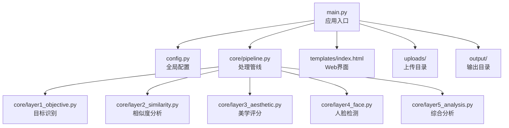
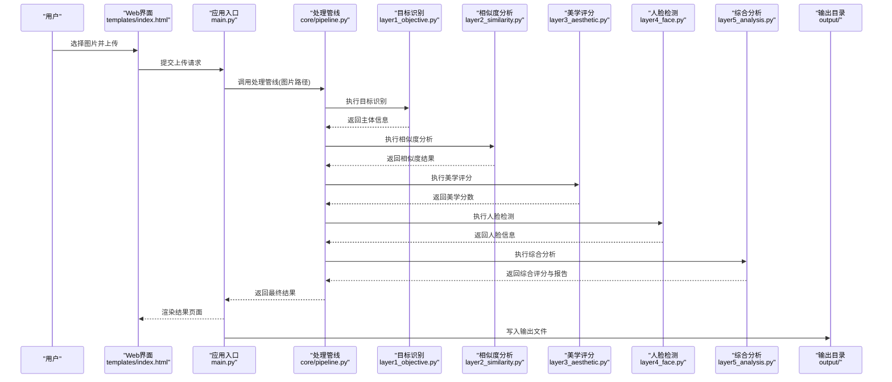
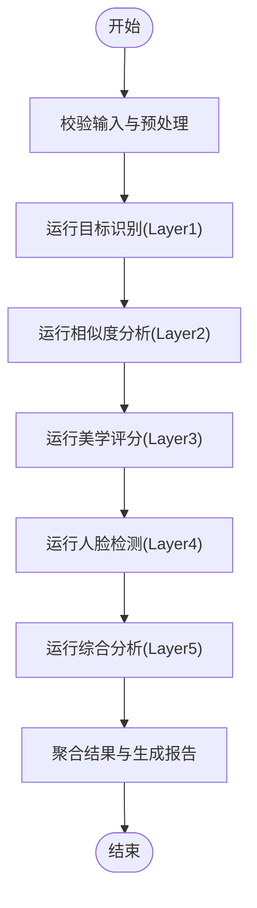
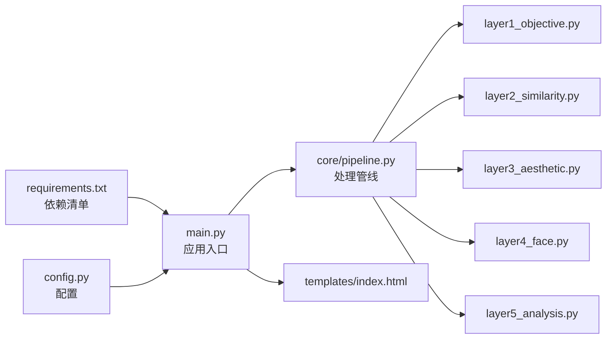

# 项目概览

<cite>
**本文引用的文件**   
- [main.py](file://main.py)
- [config.py](file://config.py)
- [requirements.txt](file://requirements.txt)
- [core/pipeline.py](file://core/pipeline.py)
- [core/layer1_objective.py](file://core/layer1_objective.py)
- [core/layer2_similarity.py](file://core/layer2_similarity.py)
- [core/layer3_aesthetic.py](file://core/layer3_aesthetic.py)
- [core/layer4_face.py](file://core/layer4_face.py)
- [core/layer5_analysis.py](file://core/layer5_analysis.py)
- [templates/index.html](file://templates/index.html)
- [docs/wiki/Quick-Start.md](file://docs/wiki/Quick-Start.md)
</cite>

## 目录
1. [简介](#简介)
2. [项目结构](#项目结构)
3. [核心组件](#核心组件)
4. [架构总览](#架构总览)
5. [详细组件分析](#详细组件分析)
6. [依赖关系分析](#依赖关系分析)
7. [性能考量](#性能考量)
8. [故障排查指南](#故障排查指南)
9. [结论](#结论)
10. [附录：快速入门](#附录快速入门)

## 简介
本项目是一个基于多层次的AI驱动的照片质量评估系统，围绕“评分—排序—洞察”的目标，提供美学评分、相似度分析、人脸检测与综合分析等能力。系统通过分层处理管线将输入照片逐步转化为可解释的指标与结果，既可用于批量评测，也可作为Web服务对外提供接口。整体设计强调模块化与可扩展性，便于接入新的模型或评估维度。

## 项目结构
- 入口与配置
  - main.py：应用启动与路由编排（如Web服务或CLI）
  - config.py：全局配置项（路径、阈值、模型参数等）
  - requirements.txt：Python依赖清单
- 核心处理层
  - core/pipeline.py：分层处理管线，串联各层模块
  - core/layer1_objective.py：目标识别/筛选层（例如主体定位、关键区域判定）
  - core/layer2_similarity.py：相似度分析层（图特征对比、去重或聚类）
  - core/layer3_aesthetic.py：美学评分层（构图、色彩、曝光等指标）
  - core/layer4_face.py：人脸检测层（数量、姿态、遮挡等）
  - core/layer5_analysis.py：综合分析层（汇总评分、生成报告、排序建议）
- Web界面与资源
  - templates/index.html：基础前端页面（上传、展示结果）
  - uploads/：上传目录
  - output/：输出目录（评分结果、报告等）
- 文档
  - docs/wiki/Quick-Start.md：快速入门说明
  - docs/research/：研究资料与参考报告

图表来源
- [main.py:1-200](file://main.py#L1-L200)
- [config.py:1-200](file://config.py#L1-L200)
- [core/pipeline.py:1-200](file://core/pipeline.py#L1-L200)
- [core/layer1_objective.py:1-200](file://core/layer1_objective.py#L1-L200)
- [core/layer2_similarity.py:1-200](file://core/layer2_similarity.py#L1-L200)
- [core/layer3_aesthetic.py:1-200](file://core/layer3_aesthetic.py#L1-L200)
- [core/layer4_face.py:1-200](file://core/layer4_face.py#L1-L200)
- [core/layer5_analysis.py:1-200](file://core/layer5_analysis.py#L1-L200)
- [templates/index.html:1-200](file://templates/index.html#L1-L200)

章节来源
- [main.py:1-200](file://main.py#L1-L200)
- [config.py:1-200](file://config.py#L1-L200)
- [requirements.txt:1-200](file://requirements.txt#L1-L200)
- [core/pipeline.py:1-200](file://core/pipeline.py#L1-L200)
- [templates/index.html:1-200](file://templates/index.html#L1-L200)
- [docs/wiki/Quick-Start.md:1-200](file://docs/wiki/Quick-Start.md#L1-L200)

## 核心组件
- 处理管线（Pipeline）
  - 负责按顺序调用各层模块，聚合中间结果并传递至下一层
  - 支持错误隔离与重试策略，保证单层失败不影响整体流程的可恢复性
- 目标识别层（Layer1）
  - 用于识别图像中的主体或关键区域，为后续评分提供上下文
- 相似度分析层（Layer2）
  - 计算图像间相似度，支持去重、分组与推荐
- 美学评分层（Layer3）
  - 基于视觉特征与模型输出，给出美学分数与细分维度得分
- 人脸检测层（Layer4）
  - 检测人脸数量、位置与基本属性，辅助人像场景评分
- 综合分析层（Layer5）
  - 汇总各层指标，生成最终评分、排序与建议，并可导出报告

章节来源
- [core/pipeline.py:1-200](file://core/pipeline.py#L1-L200)
- [core/layer1_objective.py:1-200](file://core/layer1_objective.py#L1-L200)
- [core/layer2_similarity.py:1-200](file://core/layer2_similarity.py#L1-L200)
- [core/layer3_aesthetic.py:1-200](file://core/layer3_aesthetic.py#L1-L200)
- [core/layer4_face.py:1-200](file://core/layer4_face.py#L1-L200)
- [core/layer5_analysis.py:1-200](file://core/layer5_analysis.py#L1-L200)

## 架构总览
系统采用“入口—管线—分层模块—数据IO”的分层架构。入口负责请求解析与调度；管线协调各层执行；每层专注单一职责；IO层管理上传与输出。该设计使新增功能只需扩展新层并在管线中注册即可。

图表来源
- [main.py:1-200](file://main.py#L1-L200)
- [core/pipeline.py:1-200](file://core/pipeline.py#L1-L200)
- [core/layer1_objective.py:1-200](file://core/layer1_objective.py#L1-L200)
- [core/layer2_similarity.py:1-200](file://core/layer2_similarity.py#L1-L200)
- [core/layer3_aesthetic.py:1-200](file://core/layer3_aesthetic.py#L1-L200)
- [core/layer4_face.py:1-200](file://core/layer4_face.py#L1-L200)
- [core/layer5_analysis.py:1-200](file://core/layer5_analysis.py#L1-L200)
- [templates/index.html:1-200](file://templates/index.html#L1-L200)

## 详细组件分析

### 处理管线（Pipeline）
- 职责：统一编排Layer1~Layer5的执行顺序，维护上下文数据，处理异常与日志
- 关键点：
  - 输入校验与预处理（格式、尺寸、路径合法性）
  - 层间数据传递（结构化对象或字典）
  - 错误隔离（某层失败时记录并继续或回退）
  - 结果聚合与缓存（避免重复计算）

图表来源
- [core/pipeline.py:1-200](file://core/pipeline.py#L1-L200)

章节来源
- [core/pipeline.py:1-200](file://core/pipeline.py#L1-L200)

### 目标识别层（Layer1）
- 职责：识别图像主体、关键区域或场景类型，为后续评分提供语义背景
- 关键点：
  - 使用预训练模型或规则提取主体掩码/框
  - 输出主体置信度与区域坐标
  - 对模糊/低分辨率图像进行降级处理提示

章节来源
- [core/layer1_objective.py:1-200](file://core/layer1_objective.py#L1-L200)

### 相似度分析层（Layer2）
- 职责：计算图像间的相似度，支持去重、分组与推荐
- 关键点：
  - 特征提取（颜色直方图、纹理、深度特征）
  - 相似度度量（余弦、欧氏、SSIM等）
  - 阈值控制与批量优化（索引、近似最近邻）

章节来源
- [core/layer2_similarity.py:1-200](file://core/layer2_similarity.py#L1-L200)

### 美学评分层（Layer3）
- 职责：基于视觉质量与审美特征给出评分
- 关键点：
  - 多维度打分（构图、色彩、曝光、清晰度）
  - 模型融合与权重调整
  - 输出细粒度分数与改进建议

章节来源
- [core/layer3_aesthetic.py:1-200](file://core/layer3_aesthetic.py#L1-L200)

### 人脸检测层（Layer4）
- 职责：检测人脸数量、位置与基本属性
- 关键点：
  - 人脸框与关键点检测
  - 遮挡、角度、表情等属性估计
  - 人像场景下的评分加权

章节来源
- [core/layer4_face.py:1-200](file://core/layer4_face.py#L1-L200)

### 综合分析层（Layer5）
- 职责：汇总各层指标，生成最终评分、排序与报告
- 关键点：
  - 指标归一化与加权融合
  - 规则引擎与模型融合
  - 输出结构化结果与可视化摘要

章节来源
- [core/layer5_analysis.py:1-200](file://core/layer5_analysis.py#L1-L200)

### Web界面（templates/index.html）
- 职责：提供上传、预览与结果展示的基础界面
- 关键点：
  - 表单上传与异步请求
  - 结果渲染与下载链接
  - 与后端API的路由对接

章节来源
- [templates/index.html:1-200](file://templates/index.html#L1-L200)

## 依赖关系分析
- Python依赖
  - 通过requirements.txt统一管理第三方库版本，确保环境一致性
- 内部依赖
  - main.py依赖config.py与core/pipeline.py
  - pipeline.py依赖各layer模块
  - Web界面依赖后端路由与静态资源

图表来源
- [requirements.txt:1-200](file://requirements.txt#L1-L200)
- [main.py:1-200](file://main.py#L1-L200)
- [config.py:1-200](file://config.py#L1-L200)
- [core/pipeline.py:1-200](file://core/pipeline.py#L1-L200)
- [core/layer1_objective.py:1-200](file://core/layer1_objective.py#L1-L200)
- [core/layer2_similarity.py:1-200](file://core/layer2_similarity.py#L1-L200)
- [core/layer3_aesthetic.py:1-200](file://core/layer3_aesthetic.py#L1-L200)
- [core/layer4_face.py:1-200](file://core/layer4_face.py#L1-L200)
- [core/layer5_analysis.py:1-200](file://core/layer5_analysis.py#L1-L200)
- [templates/index.html:1-200](file://templates/index.html#L1-L200)

章节来源
- [requirements.txt:1-200](file://requirements.txt#L1-L200)
- [main.py:1-200](file://main.py#L1-L200)
- [config.py:1-200](file://config.py#L1-L200)
- [core/pipeline.py:1-200](file://core/pipeline.py#L1-L200)

## 性能考量
- 批处理与并行：对大图或多图任务启用并发处理，合理设置线程/进程池
- 模型加载与缓存：预热模型、复用特征向量，减少重复推理开销
- IO优化：限制上传大小、压缩中间结果、按需落盘
- 内存管理：及时释放临时对象，避免大数组常驻内存
- 监控与日志：记录耗时与错误率，定位瓶颈

[本节为通用指导，不直接分析具体文件]

## 故障排查指南
- 常见错误
  - 依赖缺失：检查requirements.txt并重新安装
  - 路径错误：确认uploads/output目录权限与存在性
  - 模型加载失败：核对模型路径与版本兼容性
  - 输入格式不支持：限制上传类型与尺寸
- 调试步骤
  - 开启详细日志，定位失败层
  - 单独运行某一层验证其输入输出
  - 使用小样本回归问题，逐步放大规模

章节来源
- [main.py:1-200](file://main.py#L1-L200)
- [config.py:1-200](file://config.py#L1-L200)

## 结论
本系统以分层管线为核心，将目标识别、相似度分析、美学评分、人脸检测与综合分析有机整合，形成可扩展、易维护的照片质量评估平台。通过清晰的模块边界与统一的编排机制，既能满足批量评测需求，也能支撑在线服务场景。

[本节为总结性内容，不直接分析具体文件]

## 附录：快速入门
- 环境准备
  - 安装Python（建议3.9+）
  - 创建虚拟环境并激活
- 安装依赖
  - 在项目根目录执行依赖安装命令（参考requirements.txt）
- 基本配置
  - 在config.py中设置上传目录、输出目录、模型路径与阈值等参数
- 首次运行
  - 启动应用（命令行或Web服务），访问templates/index.html上传照片
  - 查看output目录中的评分结果与报告
- 常见问题
  - 若出现依赖冲突，优先锁定requirements.txt版本
  - 若模型加载失败，检查GPU/CPU环境与驱动

章节来源
- [docs/wiki/Quick-Start.md:1-200](file://docs/wiki/Quick-Start.md#L1-L200)
- [requirements.txt:1-200](file://requirements.txt#L1-L200)
- [config.py:1-200](file://config.py#L1-L200)
- [templates/index.html:1-200](file://templates/index.html#L1-L200)