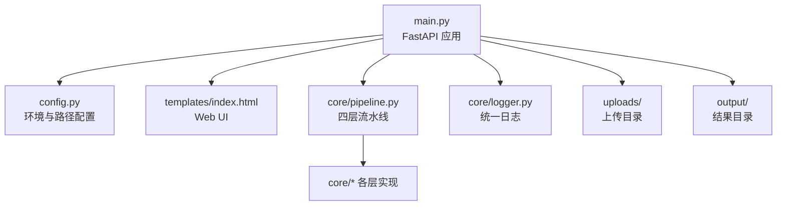
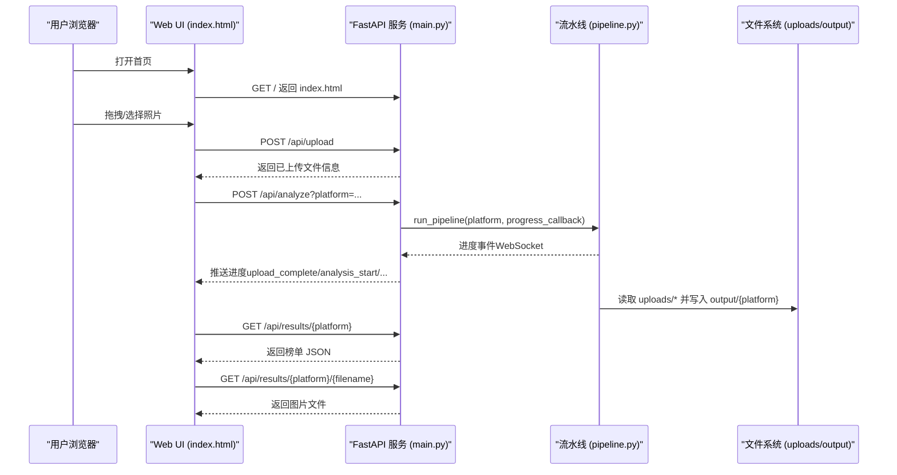
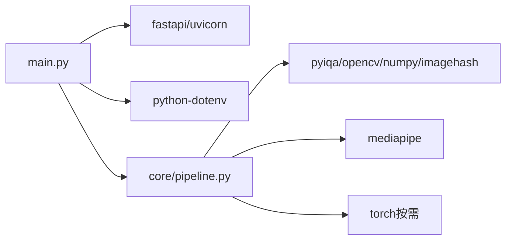

# 快速开始

<cite>
**本文引用的文件**   
- [main.py](file://main.py)
- [config.py](file://config.py)
- [requirements.txt](file://requirements.txt)
- [README.md](file://README.md)
- [Quick-Start.md](file://docs/wiki/Quick-Start.md)
- [pipeline.py](file://core/pipeline.py)
- [logger.py](file://core/logger.py)
- [index.html](file://templates/index.html)
</cite>

## 目录
1. [简介](#简介)
2. [项目结构](#项目结构)
3. [核心组件](#核心组件)
4. [架构总览](#架构总览)
5. [详细组件分析](#详细组件分析)
6. [依赖关系分析](#依赖关系分析)
7. [性能注意事项](#性能注意事项)
8. [故障排除指南](#故障排除指南)
9. [结论](#结论)
10. [附录：端到端示例（上传到出榜）](#附录端到端示例上传到出榜)

## 简介
本快速开始指南帮助你在最短时间内完成环境准备、安装依赖、配置环境变量并启动服务，随后通过一次完整的照片评分流程体验系统核心能力。系统基于 FastAPI 提供 Web UI，支持拖拽上传、实时进度推送与结果查看；后端流水线包含客观指标、相似聚类、审美评分（TOPIQ + VLM，含分类标签）、人脸质量四层处理，并支持视频抽帧与视频精选榜。

## 项目结构
- 入口与 Web 服务：main.py
- 统一配置与环境变量：config.py
- 依赖清单：requirements.txt
- 前端模板：templates/index.html
- 核心流水线：core/pipeline.py
- 日志模块：core/logger.py
- 文档与说明：README.md、docs/wiki/Quick-Start.md

图表来源
- [main.py:1-120](file://main.py#L1-L120)
- [config.py:1-123](file://config.py#L1-L123)
- [pipeline.py:165-220](file://core/pipeline.py#L165-L220)
- [logger.py:1-67](file://core/logger.py#L1-L67)

章节来源
- [README.md:105-139](file://README.md#L105-L139)
- [main.py:1-120](file://main.py#L1-L120)
- [config.py:1-123](file://config.py#L1-L123)

## 核心组件
- Web 服务与 API：提供上传、列表、删除、结果获取与分析任务触发等接口，并通过 WebSocket 推送进度。
- 配置中心：集中管理路径、平台权重、阈值、模型参数、网络代理与端口等。
- 流水线引擎：整合 L1~L5 各层，支持断点续传、并发执行、多样性惩罚与融合打分。
- 日志系统：统一日志级别与输出目标，便于调试与问题定位。

章节来源
- [main.py:100-399](file://main.py#L100-L399)
- [config.py:1-123](file://config.py#L1-L123)
- [pipeline.py:165-594](file://core/pipeline.py#L165-L594)
- [logger.py:1-67](file://core/logger.py#L1-L67)

## 架构总览
下图展示了从浏览器到后端 API、再到流水线与文件系统的整体交互。

图表来源
- [main.py:102-399](file://main.py#L102-L399)
- [pipeline.py:165-594](file://core/pipeline.py#L165-L594)
- [index.html:1-200](file://templates/index.html#L1-L200)

## 详细组件分析

### 安装与环境准备
- Python 版本要求：Python 3.11+
- GPU 与 CUDA（可选但推荐）：NVIDIA GPU（RTX 5070 或更高），CUDA 12.6+
- 依赖包：使用 requirements.txt 安装；PyTorch 需按 CUDA 版本单独安装

步骤概览
1) 克隆代码库
2) 创建并激活虚拟环境
3) 安装依赖（含 PyTorch）
4) 配置环境变量（.env）
5) 启动服务
6) 浏览器访问

章节来源
- [README.md:52-103](file://README.md#L52-L103)
- [requirements.txt:1-27](file://requirements.txt#L1-L27)
- [Quick-Start.md:1-88](file://docs/wiki/Quick-Start.md#L1-L88)

### 环境变量与配置
- .env 文件用于注入 Qwen-VL API Key、Base URL、模型名以及可选代理
- config.py 会统一加载 .env，所有模块均可读取
- 可通过 HOST、PORT 控制服务监听地址与端口

关键项
- QWEN_API_KEY、QWEN_BASE_URL、QWEN_MODEL
- HTTP_PROXY、HTTPS_PROXY（可选）
- HOST、PORT（默认 127.0.0.1:8080）

章节来源
- [config.py:1-123](file://config.py#L1-L123)
- [README.md:80-93](file://README.md#L80-L93)
- [Quick-Start.md:38-51](file://docs/wiki/Quick-Start.md#L38-L51)

### 启动服务
- 运行 main.py 即可启动 FastAPI 服务
- 默认监听 HOST:PORT（可通过环境变量覆盖）
- 首次启动会自动创建必要的目录（uploads、output、templates）

章节来源
- [main.py:396-399](file://main.py#L396-L399)
- [config.py:120-123](file://config.py#L120-L123)

### 第一个照片评分的完整示例（端到端）
- 打开浏览器访问 http://127.0.0.1:8080（或配置的 PORT）
- 在页面中拖拽或选择照片上传
- 选择平台（如小红书/朋友圈/抖音）
- 点击“开始分析”，等待进度推进
- 完成后在“照片榜”查看评分与详情，可下载/预览结果图

说明
- 上传接口会对扩展名与 MIME 类型进行白名单校验，并限制文件大小
- 分析过程通过 WebSocket 推送阶段进度（如 upload_complete、analysis_start、layer_*、analysis_complete）
- 结果保存在 output/{platform}/ranking.json，图片复制到 output/{platform}/01_xxx.jpg 等序号命名

章节来源
- [main.py:111-163](file://main.py#L111-L163)
- [main.py:336-379](file://main.py#L336-L379)
- [pipeline.py:516-576](file://core/pipeline.py#L516-L576)
- [index.html:1-200](file://templates/index.html#L1-L200)

### 视频精选榜（可选）
- 支持上传视频并流式抽帧，本地快筛后保留候选帧
- 视频榜与照片榜独立输出目录，避免相互干扰
- 名额按视频时长比例分配，保证公平性

章节来源
- [main.py:165-237](file://main.py#L165-L237)
- [pipeline.py:681-800](file://core/pipeline.py#L681-L800)

## 依赖关系分析
- Web 框架：fastapi、uvicorn、httpx、python-multipart、PyYAML、python-dotenv
- 图像处理：Pillow、pillow-heif、opencv-python、numpy、imagehash
- AI 推理：pyiqa、mediapipe；torch 需按 CUDA 版本手动安装
- 开发工具：pytest、ruff

图表来源
- [requirements.txt:1-27](file://requirements.txt#L1-L27)
- [main.py:1-60](file://main.py#L1-L60)
- [pipeline.py:1-30](file://core/pipeline.py#L1-L30)

章节来源
- [requirements.txt:1-27](file://requirements.txt#L1-L27)

## 性能注意事项
- 建议启用 GPU（CUDA）以加速审美评分与相关推理
- 合理设置 VLM 图像尺寸与 JPEG 质量，降低网络传输与 API 延迟
- 使用断点续传（checkpoint）避免重复计算
- 批量处理时注意并发度与线程池大小，避免阻塞事件循环

章节来源
- [config.py:94-98](file://config.py#L94-L98)
- [pipeline.py:114-147](file://core/pipeline.py#L114-L147)

## 故障排除指南
常见问题与解决思路
- 无法连接 Qwen-VL API
  - 检查 QWEN_API_KEY、QWEN_BASE_URL、QWEN_MODEL 是否正确
  - 如需代理，确认 HTTP_PROXY/HTTPS_PROXY 设置
- 上传失败或提示不支持的文件类型
  - 确认扩展名在白名单内（jpg/jpeg/png/gif/bmp/webp/heic/heif）
  - 检查文件大小是否超过限制（照片 50MB，视频 200MB）
- 分析任务卡住或无进度
  - 查看控制台日志（LOG_LEVEL=DEBUG 可输出更详细信息）
  - 检查是否存在正在运行的分析任务（并发锁）
- 结果缺失或为空
  - 确认 uploads 目录下有有效照片
  - 检查 output/{platform}/ranking.json 是否存在
- 视频抽帧失败
  - 确认视频格式在允许范围内（mp4/mov/avi/mkv/webm）
  - 检查磁盘空间与写入权限

章节来源
- [main.py:50-61](file://main.py#L50-L61)
- [main.py:111-163](file://main.py#L111-L163)
- [main.py:165-237](file://main.py#L165-L237)
- [logger.py:1-67](file://core/logger.py#L1-L67)

## 结论
按照本指南完成环境准备与配置后，你可以在几分钟内启动 PhotoRank 并完成一次完整的照片评分体验。系统提供安全的上传、实时的进度反馈与清晰的结果展示，同时支持视频精选榜与多平台适配。遇到问题时，优先检查环境变量、依赖安装与日志输出。

## 附录：端到端示例（上传到出榜）
- 启动服务后，访问 http://127.0.0.1:8080
- 拖拽若干张照片到上传区域
- 选择平台（例如“小红书”）
- 点击“开始分析”，观察进度条与阶段提示
- 完成后在“照片榜”查看 Top N 结果，点击可查看大图与详情
- 如需查看原始数据，可在 output/{platform}/ranking.json 与 full_ranking.json 中浏览

章节来源
- [main.py:102-163](file://main.py#L102-L163)
- [main.py:336-379](file://main.py#L336-L379)
- [pipeline.py:516-576](file://core/pipeline.py#L516-L576)
- [index.html:1-200](file://templates/index.html#L1-L200)