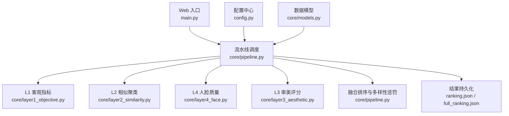
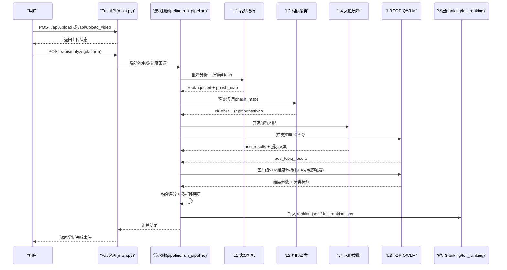
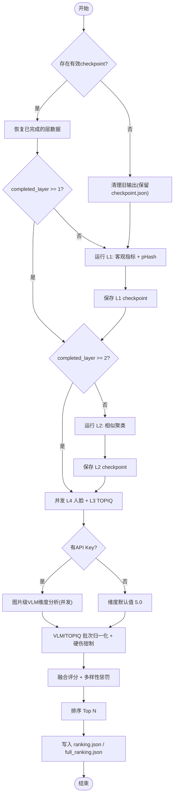
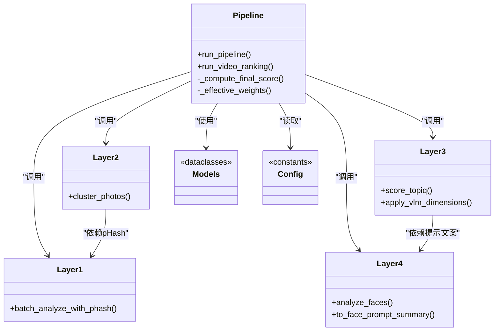

# 管道架构设计

<cite>
**本文引用的文件**   
- [core/pipeline.py](file://core/pipeline.py)
- [config.py](file://config.py)
- [main.py](file://main.py)
- [core/layer1_objective.py](file://core/layer1_objective.py)
- [core/layer2_similarity.py](file://core/layer2_similarity.py)
- [core/layer3_aesthetic.py](file://core/layer3_aesthetic.py)
- [core/layer4_face.py](file://core/layer4_face.py)
- [core/models.py](file://core/models.py)
</cite>

## 目录
1. [简介](#简介)
2. [项目结构](#项目结构)
3. [核心组件](#核心组件)
4. [架构总览](#架构总览)
5. [详细组件分析](#详细组件分析)
6. [依赖关系分析](#依赖关系分析)
7. [性能与并发优化](#性能与并发优化)
8. [故障排查指南](#故障排查指南)
9. [结论](#结论)
10. [附录：扩展新评估层指南](#附录扩展新评估层指南)

## 简介
本文件面向“照片评分系统”的管道架构，系统性阐述从照片上传、预处理、多层级分析执行到结果聚合的完整生命周期。重点解析 core/pipeline.py 中的 Pipeline 实现（以 run_pipeline 为主），包括异步任务编排、错误处理策略、断点续传机制与性能优化；同时说明各评估层之间的数据流转与依赖管理，并提供流程图与扩展示例路径，帮助读者快速理解并安全扩展新的评估层。

## 项目结构
- 入口与 Web UI：main.py（FastAPI）提供上传、抽帧、分析与结果查询接口，并通过 WebSocket 推送进度事件。
- 配置中心：config.py 集中管理平台权重、输出数量、阈值、VLM 参数等。
- 核心流水线：core/pipeline.py 串联 L1→L2→L4+L3(并发)→融合排序→多样性惩罚→输出。
- 评估层：
  - L1 客观指标：清晰度、曝光、噪声、淘汰规则与 pHash 流水计算。
  - L2 相似聚类：感知哈希 + BK-Tree/暴力搜索 + 并查集，输出代表图。
  - L3 审美评分：TOPIQ-IAA 客观审美 + VLM 多维度专业评分（构图/色彩/光影/综合审美）。
  - L4 人脸质量：MediaPipe 人脸关键点与表情/清晰度/闭眼检测，生成提示文案注入 L3。
- 数据模型：core/models.py 定义各层输入输出与最终结果的 Pydantic 模型。

图表来源
- [main.py:102-399](file://main.py#L102-L399)
- [core/pipeline.py:165-594](file://core/pipeline.py#L165-L594)
- [config.py:22-108](file://config.py#L22-L108)
- [core/models.py:13-123](file://core/models.py#L13-L123)

章节来源
- [main.py:1-399](file://main.py#L1-L399)
- [config.py:1-123](file://config.py#L1-L123)

## 核心组件
- 流水线主函数 run_pipeline：统一编排 L1→L2→L4+L3→融合排序→输出，支持断点续传、进度回调、失败降级与日志记录。
- 视频榜 run_video_ranking：独立于照片榜的视频帧排名流程，复用 L2/L3/L4 能力并按时长比例分配名额。
- 评估层模块：
  - L1：多线程批处理 + 逐张计算 pHash，返回保留/淘汰集合与 phash_map。
  - L2：基于 pHash 的相似度聚类，输出代表图列表。
  - L3：TOPIQ 批次归一化 + VLM 维度分析（可并行），产出多维审美分与分类标签。
  - L4：人脸质量分析，生成结构化结果与中性提示文案供 L3 prompt 注入。
- 数据模型 models：Layer1Result、SimilarityCluster、Layer3Result、Layer4Result、FinalResult、PipelineResult 等。

章节来源
- [core/pipeline.py:165-594](file://core/pipeline.py#L165-L594)
- [core/layer1_objective.py:129-215](file://core/layer1_objective.py#L129-L215)
- [core/layer2_similarity.py:161-245](file://core/layer2_similarity.py#L161-L245)
- [core/layer3_aesthetic.py:130-369](file://core/layer3_aesthetic.py#L130-L369)
- [core/layer4_face.py:198-290](file://core/layer4_face.py#L198-L290)
- [core/models.py:13-123](file://core/models.py#L13-L123)

## 架构总览
下图展示从上传到最终排名的端到端调用序列，包含关键并发点与降级路径。

图表来源
- [main.py:336-379](file://main.py#L336-L379)
- [core/pipeline.py:165-594](file://core/pipeline.py#L165-L594)
- [core/layer1_objective.py:161-215](file://core/layer1_objective.py#L161-L215)
- [core/layer2_similarity.py:161-245](file://core/layer2_similarity.py#L161-L245)
- [core/layer3_aesthetic.py:269-369](file://core/layer3_aesthetic.py#L269-L369)
- [core/layer4_face.py:198-290](file://core/layer4_face.py#L198-L290)

## 详细组件分析

### 流水线 run_pipeline：生命周期与断点续传
- 输入与输出
  - 输入：photos_dir、platform、progress_callback、force。
  - 输出：PipelineResult 字典（total/rejected/merged/ranked/output_count/results 等）。
- 阶段划分
  - L1：客观指标 + 逐张计算 pHash，返回 kept/rejected 与 phash_map。
  - L2：相似聚类，复用 phash_map 避免重复计算，输出 clusters 与 representatives。
  - L4+L3 并发：L4 分析完一张立即发起该张 VLM 调用（图片级流水），与 TOPIQ 推理并行。
  - 融合排序：按平台权重计算融合分，应用多样性惩罚，Top N 输出。
  - 结果持久化：ranking.json（Top N）、full_ranking.json（全部）、checkpoint.json（断点）。
- 断点续传
  - 版本化 checkpoint（version=2），completed_layer 表示已完成步骤编号（1=L1, 2=L2, 3=L4, 4=L3）。
  - 旧版 v1 兼容：仅复用 L1/L2，L4/L3 强制重跑。
  - 每层完成后累积保存中间数据（kept/rejected/clusters/aes_results/face_scores/phash_map/skipped_layers）。
- 错误处理与降级
  - 任一层失败将记录 skipped_layers，使用兜底数据继续后续流程（如 L1 失败则所有照片进入 kept）。
  - VLM 未配置 API key 时，维度默认值 5.0，q_vlm 回退为 TOPIQ 分，保证仍可排序。
- 进度回调
  - _emit 安全封装，异常吞掉不影响主流程。

图表来源
- [core/pipeline.py:165-594](file://core/pipeline.py#L165-L594)

章节来源
- [core/pipeline.py:165-594](file://core/pipeline.py#L165-L594)

### Layer 1：客观指标与 pHash 流水
- 功能：清晰度（Laplacian方差）、曝光（亮度区间不扣分）、噪声（SNR），综合得分与淘汰规则。
- 并发：ThreadPoolExecutor 多线程批处理。
- pHash 流水：在 worker 内“分析完即算哈希”，仅对不 rejected 的照片计算，供 L2 与多样性惩罚复用。
- 输出：Layer1Result 列表 + phash_map（path -> ImageHash）。

章节来源
- [core/layer1_objective.py:98-158](file://core/layer1_objective.py#L98-L158)
- [core/layer1_objective.py:161-215](file://core/layer1_objective.py#L161-L215)

### Layer 2：相似聚类（BK-Tree + Union-Find）
- 算法：感知哈希 + BK-Tree（大数据集 O(n log n)）或暴力 O(n²)（小数据集更快），Union-Find 合并等价类。
- 输入：image_paths、sharpness_scores、precomputed_hashes（来自 L1 的 phash_map）。
- 输出：SimilarityCluster 列表，每组取前 2 张代表图进入 L3。

章节来源
- [core/layer2_similarity.py:161-245](file://core/layer2_similarity.py#L161-L245)

### Layer 4：人脸质量（MediaPipe）
- 功能：人脸数量、闭眼检测、表情微笑度、主脸清晰度、人脸占比、次脸占比、主脸闭眼标记。
- 并发：全局实例缓存 + 串行调用锁（MediaPipe 非线程安全），支持 on_photo_done 回调实现图片级流水。
- 输出：Layer4Result 列表 + to_face_prompt_summary（中性提示文案注入 L3 prompt）。

章节来源
- [core/layer4_face.py:198-290](file://core/layer4_face.py#L198-L290)

### Layer 3：审美评分（TOPIQ + VLM）
- TOPIQ：批次归一化（p5-p95 拉伸），设备自动选择（CUDA/CPU），模块级缓存复用。
- VLM：Qwen3-VL 多维度评分（构图/色彩/光影/综合审美），指数退避重试、JSON 解析校验、类别枚举白名单。
- 硬伤钳制：人像硬伤（主脸闭眼/明显模糊）综合审美上限 6 分，程序化保障。
- 并发：VLM 独立线程池（_VLM_CONCURRENCY=8），图片级流水优先启动网络 IO 最慢环节。

章节来源
- [core/layer3_aesthetic.py:130-369](file://core/layer3_aesthetic.py#L130-L369)
- [core/layer3_aesthetic.py:465-536](file://core/layer3_aesthetic.py#L465-L536)

### 融合评分与多样性惩罚
- 融合公式：q_vlm（VLM 加权维度分或回退 TOPIQ）× w_vlm + topiq × w_topiq + face × w_face + objective × w_obj。
- 权重动态调整：VLM 已评分时 face 权重重分配至其他维度；无人脸时同样重分配，避免无脸照片吃亏。
- 多样性惩罚：基于 pHash 汉明距离，低于阈值对靠后照片按比例扣分，避免同场景多占名额。

章节来源
- [core/pipeline.py:33-112](file://core/pipeline.py#L33-L112)
- [core/pipeline.py:455-514](file://core/pipeline.py#L455-L514)

### 视频榜 run_video_ranking
- 目标：跨视频帧竞争排名，按视频时长比例分配名额，避免长/短视频不公。
- 流程：读取 manifest → L2 聚类（复用快筛 phash）→ L4+L3 并发 → 融合评分 + 多样性惩罚 → 配额分配。
- 输出：video_ranking.json（独立子目录 output/{platform}/videos/）。

章节来源
- [core/pipeline.py:681-800](file://core/pipeline.py#L681-L800)

## 依赖关系分析
- 模块耦合
  - pipeline 强依赖 L1/L2/L3/L4 的输出模型与函数接口。
  - L3 依赖 L4 的人脸提示文案与硬伤标志。
  - L2 依赖 L1 的 phash_map 以避免重复计算。
- 外部依赖
  - config：平台权重、阈值、VLM 参数、代理等。
  - models：Pydantic 数据模型，确保类型安全与序列化。
  - 第三方库：cv2、PIL、imagehash、pyiqa、torch、mediapipe、httpx。

图表来源
- [core/pipeline.py:165-594](file://core/pipeline.py#L165-L594)
- [core/layer1_objective.py:161-215](file://core/layer1_objective.py#L161-L215)
- [core/layer2_similarity.py:161-245](file://core/layer2_similarity.py#L161-L245)
- [core/layer3_aesthetic.py:269-369](file://core/layer3_aesthetic.py#L269-L369)
- [core/layer4_face.py:198-290](file://core/layer4_face.py#L198-L290)
- [core/models.py:13-123](file://core/models.py#L13-L123)
- [config.py:22-108](file://config.py#L22-L108)

章节来源
- [core/pipeline.py:165-594](file://core/pipeline.py#L165-L594)
- [core/models.py:13-123](file://core/models.py#L13-L123)
- [config.py:22-108](file://config.py#L22-L108)

## 性能与并发优化
- 并发策略
  - L1：多线程批处理，worker 内“分析完即算 pHash”。
  - L2：根据数据规模选择 BK-Tree（大数据）或暴力（小数据）。
  - L3：TOPIQ 单进程推理，VLM 独立线程池（8 并发），图片级流水优先启动网络 IO。
  - L4：全局实例缓存 + 串行调用锁，避免 C++ 层崩溃。
- 缓存与复用
  - TOPIQ 模型模块级缓存（按 device 键），避免重复加载。
  - pHash 在 L1 计算后贯穿 L2 与多样性惩罚，避免重复大图解码。
  - 解码缓存（core.image_cache）减少重复解码开销。
- 资源释放
  - release_topiq_model() 主动释放显存，适配分时加载场景。
  - VLM 线程池 shutdown(wait=False)，已提交任务继续完成。
- 降级与容错
  - 任一层失败记录 skipped_layers，使用兜底数据继续。
  - VLM 未配置 API key 时维度默认 5.0，q_vlm 回退 TOPIQ。

章节来源
- [core/layer1_objective.py:161-215](file://core/layer1_objective.py#L161-L215)
- [core/layer2_similarity.py:197-203](file://core/layer2_similarity.py#L197-L203)
- [core/layer3_aesthetic.py:156-188](file://core/layer3_aesthetic.py#L156-L188)
- [core/layer4_face.py:226-231](file://core/layer4_face.py#L226-L231)
- [core/pipeline.py:320-369](file://core/pipeline.py#L320-L369)

## 故障排查指南
- 常见问题
  - HEIC 不支持：需安装 pillow-heif。
  - MediaPipe 初始化失败：检查模型下载与权限，重试最多 3 次。
  - TOPIQ 模型加载失败：自动 CPU fallback，确认 pyiqa 可用。
  - VLM 调用失败：检查 QWEN_API_KEY、网络代理、超时与重试。
- 定位方法
  - 查看日志中 [Checkpoint]、[L1]/[L2]/[L3]/[L4] 相关条目。
  - 检查 output/{platform}/checkpoint.json 的 completed_layer 与 skipped_layers。
  - 确认 ranking.json/full_ranking.json 是否生成。
- 恢复策略
  - 设置 force=False 启用断点续传，从最近完成层继续。
  - 删除 checkpoint.json 强制从头开始。

章节来源
- [core/layer1_objective.py:24-31](file://core/layer1_objective.py#L24-L31)
- [core/layer4_face.py:87-116](file://core/layer4_face.py#L87-L116)
- [core/layer3_aesthetic.py:163-187](file://core/layer3_aesthetic.py#L163-L187)
- [core/pipeline.py:114-163](file://core/pipeline.py#L114-L163)

## 结论
本管道架构通过分层解耦、并发编排、断点续传与稳健降级，实现了高吞吐、高可用的照片评分系统。L1→L2→L4+L3→融合排序的流程清晰，数据流与依赖管理严谨，性能优化覆盖计算、IO 与内存管理。扩展新评估层只需遵循接口契约与数据模型约定，即可无缝接入现有流水线。

## 附录：扩展新评估层指南
- 目标：新增一个评估层（例如 L5 情感分析），要求不破坏现有流程，支持断点续传与进度回调。
- 步骤
  1. 定义数据模型：在 core/models.py 中添加 NewLayerResult（Pydantic BaseModel），包含必要字段与默认值。
  2. 实现评估逻辑：新建 core/layer_emotion.py（示例名，实际按新层命名约定取名），提供 analyze_emotion(image_paths, on_photo_done=None) 函数，支持并发与回调。
  3. 集成到流水线：
     - 在 run_pipeline 中插入新层（建议放在 L3 之后，融合之前），参考 L4+L3 并发模式。
     - 若需要前置数据（如 L4 人脸信息），通过 to_face_prompt_summary 类似方式注入。
     - 在 checkpoint 保存中追加新层数据（skipped_layers 与 completed_layer 更新）。
  4. 错误处理：捕获异常，记录 skipped_layers，使用兜底数据继续。
  5. 测试验证：确保断点续传、进度回调、降级路径正常。
- 参考路径
  - 数据模型定义：[core/models.py:13-123](file://core/models.py#L13-L123)
  - 评估层实现示例：[core/layer4_face.py:198-290](file://core/layer4_face.py#L198-L290)
  - 流水线集成位置：[core/pipeline.py:308-454](file://core/pipeline.py#L308-L454)
  - 断点续传保存：[core/pipeline.py:149-163](file://core/pipeline.py#L149-L163)

章节来源
- [core/models.py:13-123](file://core/models.py#L13-L123)
- [core/layer4_face.py:198-290](file://core/layer4_face.py#L198-L290)
- [core/pipeline.py:308-454](file://core/pipeline.py#L308-L454)
- [core/pipeline.py:149-163](file://core/pipeline.py#L149-L163)