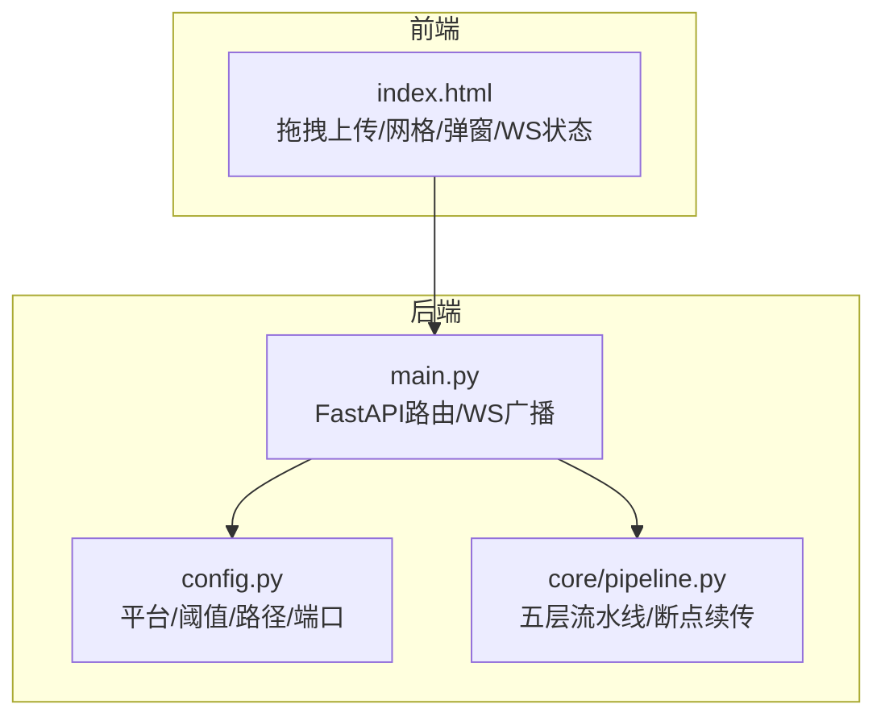
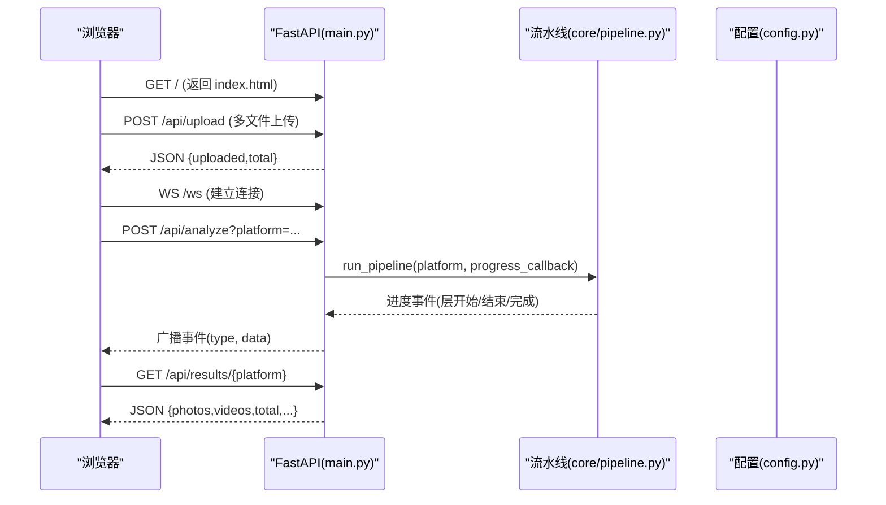
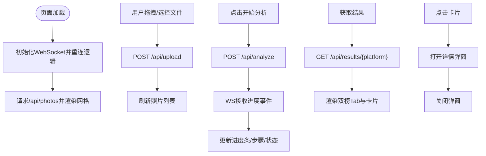
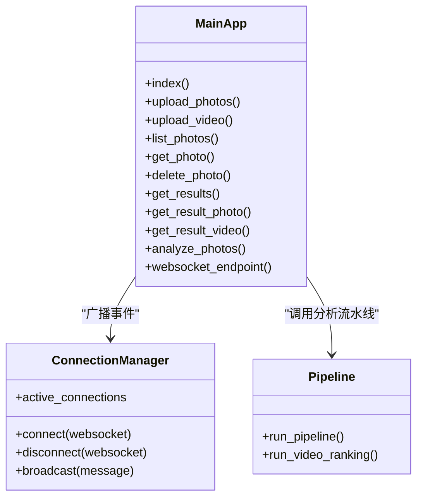
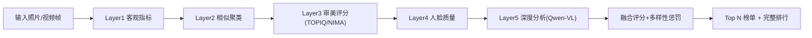
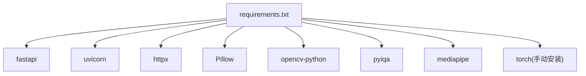

# Web UI框架研究

<cite>
**本文引用的文件**   
- [main.py](file://main.py)
- [config.py](file://config.py)
- [templates/index.html](file://templates/index.html)
- [requirements.txt](file://requirements.txt)
- [core/pipeline.py](file://core/pipeline.py)
- [docs/research/web_ui_framework_research.md](file://docs/research/web_ui_framework_research.md)
- [README.md](file://README.md)
- [docs/wiki/Architecture.md](file://docs/wiki/Architecture.md)
</cite>

> ⚠️ 本文为历史研究资料（撰写于 v2.0.0 之前），其中描述的五层流水线 / Layer 5 深度分析等内容已过时：自 v2.0.0 起架构为四层流水线，原 Layer 5 职责并入 Layer 3 的 VLM 评分与 pipeline 融合逻辑。仅作当时选型参考，现状以 README 与 wiki 其他文档为准。

## 目录
1. [引言](#引言)
2. [项目结构](#项目结构)
3. [核心组件](#核心组件)
4. [架构总览](#架构总览)
5. [详细组件分析](#详细组件分析)
6. [依赖关系分析](#依赖关系分析)
7. [性能与优化](#性能与优化)
8. [故障排查指南](#故障排查指南)
9. [结论](#结论)
10. [附录：技术选型决策矩阵](#附录技术选型决策矩阵)

## 引言
本技术文档围绕“Web UI框架研究”目标，结合本项目实际实现，系统比较并分析主流前端框架（React、Vue、Angular）与Python原生方案（FastAPI + 原生HTML/JS、Streamlit、Gradio）的优缺点；深入阐述前端架构设计模式、组件化理念与状态管理策略；总结响应式设计原则、用户体验优化与性能调优技巧；给出面向项目需求、团队技能与维护成本的技术选型依据；说明UI框架与后端服务的集成方式（API设计、数据流管理与错误处理），以及前端部署策略、构建优化与监控方案。

## 项目结构
本项目采用“FastAPI 后端 + 原生 HTML/JS 前端”的轻量架构，配合 WebSocket 实时进度推送，支持照片与视频上传、AI 分析流水线、双榜单展示与详情弹窗等能力。核心目录包括：
- core：AI 流水线与各层模型封装
- templates：服务端渲染的前端页面
- main.py：FastAPI 应用入口与路由
- config.py：统一配置与环境变量加载
- requirements.txt：依赖清单

图表来源
- [templates/index.html](file://templates/index.html)
- [main.py](file://main.py)
- [config.py](file://config.py)
- [core/pipeline.py](file://core/pipeline.py)

章节来源
- [README.md](file://README.md)
- [docs/wiki/Architecture.md](file://docs/wiki/Architecture.md)

## 核心组件
- FastAPI 应用与路由：提供静态页面、文件上传、结果查询与分析任务接口，并通过 WebSocket 广播实时事件。
- 原生前端：基于 CSS Grid 的响应式布局、拖拽上传、模态框详情、WebSocket 自动重连与进度条。
- 配置中心：集中管理平台权重、阈值、目录路径、服务端口与外部 API 地址。
- 流水线引擎：整合 L1-L5 各层模型，支持并发、断点续传、多样性惩罚与融合评分。

章节来源
- [main.py](file://main.py)
- [templates/index.html](file://templates/index.html)
- [config.py](file://config.py)
- [core/pipeline.py](file://core/pipeline.py)

## 架构总览
整体采用前后端分离但无构建步骤的极简方案：前端通过 Fetch API 调用 REST 接口，使用 WebSocket 接收分析进度；后端将耗时计算放入线程池，避免阻塞事件循环，并通过 ConnectionManager 向所有连接广播事件。

图表来源
- [main.py](file://main.py)
- [core/pipeline.py](file://core/pipeline.py)
- [config.py](file://config.py)

章节来源
- [docs/research/web_ui_framework_research.md](file://docs/research/web_ui_framework_research.md)
- [docs/wiki/Architecture.md](file://docs/wiki/Architecture.md)

## 详细组件分析

### 前端组件与交互流程
- 上传区域：支持拖拽与点击选择，批量上传至 /api/upload，成功后刷新列表。
- 视频抽帧：上传视频后调用 /api/upload_video，后端流式抽帧与本地快筛，返回统计信息。
- 结果展示：双榜 Tab（照片精选/视频精选），卡片网格展示图片与基础信息，点击打开详情弹窗。
- 进度与状态：WebSocket 实时更新进度条与步骤高亮，右下角显示连接状态（已连接/断开/重连中）。
- 响应式布局：CSS Grid 自适应列数，移动端缩小间距与字号，保证多设备可用。

图表来源
- [templates/index.html](file://templates/index.html)
- [main.py](file://main.py)

章节来源
- [templates/index.html](file://templates/index.html)

### 后端API与WebSocket
- 安全校验：文件名净化、扩展名与MIME白名单、Content-Length预检、文件大小限制。
- 上传接口：/api/upload 支持多文件上传；/api/upload_video 支持视频流式保存与抽帧。
- 结果接口：/api/photos、/api/results/{platform}、/api/results/{platform}/videos/{filename} 等，均含路径遍历防护。
- 分析接口：/api/analyze 使用锁控制并发，回调推进进度，完成后广播完成事件。
- WebSocket：/ws 维护连接集合，统一广播消息类型（upload_complete、video_frames_ready、analysis_start/complete/error 等）。

图表来源
- [main.py](file://main.py)
- [core/pipeline.py](file://core/pipeline.py)

章节来源
- [main.py](file://main.py)

### 配置与平台权重
- 平台配置：小红书、朋友圈、抖音的权重与输出数量，用于融合评分与文案生成。
- 阈值参数：L1/L2/L3/L4/L5 各层阈值、多样性惩罚、VLM图像缩放与质量、视频抽帧间隔与上限等。
- 运行参数：HOST、PORT、项目根目录、上传与输出目录、视频目录等。

章节来源
- [config.py](file://config.py)

### 流水线与数据流
- Layer 1：客观指标（清晰度、曝光、噪声），淘汰低质量照片。
- Layer 2：相似聚类（pHash），合并同场景照片，选取代表。
- Layer 3：审美评分（TOPIQ/NIMA），排序候选。
- Layer 4：人脸质量（闭眼/微笑/清晰度），对分数进行修正。
- Layer 5：深度分析（Qwen-VL），分类、构图解读、改进建议、情绪与文案。
- 融合评分：按平台权重加权，考虑多样性惩罚，输出 Top N 榜单与完整排行。
- 断点续传：每层保存 checkpoint，支持中断恢复与跳过已完成层。

图表来源
- [core/pipeline.py](file://core/pipeline.py)

章节来源
- [core/pipeline.py](file://core/pipeline.py)

## 依赖关系分析
- 后端依赖：FastAPI、uvicorn、httpx、python-multipart、PyYAML、python-dotenv。
- 图像处理：Pillow、pillow-heif、opencv-python、numpy、imagehash。
- AI模型：pyiqa、mediapipe；torch需按CUDA版本手动安装。
- 开发测试：pytest、ruff。

图表来源
- [requirements.txt](file://requirements.txt)

章节来源
- [requirements.txt](file://requirements.txt)

## 性能与优化
- 前端优化
  - 响应式布局与懒加载：CSS Grid 自适应，按需渲染卡片，减少首屏压力。
  - 动画与过渡：使用 CSS transition 提升交互流畅度，避免重排重绘。
  - 资源压缩：静态资源可启用 Gzip/Brotli，图片使用合适尺寸与格式。
- 后端优化
  - 并发与异步：分析任务放入线程池，避免阻塞事件循环；WebSocket 广播非阻塞。
  - I/O 分流：大文件分块写入，超限即中断并清理半成品。
  - 缓存与断点：checkpoint 支持中断恢复，减少重复计算。
- 模型推理
  - GPU 加速：NIMA/TOPIQ 在 RTX 上推理，降低延迟。
  - 批处理与降级：无 API Key 时回退到 TOPIQ 排序，保证可用性。

[本节为通用指导，不直接分析具体文件]

## 故障排查指南
- 上传失败
  - 检查扩展名与 MIME 白名单、文件大小限制、Content-Length 预检。
  - 查看后端日志中的“不支持的文件类型/过大/保存失败”等提示。
- 分析任务卡住
  - 确认 _analysis_lock 是否被占用；检查 QWEN_API_KEY 与网络代理设置。
  - 查看 pipeline 日志中的层失败与跳过记录。
- WebSocket 断连
  - 前端自动重连机制会尝试 3 秒后重连；检查服务器端口与防火墙。
- 结果缺失
  - 确认 output 目录权限与路径；检查 ranking.json 是否存在。

章节来源
- [main.py](file://main.py)
- [core/pipeline.py](file://core/pipeline.py)

## 结论
本项目采用 FastAPI + 原生 HTML/JS 的轻量架构，具备零构建、原生 WebSocket、直接 Python 调用 AI 模型的优势，适合快速原型与中小规模应用。对于复杂交互与长期维护的大型项目，可考虑引入 React/Vue 以增强组件化与生态能力。无论何种方案，都应重视安全性（路径遍历、类型校验）、性能（并发、GPU 加速、缓存）与可观测性（日志、监控、错误上报）。

[本节为总结性内容，不直接分析具体文件]

## 附录：技术选型决策矩阵
- FastAPI + 原生 HTML/JS
  - 优点：零构建、原生 WebSocket、学习成本低、部署简单、适合 AI/ML 工程师。
  - 缺点：复杂交互需手动 DOM 操作、组件复用弱。
  - 适用：单人开发、快速原型、AI 集成优先。
- FastAPI + React
  - 优点：组件化、生态丰富、适合复杂 UI、热重载。
  - 缺点：需要 Node.js 与构建步骤、学习曲线较高。
  - 适用：大型团队、长期维护、复杂交互。
- FastAPI + Vue
  - 优点：学习曲线适中、单文件组件、TypeScript 支持良好。
  - 缺点：社区与第三方组件少于 React。
  - 适用：希望 React 特性但更简洁的团队。
- Streamlit
  - 优点：纯 Python、最快原型、内置控件。
  - 缺点：定制有限、无真实 WebSocket、大数据量性能问题。
  - 适用：内部演示、数据探索。
- Gradio
  - 优点：专为 ML/AI 演示、自动生成 UI、HuggingFace 集成。
  - 缺点：定制受限、不适合生产复杂 UI。
  - 适用：模型演示、Spaces 分享。

章节来源
- [docs/research/web_ui_framework_research.md](file://docs/research/web_ui_framework_research.md)